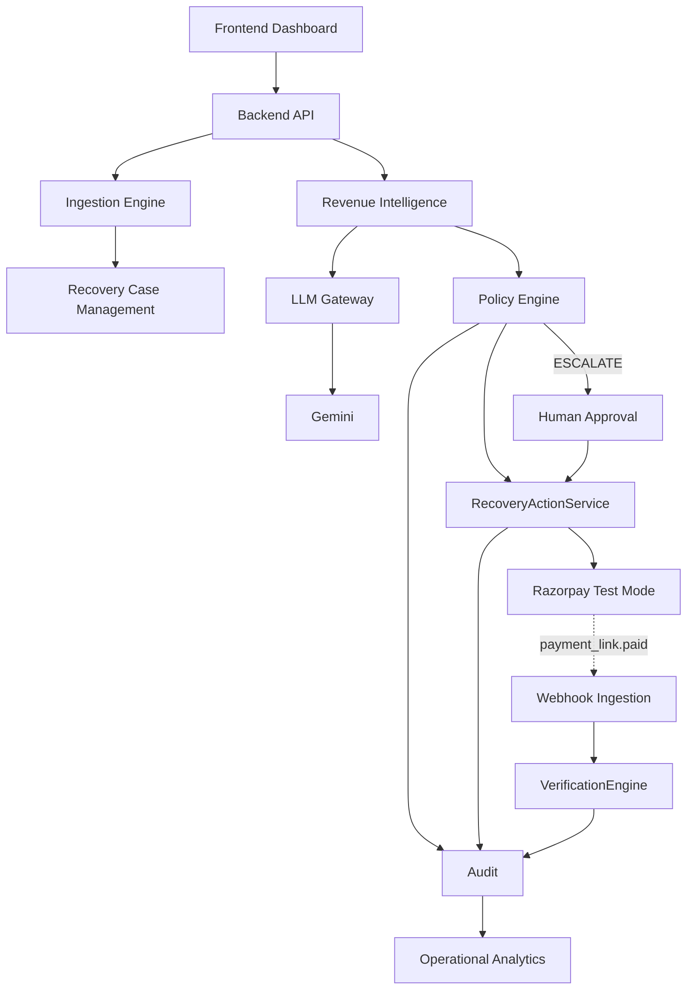
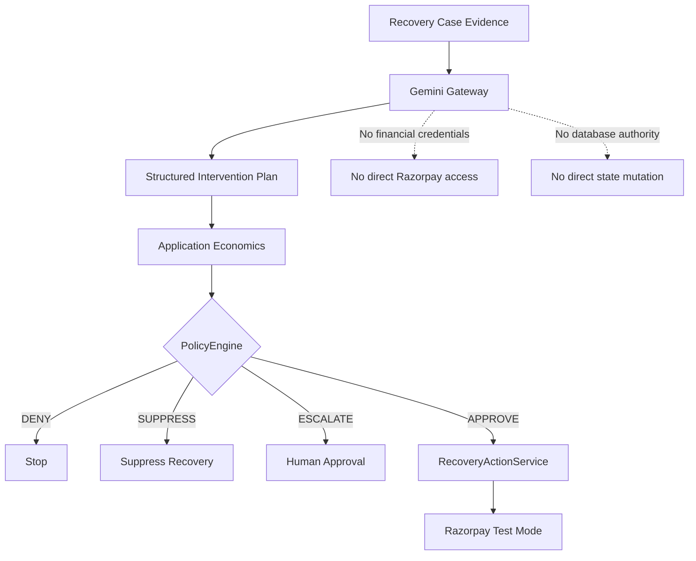
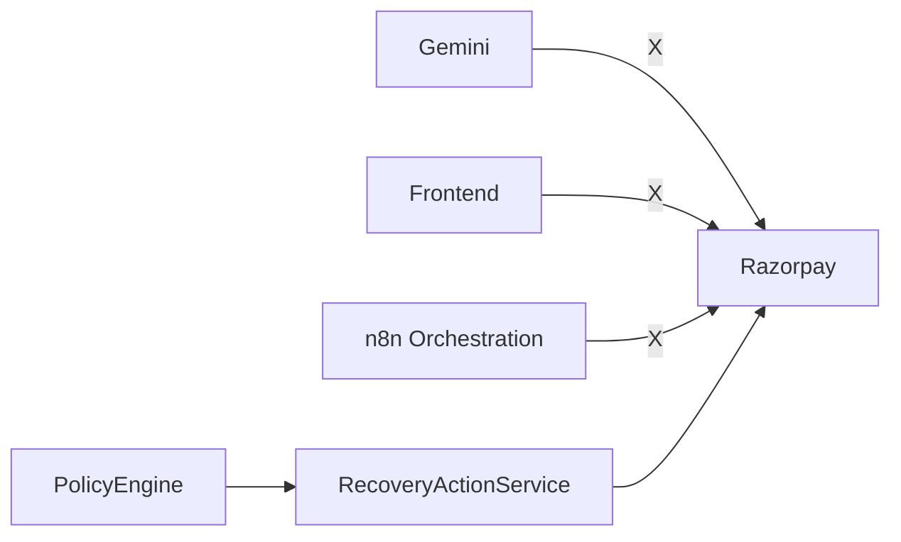
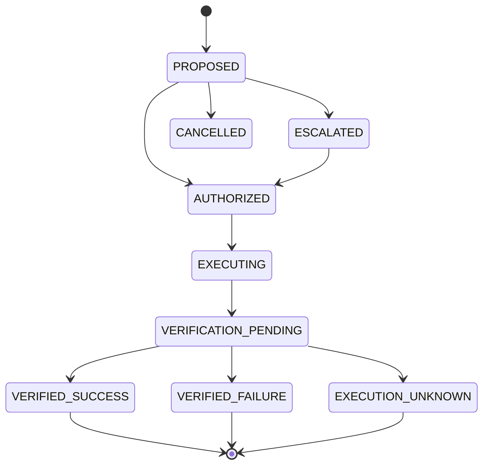
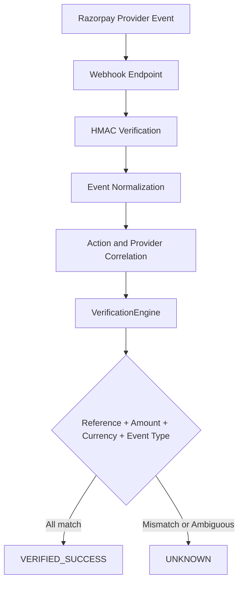
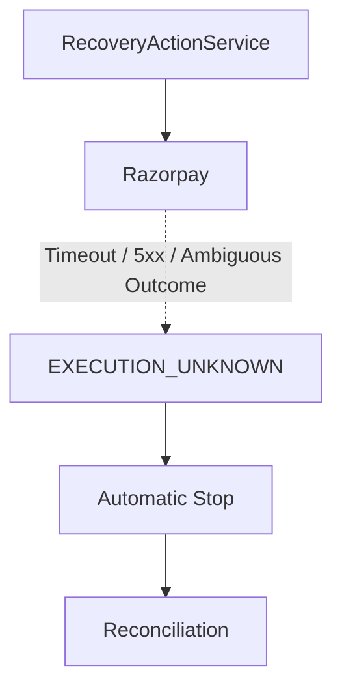

# RecoverAI

> **Evidence-first AI revenue recovery with bounded execution.**
>
> **Razorpay AI Buildathon · Track 03 — AI Revenue Recovery**

[Demo](docs/DEMO.md) · [Architecture](#system-architecture) · [Evaluation](#evaluation--robustness) · [Setup](#demo-quick-start)

---

## The Problem

When a customer's payment fails, the merchant's revenue is at risk.

Blind retries and payment-link spam are not a recovery strategy. They can
waste gateway attempts, frustrate customers facing legitimate issues,
increase operational noise, and create unnecessary risk.

Recovering that revenue safely requires more than detecting a failed payment.
A recovery system must understand **why** the payment failed, determine
whether intervention is appropriate, enforce strict stopping rules, execute
only an authorized action, and verify the outcome through authoritative
provider evidence.

---

## The Solution

RecoverAI is an **evidence-first AI revenue recovery agent**.

It follows a strict, observable pipeline:

**Detect → Understand → Recommend → Decide → Execute → Verify → Audit**

The core idea is deliberately simple:

> **AI proposes. Deterministic policy constrains. Provider evidence proves.**

Gemini interprets the qualitative context of a recovery case and produces a
structured intervention recommendation. The application then combines that
proposal with authoritative financial facts and deterministic policy controls
before any financial execution can occur.

A provider response is never treated as proof of recovery by itself.
RecoverAI only records a successful recovery after the verification layer
independently matches the expected provider evidence.

---

# Razorpay Buildathon — Track 03: AI Revenue Recovery

RecoverAI maps directly to the challenge:

| Challenge requirement | RecoverAI |
|---|---|
| Detect revenue at risk | Revenue events become recovery cases with observable evidence |
| Diagnose the failure | Evidence-first context is assembled for the intelligence layer |
| Determine the right intervention | Gemini produces a structured intervention recommendation |
| Execute a bounded recovery workflow | PolicyEngine gates the canonical financial execution path |
| Verify the outcome | VerificationEngine independently validates provider evidence |
| Measure recovered revenue | Operational analytics are derived from persisted runtime outcomes |
| Escalation and stopping rules | `APPROVE`, `ESCALATE`, `DENY`, and `SUPPRESS` boundaries |
| Audit trail | Chronological, append-oriented lifecycle records |

---

# System Architecture



RecoverAI is intentionally layered:

- **Frontend** presents the operational state.
- **Backend API** owns application behavior.
- **Ingestion and case management** turn payment evidence into recovery work.
- **Revenue Intelligence** interprets the case.
- **PolicyEngine** makes deterministic safety decisions.
- **RecoveryActionService** is the financial execution authority.
- **Razorpay Test Mode** provides external provider execution and evidence.
- **VerificationEngine** independently decides whether recovery is proven.
- **Audit and Analytics** record and measure what actually happened.

---

# AI / Policy Trust Boundary

RecoverAI deliberately separates **probabilistic intelligence** from
**financial authority**.



### What Gemini does

- Interprets observable payment and recovery evidence.
- Analyzes qualitative failure context.
- Produces structured intervention candidates.
- Selects a recommended intervention.
- Provides reasoning and confidence.
- Returns evidence references that can be checked against the case context.

### What Gemini does **not** do

- Authoritative financial amounts or currencies.
- Policy authorization.
- Direct Razorpay execution.
- Direct database mutation.
- Recovery verification.

> **The LLM is an intelligence component, not a financial authority.**

---

# Why AI?

RecoverAI uses AI where interpretation is valuable and deterministic code
where financial safety must be authoritative.

```text
Observable evidence
        ↓
      Gemini
        ↓
"What intervention appears appropriate?"
        ↓
Deterministic policy
        ↓
"Is this intervention allowed?"
        ↓
Execution authority
```

This separation is deliberate. A language model can reason about messy,
qualitative evidence, but the final financial decision remains constrained by
explicit application rules.

---

# Provider & Fallback Model

RecoverAI uses a provider chain with explicit provenance:

**Gemini → Groq → Hugging Face → Deterministic Fallback**

Provider identity is carried from the provider that actually generated the
intervention into the persisted plan/audit representation and then into the
API/UI.

That prevents a dangerous ambiguity:

```text
Provider succeeds
      ↓
Provider identity preserved
      ↓
Recommendation + confidence + reasoning
      ↓
Audit/API/UI all agree
```

When external providers are unavailable:

```text
Gemini
  ↓
Groq
  ↓
Hugging Face
  ↓
Deterministic Fallback
```

The deterministic path is an explicit resilience mechanism. It is never
presented as Gemini when Gemini did not produce the result.

---

# Execution Safety

RecoverAI enforces a **single financial authority**.



Razorpay mutations are restricted to the backend execution path.

### Execution safeguards

- Policy authorization is checked before financial execution.
- Invalid and terminal action states are rejected.
- `ESCALATE` is routed through the human-approval boundary.
- Frontend code never receives private Razorpay credentials.
- Razorpay execution is guarded by **Test Mode**.
- Recovery actions use idempotency controls.
- A recovery action is **atomically claimed before crossing the provider
  boundary**.
- A synchronized concurrency test demonstrates that two simultaneous
  execution attempts for one action result in **one provider call**.
- An uncertain provider outcome does not automatically become a successful
  recovery.

---

# Recovery Lifecycle



### Decision semantics

| Policy outcome | Meaning |
|---|---|
| `APPROVE` | The proposed intervention is eligible for bounded execution |
| `ESCALATE` | The intervention requires the human-approval boundary |
| `DENY` | A core invariant or rule blocks the action |
| `SUPPRESS` | Recovery is intentionally suppressed by policy |

An AI recommendation of `ESCALATE` remains an escalation. It does not become
an executable financial action simply because its structure is valid.

---

# Verification Architecture

A provider response is **not** the same thing as a verified recovery.

RecoverAI uses provider events as evidence and independently validates the
expected outcome.



### Verification principle

A recovery is only considered successful when the evidence matches what
RecoverAI expected:

- correct provider reference
- correct amount
- correct currency
- correct event type
- correct recovery action correlation

Ambiguous or mismatched evidence remains **UNKNOWN** rather than becoming a
false success.

---

# Uncertainty & Safety

External provider uncertainty is handled conservatively.



The system does not blindly create another payment link simply because an
external outcome is uncertain.

---

# Auditability

Every important lifecycle boundary is represented by persisted audit events.

**Detected → Analyzed → Policy Decision → Authorization/Approval →
Execution → Verification → Outcome**

The audit surface is designed for investigation rather than execution.

Historical context is preserved from the event itself rather than silently
reconstructed from the case's current state.

The audit repository is append-oriented: historical events are inserted and
retrieved, not ordinarily edited through the application.

---

# Operator Workflow

RecoverAI exposes the recovery lifecycle through eight operational screens:

| Screen | Purpose |
|---|---|
| **01 — Dashboard** | High-level revenue-risk and operational overview |
| **02 — Recovery Cases** | Active and historical recovery cases |
| **03 — Case Detail** | Evidence, AI recommendation, policy context, and lifecycle history |
| **04 — Approval Queue** | Human review of escalated recovery actions |
| **05 — Execution Queue** | Bounded financial execution visibility |
| **06 — Verification** | Provider evidence and independent verification |
| **07 — Audit** | Historical event investigation and actor/component trace |
| **08 — Operational Analytics** | Runtime recovery and operational performance |

The Case Detail interaction is intentionally simple:

> **The timeline and policy state are authoritative backend history.  
> `Analyze Case` is the explicit AI interaction.**

There is no frontend-simulated workflow theatre.

---

# Real Razorpay Test Mode Proof

RecoverAI has a real Razorpay Test Mode execution path:

```text
Revenue-risk event
        ↓
Recovery Case
        ↓
Evidence
        ↓
Analyze Case
        ↓
Gemini recommendation
        ↓
Policy decision
        ↓
RecoveryActionService
        ↓
Razorpay Test Mode
        ↓
Real payment-link reference
        ↓
Webhook ingestion
        ↓
HMAC verification
        ↓
VerificationEngine
        ↓
VERIFIED_SUCCESS
```

The real Test Mode flow exercises:

1. Razorpay payment-link creation.
2. Persistence of the provider-generated reference.
3. Webhook ingestion through the application endpoint.
4. HMAC verification.
5. Provider/action correlation.
6. Independent verification.
7. `VERIFIED_SUCCESS`.

For controlled end-to-end testing, correctly signed webhook requests may be
generated by the test harness and delivered through the actual webhook
endpoint. The financial provider call itself uses the real Razorpay **Test
Mode** API.

> **This is Test Mode evidence, not a production merchant integration.**

---

# What Is Real vs Synthetic?

Keeping these boundaries explicit is part of the design.

| Component | Nature |
|---|---|
| Gemini recommendation | **Real provider output** when Gemini succeeds |
| Gemini confidence and reasoning | **Real structured model output** |
| Razorpay payment links | **Real Razorpay Test Mode resources** |
| Razorpay provider reference | **Real provider-generated reference** |
| Webhook ingestion | **Real RecoverAI endpoint** |
| HMAC validation | **Real implementation** |
| VerificationEngine | **Real backend verification** |
| Operational analytics | **Runtime database-derived outcomes** |
| Seed/demo records | **Development/test fixtures** |
| Quantitative benchmark | **Synthetic, frozen evaluation data** |

Synthetic fixtures exist to exercise controlled states. They are not
represented as live merchant traffic.

---

# Evidence Hierarchy

RecoverAI deliberately separates different forms of evidence.

| Evidence layer | Type | What it proves |
|---|---|---|
| **AI provider validation** | Real provider-backed validation | Structured AI output, grounding, confidence, and provenance |
| **Razorpay Test Mode validation** | Real external provider-backed validation | Financial execution, provider reference, webhook, and verification path |
| **Synthetic benchmark** | Controlled quantitative evaluation | Safety/effectiveness tradeoff under reproducible scenarios |

This separation keeps benchmark claims distinct from runtime operational
outcomes.

---

# Evaluation & Robustness

## Synthetic quantitative benchmark

The benchmark evaluates RecoverAI across **1,500 synthetic scenarios** against
a transparent simple-rule baseline.

> **These results are synthetic evaluation evidence. They are not live
> merchant performance and are not mixed into operational analytics.**

### Baseline comparison

| Metric | Simple Rule | RecoverAI |
|---|---:|---:|
| Recoveries | 785 | 727 |
| Gross recovery | ₹3,362,181 | ₹3,159,057 |
| Failed interventions | 558 | 506 |
| Escalations | 0 | 121 |
| Recovery Rate (Case) | **52.3%** | **48.5%** |

RecoverAI produced fewer gross recoveries in the synthetic benchmark while
also preventing **52 failed interventions** and escalating **121 cases**.

The result illustrates a safety/effectiveness tradeoff rather than a claim
about real-world merchant performance.

### Sensitivity frontier

| Threshold | Recoveries | Failed interventions | Escalations |
|---|---:|---:|---:|
| 2 | 701 | 484 | 173 |
| 3 — Baseline | 727 | 506 | 121 |
| 4 | 760 | 528 | 61 |

The qualitative tradeoff remained directionally stable across the declared
synthetic sensitivity scenarios.

---

# Evidence vs Operational Metrics

RecoverAI keeps evaluation evidence separate from operational analytics.

**Synthetic benchmark:**

- controlled scenarios
- simulated outcomes
- quantitative strategy comparison
- safety/effectiveness sensitivity analysis

**Operational analytics:**

- persisted runtime cases
- recorded actions
- actual provider references
- verification outcomes
- recovered amounts derived from operational records

The synthetic benchmark does not feed the operational recovery dashboard.

---

# Safety & Security Boundaries

RecoverAI is designed around explicit financial safety boundaries:

- **AI has no direct financial execution authority.**
- **Frontend contains no private provider credentials.**
- **PolicyEngine gates financial execution.**
- **Razorpay execution is Test Mode guarded.**
- **Webhook signatures are HMAC verified.**
- **Duplicate webhook delivery is handled idempotently.**
- **Execution claims are protected against concurrent duplication.**
- **Verification fails closed under mismatched or ambiguous evidence.**
- **Audit history is append-oriented.**
- **Synthetic benchmarks are isolated from operational analytics.**

The goal is not to claim perfect security. The goal is to make the financial
decision boundary explicit, testable, and auditable.

---

# Questions a Judge Should Be Able to Answer Immediately

### Where is the AI?

In the Revenue Intelligence and LLM Gateway layer. Gemini interprets case
evidence and produces a structured intervention recommendation.

### Can Gemini call Razorpay?

**No.** It has no private Razorpay credentials or direct financial execution
authority.

### Can the browser call Razorpay?

**No.** Provider secrets remain backend-only.

### Can AI bypass policy?

**No.** Financial execution passes through the deterministic PolicyEngine
and the canonical RecoveryActionService.

### What happens if the AI provider is unavailable?

RecoverAI follows its configured provider chain and can fall back to the
explicit deterministic recovery logic. Provenance remains truthful.

### Can a `PROPOSED` action bypass the approval boundary?

**No.** Direct resume of a `PROPOSED` action is rejected.

### Can two concurrent requests create two provider actions?

The action is atomically claimed before provider execution. The synchronized
concurrency test demonstrated:

**2 simultaneous execution attempts → 1 provider call.**

### Can a mismatched webhook produce `VERIFIED_SUCCESS`?

**No.** Reference, amount, currency, event type, and action correlation must
match the expected recovery evidence.

### What happens when provider execution is uncertain?

The action can enter `EXECUTION_UNKNOWN` and stop automatic continuation
until reconciliation.

### What is synthetic?

The quantitative benchmark and local seed/demo fixtures. They are not
represented as live operational recovery data.

### Where is the audit trail?

Screen 07 and the backend audit surface expose the persisted lifecycle.

---

# Repository Structure

```text
RecoverAI/
├── recoverai/
│   ├── api/
│   ├── application/
│   ├── domain/
│   ├── intelligence/
│   ├── llm_gateway/
│   ├── policy/
│   ├── services/
│   ├── ingestion/
│   ├── integrations/
│   ├── verification/
│   ├── persistence/
│   └── mcp/
├── frontend/
├── tests/
├── docs/
├── scripts/
├── n8n/
├── workflows/
└── pyproject.toml
```

### Where the important logic lives

- `recoverai/intelligence/` — AI reasoning and intervention planning
- `recoverai/llm_gateway/` — provider abstraction and fallback
- `recoverai/policy/` — deterministic financial policy
- `recoverai/application/` — application/service layer
- `recoverai/integrations/` — external provider adapters
- `recoverai/verification/` — independent recovery verification
- `recoverai/persistence/` — canonical repositories and storage
- `recoverai/mcp/` — bounded tool/orchestration interfaces
- `frontend/` — operator-facing React/TypeScript application
- `tests/` — unit, integration, and E2E verification
- `docs/` — demo, architecture, evaluation, and supporting evidence

---

# Engineering Principles

RecoverAI follows deliberate engineering principles:

1. **Backend authority over frontend assumptions**
2. **AI proposes; deterministic policy constrains**
3. **No AI access to financial credentials**
4. **Verify before recording recovery**
5. **Append-oriented auditability**
6. **Idempotent financial actions**
7. **Atomic financial-action claim before provider execution**
8. **Fail closed under ambiguity**
9. **Synthetic benchmarks isolated from operational analytics**
10. **External financial integration constrained to Test Mode**

---

# Technical Decisions

### SQLite

SQLite keeps the prototype portable and easy to evaluate locally without
introducing infrastructure that does not add value to the core recovery
workflow.

### Deterministic policy around nondeterministic AI

LLMs are probabilistic. Financial authorization should not be.

RecoverAI therefore lets the model propose an intervention while deterministic
Python policy controls whether that intervention is permitted.

### Persisted plan snapshots

Recovery actions retain the relevant intervention plan snapshot so approval
or resume flows operate on the intended historical proposal rather than
whatever a client happens to send later.

### n8n as orchestration, not financial authority

n8n can orchestrate human approval and asynchronous workflow concerns, but
core financial authorization and Razorpay mutation remain inside the backend
execution path.

### Verification is independent from execution

A successful API request is an execution event, not a recovery claim.

Recovery is recorded only after provider evidence is validated by the
independent verification layer.

### Atomic execution claim

Before a financial provider call, the action is atomically claimed so that
simultaneous requests cannot both cross the provider boundary for the same
logical action.

---

# Demo Quick Start

RecoverAI is designed for a local Windows evaluation environment.

## Prerequisites

- Python 3.11+
- Node.js 20+
- `uv`
- Razorpay **Test Mode** credentials for real provider execution
- Gemini API access for real Gemini-backed recommendations

## 1. Environment setup

```powershell
Copy-Item .env.example .env
Copy-Item frontend/.env.example frontend/.env
```

Populate `.env` with your own credentials and configuration.

**Never commit `.env`.**

## 2. Start the application

```powershell
.\scripts\start-all.ps1
```

Or start backend and frontend independently using the commands documented in
[`docs/DEMO.md`](docs/DEMO.md).

## 3. Reset development fixtures

```powershell
uv run python scripts/seed_demo_data.py
```

The seed script is for development/testing. It is not the source of truth
for real merchant traffic.

## 4. Judge-facing path

```text
Recovery Cases
      ↓
Case Detail
      ↓
Observed Evidence
      ↓
Analyze Case
      ↓
Gemini Recommendation
      ↓
Policy Decision
      ↓
Bounded Execution
      ↓
Razorpay Test Mode
      ↓
Webhook
      ↓
Verification
      ↓
Audit
      ↓
Analytics
```

For the exact Test Mode workflow, see
[`docs/DEMO.md`](docs/DEMO.md).

---

# Verification & Testing

## Core backend suite

```bash
uv run python -m pytest tests/ -q
```

Covers domain rules, API contracts, policy boundaries, provider behavior,
verification behavior, and execution invariants.

## Real Test Mode E2E

```bash
uv run python -m pytest tests/e2e/test_real_testmode.py -v
```

The E2E path exercises the real Razorpay Test Mode payment-link integration
and the RecoverAI webhook/verification boundary. It is designed to skip
safely when required real credentials are unavailable rather than silently
substituting a fake provider result.

## Frontend production build

```bash
cd frontend
npm run build
```

## Concurrency hardening

The final execution hardening includes a synchronized test proving that two
simultaneous execution attempts for a single action result in one provider
call.

---

# Product Screens

RecoverAI's operator workflow is organized as a progressive investigation
surface:

```text
01  Dashboard
 ↓
02  Recovery Cases
 ↓
03  Case Detail
 ↓
04  Approval Queue
 ↓
05  Execution Queue
 ↓
06  Verification
 ↓
07  Audit
 ↓
08  Operational Analytics
```

Screen 03 is deliberately evidence-first: the timeline and policy state come
from persisted backend data, while `Analyze Case` is the explicit intelligence
interaction.

---

# Demo Documentation

The detailed operating procedure lives in:

**[docs/DEMO.md](docs/DEMO.md)**

It covers:

- environment configuration
- Test Mode requirements
- startup
- fixture reset
- AI analysis
- policy evaluation
- Razorpay Test Mode execution
- webhook handling
- verification
- audit
- analytics

---

# Limitations

- **Competition prototype:** RecoverAI is an evaluation-oriented build, not
  a production multi-merchant deployment.
- **Test Mode only:** Razorpay financial execution has been demonstrated in
  Test Mode, not a production merchant account.
- **Synthetic benchmark:** quantitative evaluation results are controlled
  synthetic scenarios, not real-world merchant performance.
- **Provider availability:** external LLM providers can be quota-limited or
  unavailable; the fallback chain remains explicit and truthful.
- **Groq access:** available model access depends on the configured Groq
  project/credential.
- **Multi-currency:** currency partitioning is supported, but live FX/exchange
  rate calculation is outside the current prototype scope.

---

# Status

**Submission-ready engineering baseline**

The repository contains the complete bounded recovery architecture:
AI recommendation, deterministic policy, controlled Test Mode execution,
provider webhook evidence, independent verification, auditability, and
runtime analytics.

---

## The One-Line Thesis

> **RecoverAI turns revenue recovery from a blind retry into an evidence-driven
> decision: AI proposes the intervention, policy constrains it, Razorpay
> executes it, verification proves it, and the audit trail remembers what
> actually happened.**
