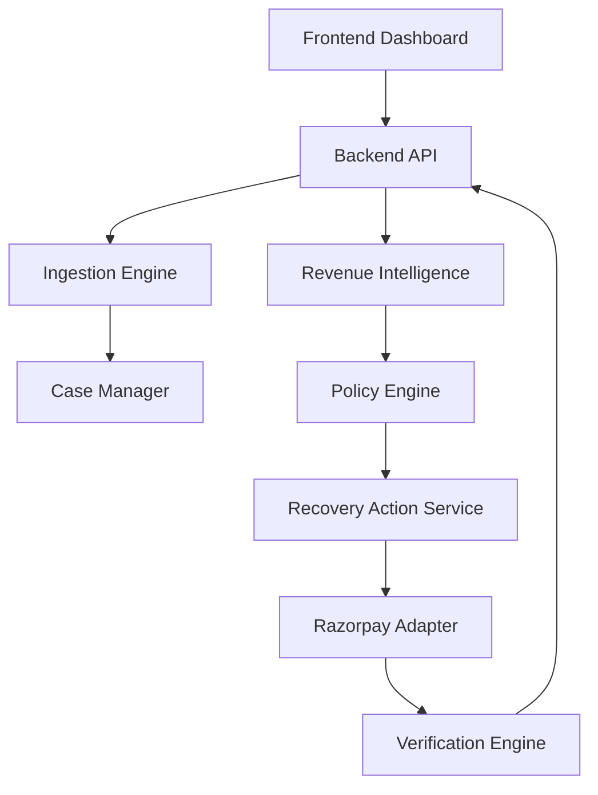
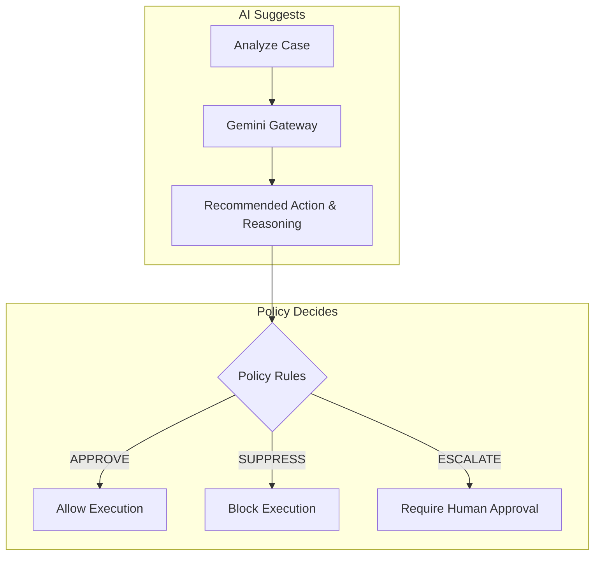
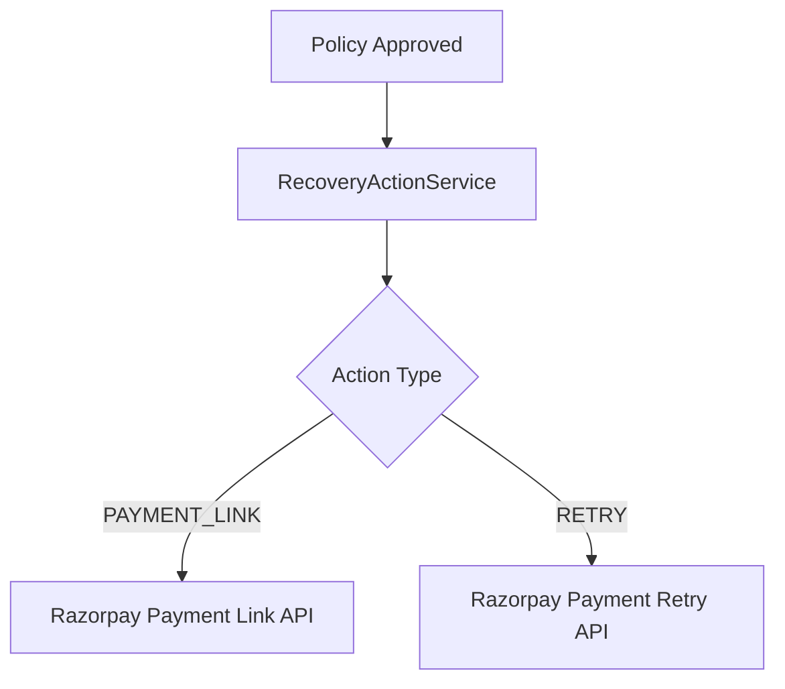
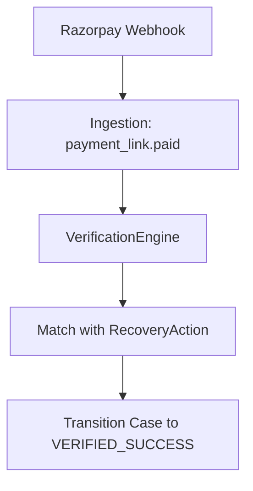
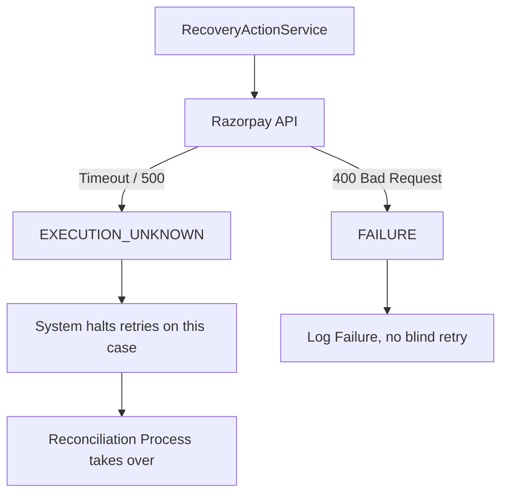
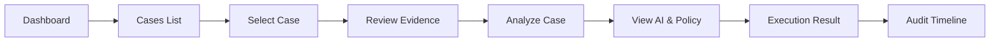

# RecoverAI

**Razorpay AI Buildathon — Track 03: AI Revenue Recovery**

RecoverAI is an evidence-first, bounded AI revenue-recovery system. It detects revenue at risk, applies intelligent analysis to determine the optimal recovery strategy, enforces deterministic policy to ensure financial safety, and executes bounded recovery workflows via Razorpay.

## Architecture

RecoverAI implements a strict Trust Boundary separating AI reasoning from financial execution.

### System Architecture Detailed


### AI / Policy Trust Boundary


### Financial Execution Path


### Verification Path


### UNKNOWN / Failure Safety Flow


### User Journey


### Key Principles
1. **AI Suggests, Policy Decides:** LLM outputs (Gemini) are strictly recommendations. They cannot directly execute financial mutations.
2. **Evidence-First:** Every AI decision is grounded in verifiable case context and payment events. 
3. **Single Financial Authority:** The `RecoveryActionService` is the sole pathway to Razorpay mutations.

## Features
- **Intelligent Case Analysis:** Analyzes payment failure reasons, systemic degradations, and high-value sensitivities.
- **Truthful Analytics:** Computes *Revenue at Risk* and *Verified Recovered* based on authoritative API verification, with strict currency partitioning (INR vs USD).
- **Audit Timeline:** Human-readable audit trails for every state transition, with technical payloads accessible for debugging.
- **n8n Orchestration:** Workflow integration for complex case handling.

## Setup Instructions (Windows)

Prerequisites: Python 3.11+, Node.js (for frontend), and `uv` package manager.

1. **Bootstrap Environment:**
   ```powershell
   Copy-Item .env.example .env
   Copy-Item frontend\.env.example frontend\.env
   ```
2. **Configure API Keys:**
   Open `.env` and set `GEMINI_API_KEY` and Razorpay credentials (if testing live execution).
3. **Start Infrastructure:**
   ```powershell
   .\scripts\start-all.ps1
   ```
4. **Health Check:**
   ```powershell
   .\scripts\check-health.ps1
   ```

## Demo & Verification

**Deterministic Demo Data:**
Seed a curated set of 7 cases proving safety invariants and pipeline states (SUCCESS, FAILURE, UNKNOWN, DENIAL, ESCALATION, DUPLICATE, LIVE DETECTED):
```powershell
uv run scripts/seed_demo_data.py
```

**Evaluation:**
Run the P25 synthetic batch evaluation:
```powershell
uv run python scratch/run_evaluation.py
```

## Safety Guarantees
- **No Fabricated Data:** AI does not invent case context or recommendations prior to explicit "Analyze Case" interactions.
- **UNKNOWN Safety:** Provider uncertainties (e.g. timeouts) result in `UNKNOWN` state, preventing blind retry loops.
- **No Client-Side Execution:** The frontend cannot mutate financial state directly.


## Evaluation & Robustness (P25)
We evaluated RecoverAI on a reproducible 1,500-scenario synthetic benchmark against no intervention and a transparent simple-rule baseline. RecoverAI did not maximize gross recovery: at the baseline configuration it recovered ₹3.16M versus ₹3.36M for the simple rule. Instead, it reduced failed interventions from 558 to 506 and escalated 121 chronic-failure cases. A predeclared sensitivity sweep showed that this recovery-versus-intervention tradeoff remained directionally stable across reasonable parameter changes. These are synthetic evaluation results, not claims of production recovery performance.

## Limitations
- Currency exchange calculation is not implemented; metrics are strictly partitioned by currency.
- Real execution relies on valid Razorpay Test Mode credentials and webhook configurations.

---
*Built for the Razorpay AI Buildathon.*
