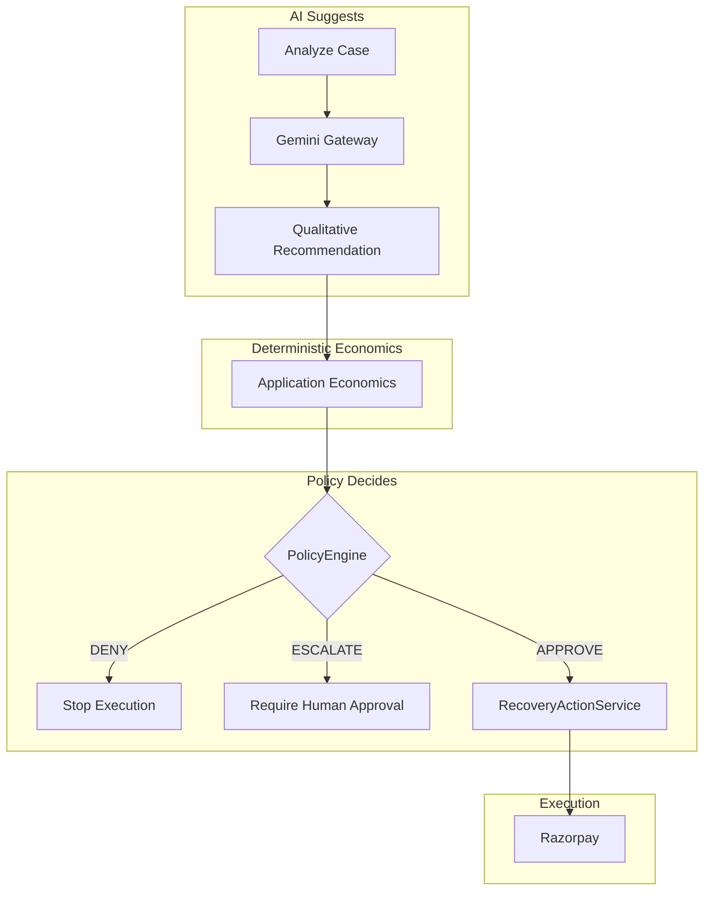
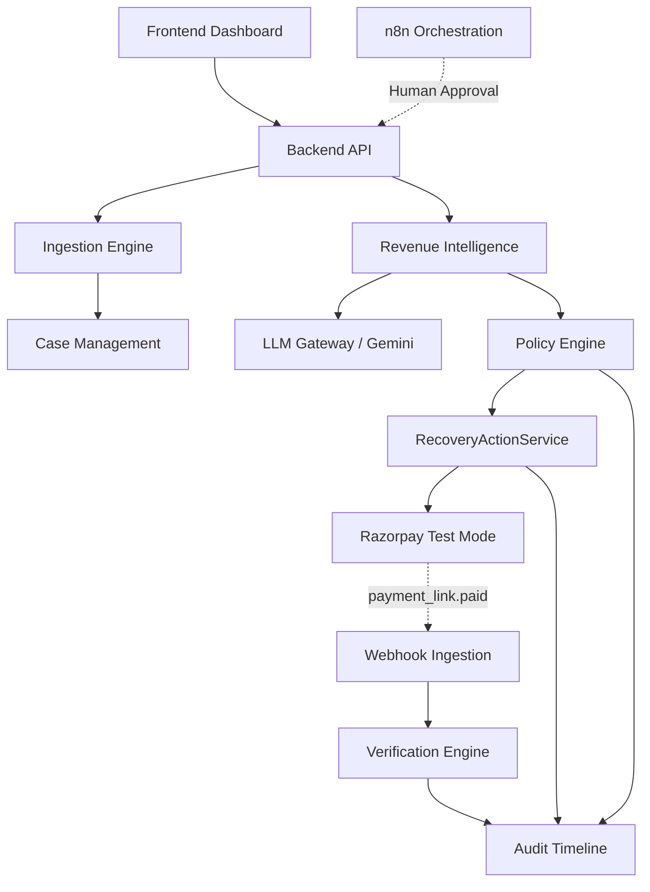
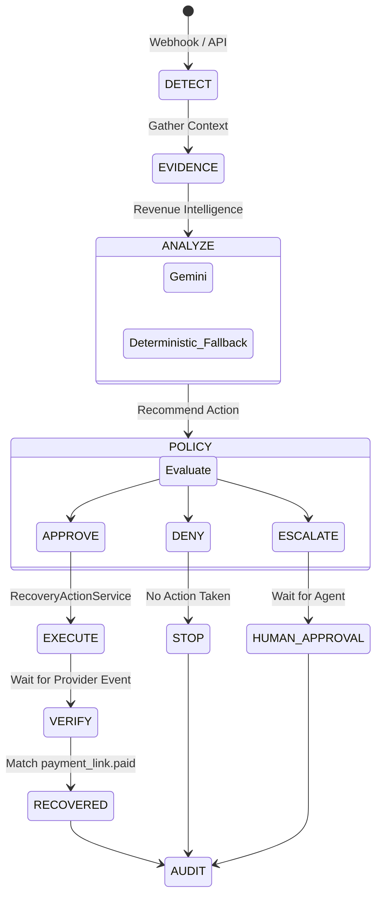
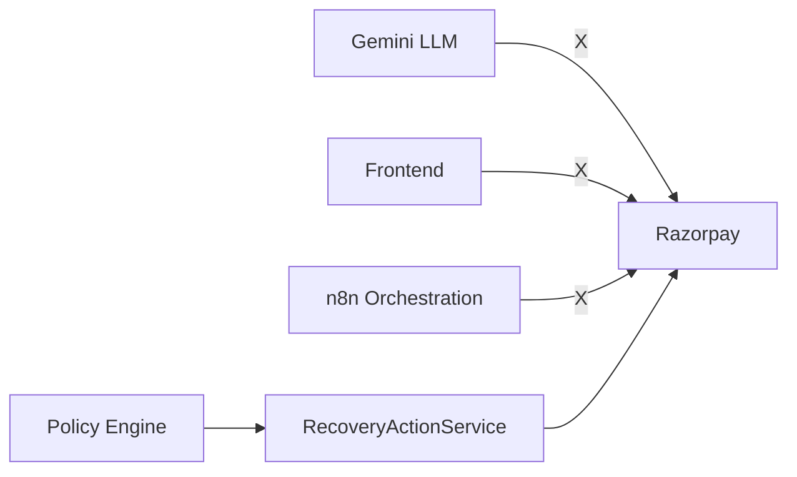
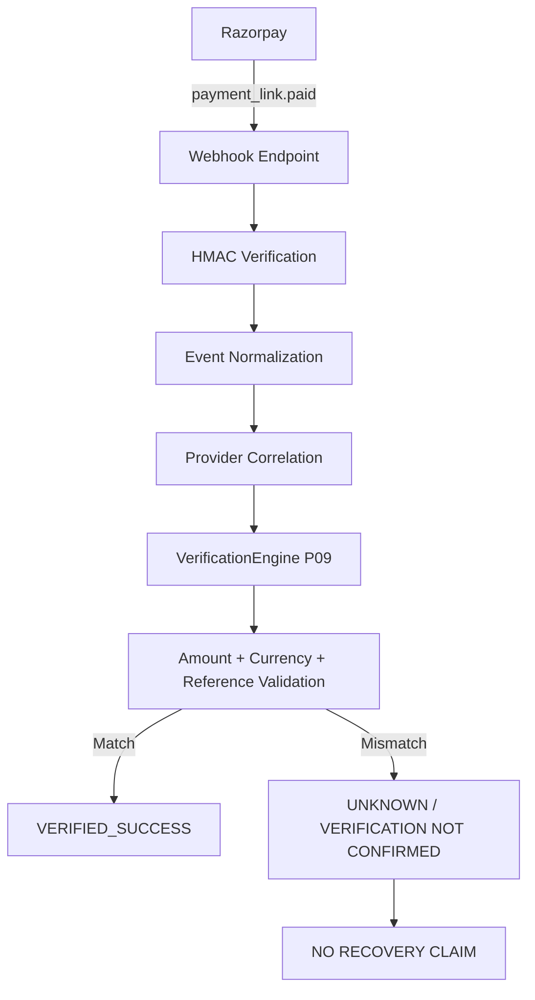
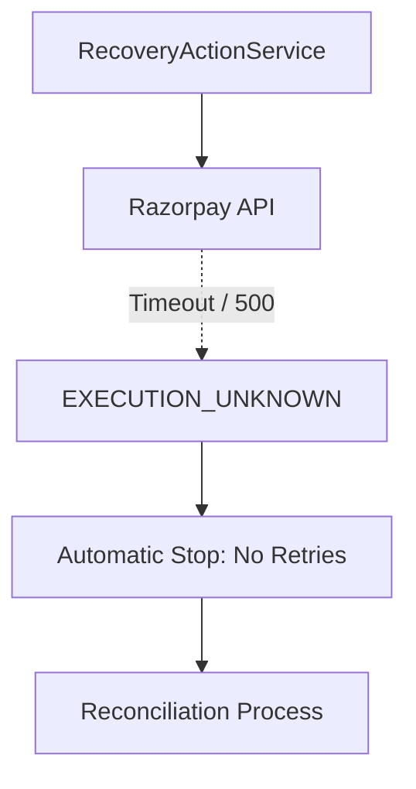
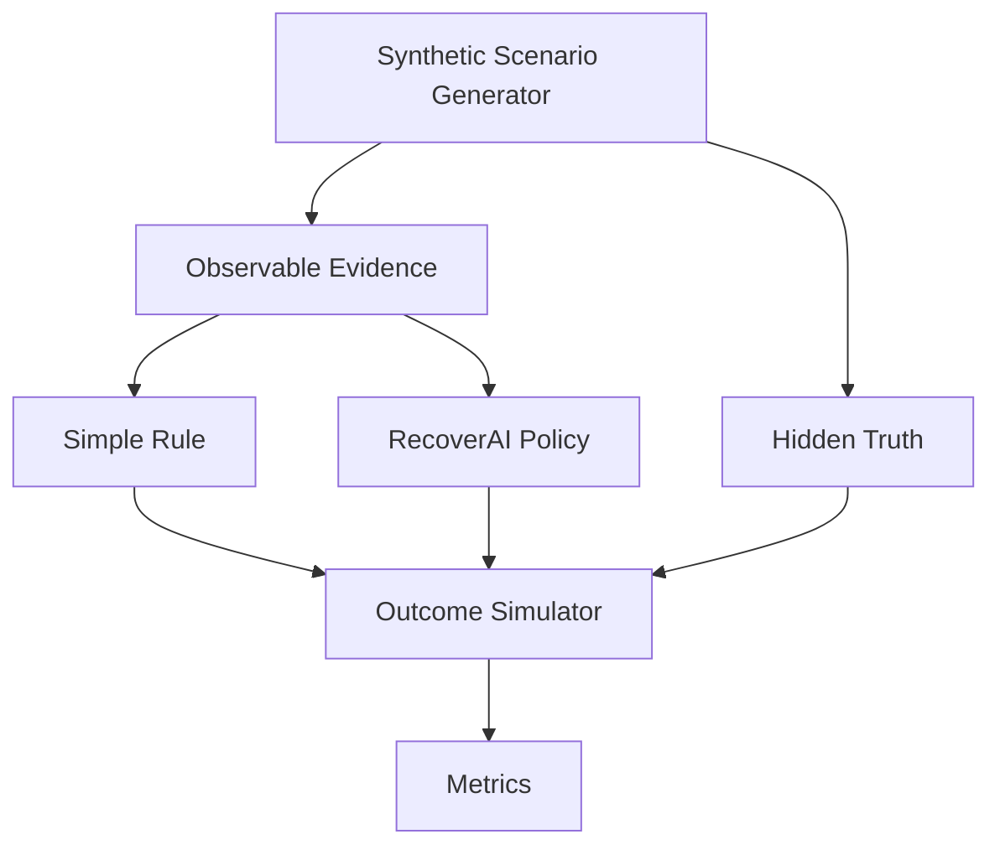

# RecoverAI

Evidence-first AI revenue recovery with bounded execution.

**Razorpay AI Buildathon**  
**Track 03 — AI Revenue Recovery**

[Demo](#demo-quick-start) | [Architecture](#system-architecture) | [Evaluation](#evaluation--robustness) | [Setup](#setup--installation-windows)

---

## The Problem
When a customer's payment fails, the merchant's revenue is at risk. Blindly retrying the payment is unsafe and inefficient—it frustrates customers facing legitimate issues, incurs unnecessary gateway fees, and risks triggering fraud systems. Recovering this revenue safely requires understanding *why* it failed, determining whether intervention is appropriate, enforcing strict stopping rules, and verifying the outcome through authoritative providers.

## The Solution
RecoverAI is an **evidence-first revenue recovery system**. It does not guess. It follows a strict, observable pipeline:

**Detect → Understand → Recommend → Decide → Execute → Verify → Audit**

Unlike simple-retry logic or blind payment-link spam, RecoverAI uses AI to interpret the qualitative context of a failure, but relies on a deterministic policy engine to make the final financial safety decision. It sacrifices some aggressive gross recovery in exchange for preventing failed, friction-inducing interventions.

---

## Why AI?
RecoverAI uses Gemini to understand the *qualitative context* of payment failures. 

**What Gemini DOES:**
- Analyzes unstructured or complex failure codes.
- Interprets observable failure context and recommends an intervention strategy based on the evidence available to the case.
- Grounds all reasoning in observable evidence.

**What Gemini DOES NOT DO:**
- It does not dictate authoritative amounts or currencies.
- It does not authorize financial execution.
- It does not mutate Razorpay state directly.
- It does not verify recovery success.

---

## AI / Policy Trust Boundary

RecoverAI enforces a strict boundary between AI recommendation and financial execution.


**The Boundary:** Gemini outputs structured recommendations. The application injects deterministic financial constraints (Amount at Risk, Currency). The `PolicyEngine` evaluates the complete package. Only an explicit `APPROVE` allows the `RecoveryActionService` to contact Razorpay.

---

## System Architecture



---

## Recovery Lifecycle


*Gemini is used when configured and available. The application has a deterministic fallback when the provider is unavailable or the output cannot be safely validated.*

---

## Execution Safety

RecoverAI enforces a **Single Financial Authority**.


*Razorpay mutations are restricted to the RecoveryActionService execution path; AI, the frontend, and n8n cannot directly authorize financial execution.*

---

## Verification Architecture

RecoverAI relies exclusively on the payment provider (Razorpay) for financial truth.


*A mismatch does not equal a verified recovery; the system fails conservatively, ensuring no false claims are made.*

---

## Uncertainty & Safety Flow

When the provider is unresponsive or the execution state is uncertain, RecoverAI fails safe.


*If an action yields an unknown outcome, the system halts to prevent infinite payment-link spam loops.*

---

## Evaluation Architecture (P25)

Our P25 Evaluation explicitly prevents data leakage between what the AI/Policy sees and the actual simulated customer outcome.


*Strategies see only observable evidence; the outcome simulator strictly applies the hidden truth. The hidden evaluation truth is not provided to the model.*

---

## Evidence Hierarchy

We do not blend our evidence layers. Each phase of RecoverAI proves a specific capability.

| Evidence Layer | Type | What It Proves |
|----------------|------|----------------|
| **P23 Gemini Verification** | Real Provider-Backed Validation | AI grounding, structured output, and hallucination controls. |
| **P24 Razorpay Verification** | Real Provider-Backed Validation | External execution in Razorpay Test Mode, HMAC validation, and P09 verification. |
| **P25 Benchmark** | Synthetic Quantitative Benchmark | Quantitative safety/effectiveness tradeoff and deterministic policy behavior. |

---

## Evaluation & Robustness (P25)

> **Important:** P25 evaluated our deterministic policy fallback (`AnalysisType.RULE_BASED`), not live Gemini intelligence (which was evaluated in P23/P24). 

We evaluated RecoverAI on a reproducible 1,500-scenario synthetic benchmark against no intervention and a transparent simple-rule baseline. Simple Rule aggressively maximizes intervention coverage among non-systemically degraded cases.

- **Simple Rule:** 785 recoveries, ₹3,362,181 gross recovery, 558 failed interventions, 0 escalations
- **RecoverAI:** 727 recoveries, ₹3,159,057 gross recovery, 506 failed interventions, 121 escalations
- **Difference:** RecoverAI produced 58 fewer recoveries (₹203,124 less gross recovery), but prevented 52 failed interventions and escalated 121 cases.

*Note: A "failed intervention" is an attempted intervention that did not recover the simulated case. A "false recovery claim" is claiming a recovery that the simulated outcome says did not occur. There were 0 false recovery claims across all strategies.*

RecoverAI demonstrates a tunable safety/effectiveness tradeoff within the synthetic benchmark. It prioritizes intervention precision and controlled escalation, accepting some gross-recovery loss in exchange for fewer failed interventions. Net merchant value is not modeled. No UNKNOWN strategy outcomes were produced by the synthetic benchmark.

**The Sensitivity Frontier:**
The threshold sweep shows a monotonic tradeoff in this benchmark: more aggressive intervention increases gross recovery while reducing escalation and increasing failed interventions:
- **Threshold 2:** 701 recoveries, 484 failed interventions, 173 escalations.
- **Threshold 3 (Baseline):** 727 recoveries, 506 failed interventions, 121 escalations.
- **Threshold 4:** 760 recoveries, 528 failed interventions, 61 escalations.

The qualitative safety/effectiveness tradeoff remained directionally stable across the predeclared sensitivity scenarios.

---

## Product Screenshots

*Final product screenshots will be added after the P26B UI/UX redesign and browser-verified capture.*

- [Dashboard](docs/screenshots/README.md)
- [Cases List](docs/screenshots/README.md)
- [Case Detail - Success](docs/screenshots/README.md)
- [Case Detail - Escalation](docs/screenshots/README.md)
- [Audit Timeline](docs/screenshots/README.md)

---

## Demo Quick Start

The evaluation journey follows this path:
`Dashboard → Cases → LIVE Case (deterministic demo data) → Evidence → Analyze Case (AI Suggests) → Policy → Execution → Verification → Audit`

To run RecoverAI locally on Windows:

### Prerequisites
- Python 3.11+
- Node.js (v20+)
- `uv` package manager

### 1. Environment Setup
```powershell
# Root environment
Copy-Item .env.example .env

# Frontend environment
Copy-Item frontend/.env.example frontend/.env
```
*Note: Update `.env` with a real `GEMINI_API_KEY` and Razorpay Test Mode credentials if executing live.*

### 2. Startup
We use a robust Windows startup script:
```powershell
.\scripts\start-all.ps1
```
*(This starts the FastAPI backend, React frontend, and n8n orchestration instance).*

### 3. Health Check & Demo Seed
Verify services and inject the 7 deterministic demo cases (which safely prove UNKNOWN, ESCALATION, SUCCESS, and FAILURE states):
```powershell
.\scripts\check-health.ps1
uv run python scripts/seed_demo_data.py
```

### 4. Safe Reset
To reset the environment to a clean state:
```powershell
uv run python scripts/seed_demo_data.py
```
*The seeding script is fully idempotent.*

---

## Repository Structure

- `recoverai/api/`: FastAPI route handlers and dependency injection.
- `recoverai/application/`: Service layer (e.g., `RecoveryActionService`).
- `recoverai/domain/`: Core business entities and rules.
- `recoverai/intelligence/`: AI orchestration and reasoning.
- `recoverai/llm_gateway/`: Standardized provider adapters (Gemini).
- `recoverai/policy/`: Deterministic financial safety rules.
- `recoverai/integrations/`: External adapters (Razorpay).
- `recoverai/verification/`: VerificationEngine (P09).
- `frontend/`: React + TypeScript SPA.
- `n8n/` & `workflows/`: Orchestration flows for human-in-the-loop and notifications.
- `tests/`: Comprehensive unit and integration test suite.
- `docs/`: Architecture diagrams, evaluations, and historical package reports.

---

## Safety Guarantees

- **No AI Financial Fields:** AI has no authoritative financial fields.
- **Policy Gates Execution:** Policy gates execution.
- **Fail-Safe Provider State:** Provider uncertainty does not become success.
- **Idempotent Verification:** Duplicate webhook events are handled idempotently.
- **Single Source of Execution:** Razorpay mutations are restricted to the authorized execution path.
- **Strict Verification:** Verification requires matching provider evidence.

---

## Technical Decisions

- **SQLite:** Used for zero-dependency local evaluation and portability during the Buildathon.
- **Deterministic Policy:** LLMs are powerful but non-deterministic. We wrap them in strict Python policies to guarantee financial safety.
- **JSON Plan Snapshots:** Approved intervention plans are serialized as versioned JSON and persisted with the recovery action so human-approval resumes can replay the exact original plan.
- **n8n Orchestration:** Handles asynchronous notifications and complex multi-step human approvals without bloating the core backend. It is an orchestration layer, not a financial authorization authority.
- **P09 Verification:** We decouple "Execution Attempt" from "Verified Success." Success is only achieved when the webhook validates the HMAC and exactly matches the expected amount and currency.

---

## Limitations

- **Competition Prototype:** This is a single-merchant evaluation build.
- **Synthetic Metrics:** P25 reports synthetic tradeoff ratios, not real-world INR metrics.
- **Test Mode Only:** Real execution was proven against Razorpay Test Mode, not a production merchant account.
- **No Exchange Rates:** Multi-currency support exists via strict partitioning, but live exchange-rate calculations are not implemented.

---

## FAQ

**Q: Can the AI move money on its own?**  
A: No. The AI generates a qualitative recommendation. The deterministic Policy Engine evaluates that recommendation against financial bounds. If approved, the Application executes the movement.

**Q: What happens if Gemini is down?**  
A: RecoverAI falls back to a deterministic rule-based evaluation (`AnalysisType.RULE_BASED`), which we aggressively benchmarked in P25.

**Q: Is n8n required for payment links?**  
A: No. Razorpay execution happens natively in the Python backend. n8n is used strictly for orchestration (notifications, human-approval routing).

**Q: Where can I find the historical package reports?**  
A: All historical Buildathon forensic audits and package reports are preserved in `docs/reports/`.
