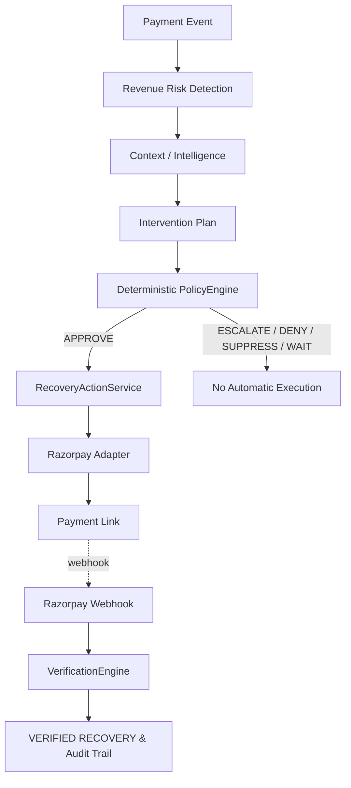

# RecoverAI

**An AI-assisted revenue recovery system for failed and at-risk payments.**

RecoverAI turns failed payments into bounded recovery workflows.

## The Problem
Payment failures are revenue events, not just technical errors. Treating every failure as a blind, aggressive retry degrades the customer experience, burns operations time, and violates merchant policies. 

## The Solution
RecoverAI detects revenue at risk, understands the context of the failure using agentic intelligence, and proposes a bounded intervention. A deterministic policy engine decides whether to allow the action, executes it through Razorpay, and independently verifies the provider evidence to record a verified recovery.

## Why RecoverAI Is Different
The core differentiator of RecoverAI is that **the LLM is not the final financial authority**. The system separates intelligence from execution.

1. **Provider-verified recovery:** Outcomes are verified independently via provider webhooks, not self-reported by an AI.
2. **AI recommendation separated from financial authority:** The LLM proposes, but a deterministic Python policy engine strictly enforces the rules.
3. **Real failure-driven engineering:** Built and hardened against real edge cases like recovery-payment loops, live policy configuration gaps, and test-provider isolation issues.
4. **Quantitative synthetic benchmark:** Compared systematically against No Intervention (L0), Naive Retries (L1), and Deterministic Rules (L2).
5. **Explicit evidence separation:** We cleanly separate Real, Adversarial, Synthetic, and Engineering evidence.

---

## Architecture

**AI proposes. Deterministic policy constrains. Provider evidence proves.**



**Note:** Payment Link creation ≠ recovery. A recovery is only recorded after independent webhook verification asserts that the payment succeeded for the exact amount and currency.

---

## Evidence Model

We do not combine these into one generic performance number. They prove different parts of the system.

### CLASS A — REAL RAZORPAY TEST MODE
Proves real provider integration, real `payment.failed` events, real Payment Link creation, real Test Mode payments, real `payment_link.paid` events, real provider correlation, and independent verification.

| Case | Amount | Initial Event | Action | Provider Outcome | Verification | Final Result | Finding |
|---|---|---|---|---|---|---|---|
| A001 | ₹100 | payment.failed | CREATE_PAYMENT_LINK | payment_link.paid | Verified | VERIFIED RECOVERY | - |
| A002 | ₹450 | payment.failed | CREATE_PAYMENT_LINK | payment_link.paid | Verified | VERIFIED RECOVERY | - |
| A003 | ₹750 | payment.failed | CREATE_PAYMENT_LINK | payment.failed | None | FAILED RECOVERY | Real recovery-payment loop discovered & fixed |
| A004 | ₹1,000 | payment.failed | CREATE_PAYMENT_LINK | payment_link.paid | Verified | VERIFIED RECOVERY | Verified recovery after loop fix |
| A005 | ₹50,000 | payment.failed | CREATE_PAYMENT_LINK | NOT CAPTURED | None | ESCALATED | Live high-value threshold omission discovered & fixed |

### CLASS B — CONTROLLED ADVERSARIAL
Proves safety boundaries, evidence rejection, idempotency, concurrency, AI failure handling, and failure semantics.

Across the 21 tested adversarial scenarios, RecoverAI recorded zero violations of the defined safety invariants:
- **False Recovery Claims = 0**
- **Policy Violations = 0**
- **Invalid Evidence Accepted = 0**
- **Duplicate Financial Execution = 0**
- **Stopping-Rule Violations = 0**
- **Unsafe Actions = 0**

### CLASS C — SYNTHETIC BENCHMARK
Proves repeatable population-level comparison against baselines. Note that *simulated recovered value is NOT real Razorpay recovered revenue*.

| Strategy | Recovery Rate | Gross Simulated Recovery | Safety |
|---|---|---|---|
| L0 (No Intervention) | 8.2% | ₹569,697.22 | PASS |
| L1 (Naive Rule) | 54.5% | ₹3,232,371.94 | FAIL (519 Policy / 218 Stopping Violations) |
| L2 (Deterministic) | 32.0% | ₹1,825,326.26 | PASS |
| **L3 (RecoverAI)** | **47.5%** | **₹2,709,921.81** | **PASS** |

The current RecoverAI evaluation pipeline produced a **48.5% relative increase in simulated gross recovered value** over the deterministic contextual-rule baseline (L2) in the frozen 1,500-case synthetic benchmark.

### CLASS D — ENGINEERING / REGRESSION
Proves discovered defects, fixes, regression coverage, provider isolation, and configuration correctness.

---

## What We Found and Fixed

This system was hardened against real failures discovered during development.

1. **Recovery-payment failure loop**
   - *Issue:* A real recovery Payment Link failed, emitting a new `payment.failed` event, which accidentally created a brand new recovery case.
   - *Fix:* Exact provider correlation implemented. Existing recovery actions are updated instead. Secured with regression tests.
2. **Missing live high-value threshold**
   - *Issue:* The benchmark expected a ₹40,000 threshold for escalations, but the live `PolicyContext` received `None`, causing a ₹50,000 case (A005) to be automatically approved.
   - *Fix:* Added merchant-configurable `high_value_threshold_inr`, wired via live dependency injection. A ₹50K case now correctly escalates. Secured with regression tests.
3. **Automated tests consuming real Razorpay Payment Links**
   - *Issue:* `pytest` inherited real Test Mode credentials, allowing auto-execution paths to reach the real provider.
   - *Fix:* A provider boundary safety fence was added requiring explicit `ALLOW_REAL_RAZORPAY` opt-in. Narrow provider mocks implemented and global HTTP mocks removed.

---

## What the AI Does

The AI/contextual layer proposes intervention candidates based on the context of the failure. The `PolicyEngine` determines whether the proposal is allowed. The `RecoveryActionService` performs bounded execution. The `VerificationEngine` requires provider evidence.

**AI Contribution Statement:**
The current system demonstrates the architectural role of contextual intelligence, but the Phase 2 controlled attribution experiment did not establish a standalone incremental AI uplift over the deterministic baseline. 

**Gemini & Fallbacks:**
Gemini is the intended primary LLM provider. In the event of provider failure, the system relies on a deterministic fallback. Live API availability may vary.

---

## Strategic Extension: Systemic Intelligence

*(FUTURE / STRATEGIC EXTENSION - NOT IMPLEMENTED IN MVP)*

RecoverAI is conceptually positioned for portfolio-level revenue intelligence. If a gateway-wide failure rate spikes, blindly retrying every payment may worsen customer experience. In the future, RecoverAI could detect systemic degradation, estimate affected revenue, and suppress retries, prioritize safe segments, or escalate entirely.

---

## Running the Demo

1. Start the backend: `uv run uvicorn recoverai.api.main:app`
2. Start the frontend: `cd frontend && npm run dev`
3. Start an ngrok tunnel (if receiving real webhooks).
4. Ensure your Razorpay Test Mode webhook is configured.
5. Trigger a Test Mode failed payment.
6. Watch RecoverAI detect the case in the dashboard.
7. Click **Analyze** to auto-execute the policy decision.
8. Open the generated Payment Link.
9. Complete the Test Mode payment.
10. Observe the `payment_link.paid` webhook arrival.
11. See the final state transition to **VERIFIED RECOVERY**.

*Note: Test Mode is not production. Do not expose secrets.*

---

## Configuration

Set the following environment variables (e.g., in `.env`):
- `LLM_PROVIDER`
- `GEMINI_API_KEY`
- `RAZORPAY_KEY_ID`
- `RAZORPAY_KEY_SECRET`
- `RAZORPAY_MODE`
- `HIGH_VALUE_THRESHOLD_INR`
- `ALLOW_REAL_RAZORPAY` (Intended ONLY for explicit real-provider testing. Leave unset for typical local development and tests).

---

## Test / Evaluation Quick Start

Run standard unit and integration tests safely with:
```bash
pytest
```
*The full test suite will not create real Razorpay Payment Links or consume quota, because `ALLOW_REAL_RAZORPAY` must be explicitly enabled for real network bounds to open.*

Evaluation scripts for the synthetic benchmark and adversarial suite are located in the `scripts/` directory. Keep real provider execution clearly separate from ordinary `pytest`.
