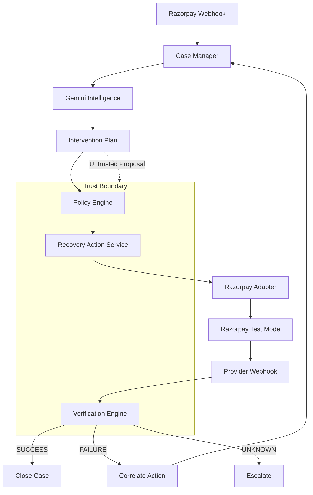
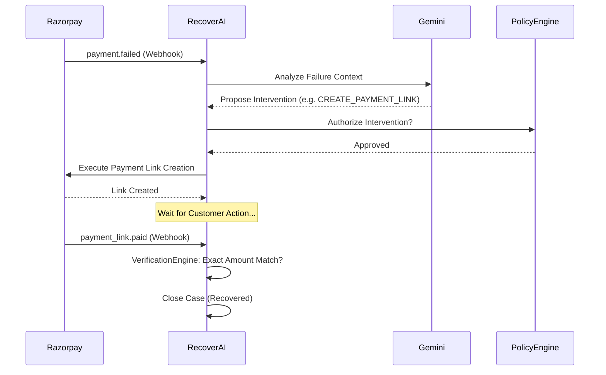

<div align="center">

# 🚀 RecoverAI

### AI Revenue Recovery Agent

**Razorpay AI Buildathon 2026 · Track 03**

> **AI diagnoses. Deterministic policy decides. Provider evidence proves.**


</div>

## Executive Overview

Failed payments are lost revenue. But blindly retrying them is unsafe, and handing full financial autonomy to an AI agent exposes the business to hallucination risks and runaway execution loops.

RecoverAI turns payment failures into bounded, intelligent recovery actions. It combines **Gemini** for contextual reasoning and diagnosis with a strict, deterministic **PolicyEngine** for financial authorization. RecoverAI executes approved interventions via **Razorpay Test Mode** and relies on a cryptographic **VerificationEngine** for provider-backed recovery truth.

It is a zero-trust financial agent: the AI is highly capable, but it has no authority to move money or declare a payment recovered.

---

## Core Capabilities

| Capability | Implementation | Measured / Engineering Guarantee |
|:---|:---|:---|
| **Revenue-at-Risk Detection** | Cryptographic ingestion of Razorpay `payment.failed` webhooks | 100% HMAC verification enforcement |
| **Gemini Recovery Reasoning** | Contextual feature extraction and failure diagnosis | Evaluates context and proposes bounded actions |
| **Deterministic Policy** | Strict `PolicyEngine` gating all AI proposals | Zero unauthorized executions in 1,500-case benchmark |
| **Closed-Loop Recovery** | Correlates subsequent failures back to original recovery actions | Infinite loops blocked by deterministic bounds |
| **Bounded Attempts** | Hard-coded `max_attempts_per_case` threshold | 100% halt on limit exhaustion |
| **High-Value Escalation** | Diverts high-value cases to manual human review via n8n | Zero auto-executions > ₹40,000 threshold |
| **Idempotent Execution** | Atomic DB locks and unique webhook indexing | Zero duplicate webhook/execution processing |
| **Provider Verification** | `VerificationEngine` requires exact Razorpay payloads | Missing amount/currency fails closed to `UNKNOWN` |
| **Systemic Degradation** | Dynamic halt during mass failure events | Automated actions suspended during gateway outages |

---

## The Recovery Problem

Not all failures require the same treatment. Treating every failure with a generic rule invites friction, fraud, or wasted effort.

| Revenue Failure | Risk of Naive Automation | RecoverAI Behavior |
|:---|:---|:---|
| **Transient network timeout** | Blind immediate retry fails if gateway is still down | Evaluates context; proposes alternate method |
| **Repeated recovery failure** | Aggressive, runaway retry loops leading to blocks | Detects attempt history; deterministically halts |
| **High-value failure (>₹40k)** | Auto-charging massive amounts triggers fraud flags | Safely suppresses automation and escalates to human |
| **Systemic gateway degradation**| Massive spike in automated retries overwhelms API | Suspends aggressive automation system-wide |
| **Malformed provider evidence** | System falsely believes payment was recovered | Verification fails closed to `UNKNOWN` |
| **Duplicate Razorpay webhook** | Double-executing a recovery payment link | Idempotent indexing drops duplicate events |
| **Payment Link created** | Falsely treating "link sent" as "money received" | Waits for independent cryptographic verification |

---

## Core Invariant

> **Payment Link creation ≠ revenue recovered.**

Creating a Payment Link means RecoverAI initiated an intervention. Recovery is counted *only* after independent provider evidence is validated (authentic webhook, exact amount, exact currency). Missing or malformed evidence always fails closed.

> **AI proposes.**  
> **Policy constrains.**  
> **Razorpay executes.**  
> **Verification proves.**

---

## System Architecture



---

## End-to-End Sequence



---

## Trust Boundary

The system maintains a zero-trust model between the intelligence layer and the financial execution boundary.

| Operation | Gemini Intelligence | Deterministic RecoverAI |
|:---|:---:|:---:|
| Understand failure context | ✅ | ❌ |
| Diagnose root cause | ✅ | ❌ |
| Propose recovery action | ✅ | ❌ |
| Rank candidate interventions | ✅ | ❌ |
| Authorize money movement | ❌ | ✅ |
| Enforce retry limits | ❌ | ✅ |
| Execute Razorpay action | ❌ | ✅ |
| Verify recovery success | ❌ | ✅ |
| Stop runaway retries | ❌ | ✅ |

---

## Closed-Loop Recovery

RecoverAI operates a fully closed-loop architecture. When a recovery action (like a sent payment link) fails, the system safely replans:

**Detect → Diagnose → Propose → Constrain → Execute → Verify → Replan → Stop**

1. **Failure**: A recovery `payment.failed` webhook arrives.
2. **Correlation**: The system parses the deterministic `Action ID` to map the failure back to the original action.
3. **Re-analysis**: The failure is passed as context into the next AI analysis phase.
4. **Next Attempt**: Gemini proposes a new intervention based on the attempt history.
5. **Stop**: The `PolicyEngine` halts execution permanently if `max_attempts_per_case` is exceeded.

---

## Real Razorpay Evidence

RecoverAI executes real financial operations against the Razorpay Test Mode API. Real failures drive real engineering fixes.

| Case | Amount | Outcome | Engineering Significance |
|:---|:---|:---|:---|
| **A001** | ₹100 | Verified Recovery | Baseline successful end-to-end recovery loop. |
| **A002** | ₹450 | Verified Recovery | Repeat baseline across a different value. |
| **A003** | ₹750 | **Failed Recovery** | Real failed recovery that exposed a critical closed-loop correlation defect. It drove the fix to the adapter description format. |
| **A004** | ₹1,000| Verified Recovery | Successful recovery proving the A003 loop fix was effective. |
| **A005** | ₹50,000| Policy Gap Found | Historical high-value wiring gap; no false recovery was claimed, and the threshold wiring was subsequently fixed. |

Detailed provider evidence is available in the [Razorpay Evidence Pack](evidence/razorpay/README.md).

---

## Scale Evaluation: 1,500-Case Benchmark

### **48.46% higher simulated gross recovery than L2.**

The architectural capabilities of the `PolicyEngine` and closed-loop orchestration were evaluated across a frozen 1,500-scenario deterministic benchmark (Seed 42).

| Level | Intervention Strategy | Recovery Rate | Gross Simulated Recovery | Safety |
|:---|:---|---:|---:|:---|
| **L0** | No Intervention | 8.2% | ₹569,697.22 | PASS |
| **L1** | Naive (Retry Everything) | 54.5% | ₹3,232,371.94 | **FAIL** (519 policy violations, 218 stopping violations) |
| **L2** | Safe Deterministic | 32.0% | ₹1,825,326.26 | PASS |
| **L3** | **RecoverAI (Bounded)**| **47.5%** | **₹2,709,921.81** | **PASS** |

*(Methodology Note: The large-scale benchmark isolates reproducible system behavior and structural policy efficacy using `llm_gateway=None`. Live Gemini judgment is evaluated separately via a hybrid smoke-test due to quota limitations.)*

---

## Adversarial & Security Validation

The system architecture was heavily audited by an offline hostile QA subagent. Below are the structural protections and engineering fixes validated.

| Threat / Test Case | Result | Engineering Status |
|:---|:---|:---|
| **Broken recovery-loop correlation** | 🐛 Defect Found | **FIXED** (Adapter now injects strict `Action ID`) |
| **Missing amount verification bypass** | 🐛 Defect Found | **FIXED** (Verification fails closed to `UNKNOWN`) |
| **Duplicate webhook replay** | 🛡️ Blocked | Handled by idempotent `source_event_id` indexing |
| **Duplicate execution** | 🛡️ Blocked | Handled by atomic database row-level locking |
| **High-value policy bypass** | 🛡️ Blocked | Gated by `PolicyEngine` threshold rules |
| **Repeated recovery failure loop** | 🛡️ Blocked | Halted by `max_attempts_per_case` |
| **Malformed AI output** | 🛡️ Blocked | Fallback to deterministic `GEMINI_FAILED_FALLBACK` |
| **Rate limit abuse** | 🛡️ Blocked | Lightweight memory limits on `/analyze` |
| **Unknown provider state** | 🛡️ Blocked | `EXECUTION_UNKNOWN` quarantined |

---

## Technology Stack

| Layer | Technology |
|:---|:---|
| **Backend** | Python 3.11, FastAPI, Pydantic |
| **Frontend** | React, TypeScript, Vite |
| **AI** | Gemini |
| **Database** | SQLite |
| **Provider** | Razorpay Test Mode API |
| **Testing** | Pytest, AnyIO |

---

## Quick Start

**1. Configure Environment**
```bash
cp .env.example .env
cp frontend/.env.example frontend/.env
```
Add your **Gemini API key** and **Razorpay Test Mode credentials**.

**2. Start Services**
```powershell
uv run uvicorn recoverai.api.main:app --reload
```

**3. Seed Demo Data**
```powershell
uv run python scripts/reset_demo_db.py
uv run python scripts/seed_demo_data.py
```

---

## Documentation Index

- [**Engineering Design**](DESIGN.md)
- [**Architecture Topology**](docs/ARCHITECTURE.md)
- [**Closed-Loop Recovery**](docs/CLOSED_LOOP.md)
- [**Security & Trust Boundary**](docs/security.md)
- [**Failure Recovery Mechanisms**](docs/FAILURE_RECOVERY.md)
- [**Razorpay Integration**](docs/RAZORPAY_INTEGRATION.md)
- [**Evaluation Methodology**](docs/EVALUATION.md)
- [**Evidence Root**](evidence/README.md)
- [**Historical Reports**](docs/reports/README.md)

---

## Known Constraints

- **Live Provider Integration:** Razorpay integration is strictly restricted to Test Mode. 
- **Rate Limiting:** The prototype utilizes a lightweight in-memory rate limiter based on `request.client.host` and does not account for proxy identity spoofing (e.g., `X-Forwarded-For`).
