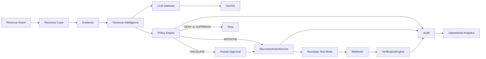
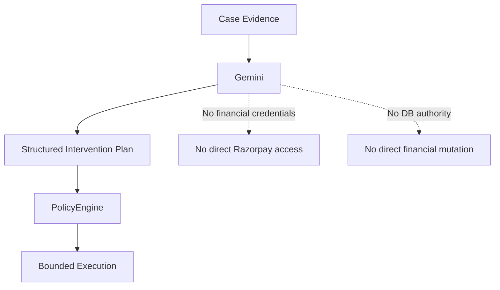
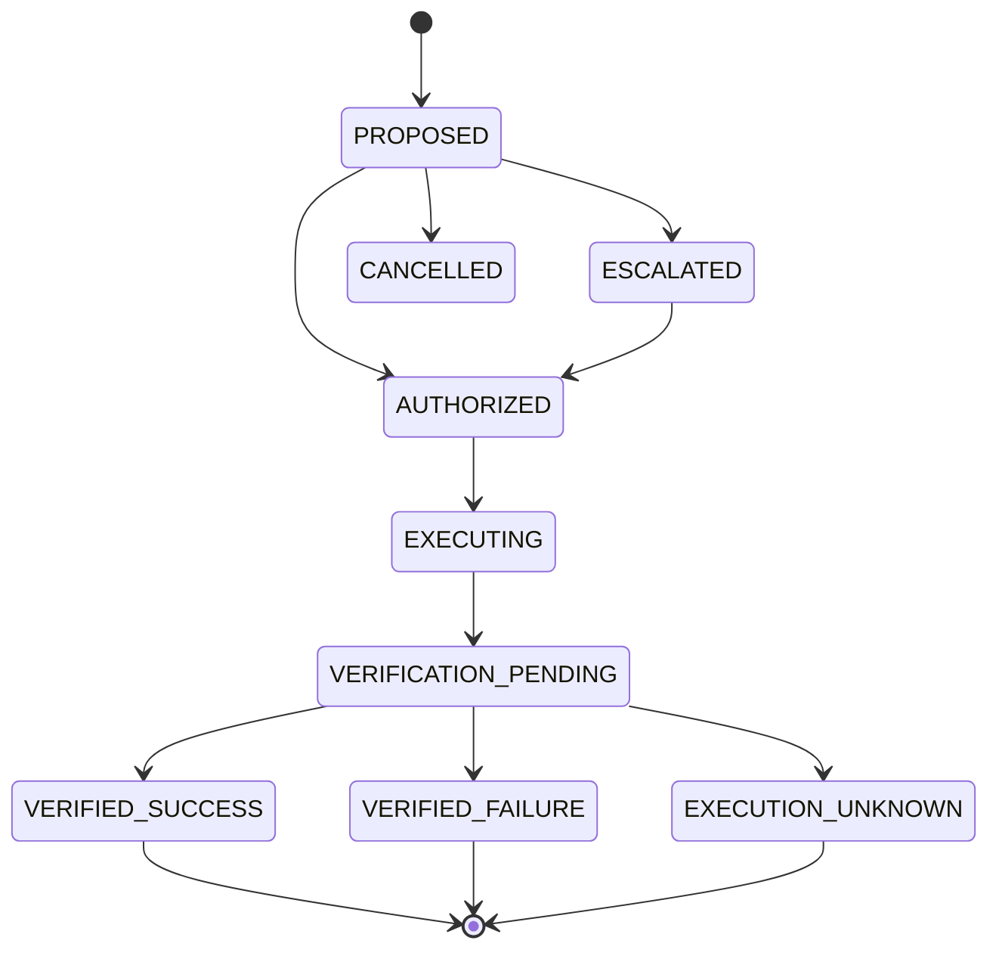
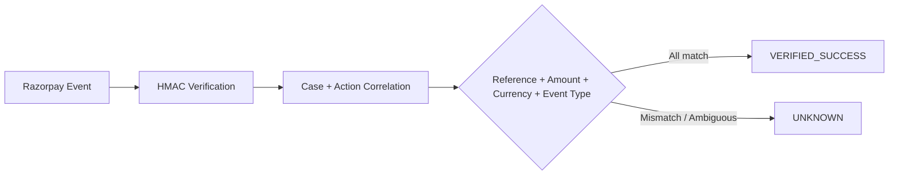

# RecoverAI

### Evidence-first AI revenue recovery with bounded execution

**Razorpay AI Buildathon · Track 03 — AI Revenue Recovery**

> **Detect revenue at risk → understand the evidence → let AI recommend the intervention → enforce deterministic policy → recover → verify → audit.**

[Demo](docs/DEMO.md) · [Architecture](#architecture) · [Security](#security) · [Testing](#testing)

---

## Why RecoverAI?

A failed payment is not the end of a transaction. It is a revenue-recovery
decision.

RecoverAI turns that decision into a controlled loop:

```text
Revenue Event
     ↓
Recovery Case
     ↓
Evidence
     ↓
AI Recommendation
     ↓
Policy Decision
     ↓
Bounded Recovery
     ↓
Provider Evidence
     ↓
Independent Verification
     ↓
Audit + Analytics
```

The product focuses on **payment-failure / payment-degradation recovery**
with Razorpay Test Mode.

### Track 03 alignment

| Track 03 asks for | RecoverAI demonstrates |
|---|---|
| Detect revenue at risk | Revenue events become persistent recovery cases |
| Determine the right intervention | Gemini produces structured recovery recommendations |
| Execute a bounded workflow | Deterministic policy gates `RecoveryActionService` |
| Escalate safely | `ESCALATE` routes to human approval |
| Stop unsafe actions | `DENY`, `SUPPRESS`, terminal-state checks and fail-safe handling |
| Prove recovery | `VerificationEngine` validates external evidence |
| Show recovered money | Operational analytics use persisted runtime outcomes |
| Preserve an audit trail | Lifecycle decisions and actions are recorded |

---

# Architecture



### Component boundaries

**Revenue Intelligence** interprets case evidence and proposes interventions.

**LLM Gateway** isolates provider-specific model access and preserves
provider provenance.

**PolicyEngine** makes deterministic financial decisions.

**RecoveryActionService** is the canonical financial execution authority.

**Razorpay Test Mode** provides the external payment action and provider
evidence.

**VerificationEngine** independently proves or rejects the recovery outcome.

**Audit + Analytics** preserve and measure the resulting lifecycle.

---

# The AI Boundary

RecoverAI gives the model a reasoning role, not a financial-authority role.



### Gemini does

- interpret observable payment/recovery context
- recommend an intervention strategy
- provide reasoning and confidence
- return structured output that can be validated

### Gemini does not

- authorize money movement
- define authoritative financial amounts/currency
- call Razorpay
- mutate financial state
- verify recovery

> **AI proposes. Deterministic policy constrains. Provider evidence proves.**

---

# Recovery Lifecycle



| Decision | Effect |
|---|---|
| `APPROVE` | Action may enter bounded execution |
| `ESCALATE` | Human authorization is required |
| `DENY` | Safety/business rule blocks the action |
| `SUPPRESS` | Recovery is intentionally stopped |

A `PROPOSED` action cannot be resumed through the human-approval bypass path.
Terminal states cannot be executed again.

---

# Financial Execution Safety

There is one financial execution path:

```text
PolicyEngine
     ↓
RecoveryActionService
     ↓
Razorpay Test Mode
```

The browser, Gemini and n8n are not financial authorities.

Safety controls include:

- backend-authoritative execution
- policy enforcement before provider mutation
- human approval for escalations
- Test Mode guard
- private provider credentials kept off the frontend
- duplicate-execution protection
- atomic action claim before the provider boundary
- safe handling of uncertain external outcomes

The final concurrency validation demonstrated:

> **2 simultaneous execution attempts → 1 provider call**

The important property is application-level protection before the external
financial mutation, not reliance on provider-side behavior.

---

# Verification

Execution success is not the same thing as recovery success.



Recovery is recorded only when the expected provider evidence matches.

Ambiguous or mismatched evidence remains `UNKNOWN` rather than being promoted
to a false successful recovery.

---

# Real Razorpay Test Mode Proof

RecoverAI has been exercised against the **real Razorpay Test Mode API**.

The proven path is:

```text
Recovery Case
    ↓
Gemini Recommendation
    ↓
Policy
    ↓
RecoveryActionService
    ↓
Razorpay Test Mode
    ↓
real payment-link reference
    ↓
Webhook
    ↓
VerificationEngine
    ↓
VERIFIED_SUCCESS
```

A representative browser validation produced:

- Gemini-backed recommendation
- `CREATE_PAYMENT_LINK`
- model confidence shown in the UI
- policy approval
- real Razorpay Test Mode payment-link reference
- verification leading to `VERIFIED_SUCCESS`

> **This is Test Mode evidence, not production payment processing.**

For controlled E2E verification, the test harness can generate correctly
signed webhook requests and send them through the real RecoverAI webhook
endpoint.

---

# Real vs Synthetic

The project keeps proof categories explicit.

| Component | Nature |
|---|---|
| Gemini recommendation | **Real provider output** when Gemini succeeds |
| Gemini reasoning / confidence | **Real structured model output** |
| Razorpay payment link | **Real Razorpay Test Mode resource** |
| Provider reference | **Real provider-generated identifier** |
| Webhook ingestion | **Real application endpoint** |
| HMAC verification | **Real implementation** |
| VerificationEngine | **Real backend verification** |
| Operational analytics | **Runtime database-derived outcomes** |
| Seed/demo records | **Development/test fixtures** |
| Quantitative benchmark | **Synthetic evaluation** |

This distinction is intentional: synthetic data is useful for reproducible
testing, but it is never presented as live merchant traffic.

---

# Evaluation

RecoverAI includes a **synthetic** benchmark for controlled
safety/effectiveness analysis.

### 1,500 synthetic scenarios

| Metric | Simple Rule | RecoverAI |
|---|---:|---:|
| Recoveries | 785 | 727 |
| Gross recovery | ₹3,362,181 | ₹3,159,057 |
| Failed interventions | 558 | 506 |
| Escalations | 0 | 121 |
| Recovery rate | **52.3%** | **48.5%** |

The benchmark shows a safety/effectiveness tradeoff: RecoverAI accepts less
aggressive intervention in exchange for fewer failed interventions and more
explicit escalation.

**These numbers are not live merchant performance and do not feed operational
analytics.**

---

# Security

RecoverAI is built around explicit financial safety boundaries.

| Boundary | Principle |
|---|---|
| AI | Untrusted proposal, no financial authority |
| Policy | Deterministic authorization |
| Execution | Single backend authority |
| Provider | Test Mode constrained |
| Webhooks | HMAC authenticated |
| Verification | Fail closed on mismatch/ambiguity |
| Idempotency | Duplicate execution prevented |
| Audit | Important lifecycle events preserved |

### Key engineering principles

- **AI for interpretation, deterministic code for financial authority**
- **Backend authority over frontend assumptions**
- **Verify before recording recovery**
- **Atomic claim before external mutation**
- **Fail closed under ambiguity**
- **Append-oriented auditability**
- **Synthetic benchmarks isolated from operational metrics**

---

# Operator Workflow

RecoverAI provides an operational console for the recovery lifecycle:

```text
Dashboard
   ↓
Recovery Cases
   ↓
Case Detail
   ↓
Approval
   ↓
Execution
   ↓
Verification
   ↓
Audit
   ↓
Analytics
```

The Case Detail view is evidence-first:

- observed recovery evidence
- AI recommendation
- provider provenance
- confidence and reasoning
- policy result
- lifecycle state

`Analyze Case` is the explicit intelligence action. The timeline and policy
state displayed by the browser come from persisted backend state rather than
frontend-simulated workflow steps.

---

# Quick Start

## Prerequisites

- Python 3.11+
- Node.js 20+
- [`uv`](https://docs.astral.sh/uv/)
- Razorpay Test Mode credentials
- Gemini API access

## Configure

```powershell
Copy-Item .env.example .env
Copy-Item frontend/.env.example frontend/.env
```

Add your own credentials.

**Never commit `.env`.**

## Start

```powershell
.\scripts\start-all.ps1
```

## Reset development fixtures

```powershell
uv run python scripts/seed_demo_data.py
```

For the complete Test Mode procedure, see [docs/DEMO.md](docs/DEMO.md).

---

# Testing

### Backend

```powershell
uv run python -m pytest tests/ -q
```

### Razorpay Test Mode E2E

```powershell
uv run python -m pytest tests/e2e/test_real_testmode.py -v
```

### Frontend build

```powershell
cd frontend
npm run build
```

The repository also contains targeted tests for webhook security,
verification, policy behavior, and concurrent execution.

---

# Repository Structure

```text
RecoverAI/
├── recoverai/
│   ├── api/
│   ├── application/
│   ├── domain/
│   ├── intelligence/
│   ├── llm_gateway/
│   ├── policy/
│   ├── ingestion/
│   ├── integrations/
│   ├── verification/
│   ├── persistence/
│   └── mcp/
├── frontend/
├── tests/
├── docs/
├── scripts/
└── pyproject.toml
```

The most important layers are:

- `intelligence/` — AI reasoning and intervention planning
- `llm_gateway/` — provider abstraction and fallback
- `policy/` — deterministic financial policy
- `application/` — execution/application services
- `integrations/` — external provider adapters
- `verification/` — independent recovery verification
- `persistence/` — repositories and storage
- `mcp/` — bounded tool interfaces
- `frontend/` — operator console

---

# Limitations

- This is a competition-oriented prototype, not a production multi-merchant
  deployment.
- Razorpay execution is demonstrated in **Test Mode**, not production.
- Quantitative evaluation uses synthetic scenarios.
- LLM availability depends on provider credentials, quotas, model access,
  and external service availability.
- The current product focus is payment-failure/payment-degradation recovery;
  other Track 03 directions are not claimed as implemented.
- Live FX/exchange-rate calculation is outside the current scope.

---

# Documentation

- **[Demo Guide](docs/DEMO.md)** — local Test Mode setup and E2E workflow
- **[Repository](.)** — implementation and tests
- **Architecture diagrams above** — system, AI boundary, lifecycle, and verification

---

## The Thesis

> **RecoverAI turns revenue recovery from a blind retry into an evidence-driven decision: AI proposes the intervention, policy constrains it, Razorpay executes it, verification proves it, and the audit trail records what actually happened.**
