# RecoverAI

### AI Revenue Recovery Agent — Razorpay Buildathon 2026 · Track 03

> **AI proposes. Deterministic policy constrains. Provider evidence proves.**


RecoverAI detects failed payments, diagnoses the failure context using Gemini, proposes a bounded recovery intervention, enforces deterministic financial safety, executes against Razorpay, and independently verifies whether revenue was actually recovered.

---

## The Problem

Every failed payment is revenue at risk, but blind retries treat all failures identically—causing customer friction and policy violations. Financial automation requires intelligence to understand the context of a failure, but it must be constrained by hard safety rules to prevent duplicate charges or false recovery claims.

---

## Why RecoverAI Fits Track 03

| Track 03 Need | RecoverAI Implementation |
|---|---|
| **Detect revenue at risk** | Ingests and normalizes Razorpay `payment.failed` webhooks |
| **Understand context** | Gemini interprets error codes, payment methods, and systemic signals |
| **Determine intervention** | AI proposes and ranks candidates (Payment Link, Wait, Escalate, Suppress) |
| **Execute recovery** | Deterministic PolicyEngine gates actions; executes via Razorpay Test Mode |
| **Handle escalation / stopping** | Enforces high-value thresholds and retry limits deterministically |
| **Verify recovery** | Cross-checks provider evidence (amount, currency, reference) independently |
| **Measure outcomes** | 1,500-scenario synthetic benchmark + adversarial tests + live Test Mode cases |

---

## Gemini Intelligence Layer

Gemini receives the case's payment amount/currency, provider failure information, payment method, customer/failure history, prior recovery context, systemic signals, and event history.

Gemini then:
1. Diagnoses the likely failure cause with evidence citations.
2. Generates intervention candidates.
3. Ranks candidates using LLM-provided confidence as a relative planning/ranking signal.
4. Provides operator-facing reasoning.

> **Gemini proposes the intervention; the deterministic PolicyEngine decides whether that intervention is allowed.**

Gemini does **not** authorize financial execution, bypass policy, or declare recovery success. The confidence score is not a calibrated probability of recovery. If all LLMs fail, a complete deterministic fallback path handles the analysis.

---

## Architecture

```mermaid
flowchart LR
    RZ["Razorpay Webhook"] --> ING["Ingestion<br/>+ HMAC Verification"]
    ING --> CASE["Recovery Case"]
    CASE --> AI["Gemini Intelligence<br/>Diagnose + Propose"]
    AI -->|"cause + candidates"| PLAN["Intervention Proposal"]
    PLAN --> POLICY["Deterministic PolicyEngine"]

    POLICY -->|APPROVE| EXEC["RecoveryActionService"]
    POLICY -->|ESCALATE| HUMAN["Human / n8n Approval"]
    POLICY -->|DENY / SUPPRESS / WAIT| HALT["Safe Halt"]

    EXEC -->|Payment Link| RZAPI["Razorpay Test Mode API"]
    RZAPI -->|payment_link.paid| WH["Provider Webhook"]
    WH --> VERIFY["Independent Verification"]

    VERIFY -->|Matches| SUCCESS["Verified Recovery"]
    VERIFY -->|Mismatch/Missing| UNKNOWN["UNKNOWN State"]

    SUCCESS --> AUDIT["Immutable Audit Trail"]
    UNKNOWN --> AUDIT
    HUMAN --> AUDIT
    HALT --> AUDIT

    style AI fill:#4285F4,color:#fff
    style POLICY fill:#34A853,color:#fff
    style RZAPI fill:#555,color:#fff
    style VERIFY fill:#EA4335,color:#fff
    style AUDIT fill:#666,color:#fff
```



---

## AI Trust Boundary

| AI / Intelligence Layer | Deterministic Financial Authority |
|---|---|
| Diagnoses root cause from context | Enforces limits, retry caps, and thresholds |
| Generates and ranks interventions | Controls APPROVE / DENY / ESCALATE decisions |
| Surfaces case-specific reasoning | Prevents duplicate execution (atomic DB claim) |
| Falls back to rules on provider failure | Independently verifies recovery via provider evidence |

---

## Real Razorpay Evidence

Tested against the live Razorpay Test Mode API. 

| Case | Amount | Result | Significance |
|---|---|---|---|
| **A001** | ₹100 | ✅ Verified Recovery | End-to-end: failure → AI analysis → link → verified recovery |
| **A002** | ₹450 | ✅ Verified Recovery | Repeated successful recovery across different amounts |
| **A003** | ₹750 | ❌ Failed Recovery | Provider-backed failure discovery; exposed recursive-loop bug, subsequently fixed |
| **A004** | ₹1,000 | ✅ Verified Recovery | Confirmed the successful recovery after the A003 fix |
| **A005** | ₹50,000 | ⚠️ Policy Gap Found | Real high-value boundary issue; link created but unpaid (no false recovery claimed); policy wiring fixed and regression-tested |

---

## Recovery Verification

> **Payment Link creation ≠ recovery.**

Recovery is only counted after the `VerificationEngine` independently validates the `payment_link.paid` webhook. It confirms the event authenticity (HMAC), external reference correlation, exact amount match, exact currency match, and status semantics. If any check fails, the system fails closed to an `UNKNOWN` state.

---

## Safety Engineering

- **Deterministic policy gate:** Evaluates every proposal before execution.
- **High-value escalation:** Automatically diverts cases above ₹40K to human approval.
- **Attempt limits:** Strictly limits recoveries to a maximum of 3 attempts.
- **Duplicate prevention:** Atomic database claim prevents concurrent identical actions.
- **HMAC verification:** Authenticates every incoming Razorpay webhook.
- **Deterministic fallback:** Ensures uptime if AI providers become unavailable.
- **UNKNOWN / fail-closed:** Handles ambiguous provider evidence safely.
- **Independent recovery verification:** Only counts success on cryptographically proven matches.
- **Test isolation:** Explicit safety fences prevent automated tests from reaching live providers.

---

## Evaluation

**Frozen Synthetic Benchmark (1,500 scenarios · Seed 42)**

| Strategy | Recovery Rate | Gross Simulated Recovery | Safety |
|---|---|---|---|
| L0 (No intervention) | 8.2% | ₹569,697.22 | PASS |
| L1 (Naive — retry everything) | 54.5% | ₹3,232,371.94 | FAIL — 519 policy / 218 stopping violations |
| L2 (Deterministic rules) | 32.0% | ₹1,825,326.26 | PASS |
| **L3 (RecoverAI)** | **47.5%** | **₹2,709,921.81** | **PASS** |

> This is a synthetic benchmark. L3 used the deterministic RecoverAI analyzer without a live LLM, so the 48.5% relative improvement over L2 is not presented as a Gemini/AI uplift.

A separate controlled attribution experiment used a deterministic mock AI rather than live Gemini and did not establish standalone incremental Gemini uplift. 

---

## What We Found and Fixed

Real provider testing found problems that synthetic evaluation did not:

- **A003 — Recovery-payment failure loop:** Exposed a recursive bug where the system tried to recover its own failed recovery. Fixed via exact action correlation and regression tests.
- **A005 — High-value threshold wiring:** Exposed missing live high-value threshold wiring during dependency injection. Fixed and regression-tested.
- **Test-provider isolation:** Automated tests were hardening their test suite to reach the real Razorpay boundary; fixed with an explicit real-provider safety fence.

---

## Tech Stack

- **Backend:** Python 3.11 · FastAPI · Pydantic
- **Intelligence:** Gemini primary · fallback providers / deterministic fallback
- **Database:** SQLite
- **Provider:** Razorpay Test Mode API
- **Frontend:** React · TypeScript · Vite
- **Optional:** n8n for human approval routing

---

## Quick Start

### 1. Configure Environment
```bash
cp .env.example .env
cp frontend/.env.example frontend/.env
```
*(Add Gemini API key and Razorpay Test Mode credentials)*

### 2. Start All Services
```powershell
.\scripts\start-all.ps1
```

### 3. Seed Demo Data
```powershell
uv run python scripts/reset_demo_db.py
uv run python scripts/seed_demo_data.py
```

---

## Repository Structure

```text
RecoverAI/
├── recoverai/           # Core backend, intelligence, policy, verification
├── frontend/            # React operator console
├── tests/               # Test suites (unit, E2E, adversarial)
├── docs/                # Architecture and technical documentation
└── scripts/             # Startup and seeding utilities
```

---

## Documentation

| Document | Purpose |
|---|---|
| [Architecture](docs/architecture.md) | System design and engineering hardening |
| [Policy & Safety](docs/policy_and_safety.md) | PolicyEngine rules and safety invariants |
| [Security](docs/security.md) | HMAC verification and provider isolation |
| [Razorpay Integration](docs/razorpay_integration.md) | Webhook handling and Test Mode evidence |
| [Evaluation](docs/evaluation.md) | Benchmark methodology and metrics |
| [Failure Recovery](docs/failure_recovery.md) | A003/A005 fixes and regression testing |
| [Synthetic Benchmark](docs/reports/benchmark_1500_seed42.md) | Frozen 1,500-case Phase 4 results |
| [Evidence Pack](docs/reports/FINAL_EVIDENCE_PACK.md) | Consolidated real Razorpay evidence |

---

## Limitations

- Buildathon prototype / single-merchant scope.
- Razorpay Test Mode only.
- Synthetic benchmark, not live merchant performance.
- 48.5% benchmark uplift is not AI-attributable.
- LLM confidence is a relative ranking signal, not calibrated recovery probability.
- Automatic closed-loop AI re-planning after failed interventions is not yet implemented.
- Multi-currency support uses strict currency partitioning; live FX conversion is out of scope.

*(Future work includes outcome-aware closed-loop replanning and calibrated recovery modeling.)*

---

RecoverAI turns a failed payment into an evidence-driven recovery decision: Gemini diagnoses the failure and proposes an intervention, deterministic policy controls what is permitted, Razorpay executes the authorized action, and independent verification establishes whether revenue was actually recovered.
