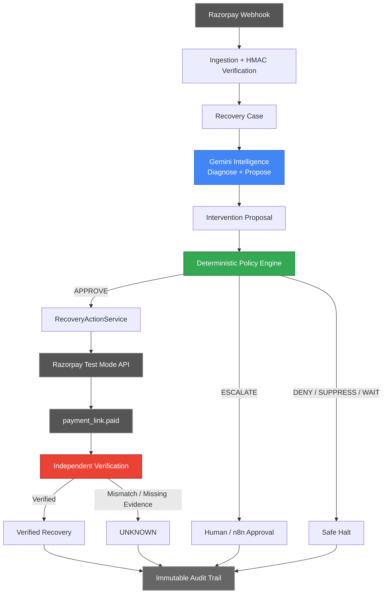

 # RecoverAI

### AI Revenue Recovery Agent — Razorpay Buildathon 2026 · Track 03

> **AI proposes. Deterministic policy constrains. Provider evidence proves.**


RecoverAI detects failed payments, diagnoses the failure context using Gemini, proposes a bounded recovery intervention, applies deterministic financial policy, executes authorized recovery actions through Razorpay Test Mode, and independently verifies whether revenue was actually recovered.

---

## The Problem

Every failed payment is revenue at risk, but blind retries treat every failure the same. A card-expiry case, a transient gateway timeout, a systemic outage, and a suspected fraud decline should not all trigger the same recovery action.

RecoverAI turns a payment failure into an evidence-driven recovery workflow: understand the context, propose an appropriate intervention, enforce hard financial constraints, execute only what policy permits, and verify the outcome from provider evidence.

---

## Why RecoverAI Fits Track 03

| Track 03 Need | RecoverAI |
|---|---|
| **Detect revenue at risk** | Ingests and normalizes Razorpay `payment.failed` webhooks into typed recovery cases |
| **Understand context** | Gemini interprets failure codes, descriptions, payment method, case history, and systemic signals |
| **Determine intervention** | Gemini generates and ranks intervention candidates such as Payment Link, Wait, Escalate, or Suppress |
| **Execute recovery** | Deterministic PolicyEngine gates authorized actions before Razorpay execution |
| **Handle escalation / stopping** | High-value thresholds, attempt limits, duplicate prevention, and systemic safeguards are deterministic |
| **Verify recovery** | VerificationEngine independently checks provider event, authenticity, reference, amount, currency, and status semantics |
| **Measure outcomes** | Real Razorpay Test Mode evidence + frozen 1,500-case synthetic benchmark + adversarial validation |

---

## How the AI Actually Works

Gemini is the contextual reasoning and intervention-planning layer. It receives a structured evidence bundle containing:

- transaction amount and currency
- provider failure codes and descriptions
- payment method
- customer/failure history
- prior recovery context
- systemic signals
- chronological event history

Gemini performs two core tasks:

**1. Root-cause diagnosis**  
It maps the observed evidence to a controlled failure-cause taxonomy and provides evidence-grounded reasoning.

**2. Intervention planning**  
It generates one or more candidate interventions, each with an action type, confidence score, and reasoning. Candidate confidence is used as a **relative planning/ranking signal**, not as a calibrated probability of recovery.

The selected proposal then passes through the deterministic PolicyEngine.

> **Gemini proposes the intervention. The deterministic PolicyEngine decides whether that intervention is allowed.**

When configured LLM providers fail, RecoverAI falls back to a complete deterministic analysis path so the recovery workflow does not depend on AI availability.

### What Gemini can influence

- likely root-cause category
- proposed intervention type
- relative candidate ranking
- operator-facing reasoning

### What Gemini cannot do

- bypass the PolicyEngine
- override financial limits or retry caps
- directly execute money movement
- bypass high-value escalation
- declare a recovery successful

---

## Architecture



The architecture deliberately separates three authorities:

**Gemini** → contextual reasoning and proposal  
**PolicyEngine** → deterministic financial authorization  
**Razorpay + VerificationEngine** → provider evidence and recovery truth

---

## Agent Lifecycle

**Detect → Understand → Recommend → Decide → Recover → Verify → Measure**

| Stage | What happens | Authority |
|---|---|---|
| **Detect** | `payment.failed` is authenticated, normalized, and turned into a recovery case | System + Razorpay |
| **Understand** | Gemini interprets failure context and diagnoses a likely cause | AI |
| **Recommend** | Gemini generates and ranks intervention candidates | AI |
| **Decide** | PolicyEngine evaluates the proposal against deterministic constraints | Deterministic |
| **Recover** | Authorized intervention executes through the RecoveryActionService | System + Razorpay |
| **Verify** | Provider evidence is independently reconciled | Deterministic + Razorpay |
| **Measure** | Recovery outcome and decisions are recorded for audit and evaluation | System |

The current implementation is **open-loop after a failed intervention**: failed outcomes are recorded and safely routed back toward planning, but automatic AI re-planning is not yet implemented.

---

## AI Trust Boundary

| AI / Intelligence Layer | Deterministic Financial Authority |
|---|---|
| Diagnoses root cause from context | Enforces financial limits, thresholds, and retry caps |
| Generates and ranks interventions | Controls `APPROVE` / `DENY` / `ESCALATE` decisions |
| Provides candidate confidence as a planning signal | Prevents duplicate financial execution |
| Provides case-specific reasoning | Independently verifies provider evidence |
| Falls back when LLM providers fail | Records immutable audit state |

> **The model can recommend; it cannot authorize money movement or assert recovery.**

---

## Real Razorpay Evidence

RecoverAI has been exercised against the **Razorpay Test Mode API** with real provider-backed interactions, webhook processing, and backend verification.

| Case | Amount | Result | What it demonstrated |
|---|---:|---|---|
| **A001** | ₹100 | ✅ Verified Recovery | End-to-end failure → AI analysis → Payment Link → payment → verified recovery |
| **A002** | ₹450 | ✅ Verified Recovery | Repeat provider-backed recovery across a different amount |
| **A003** | ₹750 | ❌ Failed Recovery | A recovery-payment failure exposed a recursive recovery-loop bug; the issue was diagnosed and fixed |
| **A004** | ₹1,000 | ✅ Verified Recovery | Successful Test Mode recovery after the A003 loop fix |
| **A005** | ₹50,000 | ⚠️ Policy Gap Found | Pre-fix live high-value wiring allowed link creation; it was never paid and **no recovery was claimed**; threshold wiring was then fixed and regression-tested |

A003 and A005 are deliberately retained as evidence of real provider testing: both exposed implementation issues that required diagnosis, fixes, and regression coverage.

> **All provider evidence above is Razorpay Test Mode. No production money was moved.**

---

## Recovery Verification

> **Payment Link creation ≠ recovery.**

A recovery is counted only after the `VerificationEngine` independently validates the expected provider evidence. It checks:

- webhook authenticity via HMAC
- expected event type and status semantics
- external reference correlation
- exact amount match
- exact currency match

If the evidence is ambiguous or does not match, RecoverAI fails closed to `UNKNOWN` rather than assuming success.

---

## Safety Engineering

- **Deterministic policy gate** — every proposed action is evaluated before execution.
- **High-value escalation** — cases above the configurable ₹40K default threshold are diverted from automatic execution.
- **Attempt limits** — recovery attempts are bounded deterministically.
- **Duplicate prevention** — atomic database claims and idempotency protect the execution boundary.
- **Webhook authentication** — incoming Razorpay events require valid HMAC verification.
- **Systemic safeguards** — systemic degradation can override aggressive recovery proposals.
- **Deterministic fallback** — the core analysis path continues when LLM providers fail.
- **UNKNOWN / fail-closed behavior** — uncertain provider evidence is not treated as success.
- **Independent verification** — AI output never determines whether revenue was recovered.
- **Test isolation** — `ALLOW_REAL_RAZORPAY` explicitly fences real-provider access from normal automated tests.

---

## Evaluation

### Frozen Synthetic Benchmark

**1,500 scenarios · Seed 42 · deterministic and reproducible**

| Strategy | Recovery Rate | Gross Simulated Recovery | Safety |
|---|---:|---:|---|
| L0 (No intervention) | 8.2% | ₹569,697.22 | PASS |
| L1 (Naive — retry everything) | 54.5% | ₹3,232,371.94 | **FAIL** — 519 policy / 218 stopping violations |
| L2 (Deterministic rules) | 32.0% | ₹1,825,326.26 | PASS |
| **L3 (RecoverAI)** | **47.5%** | **₹2,709,921.81** | **PASS** |

In the frozen synthetic benchmark, the RecoverAI L3 pipeline produced a **48.5% relative increase in simulated gross recovered value over L2**.

> **Important:** this is synthetic evaluation. L3 used the deterministic RecoverAI analyzer with `llm_gateway=None`, so no live Gemini call was made. The 48.5% result is **not presented as a Gemini/AI uplift**.

### AI Attribution

A separate Phase 2 controlled attribution experiment used a deterministic mock AI rather than live Gemini. It did not establish standalone incremental live-Gemini uplift, so RecoverAI does not claim the benchmark improvement as causal AI performance.

### Adversarial Validation

Across **21 adversarial scenarios**, RecoverAI recorded zero tested violations of the defined safety invariants:

| Invariant | Violations |
|---|---:|
| False recovery claims | 0 |
| Policy violations | 0 |
| Invalid evidence accepted | 0 |
| Duplicate financial execution | 0 |
| Stopping-rule violations | 0 |
| Unsafe actions | 0 |

---

## What We Found and Fixed

Real provider testing found issues that synthetic evaluation alone could not expose:

**A003 — Recovery-payment failure loop**  
A failed recovery Payment Link generated another `payment.failed` event and initially caused the system to treat its own recovery as a new recovery case. Exact provider/action correlation was added and regression-tested.

**A005 — High-value threshold wiring**  
The ₹40K high-value rule existed, but live dependency wiring did not populate the policy context. A ₹50K Test Mode case exposed the gap. Threshold injection was fixed and regression-tested.

**Test-provider isolation**  
Automated tests could reach the real Razorpay boundary when credentials were present. An explicit `ALLOW_REAL_RAZORPAY` fence and narrow mocks were added so normal test runs cannot accidentally execute real provider actions.

---

## Quick Start

### 1. Configure environment

```bash
cp .env.example .env
cp frontend/.env.example frontend/.env
```

Add your **Gemini API key** and **Razorpay Test Mode credentials**. Never commit `.env`.

### 2. Start services

```powershell
.\scripts\start-all.ps1
```

### 3. Seed demo data

```powershell
uv run python scripts/reset_demo_db.py
uv run python scripts/seed_demo_data.py
```

---

## Tech Stack

| Layer | Technology |
|---|---|
| **Backend** | Python 3.11 · FastAPI · Pydantic |
| **Intelligence** | Gemini primary · provider abstraction · deterministic fallback |
| **Database** | SQLite |
| **Provider** | Razorpay Test Mode API |
| **Frontend** | React · TypeScript · Vite |
| **Optional orchestration** | n8n for human-approval routing |

---

## Repository Structure

```text
RecoverAI/
├── recoverai/      # Core backend, intelligence, policy, verification
├── frontend/       # React operator console
├── tests/          # Unit, integration, contract, E2E, adversarial
├── docs/           # Architecture and technical documentation
└── scripts/        # Startup and seeding utilities
```

---

## Documentation

| Document | Purpose |
|---|---|
| [Architecture](docs/architecture.md) | System design and engineering hardening |
| [Policy & Safety](docs/policy_and_safety.md) | PolicyEngine rules and safety invariants |
| [Security](docs/security.md) | HMAC verification and provider isolation |
| [Razorpay Integration](docs/razorpay_integration.md) | Webhook handling and Test Mode integration |
| [Evaluation](docs/evaluation.md) | Benchmark methodology and metrics |
| [Failure Recovery](docs/failure_recovery.md) | A003/A005 fixes and regression testing |
| [Synthetic Benchmark](docs/reports/benchmark_1500_seed42.md) | Frozen 1,500-case Phase 4 results |
| [Evidence Pack](docs/reports/FINAL_EVIDENCE_PACK.md) | Consolidated Test Mode evidence |
| [Razorpay Evidence](docs/reports/REAL_RAZORPAY_EVIDENCE.md) | Detailed A001–A005 provider evidence |
| [Competitive Positioning](docs/reports/COMPETITIVE_POSITIONING.md) | Competitive comparison and positioning |

---

## Limitations

- Buildathon prototype with single-merchant scope; not a production platform.
- Razorpay integration is restricted to Test Mode.
- Quantitative benchmark results are synthetic, not live merchant performance.
- The 48.5% benchmark uplift is **not AI-attributable** (the frozen L3 run used no LLM).
- LLM confidence is a relative ranking signal, not a calibrated recovery probability.
- Automatic closed-loop AI re-planning after failed interventions is not currently implemented.
- Multi-currency support uses strict currency partitioning; live FX conversion is out of scope.

---

RecoverAI turns a failed payment into an evidence-driven recovery decision: **Gemini diagnoses and proposes, deterministic policy controls what is permitted, Razorpay executes the authorized action, and independent verification establishes whether revenue was actually recovered.**
