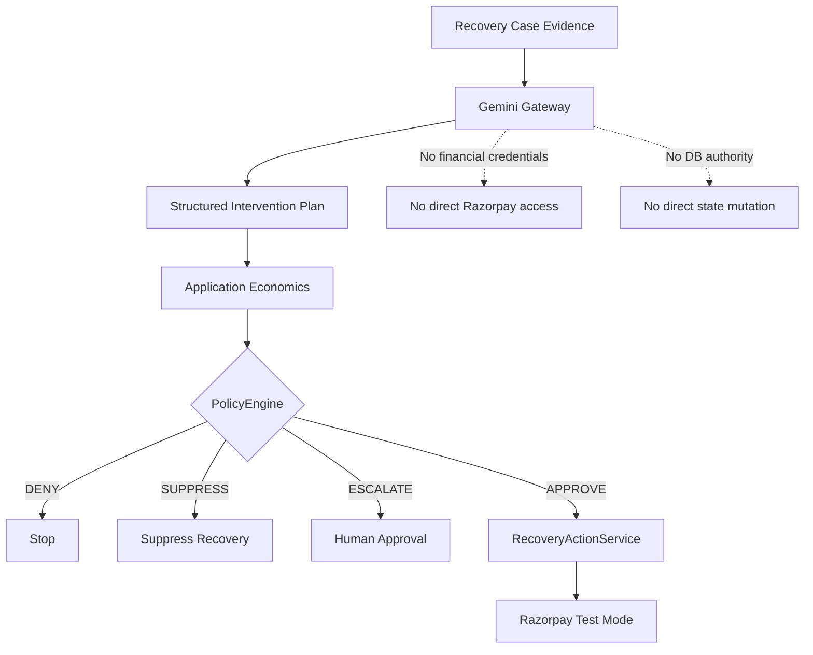
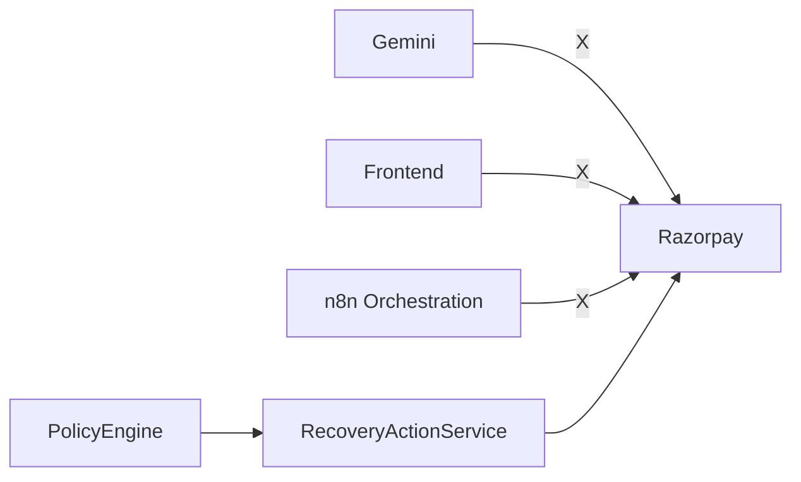
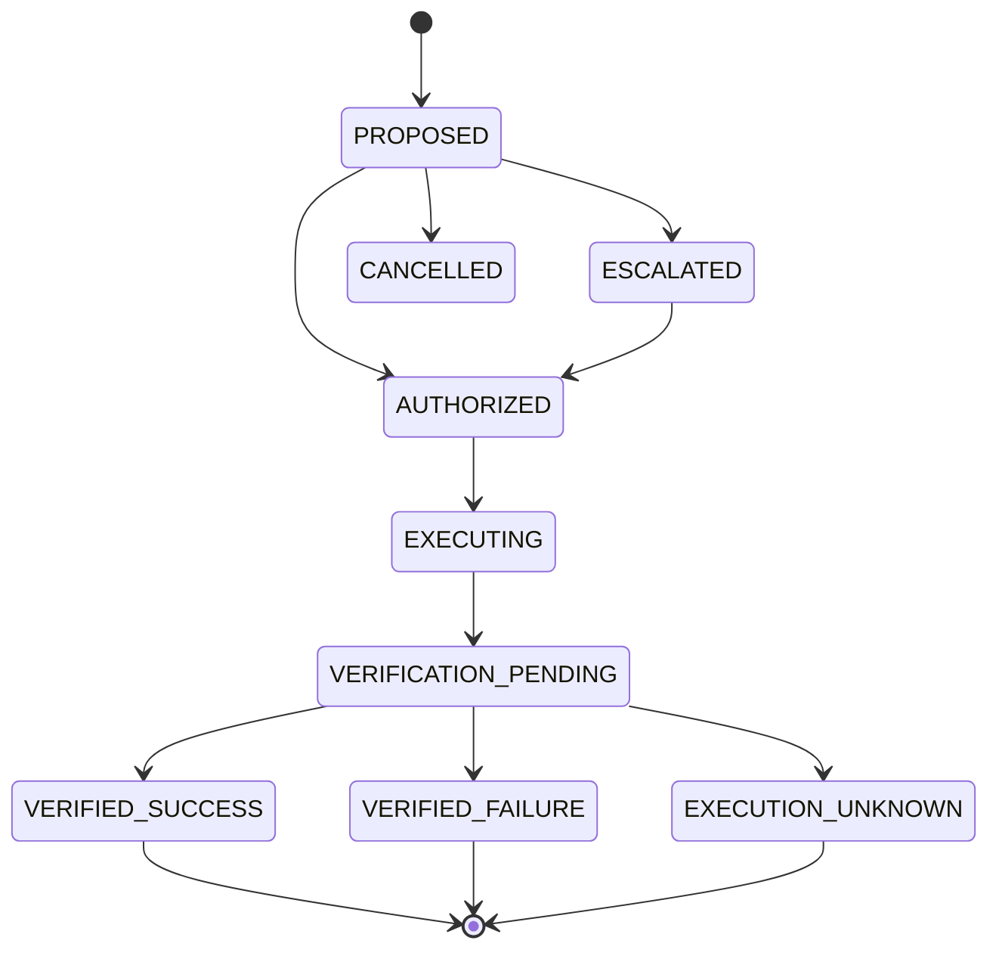
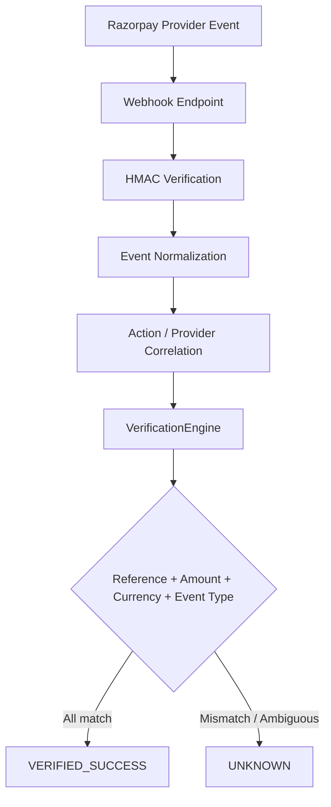
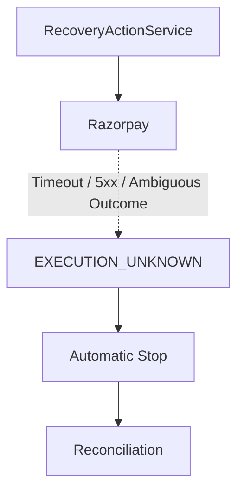

# RecoverAI

> **Evidence-first AI revenue recovery with bounded execution.**
>
> **Razorpay AI Buildathon · Track 03 — AI Revenue Recovery**

[Demo](docs/DEMO.md) · [Architecture](#system-architecture) · [Evaluation](#evaluation--robustness-p25) · [Setup](#demo-quick-start)

---

## The Problem

When a customer's payment fails, the merchant's revenue is at risk.

Blind retries and payment-link spam are not a recovery strategy. They can
waste gateway attempts, frustrate customers, increase operational noise,
and create unnecessary risk.

Recovering revenue safely requires a system that can:

**detect the problem → understand the evidence → choose an intervention →
apply deterministic safety rules → execute a bounded action → verify the
provider outcome → record what actually happened.**

---

## The Solution

RecoverAI is an **AI revenue recovery agent** built around an
evidence-first workflow:

**Detect → Understand → Recommend → Decide → Execute → Verify → Audit**

The key design principle is simple:

> **AI proposes. Deterministic policy constrains. Provider evidence proves.**

Gemini is used to interpret the qualitative context of a recovery case and
produce a structured intervention recommendation. The application then
injects authoritative financial facts and evaluates the complete proposal
through deterministic policy controls before any financial execution can
occur.

A provider response is never treated as proof of recovery by itself.
Recovery is recorded only after the verification layer independently matches
the expected evidence.

---

## Razorpay Buildathon — Track 03: AI Revenue Recovery

RecoverAI is designed around the core Track 03 loop:

| Challenge requirement | RecoverAI |
|---|---|
| Detect revenue at risk | Revenue events become recovery cases with observable evidence |
| Diagnose the failure | Evidence-first context is passed to the intelligence layer |
| Determine the right intervention | Gemini generates a structured intervention recommendation |
| Execute a bounded recovery workflow | PolicyEngine gates the canonical `RecoveryActionService` execution path |
| Verify the outcome | `VerificationEngine` validates provider evidence independently |
| Measure recovered revenue | Operational analytics are derived from persisted runtime outcomes |
| Escalation / stopping rules | `APPROVE`, `ESCALATE`, `DENY`, and `SUPPRESS` policy boundaries |
| Audit trail | Append-oriented audit history records the lifecycle |

---

# System Architecture

```mermaid
flowchart TD
    UI[Frontend Dashboard] --> API[Backend API]

    API --> ING[Ingestion Engine]
    ING --> CASES[Recovery Case Management]

    API --> INT[Revenue Intelligence]
    INT --> LLM[LLM Gateway]
    LLM --> GEM[Gemini]

    INT --> POL[Policy Engine]
    POL --> ACT[RecoveryActionService]

    POL -->|ESCALATE| HUMAN[Human Approval]
    HUMAN --> ACT

    ACT --> RZ[Razorpay Test Mode]

    RZ -. payment_link.paid .-> WEB[Webhook Ingestion]
    WEB --> VER[VerificationEngine]

    POL --> AUD[Audit]
    ACT --> AUD
    VER --> AUD

    AUD --> ANA[Operational Analytics]
```

---

# AI / Policy Trust Boundary

RecoverAI deliberately separates **probabilistic intelligence** from
**financial authority**.



### What Gemini does

- Interprets observable payment/recovery evidence.
- Analyzes qualitative failure context.
- Produces structured intervention candidates.
- Selects a recommended intervention.
- Provides reasoning and confidence.

### What Gemini does **not** do

- Authoritative financial amounts or currencies.
- Policy authorization.
- Direct Razorpay execution.
- Direct database mutation.
- Recovery verification.

> **The LLM is an intelligence component, not a financial authority.**

---

# Provider & Fallback Model

RecoverAI uses a provider chain with explicit provenance:

**Gemini → Groq → Hugging Face → Deterministic Fallback**

Gemini has been successfully used for real recommendations. Provider identity
is carried through the intelligence result into the persisted audit/API
representation rather than being inferred from a UI label.

The deterministic path is an explicit resilience mechanism. It is not
presented as Gemini when Gemini was not the provider.

```text
Gemini succeeds
    ↓
provider = Gemini
    ↓
recommendation + confidence + reasoning
```

When external providers fail or become unavailable:

```text
Gemini fails
    ↓
Groq attempted
    ↓
other configured provider
    ↓
Deterministic Fallback
    ↓
provenance = deterministic_1.0
```

The current Groq model/catalog access depends on the configured Groq
project and credentials.

---

# Why AI?

RecoverAI uses AI where interpretation is valuable and deterministic code
where financial safety must be authoritative.

```text
Observable evidence
        ↓
      Gemini
        ↓
"what intervention appears appropriate?"
        ↓
Deterministic policy
        ↓
"is this intervention allowed?"
        ↓
Execution authority
```

This prevents a language model from becoming the source of truth for
financial authorization.

---

# Execution Safety

RecoverAI enforces a **single financial authority**.



All financial mutations are routed through the backend execution authority.

### Execution safeguards

- Policy authorization is checked before financial execution.
- Terminal/invalid action states are rejected.
- Human approval is required for `ESCALATE`.
- Frontend code never receives private Razorpay credentials.
- Razorpay execution is guarded by **Test Mode**.
- Recovery actions are protected by idempotency controls.
- An action is **atomically claimed before crossing the provider boundary**.
- A concurrent duplicate attempt cannot create a second provider action for
  the same logical recovery action.

The final concurrency hardening was validated with a synchronized two-request
test:

**2 simultaneous execution attempts → 1 provider call.**

---

# Recovery Lifecycle



### Decision semantics

| Policy outcome | Meaning |
|---|---|
| `APPROVE` | Proposed intervention is eligible for bounded execution |
| `ESCALATE` | Intervention requires the human-approval boundary |
| `DENY` | Core invariant/rule violation; execution stops |
| `SUPPRESS` | Recovery is intentionally suppressed by policy |

An AI recommendation of `ESCALATE` remains an escalation and does not
become an executable financial action merely because the recommendation
passed structural validation.

---

# Verification Architecture

A provider response is **not** the same thing as a verified recovery.

RecoverAI uses the provider event as evidence and independently validates
the expected outcome.



### Verification principle

A recovery is only considered successful when the evidence matches what
RecoverAI expected:

- correct provider reference
- correct amount
- correct currency
- correct event type
- correct recovery action correlation

Ambiguity remains **UNKNOWN** rather than becoming a false success.

---

# Uncertainty & Safety

Provider uncertainty is deliberately conservative.



The system does not blindly create another recovery action simply because
an external outcome is uncertain.

---

# Auditability

Every important lifecycle boundary is represented by persisted audit events.

**Detected → Analyzed → Policy Decision → Authorization/Approval →
Execution → Verification → Outcome**

The audit surface is designed for investigation rather than execution.
Historical context is preserved from the event itself rather than silently
reconstructed from the case's current state.

The audit repository is append-oriented: it exposes event insertion and
retrieval, not ordinary editing of historical events.

---

# Operator Workflow

RecoverAI exposes the recovery lifecycle through eight operational screens:

| Screen | Purpose |
|---|---|
| **01 — Dashboard** | High-level revenue-risk and operational overview |
| **02 — Recovery Cases** | Queue of active and historical recovery cases |
| **03 — Case Detail** | Evidence, AI recommendation, policy context, and lifecycle history |
| **04 — Approval Queue** | Human review of escalated recovery actions |
| **05 — Execution Queue** | Bounded financial execution visibility |
| **06 — Verification** | Provider evidence and independent verification results |
| **07 — Audit** | Historical event investigation and actor/component trace |
| **08 — Operational Analytics** | Runtime recovery and operational performance |

The Case Detail interaction is intentionally simple:

> **The timeline and policy state are authoritative backend history.  
> `Analyze Case` is the explicit AI interaction.**

There is no frontend-simulated workflow theatre.

---

# Real Test Mode Proof

RecoverAI has a real Razorpay Test Mode execution path:

```text
Revenue-risk event
        ↓
Recovery Case
        ↓
Evidence
        ↓
Analyze Case
        ↓
Gemini recommendation
        ↓
Policy decision
        ↓
RecoveryActionService
        ↓
Razorpay Test Mode
        ↓
real payment-link reference
        ↓
Webhook ingestion
        ↓
HMAC verification
        ↓
VerificationEngine
        ↓
VERIFIED_SUCCESS
```

P29 includes an end-to-end Test Mode flow that exercises the real Razorpay
payment-link API and the real RecoverAI webhook/verification boundary.

The test harness can generate correctly signed webhook requests locally for
controlled E2E verification, while the Razorpay payment-link creation itself
uses the real Test Mode provider.

> **This is Test Mode evidence, not a production merchant integration.**

---

# What Is Real vs Synthetic?

Keeping these boundaries explicit is important.

| Component | Nature |
|---|---|
| Gemini recommendation | **Real provider output** when Gemini succeeds |
| Gemini confidence/reasoning | **Real structured model output** |
| Razorpay payment links | **Real Razorpay Test Mode resources** |
| Razorpay provider reference | **Real provider-generated reference** |
| Webhook ingestion | **Real RecoverAI endpoint** |
| HMAC validation | **Real implementation** |
| VerificationEngine | **Real backend verification** |
| Operational analytics | **Runtime database-derived outcomes** |
| Seed/demo records | **Development/test fixtures** |
| P25 benchmark | **Synthetic, frozen evaluation data** |

Synthetic fixtures exist to test the system and demonstrate controlled
states. They must not be represented as live merchant traffic.

---

# Evidence Hierarchy

RecoverAI deliberately separates different forms of evidence.

| Evidence layer | Type | What it proves |
|---|---|---|
| **AI provider validation** | Real provider-backed validation | Structured AI output, grounding, provenance |
| **Razorpay Test Mode validation** | Real external provider-backed validation | Financial execution, provider reference, webhook/verification path |
| **P25 benchmark** | Synthetic quantitative evaluation | Controlled safety/effectiveness tradeoff |

The benchmark is useful for evaluating strategy behavior, but it is not
presented as live merchant performance.

---

# Evaluation & Robustness (P25)

> **Important:** P25 is a **synthetic quantitative benchmark**. It is
> intentionally isolated from operational analytics and does not represent
> live Razorpay recovery performance.

The benchmark evaluated RecoverAI across **1,500 synthetic scenarios** against
a transparent simple-rule baseline.

### Baseline comparison

| Metric | Simple Rule | RecoverAI |
|---|---:|---:|
| Recoveries | 785 | 727 |
| Gross recovery | ₹3,362,181 | ₹3,159,057 |
| Failed interventions | 558 | 506 |
| Escalations | 0 | 121 |
| Recovery Rate (Case) | **52.3%** | **48.5%** |

RecoverAI produced fewer gross recoveries in the synthetic benchmark, while
also preventing **52 failed interventions** and escalating **121 cases**.

This demonstrates a tunable safety/effectiveness tradeoff rather than
claiming that the synthetic benchmark is a direct model of real merchant
economics.

### Sensitivity frontier

| Threshold | Recoveries | Failed interventions | Escalations |
|---|---:|---:|---:|
| 2 | 701 | 484 | 173 |
| 3 — Baseline | 727 | 506 | 121 |
| 4 | 760 | 528 | 61 |

---

# Product Screens

RecoverAI's operator workflow is organized as a progressive investigation
surface:

```text
01  Dashboard
 ↓
02  Recovery Cases
 ↓
03  Case Detail
 ↓
04  Approval Queue
 ↓
05  Execution Queue
 ↓
06  Verification
 ↓
07  Audit
 ↓
08  Operational Analytics
```

Screen 03 is deliberately evidence-first: the timeline and policy state come
from persisted backend data, while `Analyze Case` is the explicit intelligence
interaction.

If current screenshots are maintained in the repository, see the relevant
screen references in `docs/`.

---

# Safety & Security Boundaries

RecoverAI is designed around explicit financial safety boundaries:

- **AI has no direct financial execution authority.**
- **Frontend contains no private provider credentials.**
- **PolicyEngine gates financial execution.**
- **Razorpay execution is Test Mode guarded.**
- **Webhook signatures are HMAC verified.**
- **Duplicate webhook delivery is handled idempotently.**
- **Execution claims are protected against concurrent duplication.**
- **Verification fails closed under mismatched/ambiguous evidence.**
- **Audit history is append-oriented.**
- **Synthetic benchmarks are isolated from operational analytics.**

The intent is not to claim perfect security. The intent is to make the
financial decision boundary explicit, testable, and auditable.

---

# Questions a Judge Should Be Able to Answer Immediately

### Can Gemini call Razorpay?

**No.** Gemini is an intelligence component and has no private provider
credentials or direct financial execution authority.

### Can the browser call Razorpay?

**No.** Provider secrets stay on the backend.

### Can AI bypass policy?

**No.** Financial execution is routed through the backend policy and action
authority.

### What happens if the AI provider is unavailable?

RecoverAI follows the configured provider chain and can use the explicit
deterministic fallback. The provenance remains truthful.

### Can `PROPOSED` actions bypass the approval boundary?

**No.** Direct resume of a `PROPOSED` action is rejected.

### Can two concurrent requests create two provider actions?

The execution boundary uses an atomic action claim. The synchronized
concurrency test demonstrated:

**2 simultaneous requests → 1 provider call.**

### Can a mismatched webhook become `VERIFIED_SUCCESS`?

**No.** Reference, amount, currency, and event type must agree.

### What happens when provider execution is uncertain?

The action can enter `EXECUTION_UNKNOWN` and stop automatic continuation
until reconciliation.

### What is synthetic?

P25 benchmark scenarios and local development/seed fixtures. They are not
represented as live operational recovery data.

### Where is the audit trail?

Screen 07 and the backend audit surface expose the persisted lifecycle.

---

# Repository Structure

```text
RecoverAI/
├── recoverai/
│   ├── api/
│   ├── application/
│   ├── domain/
│   ├── intelligence/
│   ├── llm_gateway/
│   ├── policy/
│   ├── services/
│   ├── ingestion/
│   ├── integrations/
│   ├── verification/
│   ├── persistence/
│   └── mcp/
├── frontend/
├── tests/
├── docs/
├── scripts/
├── n8n/
├── workflows/
└── pyproject.toml
```

### Where the important logic lives

- `recoverai/intelligence/` — AI reasoning and intervention planning
- `recoverai/llm_gateway/` — provider abstraction and fallback
- `recoverai/policy/` — deterministic financial policy
- `recoverai/application/` — orchestration/service layer
- `recoverai/integrations/` — external provider adapters
- `recoverai/verification/` — independent recovery verification
- `recoverai/persistence/` — canonical data repositories
- `recoverai/mcp/` — bounded tool interfaces/orchestration boundary
- `frontend/` — operator-facing React/TypeScript application
- `tests/` — unit, integration, and E2E verification
- `docs/` — demo, reports, architecture, and evaluation evidence

---

# Engineering Principles

RecoverAI follows deliberate engineering principles:

1. **Backend authority over frontend assumptions**
2. **AI proposes; deterministic policy constrains**
3. **No AI access to financial credentials**
4. **Verify before recording recovery**
5. **Append-oriented auditability**
6. **Idempotent financial actions**
7. **Atomic financial-action claim before provider execution**
8. **Fail closed under ambiguity**
9. **Synthetic benchmarks isolated from operational analytics**
10. **External financial integration constrained to Test Mode**

---

# Technical Decisions

### SQLite

SQLite keeps the prototype portable and easy to evaluate locally without
introducing infrastructure that does not add value to the core recovery
workflow.

### Deterministic policy around nondeterministic AI

LLMs are probabilistic. Financial authorization should not be.

RecoverAI therefore lets the model propose an intervention while deterministic
Python policy controls whether that intervention is permitted.

### Persisted plan snapshots

Recovery actions retain the relevant intervention plan snapshot so approval
or resume flows operate on the intended historical proposal rather than
whatever a client happens to send later.

### n8n as orchestration, not financial authority

n8n can orchestrate human approval and asynchronous workflow concerns, but
the core financial authorization and Razorpay mutation remain inside the
backend execution path.

### Verification is independent from execution

A successful API request is an execution event, not a recovery claim.

The recovery outcome is only recorded after provider evidence is validated by
the independent verification layer.

### Atomic execution claim

Before a financial provider call, the action is atomically claimed so that
simultaneous requests cannot both cross the provider boundary for the same
logical action.

---

# Demo Quick Start

RecoverAI is designed for a local Windows evaluation environment.

## Prerequisites

- Python 3.11+
- Node.js 20+
- `uv`
- Razorpay **Test Mode** credentials for real provider execution
- Gemini API access for real Gemini-backed recommendations

## 1. Environment setup

```powershell
Copy-Item .env.example .env
Copy-Item frontend/.env.example frontend/.env
```

Populate `.env` with your own credentials and configuration.

**Never commit `.env`.**

## 2. Start the application

```powershell
.\scripts\start-all.ps1
```

Or start backend/frontend independently using the commands documented in
[`docs/DEMO.md`](docs/DEMO.md).

## 3. Reset development fixtures

```powershell
uv run python scripts/seed_demo_data.py
```

The seed script is for development/testing. It is not the source of truth
for real merchant traffic.

## 4. Judge-facing path

```text
Recovery Cases
      ↓
Case Detail
      ↓
Observed Evidence
      ↓
Analyze Case
      ↓
Gemini Recommendation
      ↓
Policy Decision
      ↓
Bounded Execution
      ↓
Razorpay Test Mode
      ↓
Webhook
      ↓
Verification
      ↓
Audit
      ↓
Analytics
```

For the exact Test Mode workflow, see
[`docs/DEMO.md`](docs/DEMO.md).

---

# Verification & Testing

## Core backend suite

```bash
uv run python -m pytest tests/ -q
```

Covers domain rules, API contracts, policy boundaries, provider behavior,
verification behavior, and execution invariants.

## Real Test Mode E2E

```bash
uv run python -m pytest tests/e2e/test_real_testmode.py -v
```

The E2E path exercises the real Razorpay Test Mode payment-link integration
and the RecoverAI webhook/verification boundary. It may skip when required
real credentials are unavailable.

## Frontend production build

```bash
cd frontend
npm run build
```

## Concurrency hardening

The P30 validation includes a synchronized execution test proving that two
simultaneous execution attempts for one action result in a single provider
call.

---

# Status

| Package | Status |
|---|---|
| **P27 — Data Contract & Populated-Data Stability** | ✅ Complete |
| **P28 — Execution Authorization & AI Integrity** | ✅ Complete |
| **P29 — Razorpay Test Mode E2E** | ✅ Complete |
| **P30 — Hostile Hardening & Concurrency Protection** | ✅ Complete |

> **Submission state: Frozen engineering baseline.**

---

## The one-line thesis

> **RecoverAI turns revenue recovery from a blind retry into an evidence-driven
> decision: AI proposes the intervention, policy constrains it, Razorpay
> executes it, verification proves it, and the audit trail remembers what
> actually happened.**
