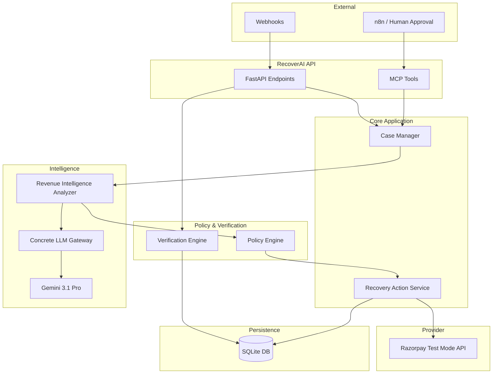

# Architecture Topology

RecoverAI is built as a modular monolith in Python using FastAPI, designed to safely isolate untrusted AI reasoning from deterministic financial execution.

## High-Level Topology

## Component Responsibilities

1. **API / MCP Layer**: Handles inbound REST HTTP requests and Model Context Protocol tool invocations. Authenticates requests and normalizes payloads.
2. **Case Manager**: The primary orchestrator. Ingests normalized events, creates or updates `RecoveryCase` records, and coordinates the analysis workflow.
3. **Revenue Intelligence Analyzer**: Extracts features from the case and its event history, formats the prompt, and queries the LLM Gateway.
4. **LLM Gateway**: Handles the network transport to Gemini. Implements a critical `GEMINI_FAILED_FALLBACK` if the live provider returns a 429 Quota Exceeded or 500 error.
5. **Policy Engine**: The immutable trust boundary. Accepts the AI's `InterventionPlan` and evaluates it against deterministic limits (e.g., `max_attempts_per_case`, `high_value_threshold`).
6. **Recovery Action Service**: The execution boundary. It takes an *authorized* action and delegates it to the specific provider adapter (Razorpay).
7. **Verification Engine**: Independently parses incoming provider webhooks (e.g., `payment_link.paid`), asserts cryptographic authenticity, and verifies that the `amount` and `currency` perfectly match the case's `amount_at_risk`.

## Data Flow

### The Analysis Flow
When a case requires analysis, the `CaseManager` passes the `RecoveryCase` and its historical `Event` list to the `RevenueIntelligenceAnalyzer`. The Analyzer formats a structured prompt. The AI returns a JSON `InterventionPlan` containing a `proposed_action`. The `PolicyEngine` evaluates this plan and returns a `PolicyDecision`.

### The Execution Flow
The `RecoveryActionService` receives the `PolicyDecision`. If approved, it delegates to the `RazorpayAdapter`, which issues an HTTP request to Razorpay Test Mode to create a Payment Link. The adapter parses the response, extracts the external reference (e.g., `plink_xxx`), and saves the `RecoveryAction` to the database with status `VERIFICATION_PENDING`.

### The Verification Flow
Razorpay fires a `payment_link.paid` webhook. The `API` routes it to the `VerificationEngine`. The engine finds the corresponding `RecoveryAction` via the external reference. It strictly compares the payload's amount and currency. If they match, the action transitions to `VERIFIED_SUCCESS` and the case is closed. If amount metadata is missing, it fails closed to `EXECUTION_UNKNOWN`.
