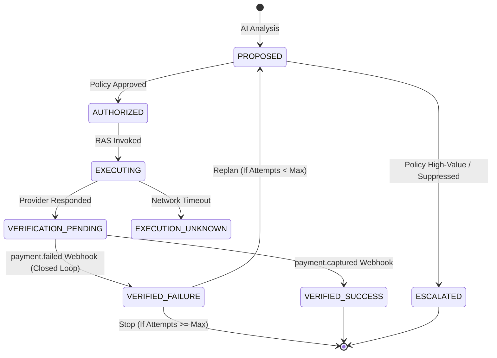

# Closed-Loop Recovery Mechanism

RecoverAI does not just fire-and-forget payment links. It implements a fully closed-loop architecture that treats a failed recovery attempt as a new input to the system.

## The Mechanism

The closed loop is achieved through strict deterministic tracking of Action IDs across the provider boundary.

1. **Execution**: When RecoverAI executes an intervention (e.g., `CREATE_PAYMENT_LINK`), the `RazorpayAdapter` embeds the internal `RecoveryActionId` securely into the provider payload (e.g., inside the Razorpay `description` or `notes` field).
2. **Failure**: If the customer attempts to pay the link and it fails, Razorpay fires a new `payment.failed` webhook.
3. **Correlation**: The webhook payload contains the embedded `RecoveryActionId`. The `CaseManager` parses this identifier.
4. **Resolution**: Instead of creating a *new* `RecoveryCase`, the system locates the existing case, marks the pending `RecoveryAction` as `VERIFIED_FAILURE`, and appends the failure context.
5. **Replanning**: The system automatically triggers the `CaseManager` to replan.
6. **Prior Action Context**: The AI is fed the updated attempt history. It natively understands that its previous intervention failed.
7. **Bounded Constraint**: The `PolicyEngine` checks the `attempt_number`. If the attempt limit (e.g., 3) is reached, the policy engine deterministically overrides any further AI proposals with `SUPPRESS`.
8. **Deterministic Stop**: The system safely halts.

## State Transition Diagram

## Duplicate Failure Delivery Behavior

If Razorpay delivers the exact same `payment.failed` webhook twice, the ingestion layer relies on the deterministic `source_event_id` (the Razorpay event ID). The database's unique constraint on `(source_type, source_event_id)` drops the duplicate instantly.

## Why Recovery Failures Do Not Sprout New Cases

A core design requirement is preventing case proliferation. If a ₹1,000 payment fails, generating a payment link which then fails, we do not have two ₹1,000 failures; we have one ₹1,000 case with a failed recovery attempt. Correlating the failure directly to the `RecoveryActionId` guarantees the `amount_at_risk` remains accurate and prevents the system from spinning up infinite independent recovery branches.
