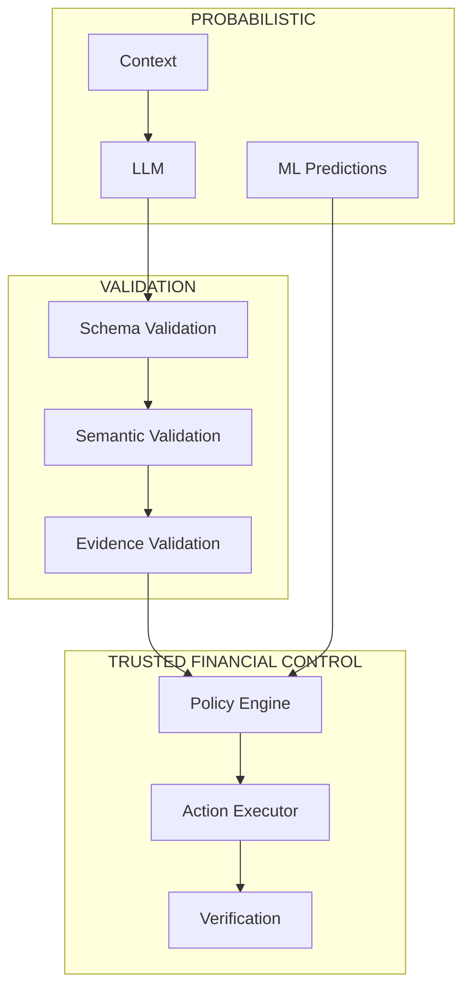
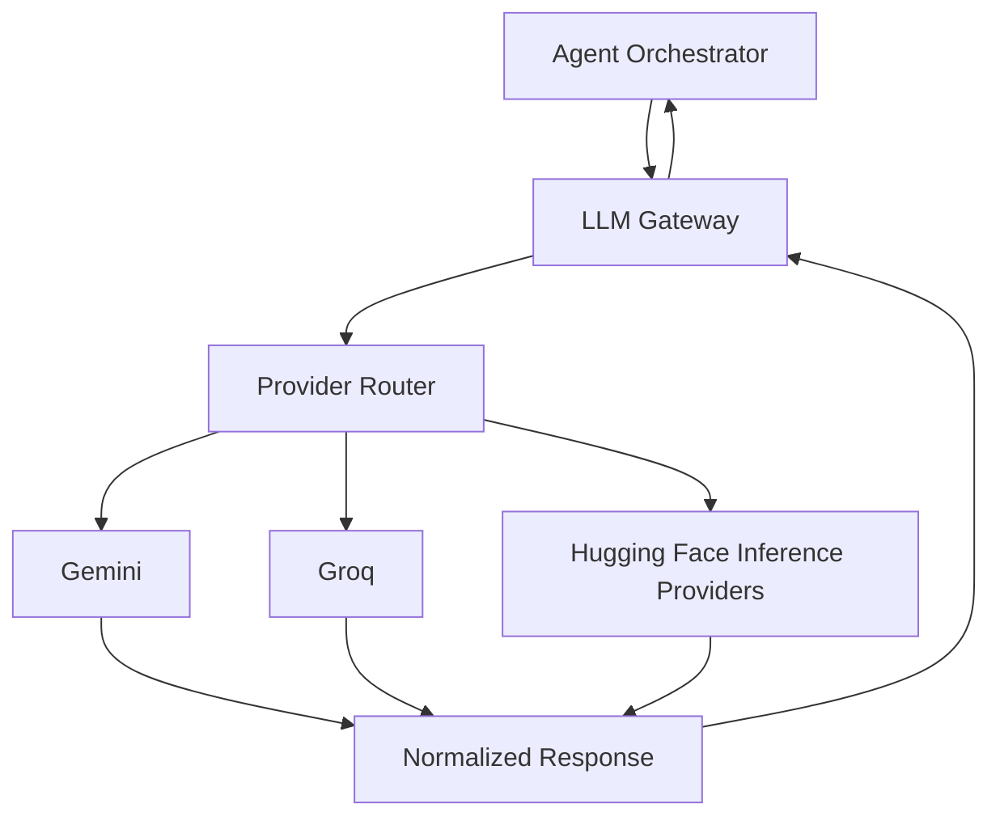
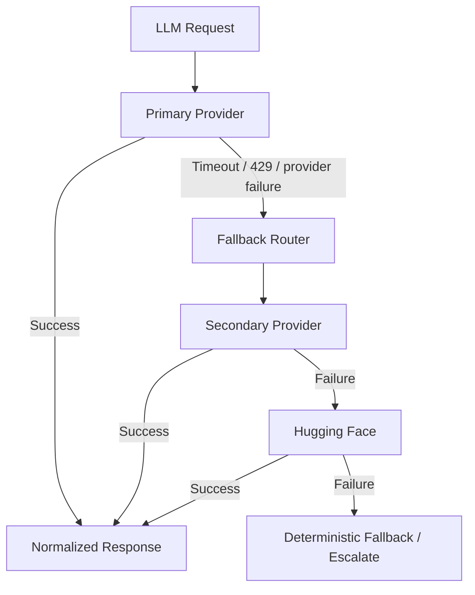
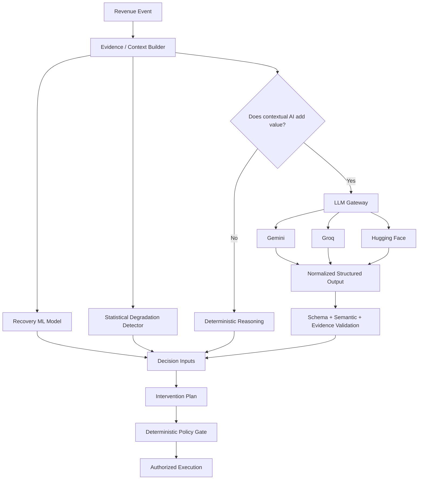

# RecoverAI — AI Judgment

**Project:** RecoverAI
**Track:** Razorpay AI Buildathon — Track 03: AI Revenue Recovery
**Document:** AI Judgment, LLM Boundaries & Model Governance
**Status:** Architecture Foundation — Proposed for Freeze
**Version:** 1.0
**Last Updated:** 2026-08-26

---

# 1. Purpose

This document defines exactly:

* where RecoverAI uses AI,
* where it uses conventional ML,
* where it uses deterministic algorithms,
* where it deliberately does **not** use AI,
* how LLM providers are abstracted,
* what an LLM is permitted to produce,
* how LLM outputs are validated,
* how provider failures are handled,
* and how AI behavior is evaluated.

The purpose is to satisfy the most important AI-engineering question in the Razorpay Buildathon:

> **Did the team use the right tool in the right place, and understand where AI should not be used?**

RecoverAI therefore treats AI as one component of a larger financial-recovery system rather than making the LLM responsible for the whole application.

---

# 2. Core AI Principle

The system follows:

> **Use AI where uncertainty, contextual interpretation, or language reasoning creates measurable value. Use deterministic systems where correctness, financial arithmetic, authorization, state, or external truth matters more than flexibility.**

The resulting architecture is:

```text id="m3nlnw"
                  REVENUE EVENT
                       |
                       v
              REVENUE INTELLIGENCE
                       |
          +------------+------------+
          |            |            |
          v            v            v
       ML Model     Statistics     LLM
          |            |            |
          +------------+------------+
                       |
                       v
              INTERVENTION PLAN
                       |
                       v
               DETERMINISTIC
                POLICY GATE
                       |
                       v
                    ACTION
                       |
                       v
                  RAZORPAY
```

The LLM is **not** the center of the financial authority boundary.

---

# 3. AI Responsibility Matrix

| Problem                           | Primary Technology                              |    AI? | Reason                                                                            |
| --------------------------------- | ----------------------------------------------- | -----: | --------------------------------------------------------------------------------- |
| Recovery probability              | Supervised ML                                   |    Yes | Structured numerical prediction                                                   |
| Probability calibration           | Statistical calibration                         |     No | Requires measurable probabilistic correctness                                     |
| Payment degradation               | Statistical / anomaly detection                 |     No | Temporal aggregate analysis is better suited to deterministic/statistical methods |
| Root-cause synthesis              | LLM + structured evidence                       |    Yes | Heterogeneous context and explanation                                             |
| Intervention candidate generation | LLM + closed action vocabulary                  |    Yes | Contextual reasoning is useful                                                    |
| Candidate ranking                 | Deterministic value calculation + model signals | Partly | Economics should remain reproducible                                              |
| Expected recovered value          | Deterministic arithmetic                        | **No** | Financial calculations must be exact                                              |
| Policy authorization              | Deterministic rules                             | **No** | Safety and authorization require predictable enforcement                          |
| Workflow sequencing               | n8n / application state machine                 | **No** | Workflow orchestration is not an AI problem                                       |
| External payment state            | Razorpay API/webhooks                           | **No** | External system is authoritative                                                  |
| Recovery outcome                  | Verification layer                              | **No** | Model prediction cannot establish financial truth                                 |
| Merchant-facing explanation       | LLM                                             |    Yes | Natural-language synthesis                                                        |
| Batch evaluation                  | Deterministic evaluator                         | **No** | Ground truth and metrics must be reproducible                                     |

---

# 4. Why the LLM Is Not the Recovery Model

RecoverAI will not use an LLM to produce:

```text
"Recovery probability = 73%"
```

as the authoritative recovery prediction.

The recovery-risk problem is a structured supervised prediction problem.

The initial architecture therefore uses a conventional ML model such as:

* Logistic Regression as baseline,
* XGBoost as the primary candidate.

The final selection is empirical.

The probability must be evaluated for:

* discrimination,
* calibration,
* stability,
* and downstream decision usefulness.

The LLM may consume the model's prediction as evidence, but must not replace the model merely because it is an AI system.

---

# 5. Why the Degradation Detector Is Not LLM-Based

Payment degradation is fundamentally an aggregate temporal problem.

Examples:

```text id="g9z4hc"
failure rate over time
volume over time
method concentration
route/bank concentration
baseline deviation
downtime signal
```

An LLM does not provide a justified advantage for calculating:

```text id="h97yfc"
current failure rate
baseline failure rate
difference
z-score / other statistical measure
```

Therefore RecoverAI uses deterministic/statistical mechanisms.

The resulting signal can then become context for an LLM when a natural-language explanation is required.

---

# 6. Why the LLM Is Used for Root-Cause Synthesis

The root-cause problem may combine:

* structured Razorpay error information,
* customer history,
* historical recovery behavior,
* payment patterns,
* temporal anomaly signals,
* external downtime signals,
* and merchant-specific context.

Razorpay documents structured error fields including `code`, `description`, `source`, `step`, and `reason`, which provide useful machine-readable evidence about payment failures. ([razorpay.com](https://razorpay.com/docs/errors/))

The LLM's role is to synthesize that evidence into a structured explanation/hypothesis.

It does **not** invent facts.

Example:

```json id="fbai8o"
{
  "cause_category": "CUSTOMER_ACTION",
  "confidence": 0.86,
  "evidence_ids": [
    "error_123",
    "history_882"
  ],
  "uncertainties": []
}
```

---

# 7. Why the LLM Is Used for Intervention Reasoning

The LLM can help compare contextually different candidate actions.

Example:

```text id="kq6w0e"
Candidate A:
CREATE_PAYMENT_LINK

Candidate B:
WAIT

Candidate C:
ESCALATE

Evidence:
- payment failed
- customer has 8 prior successful payments
- payment method is currently healthy
- amount = ₹4,999
- recovery probability = 0.82
```

The LLM can produce:

```json id="wdg0j3"
{
  "recommended_action": "CREATE_PAYMENT_LINK",
  "reason": "High historical payment reliability and no current systemic degradation make a customer-specific recovery action appropriate.",
  "evidence_ids": [
    "history_882",
    "health_019"
  ]
}
```

The Policy Engine then decides whether that recommendation is authorized.

---

# 8. The LLM Must Never Create a New Executable Action

The action space is closed.

The model may select from:

```text id="7e7v94"
WAIT
CREATE_PAYMENT_LINK
SEND_PAYMENT_LINK_NOTIFICATION
PAYMENT_LINK_REMINDER
SUPPRESS
ESCALATE
```

It may not invent:

```text id="vuc4s6"
"retry_payment_with_special_gateway"
```

unless that action has been explicitly added to the domain, policy, tool layer, implementation, and verification system.

This is critical because unconstrained action generation creates an unsafe and untestable system.

---

# 9. LLM Trust Boundary

The trust model is:



The LLM is therefore:

```text id="f2gv8r"
UNTRUSTED
```

even when its response is syntactically valid.

---

# 10. Structured Output Is Mandatory

RecoverAI will not depend on free-form natural-language parsing for critical LLM decisions.

The preferred architecture is:

```text id="ygnsna"
LLM
 |
 v
Structured JSON Schema
 |
 v
Pydantic / runtime validation
 |
 v
Semantic validation
 |
 v
Policy
```

Gemini currently supports structured output using JSON Schema and explicitly recommends application-level validation because schema compliance does not guarantee semantic correctness. ([ai.google.dev](https://ai.google.dev/gemini-api/docs/structured-output))

Groq also provides Structured Outputs with JSON Schema on supported models, including strict schema-constrained output for supported models. ([console.groq.com](https://console.groq.com/docs/structured-outputs))

Hugging Face Inference Providers currently provides structured-output support for models/providers where supported and documents JSON-schema-based structured outputs. ([huggingface.co](https://huggingface.co/docs/inference-providers/guides/structured-output))

Therefore the internal contract should be provider-neutral.

---

# 11. Structured Output Contract

Example:

```json id="o88sgf"
{
  "recommendation": {
    "action": "CREATE_PAYMENT_LINK",
    "confidence": 0.84
  },
  "reasoning_summary": "Customer-specific failure is likely and systemic degradation is not indicated.",
  "evidence_ids": [
    "evt_001",
    "sig_003"
  ],
  "uncertainties": []
}
```

The schema should define:

* exact field types,
* allowed action enum,
* required fields,
* string length constraints where appropriate,
* array sizes where relevant.

The schema must reject unknown executable actions.

---

# 12. Schema Validation Is Not Enough

A schema-valid response can still be semantically wrong.

Example:

```json id="oag62a"
{
  "action": "CREATE_PAYMENT_LINK",
  "confidence": 0.99,
  "evidence_ids": ["nonexistent_event"]
}
```

It may satisfy the JSON schema.

But it is invalid because the evidence does not exist.

Therefore RecoverAI requires:

### Structural validation

Is the response syntactically/schema valid?

### Semantic validation

Are the values valid within the domain?

### Evidence validation

Do referenced evidence IDs exist and belong to the case?

### Policy validation

Is the proposed action permitted?

---

# 13. Semantic Validation Rules

At minimum:

```text id="fsh1d5"
action must be in approved action enum
confidence must be in [0,1] when present
evidence IDs must exist
evidence IDs must belong to case/context
amounts must not be invented
merchant/customer IDs must match case context
model cannot claim external execution
```

The LLM must not return a statement such as:

> "Payment successfully recovered."

unless that is an explanation of externally provided verified state.

The LLM itself cannot establish the outcome.

---

# 14. Evidence-Bound Reasoning

The model should receive an explicit evidence bundle.

Example:

```text id="8x8z5c"
CASE
case_id = case_001

OBSERVED EVENTS
evt_001: payment.failed
evt_004: customer payment history

MODEL SIGNALS
risk_001: recovery_probability=0.81

SYSTEM SIGNALS
deg_001: systemic_degradation=false

AVAILABLE ACTIONS
CREATE_PAYMENT_LINK
WAIT
SUPPRESS
ESCALATE
```

The model is instructed to:

1. reason only over supplied evidence,
2. use evidence IDs when making claims,
3. identify uncertainty,
4. select only from available actions,
5. never claim execution,
6. never claim final payment success.

---

# 15. Evidence Injection Policy

Only the minimum relevant context should be provided to the model.

The system should not dump:

* entire databases,
* raw unrelated webhook payloads,
* unnecessary customer data,
* secrets,
* internal credentials,
* hidden evaluation labels.

Context should be constructed for the specific task.

For example:

### Root-cause analysis

Receives:

* failure event,
* relevant error fields,
* recent payment history,
* degradation signals.

### Merchant explanation

Receives:

* final decision,
* evidence references,
* verified outcome.

This reduces:

* token use,
* accidental data exposure,
* irrelevant context,
* and provider cost.

---

# 16. Prompt Injection Boundary

External text must be treated as untrusted.

Potential sources include:

* merchant metadata,
* customer-provided text,
* invoice descriptions,
* free-form notes,
* external payment metadata.

Such text must never be considered an instruction merely because it appears in a retrieved context.

Conceptually:

```text id="v5q6b9"
External Text
     |
     v
DATA
     |
     X----> SYSTEM INSTRUCTION
```

The model prompt must explicitly classify external text as evidence/data, not as system instructions.

---

# 17. No Hidden Ground Truth

The evaluation system must never put:

```text id="n3j7fs"
ground_truth_recovery = true
```

inside the LLM context.

The model must make its decision without knowing the expected answer.

Ground truth is accessed only by the evaluation harness after the decision/outcome is produced.

---

# 18. LLM Provider Abstraction

RecoverAI uses:

```text id="jvevuo"
LLM Gateway
```

rather than provider-specific calls throughout the codebase.



The rest of RecoverAI must not depend on provider-specific response formats.

---

# 19. Provider Roles

The initial provider roles are:

## Gemini

Primary general reasoning provider.

Potential tasks:

* root-cause synthesis,
* contextual intervention reasoning,
* merchant-facing explanation.

Google's current Gemini documentation provides structured outputs and function calling. Gemini function calling allows an application to define tools/functions and receive structured function-call arguments; the application remains responsible for executing the function. ([ai.google.dev](https://ai.google.dev/gemini-api/docs/function-calling))

---

## Groq

Fast secondary provider.

Potential tasks:

* short contextual reasoning,
* classification-like LLM tasks,
* explanations,
* provider fallback.

Groq currently documents rate limits in RPM, RPD, TPM, TPD, and related dimensions, with `429` responses when limits are exceeded. ([console.groq.com](https://console.groq.com/docs/rate-limits))

---

## Hugging Face Inference Providers

Secondary provider/model routing layer.

Hugging Face currently exposes access to 200+ models/providers and supports routed inference and custom provider keys. Free users receive a small monthly inference credit, currently documented as $0.10 and subject to change. ([huggingface.co](https://huggingface.co/docs/inference-providers/pricing))

HF is therefore a **flexibility/fallback mechanism**, not an assumption of unlimited free inference.

---

# 20. Provider Routing Principles

Provider routing must be explicit.

The initial policy may be:

```text id="1f2c72"
Complex reasoning
    -> Gemini

Fast/simple contextual reasoning
    -> Groq

Fallback / alternate model
    -> Hugging Face

All providers unavailable
    -> deterministic safe fallback OR escalation
```

The actual model/provider mapping remains configurable.

The architecture must not hard-code a particular model as permanently superior without evaluation.

---

# 21. Provider Fallback

Example:



Provider fallback must not change the financial policy.

For example:

```text id="cz7qzt"
Gemini failed
```

must not cause:

```text id="s9z1fh"
Policy bypass
```

It only changes how contextual reasoning is obtained.

---

# 22. Rate-Limit Awareness

Gemini and Groq currently impose provider-specific rate limits; exact limits can vary by account/model and may change. Google explicitly documents model-specific request limits, while Groq documents RPM/RPD/TPM/TPD and related limits. ([ai.google.dev](https://ai.google.dev/gemini-api/docs/rate-limits); [console.groq.com](https://console.groq.com/docs/rate-limits))

The LLM Gateway therefore needs:

```text id="w3svpc"
provider health
request budget
token budget where supported
timeout
retry policy
fallback
usage logging
```

The system must not rotate keys across multiple accounts to evade provider limits.

---

# 23. LLM Retry Policy

Not every LLM failure should be retried.

### Retry may be appropriate for:

* transient network failures,
* retryable provider errors,
* transient timeouts.

### Retry should not be repeated indefinitely.

### Retry must be bounded.

### Invalid semantic output should not trigger infinite retries.

Example:

```text id="s1q2xj"
LLM malformed/invalid
      |
      v
one bounded correction attempt
      |
      +---- valid -> continue
      |
      +---- invalid -> fallback/escalate
```

---

# 24. Provider Timeout

Each LLM operation must have a bounded timeout.

Example conceptual policy:

```text id="5hglj0"
LLM request
   |
   v
timeout threshold
   |
   +---- success -> continue
   |
   +---- timeout -> fallback
```

The exact timeout values will be set from measured application behavior rather than arbitrary production claims.

---

# 25. LLM Gateway Normalized Response

The gateway should expose a provider-neutral result.

Conceptual structure:

```json id="yn3pj7"
{
  "status": "SUCCESS",

  "provider": "gemini",
  "model": "model-id",

  "request_id": "llm_req_01",

  "content": {},

  "usage": {
    "input_tokens": 1000,
    "output_tokens": 250
  },

  "latency_ms": 842,

  "structured_output_valid": true,

  "fallback_used": false
}
```

Failure:

```json id="qz4jcb"
{
  "status": "PROVIDER_FAILURE",
  "provider": "gemini",
  "error_category": "RATE_LIMIT",
  "retryable": true,
  "fallback_available": true
}
```

The exact contract belongs in `11_LLM_GATEWAY.md` implementation.

---

# 26. Tool Calling Boundary

Gemini and Groq both support tool/function-calling mechanisms.

However:

> **Model-level function calling is not execution authority.**

Google explicitly documents that after a Gemini function call is returned, **the application is responsible for executing the function**. ([ai.google.dev](https://ai.google.dev/gemini-api/docs/function-calling))

Groq similarly documents application-controlled/local tool calling patterns for custom business logic and security-sensitive operations. ([console.groq.com](https://console.groq.com/docs/tool-use/local-tool-calling))

Therefore:

```text id="47on9w"
LLM
 |
 | function/action proposal
 v
Application
 |
 v
Schema validation
 |
 v
Policy
 |
 v
Tool Executor
```

not:

```text id="1gtt73"
LLM
 |
 v
Razorpay directly
```

---

# 27. LLM Tool Access

The model should see only the tools required for the current task.

For example, a root-cause task may receive only:

```text id="1gb0oh"
get_payment
get_customer_context
get_recovery_case
```

A recovery-planning task may receive:

```text id="gq4xxm"
get_payment
get_recovery_case
```

The financial action tool should not be exposed until the application has independently determined that the workflow is in an authorized stage.

---

# 28. Tool Allowlisting

All tools must belong to an explicit allowlist.

Example:

```text id="3vdivl"
Allowed:
get_payment
get_customer_context
get_recovery_case
create_payment_link
escalate_case
```

Any tool identifier outside the allowlist must be rejected.

This prevents model-generated hallucinated tools from reaching execution.

---

# 29. No Direct Database Tools

The model must not receive unrestricted database access.

Bad:

```text id="z2y09p"
execute_sql()
```

Good:

```text id="1ohxuh"
get_customer_context()
```

The application owns the database.

The agent receives semantic, least-privilege tools.

---

# 30. LLM Prompt Architecture

Prompts should have distinct sections:

```text id="4e3t3n"
SYSTEM RULES
    |
    v
TASK
    |
    v
CASE CONTEXT
    |
    v
EVIDENCE
    |
    v
AVAILABLE ACTIONS
    |
    v
OUTPUT SCHEMA
```

The model must be told:

* evidence is data,
* evidence may be incomplete,
* unsupported assumptions are prohibited,
* executable actions are limited to the provided list,
* financial outcomes must come from verified state,
* policy restrictions cannot be overridden.

---

# 31. Prompt Versioning

Every production LLM decision must identify:

```text id="p72bkg"
prompt_version
model_name
model_version
gateway_version
```

This allows us to reconstruct what caused a decision.

A prompt change is therefore a versioned engineering change, not a hidden text edit.

---

# 32. LLM Decision Record

When the LLM participates in a decision, the audit layer should retain:

```text id="s4p0e4"
case_id
request_id
provider
model
prompt_version
context_version
output_schema_version
selected_action
evidence_ids
structured_output
validation_result
```

Sensitive raw prompts may be minimized or redacted according to security requirements.

The final audit format will be specified in `13_AUDIT_AND_OBSERVABILITY.md`.

---

# 33. What the LLM Cannot Decide

The LLM cannot decide:

### Financial state

> "Payment succeeded."

### Policy

> "Ignore maximum retry limit."

### Authorization

> "This action is allowed."

### Ground truth

> "The simulator says this should recover."

### Arithmetic authority

> "Expected revenue = ₹37,842.19"

without application-side deterministic calculation.

### Secret handling

> "Use this API key."

### Tool creation

> "Call arbitrary HTTP endpoint."

---

# 34. What the LLM Can Decide

The LLM may recommend:

### Cause hypothesis

> "Evidence is most consistent with customer-side authentication failure."

### Intervention preference

> "Payment Link is preferable to immediate retry under current context."

### Explanation

> "Individual recovery is suppressed because the merchant currently has evidence of systemic payment degradation."

### Escalation rationale

> "The case exceeds the autonomous amount threshold and requires human review."

These are recommendations/explanations, not authorization.

---

# 35. Safe Fallback When AI Is Unavailable

If all LLM providers fail, RecoverAI should not automatically stop functioning.

The fallback depends on the task.

### If deterministic decision is already possible

Continue without LLM.

Example:

```text id="6f7j6s"
Payment failure
+
known error category
+
high recovery probability
+
policy allows payment link
```

A predefined rule can safely choose an action.

### If contextual reasoning is essential

Escalate or suppress.

The fallback policy must be explicit.

---

# 36. Example AI Failure

```text id="e6w6pv"
Recovery Case
     |
     v
Need contextual diagnosis
     |
     v
Gemini timeout
     |
     v
Groq fallback
     |
     v
Groq rate limited
     |
     v
Hugging Face fallback
     |
     v
Failure
     |
     +---- deterministic evidence sufficient
     |           |
     |           v
     |       continue safely
     |
     +---- evidence insufficient
                 |
                 v
              ESCALATE
```

At no point is the system allowed to invent a diagnosis merely to keep execution moving.

---

# 37. AI Output Failure

An LLM response may be:

### Structurally invalid

Schema parsing fails.

### Structurally valid but semantically invalid

Example:

```json id="w4vyck"
{
  "action": "CREATE_PAYMENT_LINK",
  "evidence_ids": ["does_not_exist"]
}
```

### Evidence-inconsistent

The model cites evidence unrelated to the case.

### Policy-invalid

The proposed action is not allowed.

Each condition results in:

```text id="ksc1wq"
reject proposal
+
audit failure
+
bounded retry/fallback/escalation
```

---

# 38. AI Hallucination Containment

RecoverAI uses several controls:

```text id="n7p3c2"
Closed action vocabulary
+
Evidence IDs
+
Structured output
+
Semantic validation
+
Policy gate
+
Authoritative verification
```

An LLM hallucination may therefore produce a bad **proposal**, but it must not become a bad **financial mutation**.

---

# 39. Provider-Neutral Evaluation

We should evaluate both:

### Model quality

Does the LLM reliably produce useful structured reasoning?

### System quality

Does provider choice materially affect:

* recovery decisions,
* invalid outputs,
* latency,
* fallback frequency,
* intervention value?

The project should not choose a provider merely because it produced the nicest text during a manual test.

---

# 40. LLM Evaluation Dataset

A separate evaluation set should contain cases such as:

### Clear diagnosis

One obvious evidence-backed cause.

### Conflicting evidence

Two plausible causes.

### Missing evidence

Required context unavailable.

### Misleading evidence

Some irrelevant text resembles instructions.

### Unsupported action

Model must choose only from the closed vocabulary.

### Injection-like text

External metadata attempts to influence model behavior.

### Systemic degradation

Model must prefer suppression/escalation over indiscriminate recovery.

The evaluation must measure structured decision correctness, evidence grounding, and unsafe recommendations.

---

# 41. AI-Specific Metrics

Potential metrics:

```text id="c0c9p7"
Structured output validity
Evidence grounding rate
Unsupported-action rate
Policy-invalid recommendation rate
Cause classification accuracy
Decision agreement with evaluator
Escalation precision
Mean response latency
Fallback rate
Provider failure rate
Token usage
```

Important:

> A high-quality prose answer is not automatically a good AI decision.

---

# 42. Ablation Tests

RecoverAI should eventually compare:

### Full system

```text id="8x5ml8"
ML
+
Degradation detection
+
LLM
+
Intervention economics
+
Policy
```

against:

### Without LLM

Does contextual reasoning materially degrade?

### Without ML

Does recovery prioritization degrade?

### Without degradation detector

Does unnecessary intervention increase?

### Without intervention economics

Does the system choose more costly/low-value interventions?

### Rules-only

How does a fully deterministic system compare?

The result should reveal which components actually add value.

---

# 43. AI vs Rules Example

Case:

```text id="q1dmwe"
payment.failed
error = invalid authentication
customer = high history of successful payment
no system degradation
```

A deterministic rule may be sufficient:

```text id="k9m4k2"
known customer-action error
+
policy allows payment link
    ->
CREATE_PAYMENT_LINK
```

No LLM is necessary.

But a case containing:

```text id="3kdf2n"
multiple conflicting signals
+
unusual failure pattern
+
systemic degradation evidence
+
customer history
```

may benefit from LLM synthesis.

This is exactly the intended AI-judgment boundary.

---

# 44. AI Model Governance

Every AI-producing component must record:

```text id="zv6bku"
model_name
model_version
provider
prompt_version
schema_version
feature_version where applicable
```

This enables:

* reproducibility,
* debugging,
* benchmarking,
* rollback,
* comparison.

---

# 45. Model Changes

Changing:

* provider,
* model,
* prompt,
* temperature/configuration affecting behavior,
* structured-output schema,
* system instructions,

must be treated as a versioned change.

The benchmark must be rerun for material changes.

A model change must not silently invalidate previous evaluation results.

---

# 46. AI Data Minimization

Only information needed for a task should be passed to external LLM providers.

Do not send:

* Razorpay API credentials,
* webhook secrets,
* unused customer contact details,
* unrelated payment records,
* internal database credentials,
* hidden simulator ground truth,
* irrelevant merchant data.

The exact privacy/security implementation belongs in `17_SECURITY.md`.

---

# 47. External AI Provider Reliability

The architecture cannot assume permanent availability.

Google documents model-specific Gemini API rate limits and states that rate limits can vary by model/project and may change. ([ai.google.dev](https://ai.google.dev/gemini-api/docs/rate-limits))

Groq documents organization-level rate limits and `429` responses when limits are exceeded. ([console.groq.com](https://console.groq.com/docs/rate-limits))

Hugging Face documents centralized inference through multiple providers and a small free monthly credit for Free accounts. ([huggingface.co](https://huggingface.co/docs/inference-providers/pricing))

Therefore the LLM Gateway must remain a replaceable dependency.

---

# 48. What We Will Not Do

RecoverAI will not:

* blindly trust model output,
* rotate multiple keys to evade provider quotas,
* claim free APIs are unlimited,
* use a provider-specific response directly inside domain logic,
* send hidden ground truth to the LLM,
* let the LLM execute unrestricted HTTP,
* let the LLM authorize payments,
* use model confidence as a safety guarantee,
* interpret syntactically valid JSON as automatically correct,
* or make financial claims based solely on generated text.

---

# 49. AI Architecture Diagram



The key architectural property is the branch:

```text id="w9zv9v"
Does contextual AI add value?
```

This is deliberate.

---

# 50. AI Decision Contract

A final agent recommendation should resemble:

```json id="j7h5dp"
{
  "case_id": "case_001",

  "recommendation": {
    "action": "CREATE_PAYMENT_LINK"
  },

  "reason": "The evidence indicates a customer-specific failure and no active systemic degradation.",

  "evidence_ids": [
    "evt_001",
    "signal_002"
  ],

  "uncertainties": [],

  "model": {
    "provider": "gemini",
    "model": "configured-model",
    "prompt_version": "recovery-plan-v1"
  }
}
```

This output is passed to validation and policy.

It does not contain:

```text id="8fx7me"
authorization = true
```

because authorization is owned by the Policy Engine.

---

# 51. AI Judgment Examples

## Example A — Do not use LLM

```text
payment.failed
error reason = clearly structured known customer-action failure
systemic degradation = false
policy = payment link permitted
```

Deterministic path is sufficient.

---

## Example B — Use LLM

```text
payment.failed
multiple contextual signals
customer history conflicts with current pattern
systemic degradation signal is weak but nonzero
```

LLM synthesizes evidence and proposes:

```text
WAIT
```

or:

```text
ESCALATE
```

Policy determines whether the recommendation can be acted upon.

---

## Example C — LLM unavailable

```text
complex case
+
all LLM providers unavailable
```

Result:

```text
ESCALATE
```

rather than an invented diagnosis.

---

# 52. AI Failure Demonstration

The final Buildathon demonstration should include at least one AI failure.

Example:

```text id="zrrq6p"
Gemini
   |
   v
TIMEOUT
   |
   v
Groq
   |
   v
RATE LIMITED
   |
   v
Hugging Face
   |
   v
VALID RESPONSE
```

Then show:

> The business workflow continued without changing financial authorization rules.

A stronger secondary demonstration is:

```text id="x8t8p8"
LLM output recommends prohibited action
        |
        v
Policy Gate
        |
        v
DENIED
```

This visibly demonstrates that:

> **AI judgment is advisory, not sovereign.**

---

# 53. AI Evaluation and Business Evaluation Are Separate

Two evaluation layers must remain separate.

## AI evaluation

Measures:

* structured output quality,
* evidence grounding,
* reasoning/task correctness,
* latency,
* fallback behavior.

## Business evaluation

Measures:

* recovered revenue,
* recovery rate,
* intervention efficiency,
* unnecessary interventions,
* escalation,
* safety.

A model can improve AI metrics while making the business system worse.

Therefore:

> **Business outcome remains the final system-level objective.**

---

# 54. AI Architecture Freeze

The following decisions are frozen:

1. ML handles structured recovery prediction.
2. Statistical methods handle degradation detection.
3. LLMs handle contextual reasoning/synthesis where useful.
4. Deterministic arithmetic calculates expected value.
5. Deterministic policy controls financial authorization.
6. External Razorpay state determines actual financial outcome.
7. LLM outputs must be structured and validated.
8. Evidence references are mandatory for material recommendations.
9. Executable actions come from a closed allowlist.
10. Provider-specific APIs are isolated behind the LLM Gateway.
11. Gemini, Groq, and Hugging Face are the initial external AI providers.
12. No local model is part of the architecture.
13. Provider failures trigger bounded fallback, safe deterministic behavior, or escalation.
14. No provider-key rotation is used to evade limits.
15. Model/prompt/provider changes are versioned.
16. Ground truth is never supplied to the agent during evaluation.
17. The LLM cannot authorize or directly execute financial actions.

---

# 55. Definition of Done

The AI layer is considered complete only when:

1. Each AI component has a documented purpose.
2. Each non-AI component has a documented reason for not using AI.
3. LLM outputs have typed schemas.
4. Semantic validation exists.
5. Evidence validation exists.
6. Action vocabulary is closed.
7. Provider fallback is implemented.
8. Provider failure is observable.
9. Model/prompt versions are recorded.
10. AI failures do not create unsafe financial actions.
11. AI evaluation is reproducible.
12. Business evaluation remains independent of model-generated ground truth.

---

# 56. Next Document

The next specification is:

```text id="7qpj1n"
08_POLICY_AND_SAFETY.md
```

It will define the deterministic financial-control boundary in precise terms:

* policy model,
* rules,
* action eligibility,
* retry limits,
* cooldowns,
* amount thresholds,
* suppression rules,
* approval requirements,
* policy evaluation order,
* deny-by-default behavior,
* policy versioning,
* policy revalidation,
* and how the Policy Engine prevents AI output from becoming unauthorized financial execution.

---

# 57. External References

### Google Gemini API — Function Calling

https://ai.google.dev/gemini-api/docs/function-calling
Gemini function calling allows models to return structured function calls while the application remains responsible for executing the functions. ([ai.google.dev](https://ai.google.dev/gemini-api/docs/function-calling))

### Google Gemini API — Structured Output

https://ai.google.dev/gemini-api/docs/structured-output
Gemini supports JSON-Schema-based structured output and recommends application-level semantic validation. ([ai.google.dev](https://ai.google.dev/gemini-api/docs/structured-output))

### Google Gemini API — Rate Limits

https://ai.google.dev/gemini-api/docs/rate-limits
Gemini documents model/project-specific rate limits and notes that limits can change. ([ai.google.dev](https://ai.google.dev/gemini-api/docs/rate-limits))

### Groq — Structured Outputs

https://console.groq.com/docs/structured-outputs
Groq documents JSON-Schema structured output and strict mode for supported models. ([console.groq.com](https://console.groq.com/docs/structured-outputs))

### Groq — Tool Use

https://console.groq.com/docs/tool-use/local-tool-calling
Groq documents application-controlled local tool execution patterns for custom logic and security-sensitive operations. ([console.groq.com](https://console.groq.com/docs/tool-use/local-tool-calling))

### Groq — Rate Limits

https://console.groq.com/docs/rate-limits
Groq documents organization-level RPM/RPD/TPM/TPD and related limits and `429` behavior. ([console.groq.com](https://console.groq.com/docs/rate-limits))

### Hugging Face — Inference Providers Pricing

https://huggingface.co/docs/inference-providers/pricing
Hugging Face documents 200+ model/provider access, routed requests, custom provider keys, and current Free-user inference credits. ([huggingface.co](https://huggingface.co/docs/inference-providers/pricing))

### Hugging Face — Structured Outputs

https://huggingface.co/docs/inference-providers/guides/structured-output
Hugging Face documents JSON-Schema structured-output workflows through supported inference providers. ([huggingface.co](https://huggingface.co/docs/inference-providers/guides/structured-output))

### Razorpay — Error Handling

https://razorpay.com/docs/errors/
Razorpay documents structured payment error fields used for diagnosis. ([razorpay.com](https://razorpay.com/docs/errors/))

---

# 58. Verification Status

## VERIFIED

* Gemini function-calling architecture.
* Gemini structured-output capability.
* Gemini application responsibility for executing function calls.
* Gemini current rate-limit model.
* Groq structured-output capability on supported models.
* Groq application-controlled tool execution patterns.
* Groq current rate-limit dimensions.
* Hugging Face multi-provider inference architecture.
* Hugging Face current free-credit limitation.
* Hugging Face structured-output support.
* Razorpay structured payment-error fields.

## PROPOSED

* Exact provider/model selection.
* Exact provider-routing matrix.
* Exact LLM timeout values.
* Exact retry counts.
* Exact prompt content.
* Exact schemas beyond the conceptual contracts in this document.
* Exact AI evaluation dataset.

## NOT YET IMPLEMENTED

All LLM Gateway and AI reasoning components.

## IMPORTANT

Provider capabilities, available models, rate limits, and pricing can change. The implementation package for `11_LLM_GATEWAY.md` must re-verify the provider documentation immediately before implementation.
