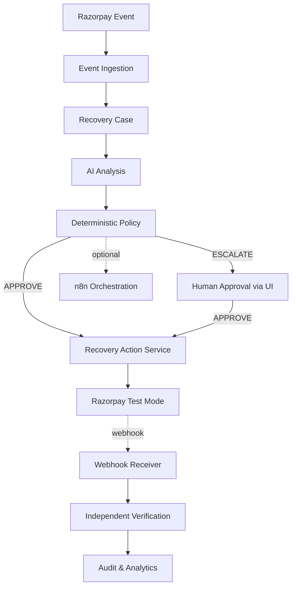

# RecoverAI — System Architecture

**Project:** RecoverAI
**Track:** Razorpay AI Buildathon — Track 03: AI Revenue Recovery
**Document:** System Architecture
**Last Updated:** 2026-09-02

---

## 1. Purpose

This document defines the system-level architecture of RecoverAI, a Razorpay Buildathon project focused on AI revenue recovery. It establishes system boundaries, architectural layers, trust boundaries, failure handling, and the relationship between AI reasoning and deterministic financial execution.

The architecture is designed around one central requirement: **RecoverAI must be able to detect, reason about, and execute revenue-recovery workflows without allowing probabilistic AI behavior to directly control financial execution.**

---

## 2. System Context

RecoverAI sits between Razorpay (the external financial authority) and the merchant (the operator). 
- It ingests payment failure events from Razorpay.
- It leverages an LLM (Gemini/Groq) to interpret qualitative evidence.
- It uses a deterministic policy engine to authorize recovery actions.
- It executes bounded financial operations (like generating payment links) back through Razorpay Test Mode.
- It optionally orchestrates human review using n8n for high-value escalations.

---

## 3. Core Architecture

The following diagram illustrates the primary end-to-end recovery pipeline.

---

## 4. AI / Deterministic Trust Boundary

A strict boundary exists between intelligence and financial authority.

* **Untrusted / Probabilistic (AI Layer)**: The LLM gateway processes unstructured evidence (e.g., failure codes, customer context) and proposes an optimal recovery intervention. The LLM has zero direct financial execution capability.
* **Trusted / Deterministic (Policy & App Layer)**: A Python-based deterministic policy engine receives the AI's proposal and evaluates it against strict financial rules (e.g., duplicate action checks, maximum recovery amounts, permitted action types). It issues a hard `APPROVE`, `DENY`, or `ESCALATE` decision.

---

## 5. Razorpay Integration Boundary

The execution layer operates under strict constraints regarding external integration:
* **Test Mode Enforcement**: RecoverAI natively guards against live-mode execution, restricting all API calls to Razorpay Test Mode endpoints.
* **Backend Authority**: Frontend applications cannot interact with Razorpay directly. All financial mutations must route through the backend `RecoveryActionService`, ensuring the atomic execution lock and policy rules cannot be bypassed.
* **Webhook Independence**: Webhooks are ingested asynchronously and are treated as the ultimate source of truth for payment status. They are strictly authenticated using Razorpay HMAC signatures.

---

## 6. Recovery Lifecycle

The lifecycle of a single recovery effort flows sequentially:
1. **Detect**: System ingests failure signals into a `RecoveryCase`.
2. **Analyze**: AI evaluates evidence and proposes a `RecoveryAction`.
3. **Decide**: Policy Engine enforces constraints.
4. **Execute**: The backend atomically claims the action and calls Razorpay to generate a payment link.
5. **Verify**: Incoming webhooks are reconciled against the expected currency and amount before case closure.
6. **Measure**: Final outcomes feed into local analytics tables.

---

## 7. State, Evidence, and Audit Ownership

* **State**: Recovery cases and actions are explicitly persisted in SQLite. Optimistic concurrency locks (`version`) prevent stale modifications during concurrent executions.
* **Evidence**: All provider evidence (failure codes, webhook bodies) is persisted immutably and fed as context to the AI.
* **Audit**: The system maintains an append-only audit trail. Every material lifecycle change, policy decision, or execution attempt is logged natively.

---

## 8. Failure & Reliability Principles

The system must handle external turbulence gracefully:
* **Duplicate Execution Protection**: The `RecoveryActionService` claims actions atomically in the database before making network calls. Concurrent executions will fail safely.
* **Fail Closed on Ambiguity**: If an execution results in a timeout or unknown state, the system transitions to `UNKNOWN` and requires verification, rather than assuming success.
* **Idempotent Webhooks**: Duplicate webhooks are ignored securely.
* **Independent Verification**: A webhook `200 OK` is not sufficient to close a case. The `VerificationEngine` demands that the received currency and amount match the expected values precisely.

---

## 9. Optional n8n Orchestration

While n8n workflow files exist within the repository, **n8n is strictly an optional orchestration integration**. 
* It is not the core financial execution authority.
* It is not required for system operation.
* If n8n is offline or unconfigured, the backend silently skips triggering outbound notifications and ESCALATE notifications.
* Human approval can be handled natively via the frontend React application hitting backend endpoints.

---

## 10. Current MVP Limitations

The current implementation represents an MVP constructed for the Razorpay AI Buildathon. Note the following boundaries of the existing codebase:
* **Execution Environment**: Interactions are strictly limited to Razorpay Test Mode.
* **Aspirational ML Components**: Theoretical components discussed during planning—such as a real-time `Recovery Risk Model`, `Degradation Detector`, and dynamic `Expected Value Calculator`—are excluded from the core MVP to ensure a focused, deterministic financial safety boundary.
* **Evaluation**: The project uses an offline 1,500-scenario synthetic benchmark to tune policy rules, rather than live merchant data processing.
