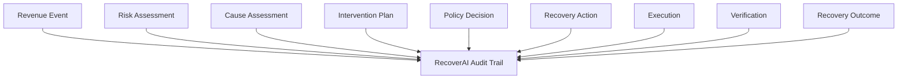
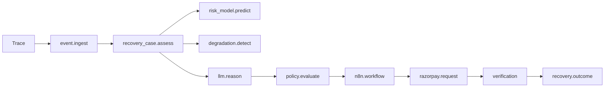
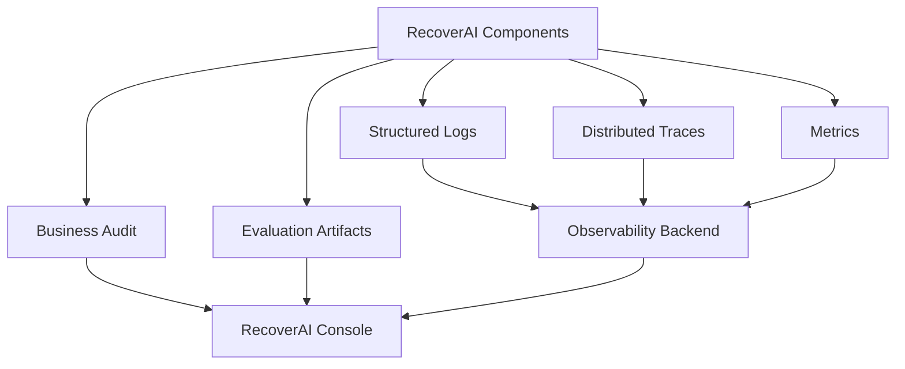

# `docs/13_AUDIT_AND_OBSERVABILITY.md`

````markdown
# RecoverAI — Audit & Observability

**Project:** RecoverAI  
**Track:** Razorpay AI Buildathon — Track 03: AI Revenue Recovery  
**Document:** Audit Trail, Logging, Metrics, Tracing & Operational Observability  
**Status:** Architecture Foundation — Proposed for Freeze  
**Version:** 1.0  
**Last Updated:** 2026-08-26

---

# 1. Purpose

This document defines how RecoverAI records, explains, observes, and reconstructs its behavior.

The system must satisfy the Track 03 requirement to provide:

- measured revenue recovery,
- compliant escalation,
- stopping rules,
- and an audit trail.

Razorpay's current Track 03 brief explicitly states:

> "Don't just identify the problem. Show measured money recovered across a batch, with compliant escalation, stopping rules, and an audit trail." ([razorpay.com](https://razorpay.com/buildathon/))

RecoverAI therefore treats observability and auditability as part of the product, not as debugging infrastructure added at the end.

The core principle is:

> **Every material recovery decision must be reconstructable from durable evidence.**

---

# 2. Audit vs Observability

RecoverAI deliberately separates two concepts.

## 2.1 Audit

Audit answers:

> **What business/financial decision happened, why did it happen, who/what caused it, what action occurred, and what was the verified result?**

Audit records are associated with:

- RecoveryCase,
- RecoveryAction,
- PolicyDecision,
- VerificationRecord,
- AI recommendation,
- external Razorpay references,
- and workflow execution references.

---

## 2.2 Observability

Observability answers:

> **What is the technical system doing, how long is it taking, where did it fail, and what component is unhealthy?**

Observability includes:

- logs,
- metrics,
- traces,
- exceptions,
- provider health,
- workflow health,
- API latency,
- database failures.

OpenTelemetry defines common semantic conventions for traces, metrics, logs, events, and resources so telemetry can be correlated consistently across components. ([opentelemetry.io](https://opentelemetry.io/docs/concepts/semantic-conventions/))

---

# 3. The Two-System Model

```text
BUSINESS TRUTH

Revenue Event
    |
    v
Recovery Case
    |
    v
Decision
    |
    v
Policy
    |
    v
Action
    |
    v
Verification
    |
    v
Outcome


TECHNICAL OBSERVABILITY

Request
    |
    v
Trace
    |
    +--> Logs
    |
    +--> Metrics
    |
    +--> Exceptions
    |
    +--> Workflow execution
````

These systems reference each other but must not replace each other.

---

# 4. Audit Trail Objective

A reviewer should be able to take one RecoveryCase ID and reconstruct:

```text
1. What happened?
2. Which external event created the case?
3. What evidence was available?
4. What did Revenue Intelligence calculate?
5. What did the LLM recommend, if used?
6. What intervention candidates existed?
7. Which policy rules were evaluated?
8. Why was the action approved/rejected/suppressed/escalated?
9. What action was executed?
10. Which Razorpay object was affected?
11. What happened technically?
12. What external financial state was verified?
13. How much revenue was actually recovered?
14. Why did the case terminate?
```

If any of these cannot be reconstructed, the audit design is incomplete.

---

# 5. Audit Architecture



The audit trail therefore observes the **business lifecycle**, not just HTTP requests.

---

# 6. Audit Event Model

Every material business transition should produce an `AuditEvent`.

Conceptual structure:

```json
{
  "audit_event_id": "audit_001",
  "timestamp": "2026-08-26T12:34:56Z",

  "event_type": "RECOVERY_STATE_CHANGED",

  "actor": {
    "type": "POLICY_ENGINE",
    "id": "policy-engine"
  },

  "case_id": "case_001",
  "action_id": "action_001",

  "previous_state": "POLICY_REVIEW",
  "new_state": "EXECUTING",

  "decision_reference": "policy_001",
  "policy_version": "1.0",

  "evidence_references": [
    "evt_001",
    "risk_001"
  ],

  "metadata": {}
}
```

The exact persistence schema will be defined during implementation.

---

# 7. Audit Event Categories

Initial categories:

```text
CASE
ASSESSMENT
DECISION
POLICY
ACTION
EXECUTION
VERIFICATION
OUTCOME
WORKFLOW
EXTERNAL_EVENT
SECURITY
SYSTEM
```

Examples:

```text
CASE_CREATED
RISK_ASSESSMENT_CREATED
CAUSE_ASSESSMENT_CREATED

INTERVENTION_PROPOSED
POLICY_DECISION_CREATED

ACTION_AUTHORIZED
ACTION_EXECUTING
ACTION_EXECUTION_UNKNOWN

RAZORPAY_REQUEST_COMPLETED
VERIFICATION_STARTED
VERIFICATION_COMPLETED

RECOVERY_CONFIRMED
RECOVERY_SUPPRESSED
CASE_ESCALATED

WORKFLOW_STARTED
WORKFLOW_FAILED

WEBHOOK_RECEIVED
WEBHOOK_DUPLICATE
WEBHOOK_REJECTED
```

Only events that materially contribute to reconstruction should be promoted to durable audit events.

---

# 8. Actor Model

Audit records must identify the actor responsible for the event.

Initial actor types:

```text
SYSTEM
ML_MODEL
LLM_AGENT
POLICY_ENGINE
MCP_TOOL
N8N_WORKFLOW
RAZORPAY
HUMAN
SIMULATOR
```

Example:

```text
Actor:
LLM_AGENT

Action:
INTERVENTION_PROPOSED
```

versus:

```text
Actor:
POLICY_ENGINE

Action:
POLICY_APPROVED
```

versus:

```text
Actor:
RAZORPAY

Action:
PAYMENT_CAPTURED_OBSERVED
```

This makes responsibility explicit.

---

# 9. Actor ≠ Authority

An actor identifies who produced an event.

It does not automatically mean that actor had authority to perform the action.

For example:

```text
LLM_AGENT
    |
    +--> proposed CREATE_PAYMENT_LINK
```

does not imply:

```text
LLM_AGENT
    |
    +--> authorized CREATE_PAYMENT_LINK
```

The audit trail should record those as separate events.

---

# 10. Audit Immutability Principle

Historical audit records must be append-oriented.

The system should not silently rewrite:

```text
ACTION_AUTHORIZED
```

into:

```text
ACTION_DENIED
```

after the fact.

If a later decision changes the state:

```text
ACTION_AUTHORIZED
    |
    v
POLICY_REVALIDATED
    |
    v
ACTION_CANCELLED
```

both events remain historically visible.

This is necessary for forensic reconstruction.

---

# 11. Audit Corrections

If an audit entry is wrong because of an implementation/data error:

1. do not silently modify history,
2. record a correction event,
3. identify the original event,
4. explain the correction,
5. preserve both records.

Example:

```text
AUDIT_CORRECTION_CREATED
original_event_id = audit_991
reason = mapping_bug_fixed
```

This preserves accountability.

---

# 12. Audit Correlation IDs

The audit system must provide a common correlation chain:

```text
merchant_id
    |
    v
case_id
    |
    v
action_id
    |
    v
policy_decision_id
    |
    v
workflow_execution_id
    |
    v
external_request_reference
    |
    v
verification_id
```

Not every event contains every ID.

Each event should include whatever identifiers are relevant.

---

# 13. Event ID vs Correlation ID

These are distinct.

### Event ID

Identifies one event.

```text
audit_event_id
```

### Correlation ID

Connects multiple events belonging to one operation/case.

```text
case_id
action_id
trace_id
```

One case can therefore have:

```text
many audit_event_id values
```

without ambiguity.

---

# 14. RecoveryCase Audit Timeline

A complete example:

```text
12:30:00
PAYMENT_FAILED_OBSERVED

12:30:01
RECOVERY_CASE_CREATED

12:30:03
RISK_ASSESSMENT_CREATED

12:30:03
DEGRADATION_ASSESSMENT_CREATED

12:30:05
CAUSE_ASSESSMENT_CREATED

12:30:06
INTERVENTION_PROPOSED

12:30:06
POLICY_APPROVED

12:30:07
ACTION_EXECUTING

12:30:09
PAYMENT_LINK_CREATED

12:30:10
VERIFICATION_PENDING

12:32:41
PAYMENT_LINK_PAID_OBSERVED

12:32:42
PAYMENT_VERIFIED

12:32:42
RECOVERY_CONFIRMED
```

The exact timestamps above are illustrative only.

Actual audit data must come from the running system.

---

# 15. AI Audit

When an LLM participates in a decision, the audit record should include:

```text
provider
model
prompt_version
context_version
output_schema_version
request_id
recommendation
evidence_ids
validation_result
fallback_used
```

Example:

```json
{
  "event_type": "LLM_RECOMMENDATION_CREATED",
  "case_id": "case_001",

  "provider": "gemini",
  "model": "configured-model",

  "prompt_version": "recovery-plan-v1",
  "context_version": "ctx-14",
  "output_schema_version": "RecoveryRecommendationV1",

  "recommendation": "CREATE_PAYMENT_LINK",

  "evidence_ids": [
    "evt_001",
    "risk_004"
  ],

  "validation": {
    "schema_valid": true,
    "evidence_valid": true
  }
}
```

The system does not need to store hidden model chain-of-thought.

It needs to store the structured decision, evidence references, and provenance necessary to reproduce or explain the outcome.

---

# 16. ML Audit

For every material ML prediction:

```text
model_name
model_version
feature_schema_version
feature_snapshot_id
prediction
prediction_timestamp
```

Example:

```json
{
  "event_type": "RISK_ASSESSMENT_CREATED",
  "case_id": "case_001",

  "model_name": "recovery-risk-xgb",
  "model_version": "0.1.0",
  "feature_schema_version": "1.0",
  "feature_snapshot_id": "fs_002",

  "recovery_probability": 0.81
}
```

This makes model-version drift visible.

---

# 17. Policy Audit

Every Policy Decision must retain:

```text
policy_decision_id
policy_version
action
decision
matched_rules
reason_codes
evaluation_timestamp
case_id
action_id
```

Example:

```json
{
  "event_type": "POLICY_DECISION_CREATED",

  "policy_decision_id": "pd_001",
  "case_id": "case_001",
  "action_id": "action_001",

  "decision": "SUPPRESS",
  "policy_version": "1.2",

  "matched_rules": [
    "SYSTEMIC_DEGRADATION"
  ],

  "reason_codes": [
    "PAYMENT_DEGRADATION_ACTIVE"
  ]
}
```

This is critical to demonstrate that the LLM did not make the final authorization decision.

---

# 18. Razorpay Audit

Every material Razorpay interaction should be correlated to:

```text
case_id
action_id
external_object_id
request/correlation reference
operation category
result category
```

Examples:

```text
CREATE_PAYMENT_LINK
FETCH_PAYMENT
FETCH_ORDER
SEND_PAYMENT_LINK_NOTIFICATION
CANCEL_PAYMENT_LINK
```

The audit should not store secrets.

---

# 19. Webhook Audit

The webhook processor should emit durable audit events for:

```text
WEBHOOK_RECEIVED
WEBHOOK_SIGNATURE_VERIFIED
WEBHOOK_SIGNATURE_REJECTED
WEBHOOK_DUPLICATE
WEBHOOK_NORMALIZED
WEBHOOK_DISPATCHED
```

Not every low-level parsing operation needs to become a durable business audit entry.

Operational details can remain in logs.

---

# 20. Duplicate Webhook Audit

When Razorpay sends the same event twice:

```text
WEBHOOK_DUPLICATE
```

should be recorded at the appropriate observability/audit level.

The record should contain:

```text
source_event_id
received_at
existing_event_reference
case_id if known
```

The duplicate must not produce a second financial action.

Razorpay explicitly documents duplicate webhook delivery and the use of `x-razorpay-event-id` for deduplication. ([razorpay.com](https://razorpay.com/docs/webhooks/validate-test/))

---

# 21. n8n Audit Correlation

n8n execution data should be correlated to business actions.

Store:

```text
workflow_name
workflow_version
workflow_execution_id
case_id
action_id
```

This creates:

```text
RecoveryCase
    |
    v
RecoveryAction
    |
    v
n8n execution
    |
    v
workflow nodes
```

The n8n execution record supplements RecoverAI's audit trail.

It does not replace it.

---

# 22. Audit and n8n Execution History

n8n currently records execution statuses such as:

* Running,
* Waiting,
* Success,
* Failed,

and provides execution history/retry capabilities. ([https://docs.n8n.io/workflows/executions/all-executions/](https://docs.n8n.io/workflows/executions/all-executions/))

RecoverAI should store enough correlation metadata to navigate from:

```text
RecoveryAction
```

to:

```text
n8n workflow execution
```

during debugging.

---

# 23. Logs

Logs are for technical diagnostics.

They should be structured, machine-readable, and correlated with the same identifiers used by traces and business state.

OpenTelemetry defines a common log data model and semantic conventions so log records can be consistently interpreted and correlated with other telemetry signals. ([opentelemetry.io](https://opentelemetry.io/docs/specs/otel/logs/data-model/))

---

# 24. Structured Logging

Prefer:

```json
{
  "timestamp": "2026-08-26T12:30:00Z",
  "level": "INFO",
  "service": "recovery-service",

  "message": "Recovery action authorized",

  "trace_id": "trace_001",
  "case_id": "case_001",
  "action_id": "action_001",
  "policy_decision_id": "pd_001",

  "event": "ACTION_AUTHORIZED"
}
```

over:

```text
"Case 001 authorized payment link"
```

Structured logs are easier to query, correlate, and test.

---

# 25. Log Levels

Initial levels:

```text
DEBUG
INFO
WARNING
ERROR
CRITICAL
```

Production/default logging should provide enough information to reconstruct operational incidents without logging unnecessary sensitive information.

OWASP recommends logging security-relevant events and protecting logs from unauthorized access and tampering, while excluding or masking credentials, tokens, payment-card data, and other sensitive information. ([owasp.org](https://cheatsheetseries.owasp.org/cheatsheets/Logging_Cheat_Sheet.html))

---

# 26. What Must Not Be Logged

RecoverAI must not directly log:

```text
API keys
API secrets
Webhook secrets
Authorization headers
Passwords
Database credentials
Encryption keys
Raw payment-card data
Unnecessary sensitive personal data
```

OWASP specifically recommends that access tokens, passwords, encryption keys, bank/payment-card data, sensitive personal data, and other secrets be removed, masked, hashed, or encrypted rather than directly recorded in logs. ([owasp.org](https://cheatsheetseries.owasp.org/cheatsheets/Logging_Cheat_Sheet.html))

---

# 27. Raw Webhook Payloads

Raw Razorpay webhook payloads may contain customer and payment information.

Therefore the system must carefully distinguish:

```text
raw integration data
```

from:

```text
operational logs
```

Raw payloads should not automatically be copied into standard application logs.

Instead:

```text
Webhook
    |
    +--> secure raw-event storage/reference
    |
    +--> structured operational log
```

The exact retention and storage policy is finalized in `17_SECURITY.md`.

---

# 28. Log Injection

External data must be treated as untrusted log content.

Examples:

```text
customer note
merchant metadata
error description
free-form input
```

must be encoded/safely structured so that untrusted newline/control characters cannot forge additional log records.

OWASP specifically identifies log injection as a concern and recommends proper sanitization/encoding of logged data. ([owasp.org](https://cheatsheetseries.owasp.org/cheatsheets/Logging_Cheat_Sheet.html))

---

# 29. Trace Architecture

Tracing should connect:

```text
incoming request
    |
    v
event ingestion
    |
    v
recovery assessment
    |
    v
LLM/ML
    |
    v
policy
    |
    v
n8n
    |
    v
Razorpay
    |
    v
verification
```

OpenTelemetry spans represent individual operations and use semantic conventions to make spans across HTTP, database, messaging, and other systems consistently attributable and correlatable. ([opentelemetry.io](https://opentelemetry.io/docs/specs/semconv/general/trace/))

---

# 30. Suggested Trace Structure



The exact span names should follow a consistent internal naming convention.

---

# 31. Trace vs Audit

A trace is temporary/operational telemetry.

An audit event is durable business history.

For example:

### Trace

```text
HTTP request took 842ms
```

### Audit

```text
Policy approved CREATE_PAYMENT_LINK under policy version 1.2
```

A trace may disappear according to telemetry retention.

The business audit record should remain according to the project's audit-retention policy.

---

# 32. Metrics

Metrics are aggregated signals used to understand behavior over time.

OpenTelemetry defines semantic conventions and metric guidelines for consistent names, units, attributes, and instruments. ([opentelemetry.io](https://opentelemetry.io/docs/specs/semconv/general/metrics/))

RecoverAI should avoid creating a metric for every possible identifier.

High-cardinality identifiers such as:

```text
case_id
payment_id
customer_id
```

should not generally be metric labels.

They belong in logs/traces/audit.

---

# 33. Product Metrics

The most important metrics are business metrics.

## Revenue

```text
revenue_at_risk_minor
revenue_recovered_minor
recovery_rate
```

## Recovery efficiency

```text
recovered_amount_per_intervention
```

## Operational

```text
active_recovery_cases
recovery_cases_opened
recovery_cases_closed
```

## Safety

```text
policy_denials
suppression_count
escalation_count
duplicate_action_preventions
unknown_execution_count
```

---

# 34. AI Metrics

```text
llm_requests_total
llm_success_total
llm_fallback_total
llm_rate_limit_total
llm_schema_failure_total
llm_latency_ms
```

ML metrics:

```text
risk_predictions_total
risk_prediction_latency_ms
```

Evaluation metrics remain separate from live operational metrics.

---

# 35. Razorpay Integration Metrics

```text
razorpay_requests_total
razorpay_errors_total
razorpay_timeouts_total
razorpay_rate_limits_total
razorpay_webhooks_total
razorpay_duplicate_webhooks_total
razorpay_verification_total
```

These should be grouped by operation category rather than raw URL where possible.

---

# 36. Workflow Metrics

```text
n8n_workflows_started
n8n_workflows_succeeded
n8n_workflows_failed
n8n_workflows_waiting
n8n_workflow_duration_ms
```

Again, avoid putting unbounded IDs into metric labels.

---

# 37. State Machine Metrics

RecoverAI should measure state transitions.

Examples:

```text
recovery_cases_detected
recovery_cases_assessed
recovery_cases_suppressed
recovery_cases_escalated
recovery_cases_recovered
recovery_cases_not_recovered
recovery_cases_unknown
```

This enables operational diagnosis.

For example:

```text
recovered revenue fell
+
suppression rate increased
=
investigate degradation detector/policy
```

---

# 38. Safety Metrics

The following metrics are especially important:

```text
policy_violation_count
unauthorized_financial_mutation_count
duplicate_financial_action_count
blind_retry_count
recovery_without_verification_count
```

Desired production/demo target:

```text
unauthorized_financial_mutation_count = 0
duplicate_financial_action_count = 0
blind_retry_count = 0
recovery_without_verification_count = 0
```

These are **targets**, not claimed results until tests prove them.

---

# 39. Revenue Recovery Metrics

Track 03 specifically requires measured money recovered across a batch.

RecoverAI should define:

```text
revenue_at_risk
verified_recovered_revenue
recovery_rate
```

The system must calculate these from verified outcomes.

It must not calculate:

```text
recovered_revenue
```

from model predictions.

---

# 40. Money Metric Storage

Monetary metrics must retain:

```text
amount_minor
currency
```

They should not be stored as floating-point values.

Example:

```text
recovered_revenue_minor = 250000
currency = INR
```

The evaluation layer can render:

```text
₹2,500
```

for presentation.

---

# 41. Metric Definitions

Every displayed metric must have a precise definition.

Example:

```text
Recovery Rate
=
cases with verified recovered outcome
/
eligible recovery cases
```

and:

```text
Revenue Recovery Rate
=
verified recovered amount
/
eligible amount at risk
```

The exact eligibility definition belongs in `14_EVALUATION.md`.

A dashboard must not display ambiguous "success rate" numbers.

---

# 42. Dashboard Observability

The merchant/reviewer console should expose:

```text
Revenue at Risk
Verified Revenue Recovered
Active Recovery Cases
Recovery Rate
Suppressed Cases
Escalated Cases
Unknown Cases
Systemic Degradation Status
Provider Health
Workflow Health
Recent Failures
```

The dashboard should allow drilling into a RecoveryCase.

---

# 43. Case Timeline UI

A RecoveryCase should expose a timeline:

```text
12:30:00  payment.failed
12:30:01  case created
12:30:03  risk score calculated
12:30:04  degradation check
12:30:05  cause assessment
12:30:06  intervention proposed
12:30:06  policy approved
12:30:07  Payment Link created
12:30:10  waiting for payment
12:32:41  payment_link.paid
12:32:42  verified
12:32:42  recovered
```

This is one of the strongest demo surfaces because it directly addresses the audit-trail requirement.

---

# 44. "Why Did We Act?"

The UI should be able to display a structured explanation:

```text
Action:
CREATE_PAYMENT_LINK

Why:
Customer-specific recovery opportunity.

Evidence:
- Payment failed due to a customer-action error.
- No active systemic payment degradation.
- Recovery probability: 0.81.

Policy:
Approved under policy v1.2.

Verification:
Payment Link paid and payment state verified.

Recovered:
₹5,000.
```

The actual values must come from the system.

No generated explanation should contradict audit records.

---

# 45. "Why Did We Not Act?"

This is equally important.

Example:

```text
Decision:
SUPPRESS

Reason:
Active systemic payment degradation.

Evidence:
- Razorpay downtime event
- Failure rate above merchant baseline

Policy:
SYSTEMIC_DEGRADATION

Next condition:
Re-evaluate after degradation clears.
```

This demonstrates that the agent is not simply an action maximizer.

---

# 46. Incident Reconstruction

For a failed case, a reviewer should be able to reconstruct:

```text
failure source
      |
      v
technical error
      |
      v
case state
      |
      v
policy decision
      |
      v
action state
      |
      v
verification state
      |
      v
final outcome
```

Example:

```text
Razorpay API timeout
    ->
RecoveryAction = EXECUTION_UNKNOWN
    ->
verification requested
    ->
Payment Link found
    ->
VERIFIED_SUCCESS
    ->
RECOVERED
```

This is stronger than simply showing an error log.

---

# 47. Graceful Failure Demonstration

The Buildathon explicitly requires a failure to be handled gracefully. ([razorpay.com](https://razorpay.com/buildathon/))

RecoverAI should deliberately demonstrate at least one:

### External timeout

```text
Razorpay request
    ->
timeout
    ->
EXECUTION_UNKNOWN
    ->
verification
    ->
correct outcome
```

or:

### LLM provider failure

```text
Gemini
    ->
timeout
    ->
Groq fallback
    ->
structured output
    ->
continue
```

The failure must be visible in telemetry and explainable in the final case timeline.

---

# 48. Failure Correlation

A failure should be traceable through:

```text
trace_id
request_id
case_id
action_id
workflow_execution_id
external reference
```

This allows:

```text
technical failure
```

to be connected to:

```text
business impact
```

---

# 49. Security Observability

Security-relevant events should be observable.

OWASP recommends considering events such as:

* authentication failures,
* authorization failures,
* attempts to bypass flow control,
* suspicious business logic activity,
* excessive use,
* configuration changes,
* logging failures,
* and other security-significant events. ([owasp.org](https://cheatsheetseries.owasp.org/cheatsheets/Logging_Cheat_Sheet.html))

RecoverAI should therefore monitor:

```text
invalid webhook signatures
unknown tool calls
policy bypass attempts
invalid state transitions
excessive action attempts
authentication failures
unexpected workflow behavior
```

---

# 50. Logging Failure Must Be Observable

If the application stops emitting audit/observability records unexpectedly, that itself is an operational problem.

OWASP recommends mechanisms that can detect when logging stops and detect tampering or unauthorized access/deletion. ([owasp.org](https://cheatsheetseries.owasp.org/cheatsheets/Logging_Cheat_Sheet.html))

For the MVP, at minimum:

```text
audit write failure
```

must:

* be surfaced,
* not be silently swallowed,
* and prevent the system from claiming a fully recorded financial action if the required audit record was not durably created.

---

# 51. Audit Write Failure

A critical decision must not be considered fully completed if its mandatory audit record cannot be durably persisted.

Example:

```text
Policy approves action
      |
      v
Audit write fails
      |
      v
Do not proceed blindly
```

The exact transactional strategy will be implemented later.

The important architectural invariant is:

> **A financially meaningful action cannot silently disappear from the audit history.**

---

# 52. Audit Persistence Ordering

Where practical, the application should establish durable business state/audit intent before an external financial mutation.

Conceptually:

```text
prepare action
    |
    v
persist action + policy reference
    |
    v
external mutation
    |
    v
record execution result
    |
    v
verify
```

This helps prevent:

```text
external action happened
+
RecoverAI has no record that it was attempted
```

The exact transactional design belongs in implementation.

---

# 53. Audit and External Side Effects

Because database transactions cannot automatically roll back an external Razorpay mutation, RecoverAI must use:

```text
durable action state
+
idempotency/correlation
+
verification
```

rather than assuming distributed atomicity.

Example:

```text
DB commit
   ->
Razorpay request
   ->
timeout
```

The action enters:

```text
EXECUTION_UNKNOWN
```

and is reconciled.

---

# 54. Metrics and Cardinality

Do not create metrics such as:

```text
recovery_case_latency{case_id="case_123"}
```

for thousands of cases.

Use:

```text
recovery_case_duration_ms
```

with low-cardinality attributes such as:

```text
revenue_source
action_type
outcome
```

Specific case IDs belong in traces/logs/audit.

OpenTelemetry's metric guidance emphasizes meaningful aggregation and consistent attributes rather than unbounded high-cardinality labels. ([opentelemetry.io](https://opentelemetry.io/docs/specs/semconv/general/metrics/))

---

# 55. Trace Sampling

The final production strategy may use sampling for technical traces.

However, Buildathon-critical flows should remain inspectable.

For the MVP:

```text
golden-path demo traces
+
failure-demo traces
+
sampled background traces
```

can balance observability and resource usage.

The audit trail is not sampled.

---

# 56. Audit Retention

Audit retention should be longer/stricter than transient debug-log retention.

The exact retention duration is a deployment/security decision.

For the Buildathon:

* audit records must survive the demo,
* historical evaluation runs must be reproducible,
* and old audit events should not be deleted during ordinary application operation.

Production retention requirements are outside the current MVP.

---

# 57. Evaluation Observability

Each evaluation run should have:

```text
evaluation_run_id
dataset_version
simulator_version
policy_version
model_version
prompt_version
gateway configuration
start/end time
```

This makes a benchmark result reproducible.

Example:

```text
RUN-2026-08-26-001

Dataset:
synthetic-v1.2

Simulator:
simulator-v0.4

RecoverAI:
policy-v1.2
risk-model-v0.1
prompt-root-cause-v1
```

---

# 58. Live vs Synthetic Labels

Every dashboard/report must clearly distinguish:

```text
LIVE_TEST_MODE
```

from:

```text
SYNTHETIC_EVALUATION
```

Never combine them into a single number without explicit labelling.

For example:

```text
Live Test Mode recovered:
₹5,000

Synthetic benchmark recovered:
₹4,82,000 across 1,000 cases
```

The two results answer different questions.

---

# 59. Observability for LLM Fallback

The UI should show:

```text
Primary provider:
Gemini

Result:
Timeout

Fallback:
Groq

Fallback result:
Success
```

This helps demonstrate resilience.

It also prevents a fallback from becoming invisible technical magic.

---

# 60. Provider Metrics

Recommended low-cardinality dimensions:

```text
provider
model_profile
task_type
status
```

Avoid:

```text
prompt text
case ID
customer ID
raw model output
```

as metric labels.

---

# 61. Audit Integrity

Audit records should be protected against accidental modification.

At minimum:

* application roles should prevent ordinary business code from deleting audit records,
* audit writes should be centralized,
* modifications should be visible,
* database access should be controlled.

A cryptographic hash chain is **not required for the MVP** unless implementation complexity is justified.

The objective is reliable append-oriented auditability, not cryptographic theater.

---

# 62. Why We Are Not Adding Blockchain

RecoverAI does not require blockchain or an immutable distributed ledger to satisfy the Buildathon audit requirement.

The actual requirement is:

> a traceable audit trail.

A properly designed application-level append-oriented audit ledger with access controls, correlation IDs, and durable records is sufficient for the MVP.

Introducing blockchain would add complexity without improving the core Track 03 outcome.

---

# 63. Observability Architecture



The exact observability backend is a deployment decision.

The internal telemetry contract is the architectural requirement.

---

# 64. Minimum Observability Stack

The MVP should not require a large enterprise monitoring stack.

Minimum viable capability:

```text
structured application logs
+
trace IDs
+
business metrics
+
durable audit records
+
case timeline
+
evaluation records
```

OpenTelemetry can be adopted where it simplifies standardized traces/metrics/log correlation, but RecoverAI should not deploy an unnecessarily large observability platform solely for appearance.

---

# 65. Buildathon Demo Observability View

The final demo should ideally have a compact operational panel:

```text
SYSTEM STATUS

Razorpay Test Mode       HEALTHY
Webhook Ingestion        HEALTHY
Policy Engine            HEALTHY
LLM Gateway              HEALTHY
  Gemini                 HEALTHY
  Groq                   HEALTHY
  Hugging Face           AVAILABLE
n8n                      HEALTHY
Database                 HEALTHY

ACTIVE RECOVERY CASES    12
RECOVERED TODAY          ₹XX,XXX
AT RISK                  ₹XX,XXX
ESCALATED                2
SUPPRESSED               7
UNKNOWN                  0
```

All numbers must be live values from the system.

---

# 66. Case Drill-Down

Clicking a recovery case should expose:

```text
Case
  |
  +--> Revenue Event
  |
  +--> Risk Assessment
  |
  +--> Degradation Assessment
  |
  +--> Root Cause
  |
  +--> Intervention Candidates
  |
  +--> Selected Action
  |
  +--> Policy Decision
  |
  +--> n8n Execution
  |
  +--> Razorpay Reference
  |
  +--> Verification
  |
  +--> Outcome
```

This is the ideal "judge-facing" audit experience.

---

# 67. Observability and Architecture Quality

The architecture will be considered observable only when a failure can be localized to a meaningful boundary.

Example:

```text
Recovery failed
```

is insufficient.

We need to determine whether:

```text
event ingestion failed
risk model failed
LLM failed
policy denied
workflow failed
Razorpay timed out
verification failed
```

This is the purpose of structured correlation.

---

# 68. Error Taxonomy

RecoverAI should use standardized internal categories.

### Event

```text
INVALID_SIGNATURE
DUPLICATE_EVENT
INVALID_SCHEMA
NORMALIZATION_ERROR
```

### AI

```text
LLM_TIMEOUT
LLM_RATE_LIMIT
LLM_SCHEMA_FAILURE
LLM_PROVIDER_ERROR
MODEL_INFERENCE_ERROR
```

### Policy

```text
POLICY_DENIED
POLICY_REVALIDATION_REQUIRED
POLICY_ENGINE_UNAVAILABLE
```

### Workflow

```text
WORKFLOW_TIMEOUT
WORKFLOW_FAILURE
WORKFLOW_STALE
```

### Razorpay

```text
RAZORPAY_TIMEOUT
RAZORPAY_RATE_LIMIT
RAZORPAY_VALIDATION_ERROR
RAZORPAY_AUTH_ERROR
RAZORPAY_NOT_FOUND
RAZORPAY_UNKNOWN_ERROR
```

### Verification

```text
VERIFICATION_PENDING
VERIFICATION_UNKNOWN
VERIFICATION_CONFLICT
```

These are internal normalization categories.

---

# 69. Failure Correlation Example

```text
case_id = CASE-42

trace_id = TRACE-900

action_id = ACTION-17

workflow_execution_id = N8N-812

Razorpay operation = CREATE_PAYMENT_LINK

Razorpay result = TIMEOUT

RecoveryAction:
EXECUTION_UNKNOWN

Verification:
Payment Link lookup

Result:
FOUND

Final:
RECOVERED
```

A judge should be able to inspect this chain without reading raw source code.

---

# 70. Security + Observability Boundary

Observability must not become a side-channel for secrets.

The application must enforce:

```text
business traceability
>
unnecessary data collection
```

OWASP explicitly advises avoiding the direct storage of secrets, authentication tokens, payment-card information, and unnecessary sensitive personal data in logs. ([owasp.org](https://cheatsheetseries.owasp.org/cheatsheets/Logging_Cheat_Sheet.html))

---

# 71. Definition of Done

Audit and observability are complete only when:

1. Every material RecoveryCase transition is auditable.
2. Every financial action has a policy reference.
3. Every financial action has an action ID.
4. Every external mutation is correlated to the action.
5. Every recovery success has verification evidence.
6. AI decisions contain model/provider/prompt/schema provenance.
7. ML decisions contain model/feature provenance.
8. n8n executions are correlated.
9. Structured logs exist.
10. Technical traces can connect major components.
11. Core metrics are available.
12. Sensitive secrets are excluded from logs.
13. Duplicate webhook processing is observable.
14. Unknown execution states are observable.
15. Audit-write failure is surfaced.
16. Live and synthetic evaluation are clearly separated.
17. A judge can inspect a complete case timeline.

---

# 72. Freeze Decisions

The following decisions are frozen:

1. Business audit and technical observability are separate concepts.
2. Material business decisions are recorded as durable audit events.
3. Audit records are append-oriented.
4. Every material financial action is correlated to case/action/policy/external references.
5. AI and ML provenance are recorded.
6. n8n execution IDs are correlated with RecoveryActions.
7. Structured logging is mandatory.
8. Trace correlation uses shared identifiers.
9. Metrics avoid high-cardinality identifiers.
10. Money metrics use integer minor units and explicit currency.
11. Secrets and sensitive payment data are not written directly to logs.
12. Audit success is not inferred from technical workflow success.
13. Recovery success is based on verification evidence.
14. Evaluation runs are versioned independently from live runtime data.
15. Audit failure must not be silently ignored.
16. A case timeline is a core demo requirement.
17. OpenTelemetry may be used for standardized telemetry, but excessive observability infrastructure is not required for the MVP.

---

# 73. Next Document

The next specification is:

```text
14_EVALUATION.md
```

It will define the most important proof layer for Track 03:

* synthetic data generation,
* independent ground truth,
* baselines,
* held-out evaluation,
* intervention outcome simulation,
* money-recovered calculation,
* false-positive/unnecessary-intervention cost,
* degradation evaluation,
* ablation studies,
* reproducibility,
* statistical reporting,
* and exactly what numbers we can legitimately claim in the final submission.

---

# 74. External References

## Razorpay

### Buildathon — Track 03

[https://razorpay.com/buildathon/](https://razorpay.com/buildathon/)

The current Track 03 brief explicitly requires measured money recovered across a batch, compliant escalation, stopping rules, and an audit trail. ([razorpay.com](https://razorpay.com/buildathon/))

### Webhook Validation

[https://razorpay.com/docs/webhooks/validate-test/](https://razorpay.com/docs/webhooks/validate-test/)

Razorpay documents raw-body signature validation, duplicate delivery, `x-razorpay-event-id`, and non-guaranteed webhook ordering.

---

## OpenTelemetry

### Semantic Conventions

[https://opentelemetry.io/docs/concepts/semantic-conventions/](https://opentelemetry.io/docs/concepts/semantic-conventions/)

OpenTelemetry defines common semantic naming across traces, metrics, logs, profiles, and resources. ([opentelemetry.io](https://opentelemetry.io/docs/concepts/semantic-conventions/))

### General Logs

[https://opentelemetry.io/docs/specs/semconv/general/logs/](https://opentelemetry.io/docs/specs/semconv/general/logs/)

OpenTelemetry defines common log identification attributes and links logs to shared resource/semantic conventions. ([opentelemetry.io](https://opentelemetry.io/docs/specs/semconv/general/logs/))

### Trace Semantic Conventions

[https://opentelemetry.io/docs/specs/semconv/general/trace/](https://opentelemetry.io/docs/specs/semconv/general/trace/)

OpenTelemetry documents consistent trace/span conventions for operations and cross-system correlation. ([opentelemetry.io](https://opentelemetry.io/docs/specs/semconv/general/trace/))

### Metrics Semantic Conventions

[https://opentelemetry.io/docs/specs/semconv/general/metrics/](https://opentelemetry.io/docs/specs/semconv/general/metrics/)

OpenTelemetry documents metric naming, units, instruments, and guidance around meaningful aggregations/attributes. ([opentelemetry.io](https://opentelemetry.io/docs/specs/semconv/general/metrics/))

### Logs Data Model

[https://opentelemetry.io/docs/specs/otel/logs/data-model/](https://opentelemetry.io/docs/specs/otel/logs/data-model/)

OpenTelemetry documents a common log record data model. ([opentelemetry.io](https://opentelemetry.io/docs/specs/otel/logs/data-model/))

---

## OWASP

### Logging Cheat Sheet

[https://cheatsheetseries.owasp.org/cheatsheets/Logging_Cheat_Sheet.html](https://cheatsheetseries.owasp.org/cheatsheets/Logging_Cheat_Sheet.html)

OWASP recommends logging security-relevant events while protecting logs from unauthorized access/tampering and avoiding direct recording of credentials, tokens, payment-card information, and other sensitive data. ([owasp.org](https://cheatsheetseries.owasp.org/cheatsheets/Logging_Cheat_Sheet.html))

---

## n8n

### Execution History

[https://docs.n8n.io/workflows/executions/all-executions/](https://docs.n8n.io/workflows/executions/all-executions/)

n8n documents execution states, history, and retrying failed workflow executions.

### Security Audit

[https://docs.n8n.io/hosting/securing/security-audit/](https://docs.n8n.io/hosting/securing/security-audit/)

n8n documents security auditing of credentials, risky nodes, community nodes, filesystem/database access, webhooks, and instance configuration.

---

# 75. Verification Status

## VERIFIED

* Track 03 explicitly requires measurable revenue recovery, escalation/stopping rules, and an audit trail.
* Razorpay's current webhook deduplication and validation requirements.
* OpenTelemetry semantic conventions for logs, metrics, traces, and events.
* OpenTelemetry's log data model.
* OWASP guidance on security logging and sensitive data exclusion.
* n8n execution history and security-audit capabilities.

## PROPOSED

* Exact audit database schema.
* Exact telemetry backend.
* Exact OpenTelemetry instrumentation.
* Exact metric names beyond the logical metrics in this document.
* Exact audit retention period.
* Exact trace sampling policy.
* Exact dashboard implementation.
* Exact raw-event retention policy.

## NOT YET IMPLEMENTED

All audit and observability components.

## IMPORTANT

The audit trail is a functional requirement of RecoverAI, not merely a logging feature. The final implementation must make a complete recovery case reconstructable from durable application records even if technical logs/traces have expired.

```
```
