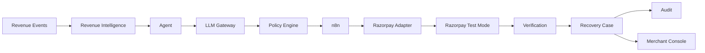
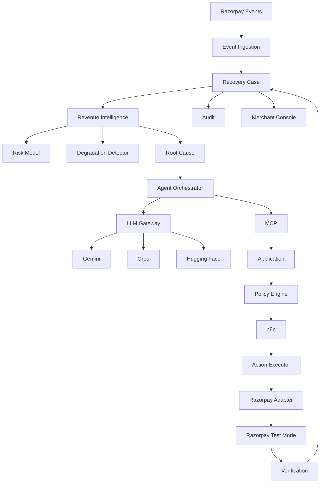
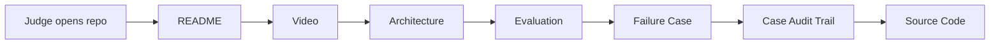

# `docs/20_DEMO_AND_SUBMISSION.md`

````markdown
# RecoverAI — Demo & Submission

**Project:** RecoverAI  
**Track:** Razorpay AI Buildathon — Track 03: AI Revenue Recovery  
**Document:** Final Demo Narrative, Evidence Presentation & Submission Checklist  
**Status:** Architecture Foundation — Proposed for Freeze  
**Version:** 1.0  
**Last Updated:** 2026-08-26

---

# 1. Purpose

This document defines how RecoverAI will be presented and submitted to the Razorpay AI Buildathon.

The official Buildathon page currently states that participants must:

- pick a track,
- build something real,
- show the work through a public repository,
- submit a 5-minute pitch video,
- and show the architecture. ([Razorpay Buildathon](https://razorpay.com/buildathon/))

For Track 03 specifically, Razorpay requires:

- detection of revenue at risk,
- determining the appropriate intervention,
- execution of a bounded recovery workflow,
- measured money recovered across a batch,
- compliant escalation,
- stopping rules,
- and an audit trail. ([Razorpay Buildathon](https://razorpay.com/buildathon/))

Therefore the final presentation must demonstrate those requirements directly.

The goal is not:

> **Show everything we built.**

The goal is:

> **Prove that RecoverAI solves the revenue-recovery problem better, safely, measurably, and with engineering depth.**

---

# 2. Current Razorpay Evaluation Signal

The current Buildathon page describes the event around building real AI and showing the work through:

```text
public repository
+
5-minute pitch video
+
architecture
````

rather than a resume-heavy application process. ([Razorpay Buildathon](https://razorpay.com/buildathon/))

This means the submission itself should communicate:

```text
Problem taste
Build quality
AI judgment
Failure recovery
```

These are therefore the four primary presentation pillars.

---

# 3. Track 03 Requirement Mapping

The final submission must map every major feature to the official Track 03 brief.

| Razorpay Requirement               | RecoverAI Evidence                   |
| ---------------------------------- | ------------------------------------ |
| Detect revenue at risk             | Revenue Intelligence                 |
| Determine appropriate intervention | Intervention Planner + LLM reasoning |
| Execute bounded workflow           | Policy + n8n + Razorpay Adapter      |
| Measure money recovered            | Evaluation Harness                   |
| Batch evaluation                   | Synthetic Evaluation                 |
| Compliant escalation               | Policy Engine                        |
| Stopping rules                     | Recovery State Machine + Policy      |
| Audit trail                        | Audit & Observability                |
| Failure handling                   | Failure-Recovery subsystem           |

The final pitch should visibly demonstrate this mapping.

---

# 4. What We Are Actually Selling

The system is not:

> "An AI that sends payment links."

That would be too simple and too close to capabilities that already exist in payment platforms.

RecoverAI should be described as:

> **A bounded revenue-recovery control loop that detects recoverable leakage, distinguishes customer-specific failures from systemic degradation, chooses an intervention, executes it under policy, verifies the external financial outcome, and stops safely when further automation is not justified.**

The key differentiator is the **closed loop**:

```text
DETECT
  ↓
UNDERSTAND
  ↓
DECIDE
  ↓
AUTHORIZE
  ↓
ACT
  ↓
VERIFY
  ↓
LEARN / STOP / ESCALATE
```

---

# 5. The Core Demo Message

The entire pitch should support one sentence:

> **RecoverAI doesn't just detect failed payments — it decides whether recovery is worth attempting, acts within strict boundaries, and proves whether the money actually came back.**

This is the central narrative.

---

# 6. What the Demo Must Prove

The final demo should prove five things:

```text
1. It can identify revenue at risk.
2. It can distinguish different causes.
3. It can choose different interventions.
4. It can recover/verify money.
5. It knows when NOT to act.
```

The fifth item is especially important.

A weak system:

```text
payment failed
    ↓
send payment link
```

RecoverAI:

```text
payment failed
    ↓
Is this recoverable?
    ↓
Why did it fail?
    ↓
Is the payment system degraded?
    ↓
Is intervention worthwhile?
    ↓
What action is allowed?
    ↓
Execute
    ↓
Verify
    ↓
Continue / Stop / Escalate
```

---

# 7. Five-Minute Pitch Constraint

The Buildathon page currently specifies a **5-minute pitch video**. ([Razorpay Buildathon](https://razorpay.com/buildathon/))

Therefore the demo cannot attempt to explain every subsystem.

The presentation should use:

```text
~30 sec
Problem

~45 sec
What RecoverAI does

~120 sec
Live product demonstration

~60 sec
Batch evaluation / evidence

~45 sec
Failure + architecture

~40 sec
Closing
```

These are targets, not rigid requirements.

The final timing should be rehearsed rather than assumed.

---

# 8. Recommended Five-Minute Narrative

```text
0:00 — 0:30
THE PROBLEM

0:30 — 1:15
THE SYSTEM

1:15 — 3:15
LIVE DEMO

3:15 — 4:15
MEASURED RESULTS

4:15 — 4:45
FAILURE + SAFETY

4:45 — 5:00
WHY THIS MATTERS
```

The exact final timing may shift after rehearsal.

---

# 9. Opening — The Problem

The opening should establish the pain immediately.

Example narrative:

> "A failed payment isn't necessarily lost revenue. It can be a temporary customer error, a systemic payment degradation, an abandoned checkout, or a case where intervention is no longer worth it. Most systems stop at detection. RecoverAI closes the loop."

Then show:

```text
₹X revenue at risk
N cases
multiple possible causes
```

The actual numbers must come from the benchmark/demo dataset.

Do not fabricate them before evaluation.

---

# 10. Why Existing Payment Systems Are Not Enough

Do not claim:

> "Razorpay cannot do payment recovery."

That would be inaccurate and unnecessary.

Razorpay itself now publicly highlights AI-native revenue-recovery products such as its Subscription Recovery Agent and broader Agent Studio. ([Razorpay Sprint 2026](https://razorpay.com/sprint/26); [Razorpay Newsroom](https://razorpay.com/newsroom/?p=4704))

This makes our differentiation even more important.

The submission should instead position RecoverAI around:

```text
merchant-specific decisioning
+
multi-signal diagnosis
+
intervention economics
+
bounded action
+
verification
+
stopping
+
auditability
+
provider/workflow resilience
```

The claim is not:

> "Razorpay has no recovery system."

The claim is:

> **"We built a recovery decision/control layer whose behavior is inspectable, policy-bounded, and benchmarkable."**

---

# 11. Product Positioning

Recommended product description:

> **RecoverAI is an AI-assisted revenue-recovery control plane for merchants. It detects revenue leakage, diagnoses likely causes, ranks recovery interventions, enforces deterministic policies, executes bounded workflows, and verifies the resulting financial outcome.**

Do not lead with:

```text
AI agent
LLM
n8n
MCP
Gemini
Groq
```

Those are implementation details.

Lead with:

```text
revenue recovery
```

---

# 12. Demo Case Selection

The live demo should use one carefully selected case.

Recommended:

```text
DEMO-01
Customer-specific payment failure
```

Why?

Because it allows the complete story:

```text
failure
→ diagnosis
→ recovery decision
→ policy
→ Payment Link
→ payment
→ verification
→ recovered
```

Then use a second case:

```text
DEMO-02
Systemic payment degradation
```

to show:

```text
DO NOT ACT
```

This creates contrast.

---

# 13. Live Demo — Case 1

The demo should begin with a payment failure event.

Display:

```text
CASE #REC-001

Revenue at Risk
₹5,000

Payment
FAILED

Customer history
High prior success

System health
No active degradation
```

The exact amount/history must come from seeded demo data.

---

# 14. Detection

Show RecoverAI creating:

```text
RecoveryCase
```

with:

```text
amount_at_risk
failure event
customer context
payment context
risk score
system health
```

The judge should immediately understand:

> "This is no longer just a failed transaction. It is now an active recovery opportunity."

---

# 15. Diagnosis

Display:

```text
Likely cause:
CUSTOMER-SPECIFIC

Confidence:
0.XX

Systemic degradation:
FALSE

Evidence:
payment failure event
customer history
system health
```

The model must cite real evidence IDs.

The interface must not display invented explanations.

---

# 16. Intervention Ranking

Show the candidate actions:

```text
1. CREATE_PAYMENT_LINK
   Expected value: ₹X

2. WAIT
   Expected value: ₹Y

3. ESCALATE
   Not justified
```

The exact candidates and values must be generated by the actual system.

The important point is:

> **The agent evaluates choices instead of automatically executing the first available action.**

---

# 17. Policy Decision

Show:

```text
ACTION:
CREATE_PAYMENT_LINK

POLICY:
APPROVED

WHY:
- Case active
- No systemic degradation
- Recovery window active
- Attempt limit not exceeded
- Amount within policy
```

This is an important judge-facing moment.

The LLM recommends.

The Policy Engine authorizes.

Those are separate.

---

# 18. Execution

Show the action:

```text
CREATE_PAYMENT_LINK
```

and the Razorpay Test Mode object:

```text
Payment Link:
plink_...
```

Do not show:

```text
KEY_SECRET
WEBHOOK_SECRET
```

or other credentials.

---

# 19. Payment

Use the actual Razorpay Test Mode flow.

Razorpay documents Test Mode Payment Link testing with selectable success/failure outcomes. ([Razorpay Payment Links Testing](https://razorpay.com/docs/payments/payment-links/create/))

The demo should deliberately produce:

```text
SUCCESS
```

for the golden path.

---

# 20. Verification

Do not immediately display:

```text
RECOVERED
```

after Payment Link creation.

Instead show:

```text
PAYMENT_LINK_PAID
        ↓
FETCH / VERIFY
        ↓
PAYMENT CONFIRMED
        ↓
RECOVERY CONFIRMED
```

This makes a crucial point:

> **Creating a payment mechanism is not the same as recovering revenue.**

---

# 21. Final Case Timeline

Open the case timeline:

```text
12:30:00  PAYMENT_FAILED
12:30:01  CASE_CREATED
12:30:03  RISK_ASSESSED
12:30:04  ROOT_CAUSE_IDENTIFIED
12:30:05  INTERVENTION_PROPOSED
12:30:05  POLICY_APPROVED
12:30:06  PAYMENT_LINK_CREATED
12:30:12  PAYMENT_LINK_PAID
12:30:13  PAYMENT_VERIFIED
12:30:13  RECOVERY_CONFIRMED
```

All timestamps must come from the real system.

---

# 22. Live Demo — Case 2

Immediately show the contrasting case:

```text
CASE #REC-002

Revenue at Risk
₹12,000

Payment failure spike
HIGH

System health
DEGRADED

Razorpay downtime signal
ACTIVE
```

---

# 23. Systemic Degradation Decision

Show:

```text
Candidate action:
CREATE_PAYMENT_LINK

Policy:
SUPPRESS

Reason:
ACTIVE_SYSTEMIC_DEGRADATION
```

The system does not repeatedly contact the customer while the underlying payment system is degraded.

This demonstrates:

> **RecoverAI knows when not to act.**

Razorpay currently exposes payment downtime events that can provide an integration-aligned signal for this kind of system-health assessment. ([Razorpay Payment Webhooks](https://razorpay.com/docs/webhooks/payments/))

---

# 24. Why the Suppression Demo Matters

This is more impressive than another successful Payment Link.

The judge sees:

```text
AI found revenue
BUT
AI did not blindly maximize intervention.
```

That directly supports:

* safety,
* judgment,
* stopping rules,
* false-positive cost awareness.

---

# 25. Failure Demonstration

The final demo should show **one deliberately injected failure**.

Recommended:

```text
Razorpay mutation timeout
```

because this tests financial safety rather than only model reliability.

---

# 26. Failure Demo

Sequence:

```text
AUTHORIZED
   ↓
CREATE_PAYMENT_LINK
   ↓
TIMEOUT
```

Display:

```text
Execution:
UNKNOWN

Action:
NOT RETRIED

Next:
RECONCILIATION
```

Then:

```text
Payment Link found
   ↓
State verified
   ↓
Continue safely
```

This demonstrates why the system does not blindly duplicate financial actions.

---

# 27. Alternative Failure Demo

A second optional failure:

```text
Gemini
  ↓
TIMEOUT

Groq
  ↓
FALLBACK
  ↓
VALID STRUCTURED OUTPUT
```

This is useful, but less important than financial-state uncertainty.

The first failure demo should be selected based on what can be made reliable during rehearsal.

---

# 28. Batch Evaluation

After the live demo, show the synthetic benchmark.

Example layout:

```text
HELD-OUT BATCH

Cases                 N
Revenue at Risk       ₹X
No Intervention       ₹Y
Rule-Based            ₹Z
RecoverAI             ₹W

Incremental Recovery  ₹W-Y
Uplift vs Rule-Based  +Z%
```

Do not fill in example numbers.

The final dashboard must display actual evaluator output.

---

# 29. Benchmark Comparison

The strongest comparison is:

```text
No Intervention
        vs
Rule-Based Recovery
        vs
RecoverAI
```

Why?

Because:

```text
No Intervention
```

captures natural recovery.

And:

```text
Rule-Based
```

tests whether AI actually adds value beyond sensible deterministic automation.

---

# 30. Why AI?

This question should be answered explicitly.

The answer should not be:

> "Because we use an LLM."

Instead:

> **"The deterministic system owns safety and execution. AI is used where the problem is contextual: synthesizing heterogeneous evidence, distinguishing likely causes, and ranking interventions under uncertainty."**

Then demonstrate an ablation:

```text
Rule-Based
₹X recovered

RecoverAI
₹Y recovered

Difference
₹Z
```

Only actual measured results should be shown.

---

# 31. AI Where It Belongs

The architecture should be visually summarized as:

```text
DETERMINISTIC
- event ingestion
- state
- policy
- verification
- financial execution
- audit

AI-ASSISTED
- cause synthesis
- contextual assessment
- intervention reasoning
- explanation
```

This is one of the strongest architecture signals in the project.

---

# 32. Architecture Slide

The final pitch should include one architecture diagram:



The complete architecture already exists in the numbered design documents.

The pitch diagram should be simplified.

---

# 33. Architecture Explanation

The architecture explanation should fit in approximately 30–45 seconds.

Suggested narration:

> "Revenue events enter RecoverAI and are analyzed by the recovery intelligence layer. The agent can reason over context, but it never gets financial authority. Every action goes through deterministic policy, then through a bounded workflow to Razorpay. Verification closes the loop, and the full decision path is recorded in the audit trail."

This is substantially stronger than listing technologies.

---

# 34. Technology Slide

Only after explaining the architecture should the technologies be mentioned:

```text
Python
SQLite
MCP
n8n
Razorpay Test Mode
Gemini
Groq
Hugging Face
OpenTelemetry/structured observability
```

Technology names are supporting evidence, not the product pitch.

---

# 35. Why n8n?

If questioned:

> "Why did you use n8n instead of implementing every workflow yourself?"

Answer:

> "We use n8n for durable orchestration — waits, retries, approvals and long-running workflow execution. We deliberately keep business state, policy and financial authorization inside RecoverAI so the workflow engine cannot become a second source of truth."

This answer directly communicates engineering judgment.

---

# 36. Why MCP?

Answer:

> "MCP is the capability boundary exposed to the agent. It gives the model typed tools instead of direct API, SQL or HTTP access. The actual authorization still happens in RecoverAI's Policy Engine."

This demonstrates that MCP was not added merely because it is fashionable.

---

# 37. Why Multiple LLM Providers?

Answer:

> "The Gateway isolates provider dependencies. Gemini, Groq and Hugging Face are interchangeable inference providers behind one contract, so a rate limit or provider outage doesn't automatically stop the recovery system."

Then demonstrate fallback if reliable.

---

# 38. Why Not Local Models?

The current architecture deliberately does not use local models.

The pitch does not need to justify this unless asked.

If asked:

> "We optimized the MVP around external AI inference because the competition requirement is a working recovery system; reliability and provider fallback were more valuable to us than introducing a local inference stack."

This should only be stated if asked.

---

# 39. Why SQLite?

Answer:

> "For the Buildathon's MVP scale, SQLite gives us durable transactional state without adding another server dependency. The architecture isolates the repository layer, so moving to a larger database later doesn't require rewriting the domain."

This demonstrates conscious scope control.

---

# 40. Why Razorpay Test Mode?

Answer:

> "The Buildathon explicitly supports Razorpay Test Mode, so we use it for real integration behavior while keeping the benchmark independent through synthetic evaluation."

Razorpay documents Test Mode as a simulation environment with separate test keys. ([Razorpay API Authentication](https://razorpay.com/docs/api/authentication/))

---

# 41. Why Synthetic Evaluation?

Answer:

> "We can't prove a batch-level recovery strategy by manually cherry-picking a few live transactions, so the large benchmark is synthetic with independent hidden ground truth. The live Test Mode flow proves integration; the held-out batch proves measured behavior."

This distinction should be explicit.

---

# 42. What the Evaluation Dashboard Should Show

The judge-facing dashboard should have four major sections.

## Revenue

```text
Revenue at Risk
Recovered Revenue
Incremental Recovery
Recovery Rate
```

## Decisions

```text
Actions
Suppressed
Escalated
Unknown
```

## Safety

```text
Unauthorized Actions = 0
Duplicate Actions = 0
Unverified Recoveries = 0
```

## AI

```text
Provider
Fallbacks
Schema Validity
Risk Model
Degradation Detection
```

The exact metrics displayed depend on actual implementation.

---

# 43. Audit Timeline as a First-Class Feature

The case detail screen should prominently expose:

```text
WHAT HAPPENED
WHY
WHAT DID THE AI RECOMMEND
WHAT DID POLICY ALLOW
WHAT ACTUALLY EXECUTED
WHAT DID RAZORPAY REPORT
WHAT WAS VERIFIED
```

The judge should not need to inspect backend logs to understand a case.

---

# 44. "Why We Acted" View

Example:

```text
WHY WE ACTED

Cause:
Customer-specific payment failure

Evidence:
3 relevant signals

Recovery probability:
0.XX

Selected intervention:
Payment Link

Policy:
Approved

Verification:
Payment captured

Revenue recovered:
₹X
```

Everything must link back to actual persisted data.

---

# 45. "Why We Did Not Act" View

Example:

```text
WHY WE DID NOT ACT

System state:
Payment degradation detected

Policy:
SUPPRESS

Reason:
Intervention likely to fail while payment infrastructure is degraded

Next:
Reassess after system recovery
```

This should be as polished as the success view.

---

# 46. Repository Presentation

The public repository should have a clear root README.

Recommended opening:

```text
# RecoverAI

### AI Revenue Recovery Agent for Razorpay

RecoverAI detects revenue at risk, reasons about the likely cause,
selects bounded recovery interventions, executes them under policy,
and verifies the financial outcome.
```

Then:

```text
Demo
Architecture
Evaluation
How to Run
Failure Handling
Repository Structure
Limitations
```

---

# 47. README Demo Section

The README should contain:

```text
## Demo

[5-minute pitch video]

[Architecture diagram]

[Live demo screenshot]

[Evaluation results]
```

The actual links must be added after the final assets exist.

---

# 48. README Evaluation Section

Use actual final results:

```text
## Evaluation

Held-out benchmark:
N cases

Revenue at risk:
₹X

Verified recovered:
₹Y

Incremental recovery:
₹Z

Uplift vs rule-based:
+X%

Safety violations:
0
```

Never publish placeholder numbers that look real.

---

# 49. README Architecture Section

Include:

```text
high-level Mermaid diagram
```

and links to:

```text
docs/02_ARCHITECTURE.md
docs/09_RAZORPAY_INTEGRATION.md
docs/15_FAILURE_RECOVERY.md
```

The README should not contain the entire architecture specification.

---

# 50. README Limitations Section

Be explicit:

```text
## Limitations

- Razorpay integration is demonstrated in Test Mode.
- Batch evaluation is synthetic.
- AI-provider quotas are externally constrained.
- The simulator does not represent all real merchant behavior.
- Production-scale deployment has not been claimed.
```

The exact limitations should reflect the implemented system.

This is better than hiding them.

---

# 51. Public Repository Safety

Before making the repository public:

```text
[ ] no secrets
[ ] no `.env`
[ ] no private credentials
[ ] no webhook secret
[ ] no database credentials
[ ] no private customer data
[ ] no internal-only URLs
[ ] no test account login credentials
[ ] no raw secret-containing workflow exports
```

Run secret scanning again immediately before publication.

---

# 52. Screenshots

The public repository can contain screenshots of:

```text
dashboard
case timeline
policy decision
evaluation report
architecture
failure recovery
```

Do not include:

```text
API secrets
private credentials
personal information
raw customer contacts
```

---

# 53. Pitch Video Rules

The 5-minute pitch should be:

```text
fast
visual
evidence-driven
```

Avoid:

```text
long code walkthrough
reading architecture document
listing every package
showing installation steps for two minutes
```

The judge should see the product working.

---

# 54. The First 30 Seconds

The first 30 seconds must answer:

```text
WHAT PROBLEM?
WHO HAS IT?
WHY DOES IT MATTER?
WHAT DID WE BUILD?
```

Example:

> "A failed payment doesn't always mean lost revenue. Merchants need to know whether it is worth intervening, what intervention is appropriate, and when to stop. We built RecoverAI to close that loop — from revenue-at-risk detection to bounded action and verified recovery."

---

# 55. The Middle of the Video

The middle should be almost entirely product.

Recommended visual sequence:

```text
Case appears
   ↓
System diagnoses
   ↓
Interventions ranked
   ↓
Policy decision
   ↓
Razorpay Test Mode
   ↓
Payment
   ↓
Verification
   ↓
Recovered
```

No slide should interrupt the flow unnecessarily.

---

# 56. Results Segment

Show one clean chart/table.

Example:

```text
RECOVERED REVENUE

No Intervention   ₹X
Rule-Based         ₹Y
RecoverAI          ₹Z
```

Then:

```text
Incremental recovery:
₹A

Uplift:
+B%
```

Only actual results.

---

# 57. Safety Segment

Show:

```text
SYSTEMIC DEGRADATION
        ↓
ACTION SUPPRESSED
```

Then:

```text
TIMEOUT
        ↓
EXECUTION_UNKNOWN
        ↓
RECONCILIATION
```

This is stronger than another happy-path success.

---

# 58. Final 15 Seconds

Do not end with:

> "Thank you, here's our tech stack."

End with the value:

> **"RecoverAI doesn't just find failed payments. It decides when recovery is worth attempting, acts within bounds, and proves whether the money came back."**

Then display:

```text
RECOVERAI
AI REVENUE RECOVERY
```

and the repository/video link if appropriate.

---

# 59. What We Should Not Say

Avoid absolute claims such as:

```text
"100% accurate"
"guaranteed recovery"
"better than Razorpay"
"production-ready at scale"
"completely autonomous"
"fraud-proof"
"never fails"
```

These are difficult/impossible to substantiate.

---

# 60. What We Should Say Instead

Use measurable language:

```text
"On our held-out synthetic benchmark..."
"Against our rule-based baseline..."
"In Razorpay Test Mode..."
"Under the documented policy constraints..."
"Across N evaluation cases..."
```

This makes the presentation credible.

---

# 61. Existing Razorpay Product Awareness

The final pitch should explicitly demonstrate that we understand the ecosystem.

Razorpay publicly describes:

* Subscription Recovery Agent,
* Chargeback/dispute agents,
* Cashflow/RTO agents,
* Agentic Dashboard,
* payments through LLMs,
* Razorpay MCP,
* and other agentic payment infrastructure. ([Razorpay Sprint 2026](https://razorpay.com/sprint/26))

Therefore our pitch should not imply:

> "We invented AI revenue recovery."

Instead:

> **"We explored the revenue-recovery control loop from the merchant's point of view and built a measurable, policy-bounded recovery system that can reason across signals and verify its outcomes."**

This is a more defensible position.

---

# 62. Why This Can Still Be Interesting to Razorpay

The differentiating engineering ideas we should emphasize are:

```text
1. Recovery decisioning instead of notification automation.
2. Systemic degradation vs customer-specific diagnosis.
3. Intervention economics.
4. Deterministic financial policy around an AI agent.
5. Verification after action.
6. Explicit UNKNOWN state for ambiguous external execution.
7. Cross-provider AI resilience.
8. Synthetic counterfactual benchmark.
9. Full decision-to-money audit trail.
10. Correct stopping/escalation behavior.
```

These are the reasons the project can be interesting even though individual recovery capabilities already exist.

---

# 63. Architecture Slide — Detailed Backup

The five-minute pitch uses one simplified architecture diagram.

The public repository can include a more detailed version:



---

# 64. Live Demo vs Architecture

Do not explain every architecture component before demonstrating the product.

Better:

```text
product
  ->
architecture
  ->
proof
```

Not:

```text
architecture
  ->
architecture
  ->
architecture
  ->
maybe product
```

---

# 65. Demo Data Preparation

At least one day before final submission, create deterministic demo data:

```text
DEMO-01
Recoverable customer failure

DEMO-02
Systemic degradation

DEMO-03
High-value approval

DEMO-04
Timeout/reconciliation
```

Do not rely on generating these randomly during the final pitch.

---

# 66. Final Rehearsal

Perform the entire presentation:

```text id="j8x4rk"
from a clean restart
```

not from an already-running system.

Measure:

```text
startup time
live-demo time
failure-demo time
```

The final video should be based on the tested sequence.

---

# 67. Demo Failure Policy

If the live Test Mode flow fails during presentation:

The team must have:

```text
backup recorded successful flow
```

or:

```text
pre-generated case with full audit trail
```

available.

Do not fake a live result.

Label recorded content honestly if it is shown.

The system should still be able to demonstrate:

```text
synthetic batch
audit trail
failure handling
```

independently.

---

# 68. What Must Be Live

Preferably live:

```text
case state
policy decision
audit timeline
evaluation dashboard
failure state
```

The Razorpay Test Mode payment itself can be live when reliable.

If the network/API is unstable, a recorded Test Mode sequence may supplement it, but it must be clearly represented as recorded.

---

# 69. Final Submission Checklist

Before submitting:

```text
[ ] Track 03 selected
[ ] Public GitHub repository ready
[ ] README complete
[ ] Architecture diagram included
[ ] 5-minute pitch video completed
[ ] Live/Test Mode evidence captured
[ ] Batch evaluation completed
[ ] Held-out results frozen
[ ] Baseline comparison complete
[ ] Failure demonstration recorded
[ ] Audit timeline verified
[ ] Security scan passed
[ ] No secrets in public repository
[ ] Final Git tag created
[ ] Deployment instructions work
```

The Buildathon page currently explicitly calls for a public repo, a 5-minute pitch video, and architecture as part of showing the work. ([Razorpay Buildathon](https://razorpay.com/buildathon/))

---

# 70. Final Evidence Package

The final submission should conceptually consist of:

```text
1. PUBLIC GITHUB REPOSITORY
2. 5-MINUTE PITCH VIDEO
3. ARCHITECTURE DOCUMENTATION
4. EVALUATION REPORT
5. WORKING RAZORPAY TEST MODE DEMO
```

The exact form fields and submission mechanism must be checked immediately before submission because those can change independently of the product brief.

---

# 71. Public Repository Structure at Submission

The judge should land on:

```text
README.md
│
├── What is RecoverAI?
├── Why Track 03?
├── Demo Video
├── Architecture
├── Evaluation
├── Failure Handling
├── Quick Start
└── Limitations
```

Then:

```text
docs/
backend/
domain/
application/
integrations/
ai/
policy/
mcp/
workflows/
evaluation/
tests/
scripts/
deployment/
```

---

# 72. Judge Journey

The ideal judge journey is:



At every stage the same story should become more detailed.

---

# 73. Judge Question: "Why Isn't This Just a Rule Engine?"

Answer:

> "The safety and execution layer is intentionally deterministic. The AI is used above it for contextual diagnosis and intervention ranking where the signals are heterogeneous and the correct action depends on context. We validate this with an ablation against the rule-based baseline rather than assuming AI adds value."

This is one of the most important questions to prepare for.

---

# 74. Judge Question: "What Happens If the Model Hallucinates?"

Answer:

> "The model cannot directly execute a financial action. Its output is schema-validated, evidence-validated and passed through deterministic policy. Financial amounts come from authoritative application state, and successful recovery requires independent verification."

---

# 75. Judge Question: "What Happens If Razorpay Times Out?"

Answer:

> "We don't retry blindly. The action enters EXECUTION_UNKNOWN, we reconcile the external state, and only then determine whether the case can continue. That prevents duplicate financial actions."

This should be demonstrated, not merely stated.

---

# 76. Judge Question: "Why n8n?"

Answer:

> "n8n handles durable orchestration — waits, scheduling, approvals and recovery workflows. RecoverAI remains the authority for business state, policy and financial execution, so n8n can't bypass safety rules."

---

# 77. Judge Question: "Why Three LLM Providers?"

Answer:

> "The gateway gives us provider independence. If one provider rate-limits or fails, the same structured task can fall back without changing the business contract. The provider choice is measured rather than hardcoded as a claim of superiority."

---

# 78. Judge Question: "How Do You Know It Actually Works?"

Answer:

> "We prove it at two levels. First, a real Razorpay Test Mode flow demonstrates integration and verification. Second, a held-out synthetic batch with independent hidden ground truth measures money recovered against no-intervention and rule-based baselines."

---

# 79. Judge Question: "What Is Your Biggest Limitation?"

Answer honestly.

Possible:

> "Our large-batch evidence is synthetic, not production merchant traffic. We designed the simulator and held-out benchmark to make the evaluation reproducible, but we are not presenting it as proof of production performance."

This answer increases credibility.

---

# 80. The Three Numbers That Matter Most

The final presentation should ideally highlight:

```text
1.
VERIFIED RECOVERED REVENUE

2.
INCREMENTAL RECOVERY VS NO INTERVENTION / RULE-BASED

3.
UNAUTHORIZED FINANCIAL ACTIONS
=
0
```

Additional metrics can support these.

---

# 81. The Three Screens That Matter Most

The final product should prioritize:

```text
SCREEN 1
Recovery dashboard

SCREEN 2
Case decision + audit timeline

SCREEN 3
Batch evaluation results
```

Everything else is secondary.

---

# 82. The Three Moments That Matter Most

The strongest final demo moments are:

```text
MOMENT 1
AI selects a recovery action.

MOMENT 2
The system refuses/suppresses an inappropriate action.

MOMENT 3
A failure occurs and the system recovers safely.
```

Together these demonstrate:

```text
AI judgment
+
financial safety
+
engineering resilience
```

---

# 83. Final Narrative

The final story should be:

```text
Revenue is leaking.
       ↓
RecoverAI detects it.
       ↓
RecoverAI understands why.
       ↓
RecoverAI decides whether intervention is worthwhile.
       ↓
Policy controls the action.
       ↓
Workflow executes it.
       ↓
Razorpay provides the external financial state.
       ↓
RecoverAI verifies the result.
       ↓
The case either recovers, stops, or escalates.
       ↓
Every decision is measurable and auditable.
```

This is the product.

The technologies are the implementation.

---

# 84. Final Submission Freeze

Before submission, freeze:

```text
architecture
code
model configuration
prompts
policy
workflow versions
evaluation dataset
evaluation results
README
video
```

Any post-freeze bug fix must be:

```text
documented
tested
re-evaluated where relevant
```

---

# 85. Definition of Done

The Demo & Submission package is complete only when:

1. A 5-minute pitch exists.
2. The pitch demonstrates the actual Track 03 workflow.
3. The public repository is clean.
4. Architecture documentation is present.
5. Live/Test Mode integration is demonstrated.
6. Batch evaluation is demonstrated.
7. Rule-based baseline comparison exists.
8. Natural recovery is accounted for.
9. A suppression case is shown.
10. A failure case is shown.
11. An audit trail is shown.
12. The AI role is explicitly justified.
13. Limitations are explicitly disclosed.
14. No unsupported performance claim is made.
15. The final release is reproducible.

---

# 86. Freeze Decisions

The following decisions are frozen:

1. The 5-minute pitch is the primary narrative constraint.
2. The live demo focuses on one complete recovery journey.
3. A second case demonstrates correct suppression.
4. A failure demonstration is mandatory.
5. Batch evaluation follows the live demonstration.
6. No-intervention and rule-based baselines are shown.
7. Natural recovery is explicitly accounted for.
8. The pitch explains why AI is needed instead of assuming it.
9. Deterministic policy and verification are positioned as core safety mechanisms.
10. Existing Razorpay capabilities are acknowledged rather than misrepresented.
11. Synthetic benchmark results are clearly labelled as synthetic.
12. Razorpay Test Mode results are clearly labelled as Test Mode.
13. No production performance claim is made without evidence.
14. The public repository must contain no secrets.
15. The final Git state is tagged and reproducible.
16. The README is the judge's entry point.
17. Architecture diagrams use the same concepts as the implementation.
18. The final demo emphasizes decisions, money recovered, safety and failure handling rather than technology names.
19. A successful payment alone is never presented as proof that the agent "worked"; verified financial outcome is the proof.
20. The final narrative is centered on the bounded revenue-recovery control loop.

---

# 87. Next Document

The core architecture/specification sequence is now almost complete.

The next document should be:

```text
21_IMPLEMENTATION_HANDOFF.md
```

It will be the **bridge from architecture documents to Gemini 3.1 Pro (High)/Antigravity implementation**.

It will define:

* package implementation order,
* which architecture documents each package must read,
* package dependencies,
* exact handoff rules,
* verification gates,
* what Gemini is allowed/not allowed to change,
* package-report requirements,
* checkpoint procedure,
* and how we will interact with the agent package-by-package.

After that, we should **stop generating architecture Markdown files** and begin the actual implementation/prompt workflow unless a concrete implementation discovery proves another specification is genuinely necessary.

---

# 88. External References

## Razorpay Buildathon

### Official Buildathon Page

[https://razorpay.com/buildathon/](https://razorpay.com/buildathon/)

The current page states:

* student-only AI Builder opportunity,
* 6- or 12-month internship,
* ₹75,000 monthly stipend,
* public repository,
* 5-minute pitch video,
* architecture,
* five tracks,
* Track 03's revenue-recovery requirement,
* and Track 03's measured recovery/escalation/stopping/audit bar. ([Razorpay Buildathon](https://razorpay.com/buildathon/))

---

## Razorpay Current AI Product Landscape

### Razorpay Sprint 2026

[https://razorpay.com/sprint/26](https://razorpay.com/sprint/26)

Razorpay currently describes its AI-native payments ecosystem, including:

* payments on LLMs,
* Razorpay for ChatGPT Apps,
* voice payments,
* Agentic Dashboard,
* Subscription Recovery Agent,
* Dispute Auto-Responder,
* Cashflow/RTO agents,
* Agent Studio. ([Razorpay Sprint 2026](https://razorpay.com/sprint/26))

### Agent Studio Announcement

[https://razorpay.com/newsroom/](https://razorpay.com/newsroom/)

Razorpay announced its AI-native Agent Studio in March 2026, explicitly describing agents for recovering revenue, managing payments and running financial operations. ([Razorpay Newsroom](https://razorpay.com/newsroom/?p=4704))

These references are important because the final pitch must not claim that revenue recovery itself is an untouched market gap.

---

## Razorpay Test Mode

### API Authentication

[https://razorpay.com/docs/api/authentication/](https://razorpay.com/docs/api/authentication/)

Razorpay documents separate Test/Live API keys and Test Mode usage. ([Razorpay API Authentication](https://razorpay.com/docs/api/authentication/))

### Payment Link Testing

[https://razorpay.com/docs/payments/payment-links/create/](https://razorpay.com/docs/payments/payment-links/create/)

Razorpay documents Test Mode Payment Link success/failure testing. ([Razorpay Payment Links](https://razorpay.com/docs/payments/payment-links/create/))

### Payment Webhooks

[https://razorpay.com/docs/webhooks/payments/](https://razorpay.com/docs/webhooks/payments/)

Current Razorpay documentation provides payment lifecycle and payment-downtime webhook signals relevant to the demo/evaluation story. ([Razorpay Payment Webhooks](https://razorpay.com/docs/webhooks/payments/))

---

# 89. Verification Status

## VERIFIED

* Current official Buildathon submission/pitch/architecture requirements.
* Current Track 03 description and evaluation bar.
* Razorpay's current AI-native product landscape, including existing revenue-recovery products.
* Razorpay Test Mode usage.
* Razorpay Payment Link testing.
* Razorpay payment webhook capabilities.

## PROPOSED

* Exact final pitch timing.
* Exact demo case IDs/data.
* Exact final UI layout.
* Exact pitch wording.
* Exact evaluation metrics displayed publicly.
* Exact submission-form details beyond the current public Buildathon page.

## NOT YET IMPLEMENTED

The actual pitch, dashboard, final README, demo recording, and submission artifacts.

## CRITICAL

The final pitch must be based on **actual measured results** produced by the completed system. This document intentionally contains example narrative structure and placeholder values, but no placeholder number should appear in the final submission as though it were a measured result.

```
```
