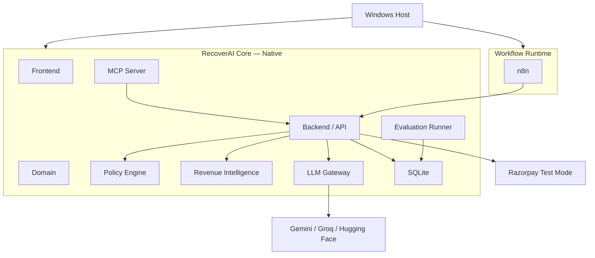
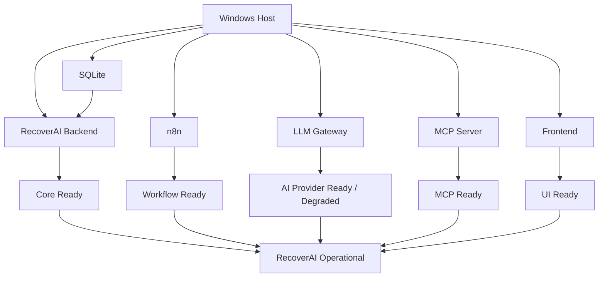
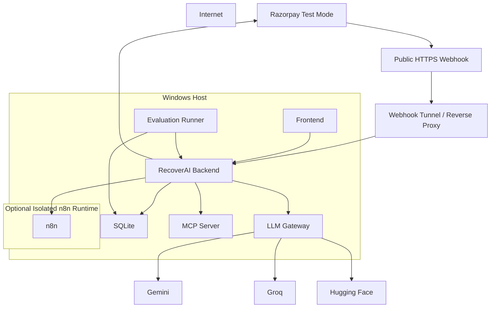

# `docs/18_DEPLOYMENT.md`

````markdown id="4x6q1p"
# RecoverAI — Deployment

**Project:** RecoverAI  
**Track:** Razorpay AI Buildathon — Track 03: AI Revenue Recovery  
**Document:** Local, Demo & Reproducible Deployment Architecture  
**Status:** Architecture Foundation — Proposed for Freeze  
**Version:** 1.0  
**Last Updated:** 2026-08-26

---

# 1. Purpose

This document defines how the complete RecoverAI MVP is deployed and operated.

The deployment must satisfy four requirements:

```text
1. Easy for the team to develop.
2. Reproducible for the final demo.
3. Isolated enough to prevent one component from bypassing another.
4. Simple enough that a deployment problem does not destroy the demonstration.
````

The deployment is intentionally not designed as a production-scale distributed platform.

The Buildathon evaluates:

* engineering quality,
* architecture,
* AI judgment,
* reliability,
* and demonstrated business value.

Therefore the deployment objective is:

> **A small, deterministic, inspectable system with strong boundaries and reliable recovery behavior.**

---

# 2. Deployment Philosophy

RecoverAI should have one canonical development/demo topology.

```text
Windows Host
│
├── RecoverAI Backend
├── Database
├── MCP Server
├── LLM Gateway
├── Frontend
├── Evaluation Runner
│
└── n8n
     └── isolated workflow runtime
```

The core application should not depend on a container orchestration platform.

n8n may be deployed separately because it is an infrastructure/workflow dependency rather than the source of business truth.

n8n officially supports self-hosting through multiple approaches, including npm and Docker. ([n8n Docs](https://docs.n8n.io/?utm_source=chatgpt.com))

---

# 3. Recommended MVP Deployment

The recommended Buildathon deployment is:

```text
Windows 11
    |
    +-- Python application services
    |
    +-- SQLite
    |
    +-- MCP server
    |
    +-- LLM Gateway
    |
    +-- Frontend development/production server
    |
    +-- n8n self-hosted
```

The exact process manager/runtime is an implementation choice.

The architecture does not require Kubernetes, cloud orchestration, or multiple application servers.

---

# 4. Why We Are Not Deploying the Entire System in Docker

The project does not need Docker for the core runtime.

Using containers for every component would introduce:

* additional networking layers,
* additional configuration,
* additional startup dependencies,
* additional failure surfaces,
* and more work during a time-constrained Buildathon.

The core RecoverAI system is therefore designed to operate natively on Windows.

Docker may still be used selectively for n8n if it provides a more reproducible isolated workflow runtime.

This distinction is deliberate:

```text
Core architecture
    !=
Container architecture
```

---

# 5. n8n Deployment Position

n8n is the exception.

The preferred deployment may be:

```text
Windows Host
   |
   +---- native RecoverAI
   |
   +---- Docker Desktop
            |
            +---- n8n
```

This keeps n8n's dependencies isolated without making Docker a dependency of:

* the domain,
* backend,
* Razorpay adapter,
* Policy Engine,
* ML,
* LLM Gateway,
* MCP,
* evaluation harness.

n8n officially supports Docker/self-hosting and documents Docker as one of its supported installation methods. ([n8n Docs](https://docs.n8n.io/?utm_source=chatgpt.com))

---

# 6. Important Deployment Boundary

The architecture is:



The important point:

> n8n communicates with RecoverAI APIs; it does not become the application.

---

# 7. Component Inventory

The final repository should contain the following logical components:

```text
recoverai/
│
├── backend/
├── frontend/
├── domain/
├── application/
├── integrations/
├── ai/
├── mcp/
├── evaluation/
├── workflows/
│   └── n8n/
├── tests/
├── docs/
├── scripts/
└── deployment/
```

The exact package structure may differ after implementation, but the dependency boundaries must remain recognizable.

---

# 8. Backend

The backend is responsible for:

* API endpoints,
* authentication/authorization,
* application services,
* RecoveryCase operations,
* policy invocation,
* workflow coordination,
* verification,
* audit access,
* dashboard data.

It does not directly embed:

* UI logic,
* n8n business logic,
* provider-specific LLM reasoning,
* raw Razorpay HTTP throughout the application.

---

# 9. Domain Layer

The domain layer contains:

```text id="5w7vsy"
RecoveryCase
RecoveryAction
RevenueEvent
PolicyDecision
VerificationRecord
Money
CustomerContext
MerchantContext
```

It should have no dependency on:

```text id="6xk42x"
FastAPI/Flask/etc.
React
Razorpay SDK
Gemini SDK
Groq SDK
Hugging Face SDK
n8n
MCP transport
SQLite implementation
```

This keeps the financial logic testable.

---

# 10. Application Layer

The application layer coordinates:

```text
id="l2cr1t"
domain
+
repositories
+
integrations
+
policy
+
AI
+
workflows
```

Example:

```text
Recover Payment Case
      |
      +--> load case
      +--> build context
      +--> assess
      +--> plan
      +--> policy
      +--> execute
      +--> verify
```

It is the primary orchestration layer inside RecoverAI itself.

---

# 11. Database

The MVP should use SQLite unless implementation evidence demonstrates a real need for another database.

Reasons:

* simple local deployment,
* no separate DB server,
* reproducible environment,
* easy backup,
* low operational burden,
* sufficient for Buildathon scale.

SQLite is not being presented as a production-scale substitute for a distributed merchant database.

It is the MVP persistence layer.

---

# 12. SQLite Storage

Conceptually:

```text
data/
    recoverai.db
```

The database must contain at minimum:

```text
merchants
customers
revenue_events
recovery_cases
recovery_actions
policy_decisions
verification_records
audit_events
workflow_runs
webhook_events
evaluation_runs
```

The final relational schema belongs in the implementation package.

---

# 13. SQLite Concurrency

SQLite is appropriate for the MVP, but concurrency must be considered explicitly.

The implementation must:

* use transactions,
* use appropriate locking behavior,
* avoid holding write transactions unnecessarily,
* handle concurrent action creation,
* enforce uniqueness where required.

Critical uniqueness constraints may include:

```text
source_event_id + source
case/action identity
external object correlation
```

This is necessary to protect against duplicate actions.

---

# 14. SQLite Backup

The demo environment should provide a simple backup command.

Example conceptual operation:

```text
scripts/
    backup-db
```

The backup must be performed while respecting SQLite consistency.

The exact mechanism belongs in the implementation package.

---

# 15. Application Configuration

Configuration should be divided into:

### Environment configuration

Secrets, URLs, ports.

### Application configuration

Policies, thresholds, feature switches.

### Model configuration

Provider/model profiles.

### Workflow configuration

n8n endpoint and workflow IDs.

These categories should not be mixed into one giant configuration object.

---

# 16. Environment Variables

Example:

```text
APP_ENV=development

APP_HOST=127.0.0.1
APP_PORT=<configured>

DATABASE_URL=<configured>

RAZORPAY_MODE=test
RAZORPAY_KEY_ID=<secret>
RAZORPAY_KEY_SECRET=<secret>
RAZORPAY_WEBHOOK_SECRET=<secret>

GEMINI_API_KEY=<secret>
GROQ_API_KEY=<secret>
HF_TOKEN=<secret>

N8N_BASE_URL=<configured>
N8N_API_TOKEN=<secret>

MCP_HOST=<configured>
MCP_PORT=<configured>
```

The exact variable names should be finalized in implementation.

No real secret belongs in `.env.example`.

---

# 17. Test Mode Enforcement

The MVP must explicitly run Razorpay in Test Mode.

Razorpay documents separate Test and Live API keys and states that Test Mode is a simulation environment with no real payments. ([https://razorpay.com/docs/api/authentication/](https://razorpay.com/docs/api/authentication/))

RecoverAI should have a startup assertion conceptually equivalent to:

```text
if RAZORPAY_MODE != "test":
    fail startup
```

for the Buildathon deployment.

The application should not silently switch to Live credentials.

---

# 18. Razorpay Endpoint

Razorpay's current API documentation states that most APIs use:

```text
https://api.razorpay.com/v1
```

while some resources use V2. ([https://razorpay.com/docs/api/](https://razorpay.com/docs/api/))

The endpoint belongs in integration configuration.

No domain code should embed the Razorpay hostname.

---

# 19. LLM Provider Configuration

The LLM Gateway should use profiles rather than scattering model IDs.

Example:

```yaml
profiles:
  reasoning:
    provider: gemini
    model: <configured>

  fast_structured:
    provider: groq
    model: <configured>

  fallback:
    provider: huggingface
    model: <configured>
```

The exact models must be selected immediately before implementation based on current availability.

Model availability can change, so model IDs are not architecture-level constants.

---

# 20. LLM Credential Validation

At startup, the Gateway may verify that required credentials are present.

It should not necessarily make external inference requests during startup just to test the keys.

Better:

```text
startup
    |
    v
credential presence check
    |
    v
service ready
```

Then:

```text
first actual inference
    |
    v
provider request
```

This avoids consuming unnecessary provider quota during every restart.

---

# 21. LLM Provider Health

Provider health should be lazy and runtime-driven.

Example:

```text
GEMINI = UNKNOWN
```

until a request succeeds/fails.

Then:

```text
GEMINI = HEALTHY
```

or:

```text
GEMINI = RATE_LIMITED
```

The system should not mark a provider unavailable forever because it was down at startup.

---

# 22. Frontend Deployment

The frontend should communicate only with the RecoverAI backend.

Architecture:

```text
Browser
   |
   v
Frontend
   |
   v
RecoverAI API
```

The browser must not directly call:

```text
Razorpay
Gemini
Groq
Hugging Face
n8n admin API
database
```

This keeps credentials and financial authority server-side.

---

# 23. Frontend Configuration

The frontend may receive:

```text
API base URL
public UI configuration
feature flags that are safe to expose
```

It must never receive:

```text
RAZORPAY_KEY_SECRET
RAZORPAY_WEBHOOK_SECRET
GEMINI_API_KEY
GROQ_API_KEY
HF_TOKEN
N8N credentials
database credentials
```

---

# 24. Backend Port

Use a single well-defined local API port.

Example:

```text
127.0.0.1:<BACKEND_PORT>
```

The exact port is configuration.

The backend should bind only as broadly as necessary.

Development can use localhost.

Public webhook exposure should be handled explicitly through the chosen tunnel/reverse-proxy mechanism.

---

# 25. Frontend Port

The frontend can run on:

```text
127.0.0.1:<FRONTEND_PORT>
```

The final deployment should document the frontend/backend relationship clearly so a developer can launch the system without guessing.

---

# 26. MCP Deployment

MCP should run as a controlled local service.

Example:

```text
127.0.0.1:<MCP_PORT>
```

The agent/application communicates with MCP through the configured transport.

The MCP server should not be publicly exposed for the MVP.

The application remains the business authority.

---

# 27. MCP Startup Dependency

The MCP server should not be required for:

```text
database startup
webhook ingestion
basic policy evaluation
evaluation runner
```

If MCP is down:

```text
AI tool interaction unavailable
```

but the core financial data remains intact.

---

# 28. n8n Deployment

Recommended:

```text
Windows
   |
   v
Docker Desktop
   |
   v
n8n container
```

Alternative supported approach:

```text
Windows
   |
   v
npm
   |
   v
n8n
```

n8n officially documents self-hosting options including npm and Docker. ([https://docs.n8n.io/](https://docs.n8n.io/?utm_source=chatgpt.com))

The project should use whichever option produces the more reliable and reproducible Buildathon environment after implementation testing.

---

# 29. Why Docker Is Acceptable for n8n

Docker is being used here as:

```text
deployment isolation
```

not:

```text
business architecture
```

RecoverAI remains functional at the application/domain level without Docker.

Therefore:

```text
n8n container stopped
```

means:

```text
workflow orchestration unavailable
```

not:

```text
RecoverAI architecture unavailable
```

---

# 30. n8n Persistent Storage

n8n requires persistent state for:

* workflows,
* credentials,
* executions,
* configuration.

The exact database/storage configuration should be kept simple for the MVP.

A single self-hosted instance is sufficient.

Do not introduce:

* queue mode,
* multiple workers,
* external binary storage,
* clustered n8n

unless the actual workload demonstrates a need.

n8n documents these as scaling/deployment capabilities, but they are unnecessary for the initial Buildathon topology. ([https://docs.n8n.io/](https://docs.n8n.io/?utm_source=chatgpt.com))

---

# 31. n8n Workflow Source

Workflow definitions should be exportable/versioned.

Repository concept:

```text
workflows/
    n8n/
        payment-recovery.json
        payment-verification.json
        notification.json
        approval.json
        error-handler.json
```

The exported files must contain no credentials.

n8n's documented source-control/environment features are available on higher plans, so the MVP should not depend on that feature for basic workflow versioning. Manual/versioned workflow artifacts in Git are sufficient for the Buildathon unless the chosen n8n plan supports native source control and it materially improves the workflow. ([https://docs.n8n.io/source-control-environments/create-environments/](https://docs.n8n.io/source-control-environments/create-environments/))

---

# 32. n8n Security Check

Before final demo:

```text
n8n audit
```

should be executed.

n8n's security audit checks:

* credentials,
* database configuration,
* filesystem access,
* risky nodes,
* community/custom nodes,
* unprotected webhooks,
* missing security settings,
* outdated instance status. ([https://docs.n8n.io/hosting/securing/security-audit/](https://docs.n8n.io/hosting/securing/security-audit/))

---

# 33. n8n External Exposure

The n8n editor should remain private to the local/controlled environment.

If a webhook must be externally reachable:

```text
Internet
   |
   v
secure endpoint / tunnel
   |
   v
n8n webhook
```

The editor/admin interface should not be exposed through the same public route.

The application should not depend on public access to the n8n editor.

---

# 34. Razorpay Webhook Exposure

The RecoverAI Razorpay webhook endpoint does need external reachability for Test Mode integration unless another accepted mechanism is used.

Architecture:

```text
Razorpay
    |
    v
HTTPS public endpoint
    |
    v
RecoverAI webhook receiver
    |
    v
local application
```

The webhook endpoint must:

* use HTTPS,
* verify signature,
* deduplicate,
* durably accept,
* return 2xx quickly,
* process asynchronously.

Razorpay currently requires a 2xx webhook response within 5 seconds and retries failed deliveries. ([https://razorpay.com/docs/payments/dashboard/account-settings/webhooks/](https://razorpay.com/docs/payments/dashboard/account-settings/webhooks/))

---

# 35. Local Webhook Exposure

For local development, the system needs a secure tunnel/reverse proxy capable of forwarding HTTPS traffic to the local webhook endpoint.

The selected tool must be verified against current Razorpay webhook compatibility before final integration.

Razorpay currently documents restrictions around certain common tunneling providers and provides guidance for Test Mode webhook testing. ([https://razorpay.com/docs/webhooks/validate-test/](https://razorpay.com/docs/webhooks/validate-test/))

The implementation package must verify the exact tunnel choice before deployment.

---

# 36. Startup Dependency Graph

RecoverAI should follow:



Not all optional services need to be healthy before the backend can start.

---

# 37. Critical vs Optional Dependencies

## Critical

```text
database
application backend
policy
domain
```

## Important but degradable

```text
LLM providers
n8n
MCP
```

## Presentation

```text
frontend
```

The backend should remain able to operate in a reduced deterministic mode if AI providers are unavailable.

---

# 38. Backend Health Checks

The backend should expose:

```text
GET /health
```

and:

```text
GET /ready
```

Conceptually:

### `/health`

Answers:

> Is the process alive?

### `/ready`

Answers:

> Can the application safely serve its intended functionality?

---

# 39. Readiness Semantics

Example:

```json
{
  "status": "degraded",
  "database": "healthy",
  "policy_engine": "healthy",
  "razorpay_adapter": "configured",
  "llm_gateway": "degraded",
  "n8n": "healthy",
  "mcp": "healthy"
}
```

A degraded LLM provider should not necessarily mark the entire core application as unavailable.

---

# 40. Dependency Health

The health system should distinguish:

```text
HEALTHY
DEGRADED
UNAVAILABLE
NOT_CONFIGURED
```

Example:

```text
Gemini = RATE_LIMITED
Groq = HEALTHY
HF = UNKNOWN
```

The LLM Gateway can still operate.

---

# 41. n8n Health

The backend should be able to determine whether n8n is reachable.

However:

```text
n8n unhealthy
```

should not make:

```text
policy unavailable
```

or:

```text
database unavailable
```

unless the current operation actually requires n8n.

---

# 42. Razorpay Health

The application should distinguish:

```text
Razorpay API reachable
```

from:

```text
merchant payment method healthy
```

These are different concepts.

A successful API request to Razorpay does not prove:

```text
UPI healthy
```

or:

```text
card processing healthy
```

The degradation system uses the appropriate payment-downtime signals and event data.

---

# 43. Startup Sequence

Recommended:

```text
1. Load configuration.
2. Validate environment.
3. Validate required secrets are present.
4. Open database.
5. Run schema migration/check.
6. Initialize repositories.
7. Initialize domain/application services.
8. Initialize Razorpay adapter.
9. Initialize LLM Gateway.
10. Initialize MCP.
11. Initialize workflow integration.
12. Start API.
13. Start frontend.
14. Verify health.
15. Register/validate webhook configuration.
```

The exact order may be simplified if components are lazily initialized.

---

# 44. Startup Failures

If a required dependency fails:

```text
database unavailable
```

the application should fail startup.

If an optional/degradable dependency fails:

```text
Gemini unavailable
```

the application may start in:

```text
DEGRADED
```

mode.

---

# 45. Database Migration

Schema migration must happen before normal request handling.

The application should refuse normal operation if the schema version is incompatible.

Example:

```text
DB schema v4
Application expects v5
    |
    v
migration required
```

Migration scripts must be versioned.

---

# 46. Configuration Validation

On startup validate:

```text id="0odkfk"
required environment variables
valid URLs
valid ports
valid mode
valid provider configuration
valid policy configuration
```

Fail early on invalid security-critical configuration.

Example:

```text
RAZORPAY_MODE=live
```

in Buildathon mode should produce:

```text
STARTUP ERROR
```

rather than silently switching behavior.

---

# 47. Environment Profiles

The deployment should support:

```text id="c4y3og"
development
integration
demo
evaluation
```

Example:

```yaml
profile: demo

razorpay:
  mode: test

evaluation:
  enabled: false

debug:
  enabled: false
```

The actual configuration mechanism will be implemented later.

---

# 48. Development Profile

Development should prioritize:

* fast startup,
* mocked external services where possible,
* local database,
* provider test keys,
* optional n8n,
* extensive logs.

It should not require real external webhooks for ordinary unit work.

---

# 49. Integration Profile

Integration uses:

* local database,
* real Test Mode Razorpay,
* real provider keys,
* actual MCP,
* actual n8n,
* test webhook exposure.

This is where cross-component correctness is proven.

---

# 50. Demo Profile

The demo profile should minimize unnecessary moving parts.

Recommended:

```text
Razorpay Test Mode = enabled
LLM Gateway = enabled
n8n = enabled
MCP = enabled
Audit = enabled
Evaluation dashboard = enabled
Debug logging = reduced
```

The final demo should be started from one documented command/script where practical.

---

# 51. Evaluation Profile

The evaluation runner should not depend on:

```text
Razorpay
n8n
public webhook
```

unless a specific integration benchmark requires them.

It should use:

```text
synthetic simulator
local database
evaluation harness
configured AI Gateway/test double
```

This makes large-batch tests reproducible and inexpensive.

---

# 52. Process Management

The team should have a documented process launch method.

Examples:

```text
scripts/
    start-backend
    start-frontend
    start-mcp
    start-n8n
    start-all
    stop-all
    health-check
```

The exact shell format should support Windows.

PowerShell is a natural option for the Windows deployment.

---

# 53. Recommended Windows Launcher

The final repository can contain:

```text
scripts/
    start-recoverai.ps1
    stop-recoverai.ps1
    health-recoverai.ps1
```

The startup script should:

1. load environment,
2. verify prerequisites,
3. start database-dependent application,
4. start n8n,
5. start MCP,
6. start frontend,
7. check health,
8. print useful URLs.

---

# 54. Prerequisites

The final deployment document generated during implementation must list exact versions for:

```text
Windows
Python
Node.js
npm
Docker Desktop
n8n
database/runtime
```

Version numbers should be frozen only after implementation validation.

This document deliberately avoids inventing current package versions.

---

# 55. Docker Desktop

If n8n is deployed through Docker:

```text
Docker Desktop
```

becomes an infrastructure prerequisite for the **workflow runtime**, not the application architecture.

If Docker becomes unstable on the demo machine, the documented fallback should be the supported npm-based n8n installation path if that proves reliable.

n8n officially documents both npm and Docker installation approaches. ([https://docs.n8n.io/](https://docs.n8n.io/?utm_source=chatgpt.com))

---

# 56. n8n Container Boundary

If Docker is used:

```text
Windows
   |
   v
Docker Desktop
   |
   v
n8n container
```

Use a persistent volume for n8n state.

Do not mount the entire project filesystem into n8n.

Only expose the directories/configuration required by the workflows.

---

# 57. n8n Docker Security

Avoid:

```text
privileged container
host network unnecessarily
entire C: drive mounted
Docker socket mounted
```

These would greatly expand the workflow runtime's ability to affect the host.

The n8n container should have only the permissions it needs.

---

# 58. n8n Ports

The n8n instance should bind to a local/private port.

Example:

```text
localhost:<N8N_PORT>
```

If an external webhook is required:

```text
public HTTPS tunnel
      |
      v
n8n webhook
```

or:

```text
public HTTPS tunnel
      |
      v
RecoverAI webhook
```

depending on the endpoint.

For the primary Razorpay webhook architecture, the preferred destination remains the RecoverAI webhook processor.

---

# 59. Inter-Service Communication

Local services should communicate using:

```text
localhost / loopback
```

where practical.

Example:

```text
Frontend
 -> localhost:backend

MCP
 -> localhost:backend

n8n
 -> localhost/host gateway:backend
```

The exact n8n-to-host networking mechanism depends on whether n8n is containerized.

---

# 60. Container-to-Host Networking

If n8n runs in Docker on Windows and must call the Windows-hosted RecoverAI backend, the implementation must use a deliberate container-to-host networking mechanism rather than assuming `localhost` means the Windows host.

This is a deployment-specific detail that must be tested.

The workflow must be tested from inside the n8n container before the final demo.

---

# 61. External Provider Connectivity

The LLM Gateway needs outbound Internet access to:

```text
Gemini
Groq
Hugging Face
```

The Razorpay Adapter needs outbound Internet access to:

```text
Razorpay
```

No other unrestricted external connectivity is required.

---

# 62. Internet Dependency Model

Core application functions:

```text
case state
policy
audit
synthetic evaluation
database
```

should operate locally.

External Internet dependencies:

```text
Razorpay
LLM providers
webhook delivery
```

must be explicit.

This allows the system to degrade gracefully when the Internet or an AI provider is unavailable.

---

# 63. Local-Only Deterministic Mode

RecoverAI should support:

```text
DEGRADED_DETERMINISTIC_MODE
```

where:

* database works,
* policy works,
* evaluation works,
* state inspection works,

but LLM providers are unavailable.

This mode is useful for:

* development,
* debugging,
* provider outage,
* final failure demonstration.

---

# 64. Disaster Restart

The final deployment should support:

```text
stop all
start all
health check
```

without manual reconstruction.

After restart:

```text
RecoveryCase state persists
Audit persists
Workflow correlation persists
```

Non-terminal operations are reconciled.

---

# 65. Startup Reconciliation

The application must scan:

```text
EXECUTING
EXECUTION_UNKNOWN
VERIFYING
WAITING_APPROVAL
PENDING_WORKFLOW
```

after restart.

It then evaluates each state according to its recovery strategy.

This is required by `15_FAILURE_RECOVERY.md`.

---

# 66. n8n Restart

n8n workflow state must persist according to its configured storage.

After restart:

```text
n8n
   |
   v
resume available workflows
```

But every recovered workflow must still call RecoverAI to verify current business state before any high-risk step.

---

# 67. MCP Restart

MCP may restart without losing authoritative business state.

The server should reinitialize from:

```text
application
database
tool registry
configuration
```

not from in-memory recovery state.

The MCP protocol session must not become the state store.

---

# 68. LLM Provider Failure on Restart

If:

```text
Gemini unavailable at startup
```

the application should remain available if the LLM capability is not mandatory for current operations.

The Gateway enters:

```text
DEGRADED
```

and uses fallback when required.

---

# 69. Observability Startup

The following should be visible after startup:

```text
Backend: HEALTHY
Database: HEALTHY
Policy: HEALTHY
Razorpay Adapter: CONFIGURED
LLM Gateway: HEALTHY/DEGRADED
MCP: HEALTHY
n8n: HEALTHY/UNAVAILABLE
Frontend: HEALTHY
```

The final demo should not require the operator to inspect terminal windows to know whether the system is ready.

---

# 70. Health Check Command

Provide a script conceptually:

```text
scripts/health-recoverai.ps1
```

It should report:

```text
API
Database
Razorpay connectivity/configuration
LLM provider status
MCP
n8n
Webhook endpoint status
```

Where an external health check is not safe/necessary, report configuration status instead.

---

# 71. Final Demo Startup Procedure

Recommended:

```text
1. Start Windows machine.
2. Start Docker Desktop if n8n uses Docker.
3. Launch RecoverAI start script.
4. Wait for health checks.
5. Open merchant console.
6. Verify Test Mode credentials.
7. Verify webhook endpoint.
8. Verify n8n workflow availability.
9. Run one synthetic benchmark smoke test.
10. Begin live demonstration.
```

This should be fully documented in the repository.

---

# 72. Demo Preflight

Before the final presentation:

```text
[ ] Razorpay Dashboard = Test Mode
[ ] Test API keys loaded
[ ] Webhook configured
[ ] Webhook secret loaded
[ ] LLM providers available
[ ] Fallback provider available
[ ] n8n running
[ ] MCP running
[ ] Database healthy
[ ] Backend healthy
[ ] Frontend healthy
[ ] Case timeline working
[ ] Audit working
[ ] Evaluation report available
[ ] Backup taken
```

---

# 73. Test Mode Verification

Razorpay's current quickstart confirms that Test Mode uses simulated transactions and separate test credentials, with API keys generated independently from Live Mode. ([https://razorpay.com/docs/payments/quickstart/](https://razorpay.com/docs/payments/quickstart/))

The demo operator must visibly confirm:

```text
Razorpay Dashboard
=
Test Mode
```

before performing any transaction simulation.

---

# 74. API Key Safety During Demo

The demo should never show:

```text
KEY_SECRET
WEBHOOK_SECRET
GEMINI_API_KEY
GROQ_API_KEY
HF_TOKEN
```

on screen.

Only:

```text
Key ID / redacted identity
provider status
```

may be visible.

---

# 75. Webhook Preflight

Because Razorpay retries failed webhook delivery, the webhook endpoint must be validated before the final demo.

Test:

```text
Webhook -> RecoverAI
signature valid
HTTP 2xx
event persisted
case updated
```

The exact webhook response timing should remain below Razorpay's documented 5-second requirement. ([https://razorpay.com/docs/payments/dashboard/account-settings/webhooks/](https://razorpay.com/docs/payments/dashboard/account-settings/webhooks/))

---

# 76. Final Demo Data

The demo should have preconstructed cases:

```text
DEMO-01
Recoverable payment failure

DEMO-02
Natural recovery

DEMO-03
Systemic degradation

DEMO-04
High-value approval

DEMO-05
External timeout / unknown
```

These should be seeded deterministically.

This prevents the live demonstration from depending entirely on random generation.

---

# 77. Live vs Evaluation Infrastructure

The final demo should have two separate views:

### Live Test Mode

```text
Razorpay Test Mode
real webhooks
actual Payment Link
real provider calls
```

### Synthetic Evaluation

```text
batch simulator
hidden ground truth
baselines
metrics
```

Do not accidentally send synthetic evaluation data into live Razorpay.

---

# 78. Backup Before Demo

Before the final presentation:

```text
database backup
workflow export
configuration backup
evaluation results
audit snapshot
```

should be copied to a safe project directory.

No secrets should be included in the backup.

---

# 79. Rollback

If a new build breaks the demo:

```text
previous known-good Git commit
+
previous database-compatible version
+
known-good n8n workflows
```

must be recoverable.

The final deployment process should therefore always maintain:

```text
KNOWN_GOOD_BUILD
```

before a significant architecture/package update.

---

# 80. Versioned Demo Build

The final Buildathon submission should record:

```text
Git commit
backend version
frontend version
database schema version
policy version
model version
prompt versions
workflow versions
evaluation version
```

This creates a reproducible demo snapshot.

---

# 81. Deployment Artifacts

The repository should eventually contain:

```text
deployment/
    README.md
    .env.example
    config/
    scripts/
    n8n/
```

Potential files:

```text
deployment/
    README.md
    scripts/
        start-all.ps1
        stop-all.ps1
        health-check.ps1
        backup.ps1
    n8n/
        README.md
        compose.yaml              # only if Docker is selected
```

The exact file names belong to implementation.

---

# 82. If Docker Is Selected for n8n

Use a minimal deployment definition.

Conceptually:

```yaml
services:
  n8n:
    image: n8nio/n8n:<PINNED_VERSION>
    ports:
      - "<HOST_PORT>:5678"
    volumes:
      - n8n_data:/home/node/.n8n
```

The final implementation must:

* pin a validated n8n version,
* persist workflow state,
* configure authentication,
* avoid privileged mode,
* avoid unnecessary host mounts,
* use a secure credential strategy.

Do not copy this exact configuration without implementation validation.

---

# 83. If npm Is Selected for n8n

The final deployment should pin:

```text
Node.js version
n8n version
```

and use a reproducible installation.

The official n8n documentation supports npm installation as a self-hosting option. ([https://docs.n8n.io/](https://docs.n8n.io/?utm_source=chatgpt.com))

The npm-based deployment should run as a separate process from RecoverAI.

---

# 84. Choosing Between Docker and npm for n8n

Decision criteria:

| Criterion              | Docker                  | npm                    |
| ---------------------- | ----------------------- | ---------------------- |
| Isolation              | Stronger                | Lower                  |
| Setup complexity       | Moderate                | Lower                  |
| Reproducibility        | Strong                  | Good with pinning      |
| Windows integration    | Requires Docker Desktop | Native                 |
| Host dependency        | Docker Desktop          | Node.js                |
| Workflow persistence   | Volume                  | filesystem/database    |
| Recovery after restart | Good                    | Good                   |
| Buildathon simplicity  | Good if already stable  | Good if already stable |

Final choice must be based on the actual machine/setup after testing.

The architecture does not depend on the choice.

---

# 85. Deployment Anti-Patterns

Do not:

```text
run everything through a giant Docker Compose stack
expose the database publicly
expose n8n editor publicly
put secrets in workflow JSON
put API keys in frontend
allow arbitrary HTTP tools
run financial policy inside n8n
skip startup health checks
skip database backup
switch to Razorpay Live Mode for the demo
```

These create complexity or security risk without adding meaningful Buildathon value.

---

# 86. Operational Logs

The final deployment should provide separate logs for:

```text
backend
frontend
n8n
MCP
LLM Gateway
Razorpay integration
evaluation
```

All logs should preserve:

```text
trace_id
case_id
action_id
```

where relevant.

---

# 87. Deployment Monitoring

During the final demo, the operator should monitor:

```text
backend
n8n
Razorpay webhook
LLM Gateway
database
```

A single consolidated health panel is preferred.

---

# 88. Resource Requirements

The project should be designed for a normal modern developer laptop/desktop rather than an enterprise machine.

The exact tested resource requirement must be measured during implementation.

Do not invent:

```text
minimum RAM = X GB
CPU = Y cores
```

before measurement.

The final deployment report should record the tested machine configuration.

---

# 89. Network Failure Mode

If Internet connectivity drops:

```text
Razorpay
    -> unavailable
LLM providers
    -> unavailable
```

the local system should remain capable of:

```text
view existing cases
view audit
run synthetic evaluation
evaluate policy
inspect state
```

New external financial operations obviously cannot complete while the external services are unreachable.

---

# 90. Offline Evaluation

The evaluation runner should work without Internet.

This is an important architectural benefit.

It enables:

* reproducible benchmarking,
* failure testing,
* regression testing,
* CI execution.

Provider calls can be replaced with:

```text
test provider
recorded responses
```

where appropriate.

---

# 91. Secure Demo Networking

The public Internet should expose as little as possible.

Ideally:

```text
Internet
    |
    +---- Razorpay webhook endpoint
```

while:

```text
n8n editor
database
MCP
LLM provider credentials
backend admin endpoints
```

remain private.

---

# 92. Localhost Binding

Where a component does not need public access:

```text
127.0.0.1
```

should be preferred over:

```text
0.0.0.0
```

This reduces unnecessary network exposure.

---

# 93. Service Exposure Matrix

| Component         | Local Only | Internet Exposed | Reason                    |
| ----------------- | ---------: | ---------------: | ------------------------- |
| Database          |        Yes |               No | Never public              |
| Backend API       |    Usually |       Controlled | UI/API                    |
| Frontend          |    Usually |         Optional | Demo UI                   |
| MCP               |        Yes |               No | Controlled agent boundary |
| LLM Gateway       |        Yes |               No | Backend service           |
| n8n Editor        |        Yes |               No | Admin surface             |
| n8n Webhook       | Controlled |         Optional | Only when required        |
| Razorpay Webhook  |         No |          **Yes** | External webhook delivery |
| Evaluation Runner |        Yes |               No | Batch testing             |

---

# 94. Deployment Security Principle

The smaller the externally reachable surface, the better.

The final architecture should expose only:

```text
frontend/demo
Razorpay webhook endpoint
```

and only if required.

Everything else remains internal/private.

---

# 95. Deployment Recovery

If one component crashes:

### Backend crashes

Restart backend.

### n8n crashes

Restart n8n; RecoverAI reconciles pending workflows.

### MCP crashes

Restart MCP; domain remains intact.

### LLM provider fails

Gateway fallback.

### Database fails

Stop mutation; restore/restart.

### Browser crashes

Reconnect to existing backend state.

This is graceful degradation at deployment level.

---

# 96. Final Deployment Architecture



---

# 97. Canonical Startup Topology

```text
Windows
|
+-- RecoverAI Backend
|    |
|    +-- Domain
|    +-- Application
|    +-- Policy
|    +-- Revenue Intelligence
|    +-- Audit
|    +-- Verification
|    +-- Razorpay Adapter
|    +-- LLM Gateway
|    |
|    +-- SQLite
|
+-- MCP Server
|
+-- Frontend
|
+-- n8n
|
+-- Evaluation Runner
```

---

# 98. Final Buildathon Deployment Command

The ideal end state is one command:

```text
scripts/start-all.ps1
```

which:

```text
1. validates configuration
2. starts required services
3. starts n8n
4. checks backend health
5. checks database
6. checks MCP
7. checks n8n
8. starts/validates frontend
9. prints dashboard URL
10. prints webhook URL/status
```

The exact implementation will depend on the final stack.

---

# 99. Final Buildathon Stop Command

Provide:

```text
scripts/stop-all.ps1
```

which safely stops:

* frontend,
* backend,
* MCP,
* n8n,

without deleting persistent state.

The database and n8n persistent data must remain available for restart.

---

# 100. Final Health Command

Provide:

```text
scripts/health-check.ps1
```

Output example:

```text
RecoverAI Health
----------------
Backend       HEALTHY
Database      HEALTHY
Policy        HEALTHY
Razorpay      CONFIGURED / TEST
LLM Gateway   HEALTHY
Gemini        HEALTHY
Groq          HEALTHY
HF            AVAILABLE
MCP           HEALTHY
n8n           HEALTHY
Webhook       READY
Frontend      HEALTHY
```

These statuses must come from real runtime checks.

---

# 101. Deployment Definition of Done

Deployment is complete only when:

1. The entire MVP starts from a documented Windows procedure.
2. Backend starts reliably.
3. Database persists across restarts.
4. MCP starts reliably.
5. LLM Gateway starts and handles unavailable providers.
6. n8n starts reliably.
7. Frontend connects to backend.
8. Razorpay Test Mode works.
9. Webhook endpoint works over HTTPS.
10. Webhook signatures are verified.
11. n8n workflows can invoke RecoverAI safely.
12. Restart reconciliation works.
13. Health endpoints exist.
14. One-command startup is available.
15. One-command shutdown is available.
16. Database backup is available.
17. Known-good build can be restored.
18. No production credentials are needed.
19. Security preflight passes.
20. Final demo can be reproduced on the target machine.

---

# 102. Deployment Freeze

The following decisions are frozen:

1. RecoverAI core is deployed natively on Windows for the MVP.
2. SQLite is the primary MVP database.
3. n8n remains a separate workflow runtime.
4. Docker may be used selectively for n8n isolation.
5. Docker is not a core dependency of RecoverAI's financial/domain runtime.
6. No Kubernetes or multi-node infrastructure is required.
7. Razorpay integration remains Test Mode.
8. Public exposure is minimized.
9. Razorpay webhook endpoint is externally reachable through HTTPS.
10. Database remains private.
11. MCP remains private/local for the MVP.
12. LLM Gateway remains backend-side.
13. API keys remain server-side.
14. Application health is reported separately from optional provider health.
15. Startup reconciliation is mandatory.
16. Demo deployment must be reproducible from a versioned known-good build.
17. Synthetic evaluation remains independent of live Razorpay infrastructure.
18. Docker/npm choice for n8n remains deployment-level and may be selected based on validated reliability.
19. The final deployment must not require Razorpay Live Mode.
20. No infrastructure component is allowed to become a hidden financial authorization layer.

---

# 103. Next Document

The next specification is:

```text
19_REPOSITORY_AND_CI.md
```

It will define the engineering repository itself:

* exact package boundaries,
* directory structure,
* dependency direction,
* Git strategy,
* branch strategy,
* commit conventions,
* documentation structure,
* CI pipelines,
* pre-commit checks,
* secret scanning,
* test gates,
* artifact retention,
* release tagging,
* package-level completion reports,
* and the workflow Gemini 3.1 Pro (High) should follow inside Antigravity.

```

# 104. External References

## Razorpay

### API Authentication
https://razorpay.com/docs/api/authentication/

Razorpay currently documents Basic Auth using Test/Live `KEY_ID` and `KEY_SECRET`, with separate keys for Test and Live modes. :contentReference[oaicite:0]{index=0}

### API Reference
https://razorpay.com/docs/api/

Razorpay currently documents `https://api.razorpay.com/v1` as the gateway for most APIs, with some V2 endpoints. :contentReference[oaicite:1]{index=1}

### Sandbox Setup
https://razorpay.com/docs/api/sandbox-setup/

Razorpay documents Test/Sandbox usage with test API keys and states that the sandbox uses the same base API URL as production. :contentReference[oaicite:2]{index=2}

### Quickstart / Test Mode
https://razorpay.com/docs/payments/quickstart/

Razorpay documents Test Mode as a simulation environment with no real-money movement and separate Test API keys. :contentReference[oaicite:3]{index=3}

### API Key Management
https://razorpay.com/docs/payments/dashboard/account-settings/api-keys/

Razorpay documents separate Test/Live keys, test-key generation without website details, and key regeneration/rotation behavior. :contentReference[oaicite:4]{index=4}

### Webhook Configuration
https://razorpay.com/docs/payments/dashboard/account-settings/webhooks/

Razorpay currently requires webhook endpoints to respond with 2xx within 5 seconds. This is a hard integration constraint for the deployment. :contentReference[oaicite:5]{index=5}

---

## n8n

### n8n Documentation
https://docs.n8n.io/

n8n documents Cloud, npm self-hosting, and Docker as supported deployment approaches. :contentReference[oaicite:6]{index=6}

### Security Audit
https://docs.n8n.io/hosting/securing/security-audit/

n8n's current audit checks credentials, database, filesystem, risky/community/custom nodes, unprotected webhooks, missing settings, and outdated-instance status. :contentReference[oaicite:7]{index=7}

### Source Control / Environments
https://docs.n8n.io/source-control-environments/create-environments/

Native source-control environments are documented for Business/Enterprise plans. For the MVP, versioned workflow exports in Git remain sufficient unless the selected n8n plan supports native source control and it proves useful. :contentReference[oaicite:8]{index=8}

---

# 105. Verification Status

## VERIFIED

- Razorpay Test Mode and separate Test credentials.
- Razorpay current API gateway behavior.
- Razorpay Test/Sandbox setup.
- Razorpay webhook response timing requirement.
- n8n supported self-hosting approaches.
- n8n security-audit capabilities.
- n8n source-control feature availability constraints.

## PROPOSED

- Exact Windows/Python/Node.js versions.
- Exact n8n version.
- Exact n8n deployment choice (Docker vs npm).
- Exact local ports.
- Exact PowerShell scripts.
- Exact tunnel/reverse-proxy provider.
- Exact SQLite schema.
- Exact process manager.
- Exact backup implementation.
- Exact readiness checks.
- Exact environment-variable names.

## NOT YET IMPLEMENTED

All deployment scripts, startup orchestration, health checks, backup/restore tooling, and final n8n deployment.

## IMPORTANT

The deployment implementation must re-verify all external version/install assumptions immediately before implementation. The architecture intentionally keeps Docker optional and isolated to n8n so that the core RecoverAI system remains deployable without container infrastructure.
```
