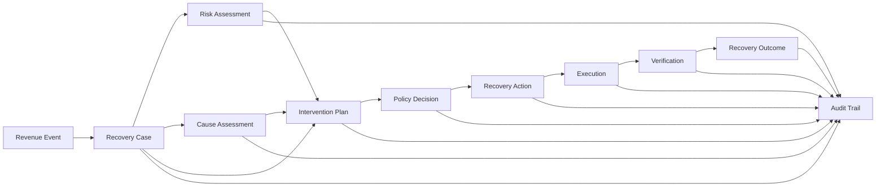
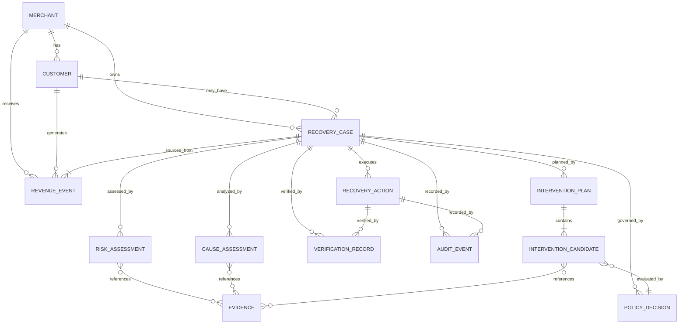

# RecoverAI — Domain Model

**Project:** RecoverAI
**Track:** Razorpay AI Buildathon — Track 03: AI Revenue Recovery
**Document:** Domain Model
**Status:** Architecture Foundation — Proposed for Freeze
**Version:** 1.0
**Last Updated:** 2026-08-26

---

# 1. Purpose

This document defines the business/domain model of RecoverAI.

It translates the system architecture into explicit domain entities, value objects, relationships, invariants, ownership boundaries, and state-independent business concepts.

The purpose is to ensure that implementation does not become a collection of API handlers and AI prompts without a coherent financial-recovery domain.

The central domain abstraction is:

> **A Recovery Case represents a revenue opportunity that has entered a recoverable-risk state and is being evaluated for an appropriate intervention.**

The domain model must remain independent of:

* Gemini,
* Groq,
* Hugging Face,
* n8n,
* MCP,
* FastAPI,
* React,
* and Razorpay-specific HTTP implementation details.

Razorpay-specific structures are translated into the RecoverAI domain at the integration boundary.

---

# 2. Domain Principles

RecoverAI follows these domain principles.

## 2.1 Money is integer-based

Monetary amounts are represented in the smallest supported currency unit.

For INR:

```text
₹499.00
=
49900 paise
```

The domain must not use binary floating-point values for monetary arithmetic.

A `Money` value consists of:

```text
amount_minor_units
currency
```

Example:

```text
amount = 49900
currency = INR
```

Arithmetic must preserve currency compatibility.

---

## 2.2 Revenue risk is not recovery success

The domain distinguishes:

```text
Amount at risk
```

from:

```text
Probability of recovery
```

and from:

```text
Actual recovered amount
```

These are separate concepts.

Example:

```text
Amount at Risk          ₹50,000
Recovery Probability       0.72
Expected Recovery       ₹36,000
Actual Recovered Amount ₹50,000
```

The final amount recovered is determined from verified external state, not from a model prediction.

---

## 2.3 Prediction is not fact

The domain must distinguish:

### Observed fact

Directly obtained from an authoritative event or API.

### Derived signal

Calculated from observed data.

### Prediction

Produced by an ML model.

### Hypothesis

A possible explanation derived from available evidence.

### Decision

The selected system action.

### Outcome

The verified result.

These concepts must never be represented as one generic "reason" field.

---

# 3. Domain Context

The RecoverAI domain can be represented as:



---

# 4. Aggregate Boundaries

RecoverAI uses several logical aggregates.

## Primary aggregate

### `RecoveryCase`

Owns the lifecycle of a revenue-recovery opportunity.

---

## Supporting aggregates

### `RevenueEvent`

Represents an observed external or synthetic revenue-related event.

### `RiskAssessment`

Represents a model/statistical assessment attached to a case.

### `CauseAssessment`

Represents the system's explanation or hypothesis for the revenue-loss event.

### `InterventionPlan`

Represents the candidate and selected recovery actions.

### `RecoveryAction`

Represents an attempt to perform a specific intervention.

### `VerificationRecord`

Represents verification of an external business outcome.

### `AuditEvent`

Represents an immutable-style historical observation of a decision or state transition.

---

# 5. Entity: Merchant

`Merchant` identifies the business whose revenue is being protected/recovered.

## Fields

```text
merchant_id
external_reference
display_name
default_currency
status
created_at
updated_at
```

### Invariants

* `merchant_id` is unique.
* A merchant must have a valid default currency.
* A disabled merchant must not initiate new autonomous recovery actions.
* Historical Recovery Cases remain readable after merchant deactivation.

---

# 6. Entity: Customer

`Customer` represents the customer associated with a revenue opportunity.

The RecoverAI customer model is intentionally minimal.

## Fields

```text
customer_id
merchant_id
external_reference
display_name
contact_reference
created_at
updated_at
```

`contact_reference` may point to merchant-controlled contact information without requiring the domain to persist unnecessary sensitive fields.

### Invariants

* `customer_id` is unique within the merchant boundary.
* A customer cannot belong simultaneously to two merchants under the same internal identity.
* Customer history must be tenant-isolated.

RecoverAI does not assume that the customer record contains all information necessary for a recovery decision.

---

# 7. Value Object: Money

`Money` represents a monetary quantity.

```text
Money {
    amount_minor: integer
    currency: CurrencyCode
}
```

### Required properties

* no floating-point storage,
* no implicit currency conversion,
* no arithmetic between different currencies without an explicit conversion operation,
* non-negative values for revenue-at-risk contexts.

Examples:

```text
Money(5000, INR)
Money(125000, INR)
```

---

# 8. Value Object: RevenueAmount

`RevenueAmount` is a semantic wrapper around `Money` for amounts associated with revenue opportunity.

It may represent:

* amount at risk,
* amount expected to be recovered,
* amount actually recovered.

It must not be used to infer accounting semantics that are not supported by the underlying data.

---

# 9. Value Object: Probability

Probability represents a value between 0 and 1.

```text
Probability {
    value: decimal
}
```

### Invariant

```text
0.0 <= value <= 1.0
```

Examples:

```text
0.87
0.42
0.05
```

A probability must always identify its meaning.

Examples:

```text
recovery_probability
degradation_probability
cause_confidence
```

A generic field such as `confidence` is insufficient when semantic interpretation matters.

---

# 10. Value Object: EvidenceReference

`EvidenceReference` identifies an observation used by a prediction or decision.

```text
EvidenceReference {
    evidence_id
    source_type
    source_id
    field
    observed_at
}
```

Possible `source_type` values include:

```text
RAZORPAY_EVENT
RAZORPAY_PAYMENT
RAZORPAY_ORDER
PAYMENT_LINK
MERCHANT_EVENT
CUSTOMER_HISTORY
MODEL_SIGNAL
SIMULATION_EVENT
```

The exact enum will be finalized in `04_EVENT_MODEL.md`.

The important rule is:

> A model-generated explanation must be able to identify the underlying evidence it used.

---

# 11. Entity: RevenueEvent

`RevenueEvent` is the normalized representation of an external or synthetic revenue-related event.

## Concept

```text
RevenueEvent
    |
    +-- source
    +-- event type
    +-- merchant
    +-- customer
    +-- financial context
    +-- timestamps
    +-- external identifiers
    +-- raw/canonical references
```

## Fields

```text
event_id
source
source_event_id
event_type

merchant_id
customer_id

amount
currency

occurred_at
received_at

external_reference
metadata

schema_version
```

### Possible event types

Initial domain vocabulary:

```text
PAYMENT_FAILED
PAYMENT_AUTHORIZED
PAYMENT_CAPTURED
PAYMENT_LINK_PAID
ORDER_PAID

CHECKOUT_STARTED
CHECKOUT_ABANDONED

SUBSCRIPTION_PAYMENT_FAILED

RECEIVABLE_OVERDUE

PAYMENT_DEGRADATION_SIGNAL
```

Not every event type must be supported by the first implementation.

The event model is deliberately broader than the MVP to preserve domain extensibility.

---

# 12. RevenueEvent Invariants

1. `event_id` is unique.
2. `source + source_event_id` must be deduplicatable where the external source provides a stable event identifier.
3. An event must have a valid `occurred_at`.
4. `received_at` must not precede `occurred_at` without explicitly representing clock/source discrepancies.
5. Monetary events must have currency.
6. Synthetic events must be marked as synthetic.
7. Razorpay webhook events must preserve the original external event identifier.
8. Raw external payloads must remain outside core domain logic.

---

# 13. Entity: RevenueSignal

A `RevenueSignal` represents a derived observation from one or more Revenue Events.

Examples:

```text
failure_rate_5m = 0.42
baseline_failure_rate = 0.08
failure_rate_delta = +0.34
```

or:

```text
payment_method_failure_cluster = UPI
```

or:

```text
customer_previous_successes = 8
```

## Fields

```text
signal_id
signal_type
value
unit
source_event_ids
computed_at
algorithm_version
```

Revenue Signals are **derived evidence**, not direct external facts.

---

# 14. Entity: RecoveryCase

`RecoveryCase` is the central aggregate root.

It represents:

> **A revenue opportunity for which RecoverAI may attempt a bounded recovery workflow.**

## Core fields

```text
case_id
merchant_id
customer_id

source_event_ids

revenue_source

amount_at_risk
currency

status
workflow_state
outcome_type
version

opened_at
updated_at
closed_at
```

## Assessment fields

```text
recovery_probability
expected_recovery_value

root_cause_category
root_cause_confidence

systemic_degradation_detected
systemic_degradation_probability
```

## Planning fields

```text
selected_intervention
policy_decision
active_action_id
```

## Outcome fields

```text
recovered_amount
outcome_type
outcome_at
```

---

# 15. RecoveryCase Revenue Source

Initial domain values:

```text
PAYMENT
CHECKOUT
SUBSCRIPTION
RECEIVABLE
SYSTEMIC_PAYMENT_DEGRADATION
```

A case must have exactly one primary revenue source.

A single event may contribute evidence to multiple cases only when explicitly allowed by domain rules.

The first implementation should avoid creating multiple overlapping cases for the same underlying revenue opportunity.

---

# 16. RecoveryCase Invariants

A Recovery Case:

1. belongs to exactly one merchant,
2. may optionally belong to a known customer,
3. must reference at least one source event,
4. must have a positive amount at risk unless the case type explicitly permits otherwise,
5. cannot enter an execution state without a valid policy decision,
6. cannot be marked `RECOVERED` without an associated verification record,
7. cannot be marked `RECOVERED` solely because an action was submitted,
8. cannot execute an action after terminal closure,
9. cannot execute a second identical financial action when the previous action remains unresolved,
10. must retain its historical decisions even after closure.

---

# 17. RecoveryCase and Event Relationship

The relationship is:

```text
1 RecoveryCase
      |
      +---- 1..N RevenueEvents
```

A case can aggregate multiple events.

Example:

```text
payment.failed
payment.failed
payment.failed
payment.authorized
```

may all contribute to one analytical recovery case when the events belong to the same revenue opportunity.

However, a systemic degradation signal may span many individual payments without merging all customer-level cases into one financial case.

This distinction is critical:

### Individual recovery case

> "Recover Customer A's ₹5,000 payment."

### Systemic incident/evidence

> "5,000 similar payment failures occurred in the last 10 minutes."

The latter should normally be represented as an analysis signal/incident rather than as one giant financial Recovery Case containing thousands of customers.

---

# 18. Entity: RiskAssessment

`RiskAssessment` represents an assessment of recoverability.

## Fields

```text
assessment_id
case_id

recovery_probability
expected_recovery_value

model_name
model_version

feature_snapshot_reference

created_at
```

Optional:

```text
confidence_interval
calibration_metadata
```

The exact evaluation requirements will be defined in `14_EVALUATION.md`.

### Invariants

* probability is between 0 and 1,
* amount is expressed in the case currency,
* model version is recorded,
* the feature snapshot is reproducible where practical.

---

# 19. Entity: CauseAssessment

`CauseAssessment` represents the system's current explanation of why revenue is at risk.

## Fields

```text
cause_assessment_id
case_id

category
confidence

evidence_references

analysis_type
model_version

created_at
```

### `analysis_type`

Possible values:

```text
RULE_BASED
STATISTICAL
ML
LLM
HYBRID
```

This field makes the reasoning provenance explicit.

---

# 20. Cause Categories

Initial vocabulary:

```text
CUSTOMER_SPECIFIC_FAILURE
PAYMENT_METHOD_FAILURE
BANK_OR_ROUTE_DEGRADATION
MERCHANT_CONFIGURATION_ISSUE
TEMPORARY_NETWORK_FAILURE
UNKNOWN
OTHER
```

These are **domain categories**, not claims that Razorpay exposes all corresponding causes as standardized API values.

Razorpay-specific failure fields will be mapped into this taxonomy only where supported by actual webhook/API payloads.

The taxonomy may also include:

```text
CHECKOUT_ABANDONMENT
SUBSCRIPTION_FAILURE
RECEIVABLE_OVERDUE
```

as source-level conditions rather than payment-error categories.

---

# 21. Evidence Model

Evidence must be first-class.

A cause assessment or recovery recommendation should be able to reference:

```text
EvidenceReference[]
```

Example:

```text
Evidence:
- 137 payment.failed events
- 5-minute window
- same payment route
- observed failure rate 3.4x baseline
```

The domain must distinguish:

```text
Evidence
```

from:

```text
Interpretation
```

This prevents the LLM from turning an unsupported hypothesis into an apparent fact.

---

# 22. Entity: InterventionCandidate

An `InterventionCandidate` represents a possible recovery strategy considered for a case.

## Fields

```text
candidate_id
case_id

action_type

expected_recovery_probability
expected_recovery_value

intervention_cost
friction_score
risk_score

eligibility_status

reason
evidence_references
```

The candidate itself is not authorization.

A candidate may later be:

```text
SELECTED
REJECTED
INELIGIBLE
SUPPRESSED
```

---

# 23. Initial Action Vocabulary

The domain should use a controlled action enum.

Initial candidates:

```text
WAIT
CREATE_PAYMENT_LINK
SEND_PAYMENT_LINK_NOTIFICATION
PAYMENT_LINK_REMINDER
ESCALATE
SUPPRESS
```

Potential future values:

```text
CHECKOUT_RECOVERY
SUBSCRIPTION_RECOVERY
RECEIVABLE_REMINDER
HUMAN_COLLECTION_ESCALATION
```

A value may only become executable after the relevant integration has been implemented and verified.

---

# 24. Entity: InterventionPlan

`InterventionPlan` represents the set of candidate actions and the selected recommendation.

## Fields

```text
plan_id
case_id

candidates[]

selected_action_type

selection_reason

expected_recovery_value
selection_model_version

created_at
```

The plan is a **proposal**, not authorization.

---

# 25. InterventionPlan Invariants

1. Every selected action must have been present in the candidate set.
2. An action must be eligible before it can be selected.
3. The plan must identify the evidence used for the recommendation.
4. The plan must not override policy.
5. The plan must be re-evaluated if material case state changes before execution.
6. A stale plan must not be silently reused.

---

# 26. Entity: PolicyDecision

`PolicyDecision` records deterministic authorization.

## Fields

```text
policy_decision_id
case_id
action_id_or_proposal_id

decision

policy_version
matched_rules

reason_codes

evaluated_at
```

## Decision values

```text
APPROVE
DENY
SUPPRESS
ESCALATE
REVALIDATE
```

A policy decision is not the same as the agent's recommendation.

---

# 27. PolicyDecision Invariants

1. Policy decisions must be reproducible from the policy version and relevant inputs where practical.
2. A denied action cannot execute.
3. A suppressed case cannot execute its suppressed intervention unless explicitly re-evaluated.
4. An action requiring human approval cannot execute before approval.
5. A stale policy decision must not authorize a changed case state.
6. Policy evaluation must be deterministic.

---

# 28. Entity: RecoveryAction

`RecoveryAction` represents a specific execution attempt.

## Fields

```text
action_id
case_id

action_type

requested_at
started_at
completed_at

status

idempotency_key

workflow_execution_reference
external_reference

policy_decision_id

attempt_number

failure_reason
```

---

# 29. RecoveryAction Status

Initial values:

```text
PROPOSED
AUTHORIZED
EXECUTING
EXECUTION_UNKNOWN
VERIFICATION_PENDING
VERIFIED_SUCCESS
VERIFIED_FAILURE
CANCELLED
ESCALATED
```

The final state transition rules are defined separately in `05_RECOVERY_STATE_MACHINE.md`.

---

# 30. RecoveryAction Invariants

1. Every financial mutation must reference a policy decision.
2. Every action must have an action ID.
3. Every mutating action must have an idempotency identity where supported by the execution boundary.
4. An action in `EXECUTION_UNKNOWN` must not be blindly duplicated.
5. `VERIFIED_SUCCESS` requires verification evidence.
6. A failed action may be retried only when policy and verification permit it.
7. A terminal action may not be mutated into a new execution attempt.

---

# 31. Idempotency Identity

RecoverAI needs three distinct identifiers:

### `event_id`

Identifies an observed event.

### `case_id`

Identifies the logical recovery opportunity.

### `action_id`

Identifies a specific action attempt.

These must not be conflated.

A conceptual identity chain is:

```text
External Event
    |
    v
event_id
    |
    v
case_id
    |
    v
action_id
```

An idempotency key is associated with a mutating action.

Its exact construction must be defined by the relevant integration contract rather than hard-coded into the domain model.

---

# 32. Entity: VerificationRecord

`VerificationRecord` records how RecoverAI determined the final business state after execution.

## Fields

```text
verification_id
action_id
case_id

verification_source
verified_state

checked_at

external_reference

evidence_reference
```

## Verification sources

Initial values:

```text
RAZORPAY_WEBHOOK
RAZORPAY_API
PAYMENT_LINK_WEBHOOK
SIMULATOR
MANUAL_REVIEW
```

These values represent verification provenance, not assumptions about which source is always authoritative.

---

# 33. Verified State

Initial values:

```text
SUCCESS
FAILURE
UNKNOWN
```

The system must not map:

```text HTTP 200
```

directly to:

```text financial SUCCESS
```

without interpreting the actual business payload/state.

---

# 34. Entity: RecoveryOutcome

`RecoveryOutcome` is the business-level result of the Recovery Case.

## Values

```text
RECOVERED
NOT_RECOVERED
SUPPRESSED
ESCALATED
EXPIRED
UNKNOWN
```

### `RECOVERED`

May only be assigned when an authoritative verification proves that the relevant revenue was successfully collected/recovered.

### `NOT_RECOVERED`

Means the case was resolved without successful recovery.

### `SUPPRESSED`

Means the system intentionally chose not to execute the recovery action.

### `ESCALATED`

Means the case requires or received human intervention.

### `UNKNOWN`

Means the system cannot yet establish a trustworthy business outcome.

---

# 35. Recovered Amount

`recovered_amount` is determined from verified financial state.

It must not be calculated from:

```text
recovery_probability
```

or:

```text expected_recovery_value
```

or:

```text API request success
```

Example:

```text
Expected recovery = ₹4,300
Actual verified recovery = ₹5,000
```

The actual recovered amount is:

```text
₹5,000
```

---

# 36. Entity: AuditEvent

`AuditEvent` represents an append-oriented historical record.

## Fields

```text
audit_event_id

timestamp

actor_type
actor_id

case_id
action_id

event_type

previous_state
new_state

decision_reference
policy_reference
model_reference

evidence_references

metadata
```

Initial `actor_type` values:

```text
SYSTEM
ML_MODEL
LLM_AGENT
POLICY_ENGINE
HUMAN
RAZORPAY
SIMULATOR
```

Audit events must not contain provider secrets.

---

# 37. Domain Relationship Diagram



The diagram is conceptual and does not prescribe a one-table-per-entity database design.

---

# 38. Domain Lifecycle

A simplified Recovery Case lifecycle is:

```text
RevenueEvent
     |
     v
RecoveryCase created
     |
     v
RiskAssessment
     |
     v
CauseAssessment
     |
     v
InterventionPlan
     |
     v
PolicyDecision
     |
     +----------+
     |          |
     v          v
Suppressed   Approved
                |
                v
          RecoveryAction
                |
                v
          Verification
                |
       +--------+--------+
       |        |        |
       v        v        v
   Recovered  Failed  Unknown
```

This is a domain relationship diagram, not the final state machine.

The complete transition semantics belong in `05_RECOVERY_STATE_MACHINE.md`.

---

# 39. Payment Domain Mapping

Razorpay's current Payment API documentation exposes payment fields including:

* payment ID,
* amount,
* currency,
* status,
* method,
* order ID,
* description,
* and additional payment data.

Razorpay documents the payment status values:

```text
created
authorized
captured
refunded
failed
```

for the payment retrieval endpoint.

These external states must be mapped into RecoverAI's event/state domain rather than reused as the entire Recovery Case state model.

For example:

```text
Razorpay payment.failed
        |
        v
RevenueEvent(PAYMENT_FAILED)
        |
        v
RecoveryCase
```

A Razorpay `payment.failed` state is therefore an **input observation**, not a complete RecoveryCase state.

---

# 40. Order Domain Mapping

Razorpay's Order API exposes:

* amount,
* amount_due,
* amount_paid,
* attempts,
* status,
* receipt,
* and notes.

The documented order statuses include:

```text
created
attempted
paid
```

Razorpay states that an order enters `paid` after successful capture of the associated payment.

RecoverAI may use order state as evidence for recovery verification, but should not duplicate Razorpay's full Order domain unless required.

---

# 41. Payment Link Domain Mapping

Razorpay's Standard Payment Link API accepts fields including:

```text
amount
currency
description
reference_id
customer
expire_by
notify
notes
callback_url
callback_method
reminder_enable
```

and requires `reference_id` to be unique for each Payment Link.

RecoverAI's domain should store only the information needed to:

* identify the recovery action,
* correlate the Payment Link to the Recovery Case,
* execute the action,
* verify the outcome,
* and audit the process.

It should not duplicate every Razorpay Payment Link field inside the core domain.

---

# 42. Payment Link Correlation

A Payment Link created by RecoverAI must be correlated to the originating Recovery Case.

At minimum, the integration should maintain:

```text
case_id
action_id
external_payment_link_id
reference_id
```

The exact correlation mechanism will be finalized in `09_RAZORPAY_INTEGRATION.md`.

Razorpay's Payment Link API documents `reference_id` as a unique merchant reference associated with the link.

---

# 43. Domain Boundary vs Integration Boundary

The domain knows:

```text
CREATE_PAYMENT_LINK
```

The Razorpay adapter knows:

```text
POST /v1/payment_links
```

The domain knows:

```text
PAYMENT_LINK_PAID
```

The Razorpay adapter/webhook mapper knows:

```text
payment_link.paid
```

This separation is mandatory.

```text
Domain language
     |
     v
Integration mapping
     |
     v
Razorpay API language
```

---

# 44. Domain Rules for AI

The domain must not contain raw prompts.

The domain may contain:

```text
Recommendation
Decision
Evidence
ModelReference
```

but not:

```text
prompt_text
LLM-specific request payload
provider-specific response
```

Those belong to the AI/application layer.

This prevents the core financial model from becoming coupled to a particular model provider.

---

# 45. Domain Rules for n8n

The domain must not store n8n-specific workflow logic.

It may store:

```text
workflow_execution_reference
```

where needed for operational correlation.

But:

```text
wait 24h
send reminder
branch
```

belongs to the workflow layer.

This keeps the domain portable.

---

# 46. Domain Rules for Synthetic Evaluation

Synthetic data may use the same domain entities:

```text
RevenueEvent
RecoveryCase
RiskAssessment
RecoveryAction
VerificationRecord
RecoveryOutcome
```

but all synthetic records must be marked with their source context.

Example:

```text
source = SIMULATION
```

This prevents synthetic and live/Test Mode records from being confused.

---

# 47. Domain Invariants Summary

The following invariants are mandatory.

### Monetary correctness

* integer minor units,
* explicit currency,
* no floating-point financial arithmetic.

### Identity correctness

* event IDs are unique,
* case IDs are unique,
* action IDs are unique,
* external identifiers are preserved.

### State correctness

* no terminal case can execute,
* no action executes without authorization,
* unknown execution cannot be blindly retried.

### Evidence correctness

* predictions reference their model/version,
* cause assessments reference evidence,
* decisions reference relevant evidence.

### Outcome correctness

* recovery success requires verification,
* expected recovery is not actual recovery.

### Boundary correctness

* Razorpay structures do not leak into domain logic,
* LLM provider structures do not leak into domain logic,
* n8n workflow structures do not define domain state.

---

# 48. Domain Anti-Patterns

The implementation must explicitly avoid:

### Generic `dict` everywhere

Unstructured dictionaries must not substitute for typed domain objects.

### Generic `status` fields

Different domains require distinct state models.

For example:

```text
RecoveryCase.status
RecoveryCase.workflow_state
RecoveryAction.status
VerificationRecord.verified_state
```

must not be collapsed into one generic status.

### LLM-generated financial truth

A model explanation cannot establish a payment outcome.

### API-response-as-domain

Raw Razorpay responses must be mapped into domain objects.

### Prediction-as-outcome

A 90% recovery prediction does not mean a recovery occurred.

### Workflow-state-as-domain-state

n8n execution state does not replace RecoveryCase state.

---

# 49. Domain Extension Strategy

The domain model is designed so that additional Track 03 directions can use the same core abstractions.

### Checkout abandonment

```text
Checkout event
    ->
RecoveryCase
    ->
InterventionPlan
```

### Subscription failure

```text
Subscription payment event
    ->
RecoveryCase
```

### Overdue receivable

```text
Receivable event
    ->
RecoveryCase
```

This is achieved by extending:

```text
RevenueEvent.event_type
RevenueCase.revenue_source
```

rather than creating independent systems for every revenue-loss category.

---

# 50. What the Domain Model Deliberately Does Not Define

The following are left to later documents:

* exact database tables,
* REST endpoint design,
* Razorpay API request/response models,
* webhook signature implementation,
* LLM prompts,
* provider routing,
* ML feature engineering,
* model training,
* n8n workflow definitions,
* MCP schemas,
* frontend components,
* benchmark distribution,
* exact policy rules,
* deployment architecture.

Those are downstream implementation contracts.

---

# 51. Domain Freeze

This document establishes the following core domain concepts:

```text
Merchant
Customer
Money
RevenueEvent
RevenueSignal
RecoveryCase
RiskAssessment
CauseAssessment
InterventionCandidate
InterventionPlan
PolicyDecision
RecoveryAction
VerificationRecord
RecoveryOutcome
AuditEvent
EvidenceReference
```

The most important abstraction is:

> **RecoveryCase = the logical revenue opportunity being recovered.**

Everything else exists to assess, decide, execute, verify, or explain that opportunity.

---

# 52. Next Document

The next architectural specification is:

```text
04_EVENT_MODEL.md
```

That document will define:

* canonical event envelope,
* event types,
* event schemas,
* Razorpay webhook mapping,
* event versioning,
* timestamps,
* idempotency identifiers,
* deduplication,
* ordering,
* event correlation,
* raw vs canonical payload boundaries,
* and synthetic-event compatibility.

---

# 53. External References

The domain model was grounded against current official Razorpay API/webhook documentation:

* Razorpay Payments API
  https://razorpay.com/docs/api/payments/

* Razorpay Fetch Payment by ID
  https://razorpay.com/docs/api/payments/fetch-with-id/

* Razorpay Orders API
  https://razorpay.com/docs/api/orders/create/

* Razorpay Payment Links API
  https://razorpay.com/docs/api/payments/payment-links/

* Razorpay Create Standard Payment Link
  https://razorpay.com/docs/api/payments/payment-links/create-standard/

* Razorpay Payment Webhook Events
  https://razorpay.com/docs/webhooks/payments/

* Razorpay Payment Link Webhook Events
  https://razorpay.com/docs/webhooks/payment-links/

* Razorpay Webhook Validation / Idempotency / Ordering
  https://razorpay.com/docs/webhooks/validate-test/

* Razorpay Webhook Best Practices
  https://razorpay.com/docs/webhooks/best-practices/

---

# 54. Verification Status

### VERIFIED

* Current Razorpay payment fields relevant to the domain.
* Current documented payment statuses.
* Current Order fields/statuses relevant to recovery verification.
* Current Payment Link request fields relevant to RecoverAI.
* Current Payment Link `reference_id` requirement.
* Current Payment Link Test Mode limit.
* Current payment and Payment Link webhook events relevant to recovery.

### PROPOSED

* RecoverAI entity names.
* Aggregate boundaries.
* Internal enums.
* Domain invariants.
* Evidence abstraction.
* Intervention economics model.
* RecoveryCase abstraction.

### NOT YET IMPLEMENTED

All internal domain entities.

### NEXT FREEZE TARGET

`04_EVENT_MODEL.md` must refine how external events become the domain's `RevenueEvent` without allowing external payload structures to leak into the core model.
