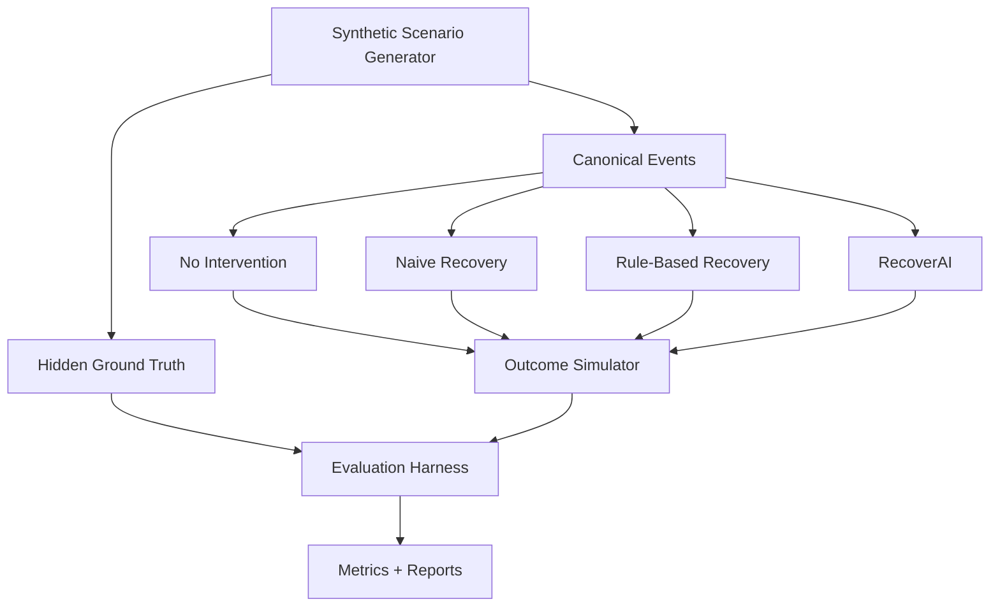
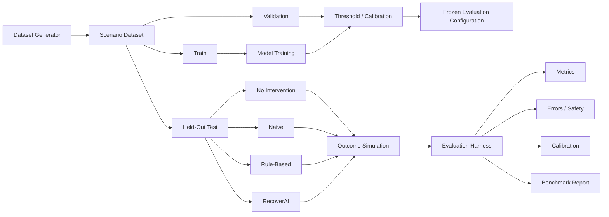

# `docs/14_EVALUATION.md`

````markdown
# RecoverAI — Evaluation

**Project:** RecoverAI  
**Track:** Razorpay AI Buildathon — Track 03: AI Revenue Recovery  
**Document:** Evaluation Framework, Synthetic Environment, Baselines & Measurement  
**Status:** Architecture Foundation — Proposed for Freeze  
**Version:** 1.0  
**Last Updated:** 2026-08-26

---

# 1. Purpose

This document defines how RecoverAI proves that it actually recovers revenue.

This is one of the most important documents in the entire project because the official Track 03 brief explicitly states:

> "Don't just identify the problem. Show measured money recovered across a batch, with compliant escalation, stopping rules, and an audit trail." ([Razorpay AI Buildathon](https://razorpay.com/buildathon/))

Therefore the evaluation system is not a post-processing report.

It is a first-class system component.

The evaluation framework must answer:

1. How much revenue was at risk?
2. How much revenue was actually recovered?
3. How did RecoverAI compare with appropriate baselines?
4. Did RecoverAI choose better interventions?
5. Did it suppress inappropriate interventions?
6. Did it escalate appropriately?
7. Did it obey safety policies?
8. Did the ML models perform adequately on held-out data?
9. Did systemic-degradation detection work?
10. Can every reported number be reproduced?

The governing rule is:

> **No performance number is a claim until the evaluation harness has actually produced it.**

---

# 2. Evaluation Philosophy

RecoverAI must be evaluated at three levels.

```text
LEVEL 1
Component Quality
       |
       v
LEVEL 2
Decision Quality
       |
       v
LEVEL 3
Business Outcome
````

### Level 1 — Component Quality

Examples:

* recovery-risk model,
* degradation detector,
* root-cause classification,
* structured LLM output.

### Level 2 — Decision Quality

Examples:

* selected intervention,
* suppression,
* escalation,
* policy adherence.

### Level 3 — Business Outcome

Examples:

* verified revenue recovered,
* revenue recovery rate,
* unnecessary intervention,
* recovery efficiency.

The third level is the final system objective.

---

# 3. Primary Evaluation Objective

The primary business metric is:

> **Verified recovered revenue across a defined evaluation batch.**

Formally:

```text
Verified Recovered Revenue
=
Σ verified recovered amount
```

Only financial outcomes established by the evaluation environment's authoritative ground truth count toward this metric.

Predictions do not count.

Recommendations do not count.

API request success does not count.

Payment Link creation does not count.

Notification success does not count.

---

# 4. Primary Revenue Metric

Define:

```text
Revenue at Risk
=
Σ eligible revenue opportunity amounts
```

and:

```text
Verified Recovered Revenue
=
Σ recovered amounts for cases whose recovery is verified
```

Then:

```text
Revenue Recovery Rate
=
Verified Recovered Revenue
/
Revenue at Risk
```

The denominator must be defined explicitly for each benchmark.

Cases excluded from the denominator must be documented.

---

# 5. Case Recovery Metric

For case-level analysis:

```text
Case Recovery Rate
=
Number of cases with verified recovery
/
Number of eligible recovery cases
```

This metric should be reported separately from revenue recovery rate because:

```text
100 recovered ₹500 cases
```

and:

```text
1 recovered ₹50,000 case
```

have very different financial consequences.

---

# 6. Why Both Case and Revenue Metrics Are Required

Example:

```text
Method A:
80% case recovery
₹1,00,000 recovered

Method B:
65% case recovery
₹1,40,000 recovered
```

A system optimizing only case count might choose A.

A merchant may prefer B.

RecoverAI therefore reports both:

```text
case outcomes
+
money outcomes
```

---

# 7. Net Recovery Value

Where intervention economics are sufficiently measurable, the evaluation may calculate:

```text
Net Recovery Value
=
Verified Recovered Revenue
-
Measured Intervention Cost
-
Measured Recovery-Related Cost
```

Only costs that have a defensible measurement basis should be included.

The system must not invent monetary "customer friction costs" merely to make a formula look sophisticated.

For example:

```text
customer_friction_cost = ₹37.50
```

must not be introduced without a defensible basis.

---

# 8. Intervention Cost Model

The first benchmark may use explicit measurable costs such as:

```text
communication cost
workflow execution cost
provider inference cost
merchant-defined operational cost
```

Where a cost is not reliably measurable, it should be reported separately rather than fabricated into the net-value formula.

---

# 9. The Evaluation Environment

The evaluation environment contains:

```text
Synthetic Scenario Generator
        |
        v
Canonical Revenue Events
        |
        v
RecoverAI
        |
        v
Action Decision
        |
        v
Outcome Simulator
        |
        v
Independent Ground Truth
        |
        v
Evaluation Harness
```

The most important principle is:

> **Ground truth is generated independently of RecoverAI.**

---

# 10. Why Synthetic Data Is Required

Large-scale evaluation cannot depend entirely on live Razorpay Test Mode.

Razorpay currently documents a limit of 30 Payment Links per business in Test Mode. ([razorpay.com](https://razorpay.com/docs/api/payments/payment-links/create-standard/))

The Buildathon requires measured revenue recovered across a batch.

Therefore:

### Live/Test Mode

Used for:

* actual integration,
* API correctness,
* webhook correctness,
* end-to-end demonstration.

### Synthetic evaluation

Used for:

* large batches,
* controlled scenarios,
* counterfactual comparisons,
* held-out evaluation,
* failure injection,
* baseline comparison.

These must remain explicitly separated.

---

# 11. Synthetic Data Must Resemble the Real Domain

Synthetic data should not be random numbers.

It should model the actual revenue-recovery problem.

The simulator should generate:

* merchants,
* customers,
* revenue opportunities,
* payments,
* payment failures,
* successful payments,
* customer history,
* payment-method behavior,
* temporal behavior,
* systemic degradation,
* recovery opportunities,
* intervention outcomes.

The synthetic event format must conform to the canonical event schema defined in `04_EVENT_MODEL.md`.

---

# 12. Synthetic Event Generation

A synthetic case can begin with:

```text
Merchant
    +
Customer
    +
Revenue Opportunity
    +
Historical Context
    +
Failure / Leakage Scenario
```

Example:

```text
Merchant:
M001

Customer:
C174

Amount:
₹5,000

Payment Method:
UPI

History:
12 payments
11 successful
1 failed

Current Event:
PAYMENT_FAILED
```

The generator then determines the hidden scenario parameters.

---

# 13. Hidden Ground Truth

The simulator may internally know:

```text
true_failure_cause
natural_recovery_outcome
intervention_outcome
systemic_degradation_state
customer_behavior
```

But these values must remain outside RecoverAI's runtime context.

Conceptually:

```text
                    SIMULATOR
                        |
          +-------------+-------------+
          |                           |
          v                           v
   Visible Event                 Hidden Truth
          |                           |
          v                           |
      RecoverAI                       |
          |                           |
          v                           |
      Decision -----------------------+
                      |
                      v
               Evaluation Harness
```

RecoverAI sees only the left side.

---

# 14. Ground Truth Integrity

The following is forbidden:

```text
simulator
   |
   v
ground_truth
   |
   v
RecoverAI feature
```

This would create evaluation leakage.

Also forbidden:

```text
LLM prediction
   |
   v
ground_truth
```

The evaluator must remain independent.

---

# 15. Synthetic World Model

The synthetic environment should contain an explicit world model.

Conceptually:

```text
World State
├── merchant state
├── customer state
├── payment state
├── payment-method health
├── bank/route health where modeled
├── customer behavior
├── recovery propensity
├── intervention response
└── time
```

The simulator advances this world according to declared rules/distributions.

The simulator is not allowed to use RecoverAI's prediction to determine the "true" outcome.

---

# 16. Scenario Classes

The initial benchmark should contain at least:

```text
S01 — Recoverable Customer-Specific Failure
S02 — Non-Recoverable Failure
S03 — Natural Customer Recovery
S04 — Systemic Payment Degradation
S05 — Intermittent Payment Degradation
S06 — Repeated Failure
S07 — High-Value Recovery
S08 — Low-Value Recovery
S09 — Ambiguous External State
S10 — Recovery-Window Expiry
```

Additional scenarios may be added after the core benchmark is stable.

---

# 17. Scenario S01 — Recoverable Customer-Specific Failure

Example:

```text
payment.failed
+
customer has strong historical success
+
payment method healthy
+
recovery opportunity remains valid
```

Ground truth:

```text
CREATE_PAYMENT_LINK
→ payment succeeds
```

The benchmark tests whether RecoverAI can identify an appropriate intervention.

---

# 18. Scenario S02 — Non-Recoverable Failure

Example:

```text
payment.failed
+
revenue opportunity no longer recoverable
```

Ground truth:

```text
no permitted intervention produces recovery
```

This tests whether RecoverAI wastes actions attempting impossible recovery.

---

# 19. Scenario S03 — Natural Customer Recovery

Example:

```text
payment.failed
      |
      v
customer retries independently
      |
      v
payment.captured
```

Razorpay explicitly documents that a `payment.failed` webhook may be followed by `payment.captured` for the same transaction, including user-initiated retry scenarios, particularly with UPI. ([razorpay.com](https://razorpay.com/docs/webhooks/payments/))

The simulator should reproduce this pattern.

The benchmark must penalize a system that unnecessarily sends additional recovery interventions after the revenue has already recovered.

---

# 20. Scenario S04 — Systemic Degradation

Example:

```text
failure-rate spike
+
payment-method concentration
+
downtime signal
```

Ground truth:

```text
individual recovery intervention is low-value or inappropriate during the degradation window
```

Razorpay currently exposes payment downtime webhook events such as `payment.downtime.started` and `payment.downtime.resolved`, providing a real integration-aligned signal for this scenario. ([razorpay.com](https://razorpay.com/docs/webhooks/payments/))

The benchmark measures whether RecoverAI suppresses or appropriately escalates instead of blindly acting on every individual failure.

---

# 21. Scenario S05 — Intermittent Degradation

Not every degradation should be treated as a full outage.

Example:

```text
failure rate elevated
but below severe-degradation condition
```

This tests whether RecoverAI can distinguish:

```text
normal
vs
minor degradation
vs
severe degradation
```

The exact severity boundaries must be configurable and evaluated.

---

# 22. Scenario S06 — Repeated Failure

Example:

```text
payment failed
     ->
recovery action
     ->
verified failure
     ->
second recovery candidate
     ->
verified failure
```

Ground truth may indicate:

```text
further automated attempts have diminishing value
```

This tests stopping rules.

---

# 23. Scenario S07 — High-Value Recovery

High-value cases are used to test:

* human approval,
* policy thresholds,
* careful action selection,
* auditability.

The simulator must not automatically assume:

```text high value = recover
```

It only makes the monetary consequences of decisions more visible.

---

# 24. Scenario S08 — Low-Value Recovery

The opposite case tests whether the system can avoid unnecessary expensive or high-friction interventions for low-value opportunities.

This scenario is especially useful for evaluating intervention economics.

---

# 25. Scenario S09 — Ambiguous External State

Example:

```text
action initiated
      |
      v
transport timeout
```

Hidden truth:

```text
action actually succeeded
```

RecoverAI sees only:

```text
EXECUTION_UNKNOWN
```

until verification.

This tests whether the system:

* avoids duplicate execution,
* verifies external state,
* eventually recognizes success.

---

# 26. Scenario S10 — Recovery Expiry

Example:

```text
revenue at risk
    |
    v
recovery attempts
    |
    v
no recovery before deadline
```

Ground truth:

```text
recovery window expired
```

This tests stopping/expiry behavior.

---

# 27. Baseline Strategy

RecoverAI must not be compared only against an intentionally weak baseline.

At minimum, the benchmark should contain:

```text
B0 — No Intervention
B1 — Naive Recovery
B2 — Deterministic Rule-Based Recovery
B3 — RecoverAI
```

The final submission should report all relevant baselines.

---

# 28. Baseline B0 — No Intervention

Strategy:

```text
detect revenue loss
    ->
take no recovery action
```

This establishes natural recovery.

It answers:

> **How much revenue would have recovered without an intervention?**

This baseline is essential because some customers recover independently.

---

# 29. Baseline B1 — Naive Recovery

A simple intervention strategy.

Example:

```text
payment.failed
    ->
create recovery payment link
```

subject to basic validity constraints.

It does not use:

* recovery prediction,
* systemic degradation intelligence,
* intervention economics,
* contextual reasoning.

This baseline demonstrates the value of a more intelligent approach.

---

# 30. Baseline B2 — Rule-Based Recovery

This baseline uses deterministic business rules.

Example:

```text
IF payment_failed
AND no_active_degradation
AND attempt_count < limit
THEN create_payment_link
ELSE wait/suppress
```

It is stronger than naive recovery and provides a fair comparison against an AI-assisted system.

---

# 31. Baseline B3 — RecoverAI

The full system:

```text
Recovery Risk Model
+
Degradation Detection
+
Root Cause
+
Intervention Planning
+
Intervention Economics
+
LLM Reasoning where justified
+
Policy
+
Workflow
+
Verification
```

The benchmark must clearly identify the configuration used.

---

# 32. Why Baselines Matter

Suppose:

```text
No intervention:
₹60,000 recovered

Naive:
₹70,000 recovered

Rule-based:
₹80,000 recovered

RecoverAI:
₹82,000 recovered
```

This demonstrates:

> RecoverAI adds value over reasonable alternatives.

But:

```text
Naive:
₹70,000

RecoverAI:
₹70,500
```

may indicate that the architecture is not adding enough value.

We must report the result honestly.

---

# 33. Recovery Uplift

For a baseline:

```text
Recovery Uplift
=
RecoverAI Recovered Revenue
-
Baseline Recovered Revenue
```

Relative uplift:

```text
Relative Recovery Uplift
=
(RecoverAI Recovered Revenue
-
Baseline Recovered Revenue)
/
Baseline Recovered Revenue
```

The baseline must be explicitly named.

For example:

```text
+18.2% vs Rule-Based Recovery
```

is meaningful.

"18.2% better" without naming the baseline is not.

---

# 34. Intervention Efficiency

A useful metric is:

```text
Recovery Efficiency
=
Verified Recovered Revenue
/
Number of Recovery Actions
```

This measures whether the system achieves recovery with fewer interventions.

It should not be used alone because a system could maximize efficiency simply by acting on only very high-value cases.

---

# 35. Unnecessary Intervention

RecoverAI should explicitly measure actions that were not needed.

Examples:

* customer recovered independently,
* systemic degradation made intervention inappropriate,
* intervention had no plausible recovery value,
* case had already become ineligible.

Metric:

```text
Unnecessary Intervention Rate
=
Unnecessary Executed Actions
/
Total Executed Recovery Actions
```

The exact labeling rules must be part of the benchmark specification.

---

# 36. False Positive Cost

For Track 03, a false positive can mean:

> RecoverAI chose to intervene when the intervention was not justified.

The evaluation should measure its cost.

Potential measurable components:

```text
action cost
communication cost
workflow cost
customer-contact count
merchant operational burden
```

Where exact monetary costs are unavailable, report the operational count separately.

---

# 37. False Negative Cost

A false negative can mean:

> RecoverAI failed to intervene when a permitted intervention could have recovered revenue.

Its cost is primarily:

```text
recoverable revenue not recovered
```

This is why revenue-based measurement is important.

A classification metric alone does not adequately describe the business impact.

---

# 38. Policy Safety Metrics

The benchmark must explicitly measure:

```text
Unauthorized financial actions
Duplicate financial actions
Blind retries
Recovery without verification
Policy bypasses
```

Desired result:

```text
0
```

for unauthorized financial actions.

This is a test target, not a claimed benchmark result until executed.

---

# 39. Suppression Quality

Suppression must be evaluated for both:

### Correct suppression

Intervention was inappropriate and the system suppressed it.

### Incorrect suppression

A worthwhile recovery opportunity existed but RecoverAI suppressed it.

Metrics:

```text
Suppression Precision
Suppression Recall
```

where the "positive" definition is explicitly:

> case where suppression was the correct decision under the benchmark's ground truth/policy.

---

# 40. Escalation Quality

Measure:

```text
Escalation Precision
Escalation Rate
Escalation Resolution Rate
```

A useful escalation system should not:

* escalate everything,
* or avoid escalation when the system is genuinely uncertain.

The benchmark should contain deliberate high-risk/ambiguous cases.

---

# 41. Recovery Model Evaluation

The Recovery Risk Model must be evaluated separately from the full business system.

For binary outcomes, candidate metrics include:

```text
Precision
Recall
F1
Average Precision / PR-AUC
ROC-AUC
Log Loss
Brier Score
Calibration Curve
```

scikit-learn documents these metrics and provides the relevant evaluation APIs. ([scikit-learn](https://scikit-learn.org/stable/modules/model_evaluation.html))

For imbalanced recovery outcomes, precision/recall and average precision should receive particular attention rather than relying only on accuracy.

---

# 42. Probability Calibration

If RecoverAI exposes:

```text
recovery_probability = 0.8
```

that value should have probabilistic meaning.

A calibrated classifier should have approximately 80% positive outcomes among examples predicted near 0.8. scikit-learn documents calibration curves/reliability diagrams and methods for calibrating classifier probabilities. ([scikit-learn](https://scikit-learn.org/stable/modules/calibration.html))

The evaluation should therefore report:

```text
Calibration Curve
Brier Score
Log Loss
```

where appropriate.

---

# 43. Brier Score Interpretation

Brier score is useful for evaluating probabilistic predictions, but it is not a pure calibration metric because it reflects calibration, discrimination/resolution, and inherent outcome uncertainty. scikit-learn explicitly warns against treating a lower Brier score alone as proof of better calibration. ([scikit-learn](https://scikit-learn.org/stable/modules/calibration.html))

Therefore RecoverAI should not claim:

> "Brier score improved, so calibration improved."

without reviewing calibration curves and other evidence.

---

# 44. Calibration Dataset Separation

The model's calibrator should not be fit directly on the same training predictions used to fit the underlying model.

scikit-learn recommends using data independent of the training data for calibration and provides `CalibratedClassifierCV` to support this workflow. ([scikit-learn](https://scikit-learn.org/stable/modules/calibration.html))

Therefore the evaluation pipeline should maintain:

```text
TRAIN
CALIBRATION / VALIDATION
HELD-OUT TEST
```

where practical.

---

# 45. Held-Out Test Set

The final reported model metrics must come from a held-out test set that was not used for:

* feature selection,
* threshold tuning,
* hyperparameter selection,
* prompt optimization,
* policy tuning,
* or final model choice.

This prevents benchmark contamination.

---

# 46. Temporal Test Split

Because revenue behavior is time-dependent, a temporal split should be preferred when the synthetic data generator supports it.

Conceptually:

```text
Past
 |
 +--> TRAIN
 |
 +--> VALIDATION
 |
 v
Most recent
 |
 +--> HELD-OUT TEST
```

This better simulates deployment on future events.

The exact split percentages must be determined after dataset generation.

---

# 47. Merchant-Level Leakage Prevention

If the dataset contains repeated observations from the same merchant, naive random splitting can leak merchant-specific behavior across train and test.

Where appropriate, the evaluation should consider:

```text
merchant-aware split
```

or a hybrid temporal + merchant split.

The chosen strategy must be documented.

---

# 48. Customer-Level Leakage Prevention

Likewise, repeated observations from the same customer may create leakage.

A test case should not receive future customer information unavailable at prediction time.

The feature builder must reconstruct history as of the prediction timestamp.

---

# 49. Feature Leakage Test

The evaluation pipeline should explicitly test:

```text
Does any feature reference information
that occurs after the prediction timestamp?
```

If yes:

```text
FAIL EVALUATION
```

The benchmark should not continue until the leakage is removed.

---

# 50. Intervention Outcome Simulation

The simulator must map:

```text
case context
+
selected intervention
+
current world state
```

to:

```text
simulated outcome
```

Example:

```text
Case:
₹5,000

Action:
CREATE_PAYMENT_LINK

Hidden world:
customer receptive = true

Outcome:
payment completes
```

A different action may produce:

```text
WAIT
→ natural recovery = false
→ not recovered
```

This is how intervention comparison becomes measurable.

---

# 51. Counterfactual Evaluation

A major purpose of the simulator is to evaluate different interventions under the same underlying scenario.

Conceptually:

```text
Same Scenario
      |
      +--> No intervention
      |
      +--> Naive
      |
      +--> Rule-based
      |
      +--> RecoverAI selected action
```

The simulator supplies outcome labels independently.

This allows fair comparison.

---

# 52. Counterfactual Caveat

Counterfactual outcomes produced by a simulator are only as valid as the simulator's assumptions.

Therefore the submission must not claim:

> "This proves what would have happened in the real world."

Instead:

> **"This benchmark estimates performance under the explicitly documented synthetic environment."**

This distinction is mandatory.

---

# 53. Simulator Calibration

The synthetic simulator should use distributions grounded in:

* realistic payment/revenue ranges,
* domain behavior,
* documented Razorpay states/events,
* intentionally designed scenario frequencies.

It should not use arbitrary distributions simply because they create favorable results.

Whenever empirical real-world distributions are unavailable, the assumptions must be explicitly stated.

---

# 54. Scenario Balance

The test set should contain enough examples of:

```text
recoverable
non-recoverable
natural recovery
systemic degradation
ambiguous state
high-value
low-value
```

A benchmark containing only easy recoverable failures is invalid.

The final report should show scenario counts.

---

# 55. Difficulty Tiers

Scenarios can be grouped into:

### Tier 1 — Straightforward

Clear evidence, simple intervention.

### Tier 2 — Contextual

Multiple signals and competing interventions.

### Tier 3 — Adversarial / Failure

Ambiguous state, duplicate events, systemic degradation, provider failures.

The final evaluation should report performance by difficulty tier.

---

# 56. Failure Injection Evaluation

RecoverAI must be tested under:

```text
F01 LLM timeout
F02 LLM rate limit
F03 all LLM providers unavailable
F04 malformed LLM output
F05 Razorpay timeout
F06 duplicate webhook
F07 out-of-order webhook
F08 delayed webhook
F09 n8n failure
F10 policy-engine failure
F11 verification failure
F12 stale workflow
```

The benchmark should verify both:

```text
technical behavior
```

and:

```text business-safety behavior
```

---

# 57. Failure Success Criteria

Example:

## Razorpay timeout

Expected:

```text
RecoveryAction = EXECUTION_UNKNOWN
No duplicate financial action
Verification attempted
```

## LLM provider failure

Expected:

```text
Fallback provider or safe deterministic path
No policy bypass
```

## Duplicate webhook

Expected:

```text
No duplicate RecoveryAction
```

## Policy Engine unavailable

Expected:

```text
No financial mutation
```

---

# 58. Degradation Detector Evaluation

The detector should be evaluated on deliberately generated:

```text
normal periods
mild degradation
severe degradation
recovery/resolution
```

Metrics should include:

```text
Precision
Recall
False Positive Rate
False Negative Rate
Detection Latency
Resolution Latency
```

The test should specifically measure whether false-positive degradation detection causes excessive suppression.

---

# 59. Root-Cause Evaluation

The Root Cause Engine should be evaluated against independently generated scenario categories.

Possible metrics:

```text
Cause Category Accuracy
Macro F1
Evidence Grounding Rate
Unsupported Evidence Rate
Unknown Accuracy
```

A wrong but confidently expressed cause should not receive the same quality score as an appropriately uncertain `UNKNOWN`.

---

# 60. LLM Evaluation

The LLM is evaluated on:

```text
Structured Output Validity
Evidence Grounding
Allowed-Action Compliance
Semantic Correctness
Unsupported Claim Rate
Latency
Fallback Rate
```

The model does not receive hidden ground truth.

The final business outcome is evaluated separately.

---

# 61. Evidence Grounding Metric

Define:

```text
Evidence Grounding Rate
=
recommendations whose cited evidence references are valid
/
recommendations containing evidence references
```

A stricter metric can measure whether the cited evidence actually supports the claim.

The evaluator should not reward the model simply for citing arbitrary existing IDs.

---

# 62. Unsupported Action Rate

Define:

```text
Unsupported Action Rate
=
LLM proposals containing actions outside the allowed action vocabulary
/
all LLM action proposals
```

Desired result:

```text
0%
```

or effectively zero after validation.

The system should still remain safe if the model proposes an invalid action because the schema/validation layer must reject it.

---

# 63. AI Ablation

To determine whether the LLM adds real value:

Compare:

```text
Full RecoverAI
```

against:

```text
RecoverAI without LLM
```

while holding other components constant.

Potential result:

```text
Without LLM:
₹X recovered

With LLM:
₹Y recovered
```

Only actual measured results should be reported.

---

# 64. Degradation Ablation

Compare:

```text
Full RecoverAI
```

against:

```text
RecoverAI without degradation detection
```

Measure:

```text
recovered revenue
unnecessary interventions
suppression precision
suppression recall
```

This tests whether the degradation component actually improves the system.

---

# 65. Intervention-Economics Ablation

Compare:

```text
With expected-value ranking
```

against:

```text
Without expected-value ranking
```

Measure:

```text
recovered revenue
actions executed
recovery efficiency
intervention cost
```

This establishes whether economic reasoning adds measurable value.

---

# 66. Rule-Based vs AI-Assisted

This is one of the most important comparisons.

The benchmark should show:

```text
Rule-Based Recovery
vs
RecoverAI
```

because the key AI-judgment question is:

> Why do we need AI at all?

If the rule-based system performs equally well, the project needs to either:

* improve the AI component,
* simplify the architecture,
* or honestly report that AI provides limited incremental value.

We must not hide this result.

---

# 67. Statistical Significance

Where the batch size permits, comparisons should include uncertainty estimates.

Examples:

```text
bootstrap confidence interval
difference in recovery rate
difference in recovered revenue
```

The exact statistical method will be selected based on the metric and data structure.

Do not claim statistical significance from a tiny number of cases.

---

# 68. Random Seed

Every synthetic evaluation run must have a recorded seed.

Example:

```text
seed = 42137
```

Then the dataset and outcomes can be reproduced.

The seed belongs in the evaluation-run metadata.

---

# 69. Evaluation Run Metadata

Every benchmark run should record:

```json id="sx0gqz"
{
  "evaluation_run_id": "run_001",

  "dataset_version": "synthetic-v1.0",
  "simulator_version": "sim-v0.1",

  "seed": 42137,

  "policy_version": "1.2",
  "risk_model_version": "0.1.0",

  "prompt_versions": {
    "root_cause": "v1",
    "intervention_reasoning": "v1"
  },

  "llm_configuration": "...",

  "started_at": "...",
  "completed_at": "..."
}
```

The exact schema is implementation-specific.

---

# 70. Evaluation Dataset Versioning

Datasets must be immutable once used for final reporting.

If the scenario generator changes:

```text
synthetic-v1.0
```

becomes:

```text
synthetic-v1.1
```

rather than silently overwriting the old dataset.

This ensures historical benchmark results remain interpretable.

---

# 71. Benchmark Result Artifact

Every final evaluation run should produce:

```text
evaluation/
    runs/
        run-001/
            metadata.json
            summary.json
            cases.jsonl
            metrics.json
            confusion_matrix.json
            calibration.json
            errors.json
            report.md
```

The exact artifact structure may change during implementation.

The essential requirement is reproducibility and inspection.

---

# 72. Per-Case Evaluation Record

A case-level evaluation record should contain:

```json id="0wpmt5"
{
  "case_id": "case_001",

  "scenario_id": "S04",

  "amount_at_risk_minor": 50000,

  "system_decision": "SUPPRESS",

  "selected_action": null,

  "ground_truth": {
    "optimal_action": "SUPPRESS",
    "recoverable_amount_minor": 0
  },

  "financial_outcome": {
    "recovered_amount_minor": 0
  },

  "safety": {
    "policy_violation": false,
    "duplicate_action": false
  }
}
```

However, hidden ground truth must not be placed in the runtime input used by RecoverAI.

This structure is for post-hoc evaluation artifacts.

---

# 73. Aggregate Evaluation Report

The report should include:

```text
Dataset:
N cases

Revenue at Risk:
₹X

Recovered Revenue:
₹Y

Recovery Rate:
Z%

Baseline:
₹B

Uplift vs baseline:
Z%

Actions:
N

Unnecessary Actions:
N

Suppression:
N

Escalations:
N

Unauthorized Actions:
0

Duplicate Actions:
0
```

All values must be generated from the actual run.

---

# 74. Scenario-Level Results

The report should also show:

| Scenario |  Cases | At Risk | Recovered | Recovery Rate | Suppressed | Escalated |
| -------- | -----: | ------: | --------: | ------------: | ---------: | --------: |
| S01      | actual |  actual |    actual |        actual |     actual |    actual |
| S02      | actual |  actual |    actual |        actual |     actual |    actual |
| S03      | actual |  actual |    actual |        actual |     actual |    actual |
| S04      | actual |  actual |    actual |        actual |     actual |    actual |

The final numbers must be produced by the evaluator.

---

# 75. Baseline Comparison Table

The final report should include:

| Strategy        |  Cases | Revenue at Risk | Recovered Revenue | Recovery Rate | Actions | Unnecessary Actions |
| --------------- | -----: | --------------: | ----------------: | ------------: | ------: | ------------------: |
| No Intervention | actual |          actual |            actual |        actual |  actual |              actual |
| Naive Recovery  | actual |          actual |            actual |        actual |  actual |              actual |
| Rule-Based      | actual |          actual |            actual |        actual |  actual |              actual |
| RecoverAI       | actual |          actual |            actual |        actual |  actual |              actual |

The table must not be populated with estimates before execution.

---

# 76. What We Will Present to Razorpay

The final Buildathon presentation should focus on a small set of high-signal measurements.

Recommended:

### 1. Revenue recovered

```text
₹X across N cases
```

### 2. Uplift vs rule-based baseline

```text
+Y%
```

### 3. Intervention efficiency

```text
₹X recovered per action
```

### 4. Safety

```text
0 unauthorized financial actions
0 duplicate financial actions
```

### 5. Degradation handling

```text
precision / recall
```

### 6. Recovery model

```text
PR-AUC / calibration / recall
```

The exact metrics selected depend on actual results.

---

# 77. Avoid Metric Theater

The project should not present:

```text
97.4% AI accuracy
```

without explaining:

* what the label means,
* the test-set size,
* the class distribution,
* the baseline,
* and whether the metric impacts money recovered.

Similarly:

```text
99.9% uptime
```

is irrelevant if the project has not operated at a scale where that measurement means anything.

Every headline number must answer:

> **Why does this matter to merchant revenue recovery?**

---

# 78. Benchmark Honesty Rules

The evaluator must enforce:

```text
RULE-001
No fabricated metrics.

RULE-002
No training-set metrics presented as held-out performance.

RULE-003
No synthetic results presented as real merchant results.

RULE-004
No counterfactual claim without simulator ground truth.

RULE-005
No baseline comparison unless the baseline uses the same evaluation batch.

RULE-006
No metric without a definition.

RULE-007
No hidden exclusion of failed/unknown cases.

RULE-008
All safety violations are reported, even if the count is zero.

RULE-009
All major benchmark assumptions are documented.

RULE-010
Changing the dataset/model/policy/prompt requires a new evaluation run.
```

---

# 79. Unknown Cases

Unknown cases must not simply be dropped.

Example:

```text
1,000 cases

950 resolved
50 unknown
```

The report must say:

```text
950 resolved
50 unknown
```

and explain why.

The benchmark must not quietly calculate recovery rate over only the easiest 950 cases unless that is explicitly the defined metric.

---

# 80. Failed Cases

Likewise:

```text
recovery failed
```

is a legitimate outcome.

It must remain in the denominator according to the metric definition.

Removing failed cases would artificially inflate performance.

---

# 81. Policy-Denied Cases

A policy-denied case is not necessarily a recovery failure.

It may be:

```text
correctly denied
```

or:

```text
incorrectly denied.
```

Evaluation should distinguish:

```text
policy safety
```

from:

```text
recovery opportunity.
```

This is why per-case ground truth must include the expected action/decision under the benchmark's policy.

---

# 82. Stopping Rule Evaluation

Stopping rules should be evaluated independently.

Example:

```text
Attempt 1 -> failed
Attempt 2 -> failed
Attempt 3 -> would recover
```

If policy only allows two attempts, the expected behavior may still be:

```text
stop after attempt 2
```

The simulator must respect the declared policy limits.

This separates:

> **optimal unconstrained outcome**

from:

> **optimal compliant outcome**.

The latter is what RecoverAI should optimize for.

---

# 83. Compliance-Aware Ground Truth

The benchmark's "optimal action" should not mean:

> "Whatever maximizes money with unlimited attempts."

Instead:

> **The best action that remains within the declared safety/policy constraints.**

This is essential because Track 03 explicitly requires compliant escalation and stopping rules. ([razorpay.com](https://razorpay.com/buildathon/))

---

# 84. Recovery Opportunity Definition

Every benchmark case should have a defined:

```text
recovery_window
```

and:

```text
eligible_recovery_amount
```

The amount should exclude revenue that is already:

* captured,
* refunded,
* outside the recovery window,
* or otherwise not eligible under the scenario definition.

The rules must be fixed before final testing.

---

# 85. Natural Recovery

The benchmark should explicitly measure natural recovery.

Example:

```text
No intervention:
₹70,000 recovered

RecoverAI:
₹95,000 recovered
```

Then the actual incremental contribution is not:

```text ₹95,000
```

against:

```text ₹0
```

but:

```text ₹25,000 incremental revenue
```

relative to the no-intervention baseline.

This is a critical distinction.

---

# 86. Incremental Revenue Recovery

Define:

```text
Incremental Recovered Revenue
=
RecoverAI Recovered Revenue
-
No-Intervention Recovered Revenue
```

This metric better captures:

> **How much additional revenue the intervention system contributed beyond natural recovery.**

It should be one of the main benchmark metrics.

---

# 87. Incremental Recovery Rate

Similarly:

```text
Incremental Recovery Rate
=
Incremental Recovered Revenue
/
Revenue at Risk
```

This is more informative than raw recovery rate when natural customer behavior is substantial.

---

# 88. Intervention Cost vs Incremental Revenue

A recovery strategy may recover more gross revenue but also perform many unnecessary actions.

The evaluation should therefore compare:

```text
Incremental Recovered Revenue
+
Action Count
+
Intervention Cost
+
Suppression/False-Positive Cost
```

This is the core of intervention economics.

---

# 89. Evaluation Decision Frontier

The benchmark should allow policy/threshold tuning against:

```text id="6eut1s"
more interventions
      vs
more recovery
```

The final selected operating point should maximize an explicitly documented objective rather than maximizing one arbitrary metric.

---

# 90. Threshold Tuning

Thresholds for:

* recovery probability,
* expected value,
* degradation,
* escalation,

must be tuned only on training/validation data.

The held-out test set must remain untouched.

After threshold tuning:

```text validation complete
     |
     v
freeze configuration
     |
     v
run held-out test
```

---

# 91. Benchmark Versioning

A benchmark version consists of:

```text
dataset version
simulator version
policy version
model version
prompt version
gateway configuration
threshold configuration
```

Changing any material component creates a new benchmark run.

Example:

```text
Run 1:
dataset v1
model v1
policy v1

Run 2:
dataset v1
model v2
policy v1
```

These are separate results.

---

# 92. Reproducibility Contract

A reviewer should be able to reconstruct a benchmark from:

```text
Git commit
+
dataset version
+
simulator version
+
seed
+
configuration
+
model artifacts
+
prompt versions
```

The exact environment/dependency lockfile should also be retained.

---

# 93. Evaluation Architecture Diagram



---

# 94. Full Evaluation Pipeline



---

# 95. Evaluation Data Flow Integrity

The direction must be:

```text
scenario
   ->
ground truth
   ->
event
   ->
system decision
   ->
outcome
   ->
evaluation
```

Not:

```text
system decision
   ->
ground truth
```

Not:

```text
LLM recommendation
   ->
ground truth
```

Not:

```text
benchmark result
   ->
threshold selection
   ->
rerun benchmark
```

The latter would contaminate the held-out evaluation.

---

# 96. Benchmark Acceptance Criteria

The evaluation framework itself is not complete until:

1. The simulator can produce reproducible scenarios.
2. Hidden ground truth is isolated.
3. RecoverAI sees only valid runtime information.
4. Baselines run on the same batch.
5. The test set is held out.
6. Metrics are deterministic/reproducible.
7. Safety failures are counted.
8. Unknown cases are preserved.
9. Natural recovery is measured.
10. Incremental recovery is reported.
11. Unnecessary interventions are measured.
12. Degradation performance is measured.
13. Calibration is measured if probabilities are used.
14. Evaluation metadata is versioned.
15. A complete benchmark report can be generated automatically.

---

# 97. Final Report Structure

The final benchmark report should contain:

```text
1. Executive Summary
2. Dataset
3. Scenario Distribution
4. Baselines
5. Revenue at Risk
6. Recovered Revenue
7. Incremental Revenue
8. Recovery Rate
9. Intervention Efficiency
10. Suppression Performance
11. Escalation Performance
12. Risk Model Metrics
13. Degradation Detector Metrics
14. LLM Metrics
15. Safety Metrics
16. Failure-Injection Results
17. Ablation Results
18. Limitations
19. Reproducibility Metadata
```

---

# 98. Limitations Section

Every final benchmark report must explicitly state:

* synthetic nature of the evaluation,
* simulator assumptions,
* data limitations,
* external API limits,
* unimplemented revenue-recovery classes,
* provider dependence,
* uncertainty in intervention-cost assumptions,
* and any statistically weak comparisons.

A benchmark report without limitations is incomplete.

---

# 99. What We May Claim

After successful evaluation, the final project may claim statements such as:

> RecoverAI recovered ₹X across N synthetic revenue-loss cases.

or:

> RecoverAI recovered Y% more revenue than the rule-based baseline on the held-out benchmark.

or:

> RecoverAI correctly suppressed Z% of benchmark systemic-degradation cases.

Only the exact values produced by the evaluation system may be inserted.

---

# 100. What We May Not Claim

Do not claim:

> RecoverAI will recover X% of a real merchant's revenue.

unless demonstrated in a real authorized environment.

Do not claim:

> RecoverAI is better than Razorpay's production recovery system.

We do not possess the evidence for that comparison.

Do not claim:

> The simulator proves real-world performance.

It does not.

Do not claim:

> 99% accuracy means 99% of revenue is recovered.

Classification accuracy and business recovery are different metrics.

---

# 101. Benchmark Design Principle

The evaluation must make the system uncomfortable.

A strong benchmark includes cases where:

* the obvious action is wrong,
* no action is best,
* natural recovery occurs,
* systemic degradation exists,
* external state is ambiguous,
* policy blocks the highest-revenue-looking action,
* the LLM fails,
* the workflow fails,
* and the customer behaves unexpectedly.

Only then can we meaningfully demonstrate:

> **AI judgment under financial constraints.**

---

# 102. Final Buildathon Evidence

The final submission should show:

```text
LIVE TEST MODE
      +
SYNTHETIC BATCH
      +
BASELINE COMPARISON
      +
AUDIT TRAIL
      +
FAILURE DEMONSTRATION
```

The strongest sequence is:

```text
1. Show a real Razorpay Test Mode recovery.
2. Show the case timeline.
3. Show the measured batch results.
4. Compare with the rule-based baseline.
5. Trigger a systemic-degradation case.
6. Show suppression.
7. Trigger an LLM/provider failure.
8. Show fallback.
9. Show an uncertain external result.
10. Show verification preventing unsafe retry.
```

This gives the reviewer evidence for:

* problem taste,
* build quality,
* AI judgment,
* failure recovery.

---

# 103. Evaluation Freeze

The following decisions are frozen:

1. Verified recovered revenue is the primary business metric.
2. Case recovery and revenue recovery are separate metrics.
3. Synthetic evaluation is required for large-scale batch measurement.
4. Live Razorpay Test Mode is used for integration evidence, not large-scale benchmarking.
5. The benchmark contains no-intervention, naive, rule-based, and RecoverAI baselines.
6. Natural recovery is explicitly measured.
7. Incremental recovery over no intervention is reported.
8. Unnecessary intervention is measured.
9. False-positive/false-negative economic or operational cost is measured where defensible.
10. Systemic-degradation detection is evaluated separately.
11. Recovery-risk probabilities are calibrated/evaluated when presented as probabilities.
12. The final model metrics come from a held-out test set.
13. Threshold tuning occurs before the final held-out run.
14. Synthetic ground truth remains hidden from RecoverAI.
15. Unknown and failed cases are not silently excluded.
16. Safety violations are reported even when zero.
17. Benchmark metadata is versioned.
18. Every benchmark run is reproducible from its recorded configuration and seed.
19. No synthetic result is presented as a real-merchant result.
20. No comparison with Razorpay's proprietary production performance is claimed.

---

# 104. Next Document

The next specification is:

```text
15_FAILURE_RECOVERY.md
```

It will consolidate the failure-engineering architecture across:

* Razorpay,
* webhooks,
* LLM providers,
* MCP,
* n8n,
* database,
* policy,
* verification,
* stale workflows,
* unknown financial state,
* retries,
* recovery/reconciliation,
* circuit breakers,
* and incident recovery.

It will define exactly **what breaks, what state the system enters, what it does next, and how it proves that it recovered safely.**

---

# 105. External References

## Razorpay

### Buildathon — Track 03

[https://razorpay.com/buildathon/](https://razorpay.com/buildathon/)

The official brief requires measured money recovered across a batch, compliant escalation, stopping rules, and an audit trail. ([Razorpay][1])

### Payment Webhooks

[https://razorpay.com/docs/webhooks/payments/](https://razorpay.com/docs/webhooks/payments/)

Current documentation confirms:

* payment webhook events,
* historical snapshot semantics,
* `payment.failed`,
* later `payment.captured` after a failed attempt in documented retry scenarios,
* payment downtime events. ([Razorpay][2])

### Payment Downtime API

[https://razorpay.com/docs/api/payments/downtime/](https://razorpay.com/docs/api/payments/downtime/)

Razorpay documents fetching payment downtime details and using APIs/webhooks to monitor payment-option downtime. ([Razorpay][3])

### Payment Link Webhooks

[https://razorpay.com/docs/webhooks/payment-links/](https://razorpay.com/docs/webhooks/payment-links/)

Current documentation confirms `payment_link.paid` and related Payment Link events. ([Razorpay][4])

---

## scikit-learn

### Model Evaluation

[https://scikit-learn.org/stable/modules/model_evaluation.html](https://scikit-learn.org/stable/modules/model_evaluation.html)

Current documentation provides classification metrics including precision, recall, F1, average precision, ROC-AUC, log loss, and Brier score. ([Scikit-learn][5])

### Probability Calibration

[https://scikit-learn.org/stable/modules/calibration.html](https://scikit-learn.org/stable/modules/calibration.html)

Current documentation defines calibrated probabilities, calibration curves, Brier/log-loss considerations, and calibration using independent data. ([Scikit-learn][6])

### Calibration Curve

[https://scikit-learn.org/stable/modules/generated/sklearn.calibration.calibration_curve.html](https://scikit-learn.org/stable/modules/generated/sklearn.calibration.calibration_curve.html)

Current documentation defines reliability/calibration curves and their interpretation. ([Scikit-learn][7])

---

# 106. Verification Status

## VERIFIED

* Current Track 03 evaluation requirement.
* Razorpay Payment Webhook behavior relevant to benchmark scenarios.
* Razorpay documented `payment.failed` → `payment.captured` behavior.
* Razorpay payment downtime events.
* Razorpay Payment Link webhook events.
* Current scikit-learn evaluation metrics.
* Current probability-calibration guidance.
* Current Brier-score/calibration caveats.

## PROPOSED

* Exact synthetic distributions.
* Exact dataset size.
* Exact scenario frequencies.
* Exact recovery-window durations.
* Exact intervention-cost assumptions.
* Exact baseline implementation rules.
* Exact threshold values.
* Exact statistical significance methodology.
* Exact benchmark split percentages.

## NOT YET IMPLEMENTED

The complete simulator, benchmark harness, baselines, evaluation pipeline, and reporting system.

## CRITICAL

No performance figure should be entered into the README, pitch deck, dashboard, or Buildathon submission until it is generated by the implemented evaluation harness from the frozen held-out test configuration.

```
```

[1]: https://razorpay.com/buildathon/?utm_source=chatgpt.com "Razorpay AI Buildathon — Build. Show. Get hired."
[2]: https://razorpay.com/docs/webhooks/payments/?utm_source=chatgpt.com "Payments Webhook Events | Razorpay Docs"
[3]: https://razorpay.com/docs/api/payments/downtime/?preferred-country=IN&utm_source=chatgpt.com "Razorpay Docs"
[4]: https://razorpay.com/docs/webhooks/payment-links/?utm_source=chatgpt.com "Payment Links Webhook Events | Razorpay Docs"
[5]: https://scikit-learn.org/stable/modules/model_evaluation.html?highlight=confusion+matrix&utm_source=chatgpt.com "3.4. Metrics and scoring: quantifying the quality of predictions — scikit-learn 1.9.0 documentation"
[6]: https://scikit-learn.org/stable/modules/calibration.html?utm_source=chatgpt.com "1.16. Probability calibration — scikit-learn 1.9.0 documentation"
[7]: https://scikit-learn.org/stable/modules/generated/sklearn.calibration.calibration_curve.html?utm_source=chatgpt.com "calibration_curve — scikit-learn 1.9.0 documentation"
