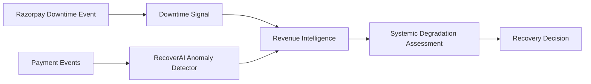
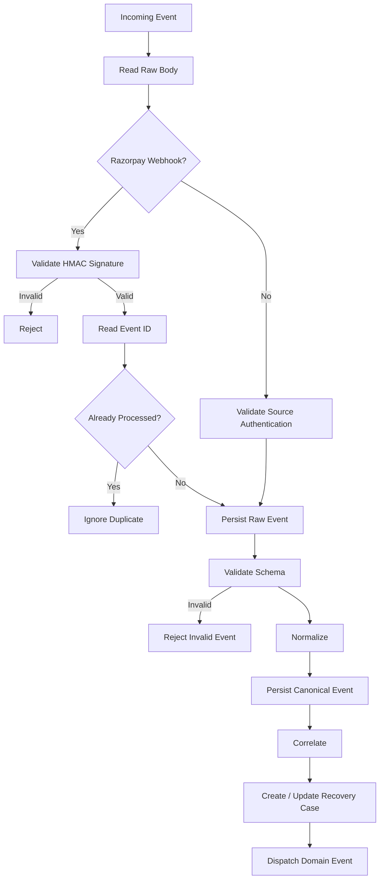
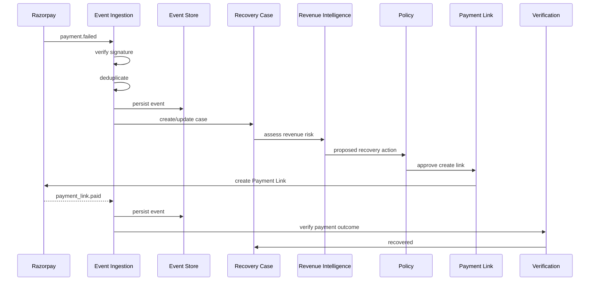

# RecoverAI — Event Model

**Project:** RecoverAI
**Track:** Razorpay AI Buildathon — Track 03: AI Revenue Recovery
**Document:** Canonical Event Model & Event Processing Contract
**Status:** Architecture Foundation — Proposed for Freeze
**Version:** 1.0
**Last Updated:** 2026-08-26

---

# 1. Purpose

This document defines how RecoverAI receives, validates, normalizes, persists, correlates, deduplicates, and processes events.

The event model is the boundary between:

* Razorpay's external event structures,
* merchant-originated revenue events,
* synthetic evaluation events,
* and RecoverAI's internal domain.

The primary goal is:

> **External event formats must never become the internal business model.**

Instead:

```text
External Event
      |
      v
Verify
      |
      v
Normalize
      |
      v
Canonical Revenue Event
      |
      v
Domain
```

This enables RecoverAI to consume real Razorpay events and synthetic events through the same internal processing path.

---

# 2. Event Architecture Principles

## 2.1 Events are observations

An event describes something observed by the system.

It is not automatically:

* a final business state,
* a recovery decision,
* a model prediction,
* or an authorization.

For example:

```text
payment.failed
```

is an observed payment event.

It does not mean:

```text
RecoveryCase = FAILED
```

and it does not mean:

```text
Revenue = permanently lost
```

A later `payment.captured` event can occur for the same transaction. Razorpay explicitly documents this possibility, including a `payment.failed` → `payment.captured` sequence for late authorization or user-initiated retry behavior, particularly for UPI.

---

## 2.2 Event order is not guaranteed

RecoverAI must not assume that external webhook events arrive in business order.

Razorpay explicitly states that webhook order may not be preserved and gives `payment.authorized` → `payment.captured` as the expected sequence while warning that this sequence may not always be followed.

Therefore:

> **Event arrival order is not equivalent to business-state order.**

---

## 2.3 Duplicate delivery is expected

Razorpay documents that the same webhook event can be delivered more than once and recommends using `x-razorpay-event-id` to identify duplicates.

Therefore:

> **Event processing must be idempotent.**

---

## 2.4 Raw payloads must be preserved separately

RecoverAI should preserve sufficient raw external information for debugging/audit while keeping the core domain independent from vendor-specific payload structures.

Conceptually:

```text
Raw External Event
      |
      +----> Raw Event Store / Diagnostic Record
      |
      v
Canonical Event
      |
      v
Domain
```

The domain must not deserialize raw Razorpay payloads directly into its business objects.

---

# 3. Event Sources

The initial event sources are:

```text
RAZORPAY_WEBHOOK
MERCHANT_EVENT
SIMULATION
SYSTEM_EVENT
```

## 3.1 RAZORPAY_WEBHOOK

Events originating from Razorpay's configured webhook endpoint.

## 3.2 MERCHANT_EVENT

Events emitted by the merchant-side integration, such as:

* checkout started,
* checkout abandoned,
* business-defined receivable became overdue.

These are not assumed to be provided automatically by Razorpay.

## 3.3 SIMULATION

Events generated by the synthetic evaluation environment.

## 3.4 SYSTEM_EVENT

Internal RecoverAI events used for state transitions or derived operational processing.

Examples:

```text
RECOVERY_CASE_CREATED
POLICY_REVIEW_REQUIRED
VERIFICATION_REQUIRED
RECOVERY_CASE_ESCALATED
```

System events are not external financial facts.

---

# 4. Canonical Event Envelope

Every event entering the RecoverAI domain must conform to a canonical envelope.

Conceptual schema:

```json
{
  "event_id": "evt_internal_01",
  "source": "RAZORPAY_WEBHOOK",
  "source_event_id": "external_event_01",
  "event_type": "PAYMENT_FAILED",
  "schema_version": "1.0",

  "merchant_id": "merchant_01",
  "customer_id": "customer_01",

  "occurred_at": "2026-08-26T12:30:00Z",
  "received_at": "2026-08-26T12:30:01Z",

  "correlation": {
    "payment_id": "pay_01",
    "order_id": "order_01",
    "payment_link_id": null,
    "subscription_id": null,
    "invoice_id": null
  },

  "financial": {
    "amount_minor": 50000,
    "currency": "INR"
  },

  "payload": {},
  "metadata": {}
}
```

The exact implementation type may be a Pydantic model or equivalent typed structure.

---

# 5. Canonical Envelope Fields

## `event_id`

RecoverAI's internally unique event identifier.

### Requirement

Must be unique within the RecoverAI event store.

---

## `source`

Identifies the originating source.

Initial enum:

```text
RAZORPAY_WEBHOOK
MERCHANT_EVENT
SIMULATION
SYSTEM_EVENT
```

---

## `source_event_id`

The source-specific event identifier.

For Razorpay webhooks, this should preserve the external event identifier.

Razorpay documents `x-razorpay-event-id` as unique per webhook event.

This identifier is critical for deduplication.

---

## `event_type`

RecoverAI's canonical event type.

Examples:

```text
PAYMENT_FAILED
PAYMENT_AUTHORIZED
PAYMENT_CAPTURED
ORDER_PAID

PAYMENT_LINK_PAID
PAYMENT_LINK_EXPIRED

PAYMENT_DOWNTIME_STARTED
PAYMENT_DOWNTIME_UPDATED
PAYMENT_DOWNTIME_RESOLVED

CHECKOUT_STARTED
CHECKOUT_ABANDONED

SUBSCRIPTION_PAYMENT_FAILED
RECEIVABLE_OVERDUE
```

Only event types actually implemented may be processed by the MVP.

---

## `schema_version`

Version of the canonical RecoverAI event schema.

Example:

```text
1.0
```

Schema evolution must be explicit.

---

## `merchant_id`

Identifies the merchant boundary.

For the Razorpay integration, this may be derived from authenticated account context and/or event payload information as supported by the integration.

---

## `customer_id`

Internal customer identifier when available.

This field may be null for events where customer identity is unavailable.

---

## `occurred_at`

Timestamp representing when the source event occurred.

This must not be confused with processing time.

---

## `received_at`

Timestamp representing when RecoverAI received the event.

The difference:

```text
received_at - occurred_at
```

can provide useful event-latency information.

---

# 6. Correlation Object

Revenue events can reference multiple external objects.

The canonical event therefore supports:

```json
{
  "correlation": {
    "payment_id": "...",
    "order_id": "...",
    "payment_link_id": "...",
    "subscription_id": "...",
    "invoice_id": "..."
  }
}
```

These values are optional.

The integration mapper must only populate fields supported by the source event.

No placeholder identifiers should be fabricated.

---

# 7. Financial Object

Financial information is represented separately from the event metadata.

```json
{
  "financial": {
    "amount_minor": 50000,
    "currency": "INR"
  }
}
```

## Rules

* `amount_minor` is an integer.
* Currency is explicit.
* No floating-point financial values are stored.
* No implicit currency conversion occurs.
* An event that does not represent a financial amount may omit the financial object.

---

# 8. Raw Event Record

Before canonical processing, the system should persist an external-event record containing enough information to reconstruct what RecoverAI received.

Conceptually:

```json
{
  "raw_event_id": "raw_01",
  "source": "RAZORPAY_WEBHOOK",
  "source_event_id": "external_event_01",
  "received_at": "...",
  "signature_verified": true,
  "headers": {},
  "raw_body_reference": "...",
  "processing_status": "ACCEPTED"
}
```

The complete raw request should not be duplicated unnecessarily across tables.

A secure reference to the stored payload is preferable.

---

# 9. Razorpay Webhook Security Boundary

Razorpay documents that webhook signatures are sent in the:

```text
X-Razorpay-Signature
```

header and are generated using HMAC SHA-256 with the webhook secret and the **raw webhook request body**. Razorpay explicitly instructs integrators not to parse or cast the request body before performing signature validation.

Therefore the processing sequence is:

```text
HTTP Request
      |
      v
Read raw request body
      |
      v
Validate X-Razorpay-Signature
      |
      +---- INVALID --> REJECT
      |
      v
Extract X-Razorpay-Event-Id
      |
      v
Deduplicate
      |
      v
Parse JSON
      |
      v
Normalize
```

Signature validation must happen before trusting the payload.

---

# 10. Webhook Acceptance States

Incoming Razorpay webhook requests should pass through:

```text
RECEIVED
   |
   v
SIGNATURE_VALIDATION
   |
   +---- FAILED --> REJECTED
   |
   v
DUPLICATE_CHECK
   |
   +---- DUPLICATE --> IGNORED_DUPLICATE
   |
   v
SCHEMA_VALIDATION
   |
   +---- FAILED --> REJECTED_INVALID
   |
   v
PERSISTED
   |
   v
NORMALIZED
   |
   v
DISPATCHED
```

A webhook must not be considered successfully processed merely because its HTTP request was accepted.

---

# 11. Deduplication Contract

The primary Razorpay webhook deduplication key is:

```text
source = RAZORPAY_WEBHOOK
+
source_event_id = x-razorpay-event-id
```

Razorpay states that this event ID is unique per event and recommends checking whether an event with the same value has already been processed.

Conceptual logic:

```text
incoming event_id
       |
       v
already processed?
    /       \
  YES        NO
   |          |
ignore     persist
              |
              v
           process
```

The deduplication check must be atomic with persistence sufficiently to prevent concurrent duplicate processing.

The exact persistence strategy will be defined in the implementation design.

---

# 12. Event Processing Must Be Idempotent

Even after deduplication, downstream processing must remain safe to repeat.

Reasons include:

* process restart,
* retry after infrastructure failure,
* duplicate internal dispatch,
* partial failure after persistence.

Therefore:

> **Duplicate processing must not create duplicate Recovery Cases or duplicate financial actions.**

A Recovery Case creation operation should be idempotent against the source event/correlation identity.

---

# 13. Event Ordering

Razorpay explicitly warns that webhook events may not arrive in expected order. For payments, the documented expected order includes:

```text
payment.authorized
payment.captured
```

but Razorpay states that this order may not always be followed.

Therefore RecoverAI must not implement logic such as:

```text
if payment.authorized seen:
    only then allow payment.captured
```

without considering current authoritative state.

Instead:

```text
Event arrives
      |
      v
Persist observation
      |
      v
Update/reconcile entity state
      |
      v
Apply valid state transition
```

---

# 14. Snapshot Semantics

Razorpay states that a webhook payload is a **snapshot of the entity at the time the event occurred**.

It specifically notes that a payment may already be in `captured` state when a `payment.authorized` webhook is fired, while that event payload still reflects the authorization-time state.

This leads to an important event-model rule:

> **Webhook payloads are historical observations, not necessarily the current entity state.**

Therefore the canonical event should retain both:

```text
occurred_at
```

and:

```text
received_at
```

and the domain should not overwrite historical facts merely because a newer state is observed later.

---

# 15. Payment Event Mapping

Razorpay currently documents payment webhook events including:

```text
payment.authorized
payment.captured
payment.failed
```

and provides payment webhook payloads containing fields such as:

* payment ID,
* amount,
* currency,
* status,
* order ID,
* method,
* bank,
* error code,
* error description,
* error source,
* error step,
* error reason,
* timestamps.

Razorpay's payment webhook documentation provides these payload structures directly.

RecoverAI maps only the information needed by the domain.

Example:

```text
Razorpay
payment.failed
      |
      v
RecoverAI
PAYMENT_FAILED
```

The raw Razorpay event remains available separately for integration-level debugging.

---

# 16. `payment.failed` Is Not Terminal

This is a critical rule.

Razorpay explicitly documents that:

```text
payment.failed
```

may be followed by:

```text
payment.captured
```

for the same transaction, including cases involving late authorization or user-initiated retries, particularly for UPI.

Therefore:

```text
PAYMENT_FAILED
```

is an **event**.

It is not:

```text
RecoveryCase = permanently lost
```

The RecoveryCase remains potentially recoverable until the external state and domain rules establish the outcome.

---

# 17. Payment Failure Event Schema

A normalized `PAYMENT_FAILED` event may contain:

```json
{
  "event_type": "PAYMENT_FAILED",

  "correlation": {
    "payment_id": "pay_123",
    "order_id": "order_123"
  },

  "financial": {
    "amount_minor": 50000,
    "currency": "INR"
  },

  "payment": {
    "method": "netbanking",
    "failure": {
      "code": "BAD_REQUEST_ERROR",
      "description": "Payment failed",
      "source": "bank",
      "step": "payment_authorization",
      "reason": "payment_failed"
    }
  }
}
```

The exact fields must be mapped only when present in the actual Razorpay payload.

For example, Razorpay's documented `payment.failed` sample includes `error_code`, `error_description`, `error_source`, `error_step`, and `error_reason`.

---

# 18. Payment Capture Event

A normalized `PAYMENT_CAPTURED` event should preserve:

```text
payment_id
order_id
amount
currency
captured state
occurred_at
```

Razorpay documents that `payment.captured` indicates successful capture and that the associated order is marked paid.

This event can close a RecoveryCase that was waiting for payment completion, provided the payment is correctly correlated to that case.

---

# 19. Payment Authorization Event

A normalized `PAYMENT_AUTHORIZED` event represents the documented payment authorization event.

However, because Razorpay warns that event payload snapshots and event delivery order do not necessarily represent current state, the event must not automatically trigger a financial action without considering current state.

---

# 20. Payment Degradation / Downtime Events

This is a particularly important addition to RecoverAI.

Razorpay's current payment webhook documentation includes payment downtime webhook events, including:

```text
payment.downtime.started
```

and corresponding downtime information such as:

* method,
* beginning time,
* ending time when available.

Razorpay describes downtime as a period where one or more payment options underperform, causing considerable payment-processing delays, potentially due to technical issues or partner/issuing-bank outages.

This gives RecoverAI a **real Razorpay-native signal** for the systemic-degradation capability.

---

# 21. Degradation Event Model

RecoverAI should distinguish:

### External downtime signal

```text
Razorpay payment.downtime.*
```

from:

### RecoverAI-detected anomaly

```text
high failure rate
+
time clustering
+
method concentration
```

Conceptually:



This is stronger than relying exclusively on an internally invented anomaly detector.

---

# 22. Systemic Degradation Assessment

The domain should represent a degradation assessment separately from an individual payment failure.

Conceptual schema:

```json
{
  "assessment_type": "SYSTEMIC_PAYMENT_DEGRADATION",
  "probability": 0.94,
  "scope": {
    "method": "upi",
    "provider": null,
    "bank": null,
    "region": null
  },
  "signals": [
    "payment.downtime.started",
    "failure_rate_above_baseline"
  ],
  "created_at": "..."
}
```

Fields such as provider/bank/region must remain nullable unless supported by actual evidence.

---

# 23. Why Degradation Must Be a Signal

Systemic degradation is not necessarily a single RecoveryCase.

It is a **contextual signal** that can influence multiple cases.

For example:

```text
Systemic Degradation Signal
         |
         +----> Case A: ₹5,000 payment
         |
         +----> Case B: ₹20,000 payment
         |
         +----> Case C: ₹2,000 payment
         |
         +----> ...
```

Each individual case may then be:

```text
SUPPRESSED
WAITING
ESCALATED
```

rather than creating a separate recovery action for every failure.

---

# 24. Payment Link Events

Razorpay exposes Payment Link webhook events.

The current documentation includes:

```text
payment_link.paid
```

and provides a payload containing:

* payment link,
* order,
* payment,
* payment-link state,
* amount,
* amount paid,
* status,
* and related references.

This event is particularly important for the first golden-path recovery workflow.

---

# 25. Payment Link Paid Event

Normalized form:

```json
{
  "event_type": "PAYMENT_LINK_PAID",

  "correlation": {
    "payment_link_id": "plink_123",
    "order_id": "order_123",
    "payment_id": "pay_123"
  },

  "financial": {
    "amount_minor": 50000,
    "currency": "INR"
  }
}
```

The event should be correlated back to:

```text
RecoveryCase
    |
    v
RecoveryAction
    |
    v
Payment Link
```

using an integration-maintained correlation identity.

---

# 26. Payment Link Correlation

Razorpay's Standard Payment Link creation API supports a unique `reference_id` for each Payment Link.

RecoverAI should use a deterministic application-level correlation strategy so that:

```text
RecoveryCase
      |
      v
RecoveryAction
      |
      v
reference_id / external payment-link ID
      |
      v
payment_link.paid
      |
      v
RecoveryAction verified
```

The exact `reference_id` format will be specified in `09_RAZORPAY_INTEGRATION.md`.

RecoverAI must not rely on string parsing of arbitrary customer-facing fields to correlate payment links.

---

# 27. Merchant Events

Merchant-originated events allow RecoverAI to extend beyond Razorpay-native payment events.

Example:

```json
{
  "event_type": "CHECKOUT_ABANDONED",

  "merchant_id": "merchant_01",
  "customer_id": "customer_01",

  "correlation": {
    "checkout_id": "checkout_01",
    "order_id": "order_01"
  },

  "financial": {
    "amount_minor": 800000,
    "currency": "INR"
  }
}
```

The merchant integration is responsible for establishing that the checkout was actually abandoned.

RecoverAI must not infer checkout abandonment merely from the absence of a payment event.

---

# 28. Subscription Events

Subscription-related events will use canonical event types only after the Razorpay subscription webhook mapping is defined and verified in the integration specification.

Potential canonical event:

```text
SUBSCRIPTION_PAYMENT_FAILED
```

The event must contain a stable subscription correlation identifier where available.

The detailed subscription mapping is explicitly deferred to `09_RAZORPAY_INTEGRATION.md`.

---

# 29. Receivable Events

Receivables may originate outside Razorpay payment webhooks.

A merchant integration or the synthetic simulator may emit:

```text
RECEIVABLE_OVERDUE
```

The event must contain enough information to identify:

* merchant,
* receivable,
* customer/debtor if known,
* amount,
* due date,
* overdue duration.

RecoverAI must not claim that the Razorpay Payment API alone automatically provides an arbitrary merchant's full accounts-receivable state.

---

# 30. System Events

Internal events are used for workflow/domain coordination.

Examples:

```text
RECOVERY_CASE_CREATED
RECOVERY_CASE_ASSESSED
POLICY_REVIEW_REQUIRED
RECOVERY_ACTION_AUTHORIZED
RECOVERY_ACTION_EXECUTING
VERIFICATION_REQUIRED
RECOVERY_OUTCOME_CONFIRMED
RECOVERY_CASE_ESCALATED
```

System events must never be mistaken for external financial events.

---

# 31. Event Classification

Every canonical event should identify its semantic category.

Initial categories:

```text
FINANCIAL_OBSERVATION
REVENUE_RISK_SIGNAL
RECOVERY_CONTROL
WORKFLOW
SYSTEM
```

Examples:

```text
payment.failed
    -> FINANCIAL_OBSERVATION

payment.downtime.started
    -> REVENUE_RISK_SIGNAL

RECOVERY_ACTION_AUTHORIZED
    -> RECOVERY_CONTROL

VERIFICATION_REQUIRED
    -> WORKFLOW

RECOVERY_CASE_CREATED
    -> SYSTEM
```

This classification supports safe routing and audit interpretation.

---

# 32. Event Correlation

RecoverAI uses correlation identifiers to connect events to the same business context.

Possible keys:

```text
merchant_id
customer_id
payment_id
order_id
payment_link_id
subscription_id
invoice_id
checkout_id
case_id
action_id
```

Correlation is additive.

For example:

```text
payment_id + order_id
```

provides stronger linkage than payment ID alone when both exist.

The system must not create correlations from approximate string matching unless explicitly designed and evaluated for that purpose.

---

# 33. Event-to-Case Creation Rules

A RevenueEvent may create a RecoveryCase only when:

1. the event type is recoverable,
2. sufficient identity/context exists,
3. the event represents a revenue opportunity,
4. the event is not already associated with a terminal case,
5. the merchant is active,
6. policy allows analysis/processing.

Example:

```text
PAYMENT_FAILED
       |
       v
Already linked to active case?
   /             \
 YES              NO
  |                |
append evidence   create case
```

---

# 34. Event-to-Case Updates

Later events may update an existing RecoveryCase.

Example:

```text
payment.failed
      |
      v
RecoveryCase = OPEN

payment.captured
      |
      v
RecoveryCase = RECOVERED
```

Or:

```text
payment.failed
      |
      v
RecoveryCase = OPEN

payment.downtime.started
      |
      v
Systemic Degradation = TRUE
      |
      v
RecoveryCase = SUPPRESSED / WAITING
```

The state machine determines whether the transition is legal.

---

# 35. Out-of-Order Event Handling

Example:

```text
Received:
payment.captured
before
payment.failed
```

The system must not blindly reverse the state merely because `payment.failed` arrived later.

Instead:

```text
persist both observations
       |
       v
determine current authoritative state
       |
       v
apply legal state transition
       |
       v
retain both events in history
```

Razorpay's documentation explicitly requires consumers to handle non-guaranteed webhook order.

---

# 36. Late Authorization / Retry Handling

Razorpay specifically documents that a `payment.failed` event may be followed by `payment.captured` for the same transaction, including user-initiated retry flows and late authorization.

Therefore RecoverAI must support:

```text
PAYMENT_FAILED
      |
      v
RECOVERY CASE OPEN
      |
      +---- customer retries independently
      |
      v
PAYMENT_CAPTURED
      |
      v
RECOVERED
```

The system must then:

* cancel unnecessary pending recovery actions,
* update the RecoveryCase,
* record the capture event,
* preserve the previous failure event,
* and audit the transition.

This is an important example of **why the agent must observe before acting repeatedly**.

---

# 37. Event Deduplication vs Business Deduplication

These are distinct.

### Event deduplication

Same external event received multiple times.

Key:

```text
source + source_event_id
```

### Business deduplication

Two distinct events represent the same logical financial opportunity.

Example:

```text
payment.failed
```

and:

```text
merchant recovery callback
```

may refer to the same payment.

Business deduplication relies on correlation identifiers and RecoveryCase identity rules.

They must not be conflated.

---

# 38. Event Versioning

The canonical event schema uses:

```text
schema_version
```

Example:

```text
1.0
1.1
2.0
```

Rules:

### Minor changes

Backward-compatible optional fields.

### Major changes

Breaking semantic or structural changes.

Historical events must remain interpretable according to the schema version under which they were stored.

---

# 39. Raw vs Canonical Data

The system should preserve:

```text
RAW
```

and:

```text
CANONICAL
```

separately.

### Raw data

Used for:

* integration debugging,
* forensic inspection,
* verifying mapping correctness.

### Canonical data

Used for:

* application logic,
* domain processing,
* evaluation,
* analytics.

The canonical model must not change merely because an external provider adds unrelated fields.

---

# 40. Event Processing Pipeline



---

# 41. Event Processing Guarantees

The implementation should aim to guarantee:

### At-least-once ingestion

An accepted valid event should not be silently lost.

### Idempotent processing

Repeating processing should not create duplicate business actions.

### Durable event record

An event should be persisted before being treated as successfully accepted by the application.

### Explicit failure

Invalid events must become rejected/failed records rather than disappearing.

### Traceability

Every canonical event should be traceable to its source event.

---

# 42. Event Processing Does Not Guarantee Exactly-Once External Execution

RecoverAI should not claim universal exactly-once semantics.

The architecture instead uses:

```text
deduplication
+
idempotency
+
verification
+
explicit unknown state
```

to make financial operations safe under retry and duplicate-delivery conditions.

This distinction must remain explicit in the documentation.

---

# 43. Synthetic Event Compatibility

The simulator must produce events that conform to the same canonical schema.

Example:

```json
{
  "event_id": "sim_evt_1001",
  "source": "SIMULATION",
  "source_event_id": "sim_1001",
  "event_type": "PAYMENT_FAILED",
  "schema_version": "1.0",
  "merchant_id": "sim_merchant_01",
  "customer_id": "sim_customer_52",
  "occurred_at": "2026-08-26T12:00:00Z",
  "received_at": "2026-08-26T12:00:00Z",
  "correlation": {
    "payment_id": "sim_pay_1001",
    "order_id": "sim_order_1001"
  },
  "financial": {
    "amount_minor": 50000,
    "currency": "INR"
  }
}
```

This ensures:

```text
Synthetic Input
      |
      v
Same Event Pipeline
      |
      v
Same RecoverAI Core
```

---

# 44. Synthetic Ground Truth Must Remain Separate

The event itself may contain observed simulated facts.

But the simulator's hidden truth must not be passed into RecoverAI as an ordinary event field.

For example:

```text
Visible event:
payment.failed
```

Hidden simulator state:

```text
would_recover_if_payment_link_sent = true
```

The second value belongs to the evaluation environment.

It must not leak into:

* agent context,
* model features,
* policy inputs,
* or decision prompts.

---

# 45. Event Retention

Retention policy is an implementation concern and will be defined later.

However, the architecture requires that enough event/audit information remain available to:

* reconstruct a RecoveryCase,
* verify a decision,
* diagnose a failure,
* reproduce an evaluation,
* and demonstrate the Buildathon audit trail.

---

# 46. Event Observability

Each processing stage should emit structured telemetry:

```text
event_received
signature_verified
duplicate_detected
event_persisted
event_normalized
case_created
case_updated
event_dispatched
```

This will allow failures to be diagnosed independently of business logic.

---

# 47. Event Security

Webhook processing must:

* verify the signature using the raw body,
* reject invalid signatures,
* prevent replay/duplicate processing using event IDs,
* avoid logging webhook secrets,
* avoid exposing raw customer credentials/contact information unnecessarily,
* validate schema before business processing.

Razorpay specifically instructs integrators to use the raw webhook body for HMAC signature validation.

---

# 48. Important Razorpay Observation for RecoverAI

Razorpay's payment webhook documentation also exposes **payment downtime events**. The documentation describes these as periods when one or more payment options underperform and says the downtime can be caused by technical problems or outages at Razorpay partners or issuing banks.

This should become a first-class integration signal for our systemic-degradation engine rather than relying entirely on synthetic anomaly detection.

The RecoverAI architecture should therefore support:

```text
Razorpay Downtime Event
        +
Observed Failure Pattern
        +
Merchant Baseline
        |
        v
Systemic Degradation Assessment
        |
        v
Recovery Suppression / Escalation
```

This is a concrete, Razorpay-aligned capability and strengthens the Track 03 implementation.

---

# 49. Event Model Anti-Patterns

The implementation must not:

### Treat `payment.failed` as permanent failure

Razorpay explicitly documents later `payment.captured` behavior.

### Assume webhook order

Razorpay explicitly warns against this.

### Process duplicate webhooks as independent events

Razorpay explicitly documents duplicate delivery.

### Parse the webhook before signature validation

Razorpay explicitly instructs that the raw body must be used for signature verification.

### Use webhook absence as proof of business failure

No event is not the same as an observed failure.

### Feed raw Razorpay payloads directly into LLM prompts

Only validated, minimized, relevant canonical context should reach the model.

### Use synthetic ground truth as ordinary application input

Ground truth belongs exclusively to evaluation.

---

# 50. Event-to-Revenue Recovery Example



A different real-world sequence could be:

```text
payment.failed
      |
      v
RecoverAI begins analysis
      |
      v
customer retries independently
      |
      v
payment.captured
      |
      v
RecoveryCase = RECOVERED
      |
      v
cancel/suppress pending recovery workflow
```

This sequence is explicitly supported by Razorpay's documented payment webhook behavior.

---

# 51. Event Contract Freeze

This document establishes the following event-model requirements:

```text
1. Raw external events are verified before trust.
2. Razorpay webhook signatures use the raw request body.
3. x-razorpay-event-id is used for duplicate detection.
4. Webhook order is not assumed.
5. Webhook payloads are historical snapshots.
6. payment.failed is not terminal.
7. payment.captured may follow payment.failed.
8. Payment Link paid events can close a recovery workflow.
9. Payment downtime events are first-class revenue-risk signals.
10. Synthetic events use the same canonical event schema.
11. Hidden evaluation ground truth never enters the application event stream.
12. Event processing is idempotent.
13. External event identity and internal business identity remain distinct.
14. Event observations do not directly become RecoveryCase outcomes.
```

---

# 52. Event Model vs State Machine

This distinction must remain explicit.

## Event

Something happened or was observed.

Example:

```text
PAYMENT_FAILED
```

## State

What RecoverAI currently believes about the Recovery Case.

Example:

```text
ASSESSING
```

## Decision

What RecoverAI intends to do.

Example:

```text
CREATE_PAYMENT_LINK
```

## Outcome

What actually happened financially.

Example:

```text
RECOVERED
```

The architecture must never collapse all four into one status field.

---

# 53. Next Document

The next specification is:

```text
05_RECOVERY_STATE_MACHINE.md
```

It will define:

* complete RecoveryCase states,
* RecoveryAction states,
* Verification states,
* legal transitions,
* terminal states,
* retry eligibility,
* suppression,
* escalation,
* `EXECUTION_UNKNOWN`,
* payment-failure-to-capture reconciliation,
* and state-transition invariants.

---

# 54. External References

Current official Razorpay sources consulted for this event model:

* **Validate and Test Webhooks**
  https://razorpay.com/docs/webhooks/validate-test/

* **Payments Webhook Events**
  https://razorpay.com/docs/webhooks/payments/

* **Payment Links Webhook Events**
  https://razorpay.com/docs/webhooks/payment-links/

* **Create Standard Payment Link**
  https://razorpay.com/docs/api/payments/payment-links/create-standard/

* **Razorpay Webhook Best Practices**
  https://razorpay.com/docs/webhooks/best-practices/

---

# 55. Verification Status

### VERIFIED

* Razorpay webhook signature mechanism.
* Raw-body requirement for signature verification.
* `X-Razorpay-Signature`.
* `x-razorpay-event-id`.
* Duplicate webhook delivery possibility.
* Non-guaranteed webhook order.
* Payment webhook snapshot semantics.
* `payment.failed`.
* `payment.authorized`.
* `payment.captured`.
* `payment.failed` followed by `payment.captured` for the same transaction.
* Payment downtime webhook availability.
* `payment_link.paid`.
* Payment Link event payload structure.

### PROPOSED

* Canonical RecoverAI event schema.
* Internal event taxonomy.
* Event correlation strategy.
* Raw/canonical persistence split.
* Synthetic event contract.
* Internal system-event taxonomy.

### NOT YET IMPLEMENTED

All event ingestion and normalization components.

### NEXT FREEZE TARGET

`05_RECOVERY_STATE_MACHINE.md` must define exactly how these events change RecoveryCase and RecoveryAction state without introducing invalid or unsafe financial transitions.
