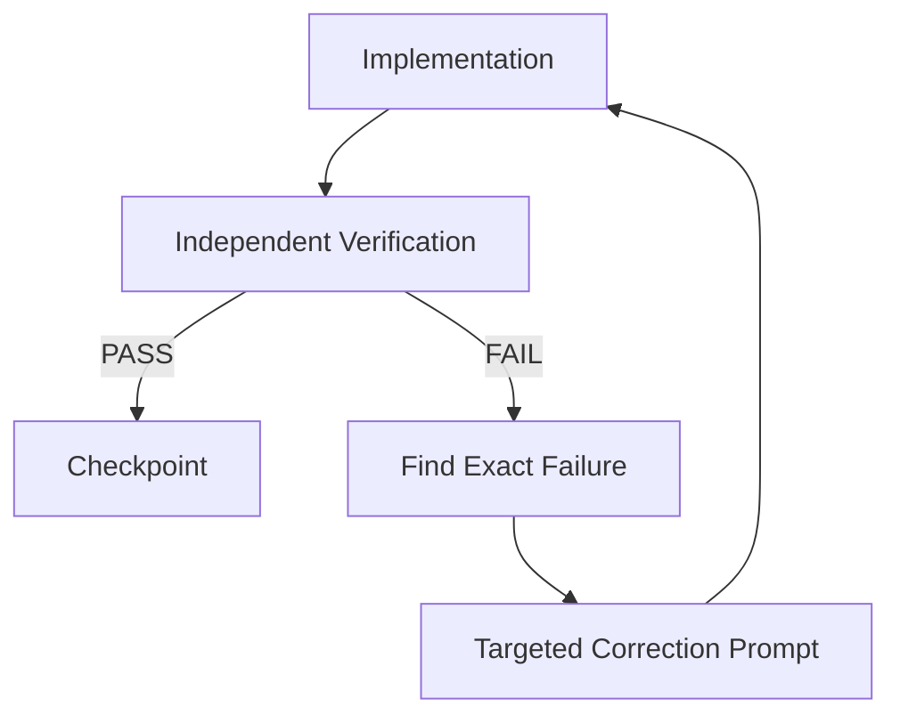
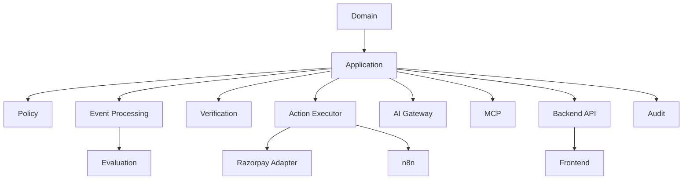
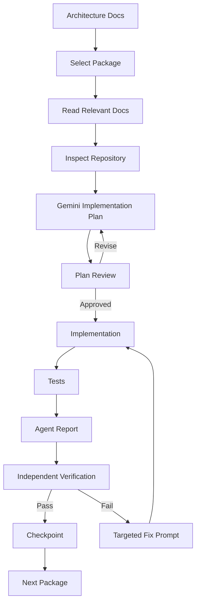

# `docs/21_IMPLEMENTATION_HANDOFF.md`

````markdown
# RecoverAI — Implementation Handoff

**Project:** RecoverAI  
**Track:** Razorpay AI Buildathon — Track 03: AI Revenue Recovery  
**Document:** Architecture-to-Implementation Handoff for Gemini 3.1 Pro (High) / Antigravity  
**Status:** Implementation Governance — Proposed for Freeze  
**Version:** 1.0  
**Last Updated:** 2026-08-26

---

# 1. Purpose

This document defines how the frozen RecoverAI architecture is converted into working software using the agreed agent-assisted development workflow.

The implementation environment is:

```text
Antigravity
    +
Gemini 3.1 Pro (High)
    +
RecoverAI architecture documents
    +
Git repository
    +
human verification
````

The purpose of this document is to prevent:

* architectural drift,
* hallucinated APIs,
* silent scope expansion,
* unverified implementation claims,
* fragile package dependencies,
* and "looks implemented" code that has not actually been tested.

The governing principle is:

> **The agent is an implementation assistant, not the architecture authority and not the verifier of its own work.**

---

# 2. Current Implementation Model

The intended workflow is:

```text
Architecture
     |
     v
Package Specification
     |
     v
Package Prompt
     |
     v
Gemini / Antigravity
     |
     v
Implementation
     |
     +--> Walkthrough
     +--> Report
     +--> Tests
     +--> Changes / Questions
     |
     v
Independent Verification
     |
     +--> Fix required
     |       |
     |       v
     |   Agent revision
     |
     +--> Pass
             |
             v
        Package checkpoint
             |
             v
        Next package
```

This process is deliberate.

Modern coding-agent guidance also recommends separating research, planning, implementation, review and iteration instead of asking an agent to perform everything in one unstructured session. ([GitHub Copilot guidance](https://docs.github.com/en/copilot/tutorials/optimize-ai-usage); [GitHub cloud-agent workflow](https://docs.github.com/en/copilot/how-tos/copilot-on-github/use-copilot-agents/research-plan-iterate))

---

# 3. Why We Are Using Package-Based Implementation

RecoverAI is too interconnected to safely implement as one massive prompt.

A single request such as:

```text
"Build the whole system."
```

creates unacceptable risks:

* excessive context,
* hidden architectural changes,
* incomplete integrations,
* untested code,
* poor debugging,
* accidental provider coupling,
* and difficult rollback.

Instead:

```text
Package 01
    ->
verify
    ->
Package 02
    ->
verify
    ->
...
```

This keeps the system stable while it grows.

---

# 4. Antigravity / Gemini Model Selection

Google's current Antigravity documentation lists:

```text
Gemini 3.1 Pro (High)
```

as an available reasoning model and exposes it in the model selector. ([Google Antigravity Models](https://antigravity.google/docs/models))

The current Antigravity CLI documentation also identifies the model slug:

```text
gemini-3.1-pro-high
```

and supports explicit model selection. ([Google Antigravity CLI](https://antigravity.google/docs/cli/headless/))

Therefore the implementation process assumes:

```text
Reasoning Model:
Gemini 3.1 Pro (High)
```

unless a specific implementation reason requires a different model.

---

# 5. Model Selection Rule

Do not silently switch implementation reasoning models because:

```text
"this one was faster."
```

The model can be changed if:

* quota requires it,
* a task is clearly better suited to another model,
* or a controlled experiment establishes a better result.

If the model is changed for a package:

```text
package report
    +
model
    +
reason
```

must be recorded.

---

# 6. Antigravity Workflows

Current Antigravity documentation provides reusable Workflows saved as Markdown files and invoked through slash commands. Workflows are intended for repeatable sequences of agent actions. ([Google Antigravity Workflows](https://www.antigravity.google/docs/ide/workflows/))

This is useful for RecoverAI because our implementation loop itself is repetitive.

We should eventually create workspace workflows for:

```text
/recoverai-package
/recoverai-verify
/recoverai-report
```

The exact workflow definitions should be created only after the manual process is proven.

---

# 7. Important Workflow Constraint

Antigravity Workflows are limited to 12,000 characters per workflow file. ([Google Antigravity Workflows](https://www.antigravity.google/docs/ide/workflows/))

Therefore:

> Do not put the entire RecoverAI architecture into one giant workflow.

Instead:

```text
Workflow
    |
    v
references architecture documents
```

and passes only the relevant package information.

---

# 8. Architecture Documents Are the Source of Truth

The numbered architecture documents are authoritative.

The agent must read the relevant documents before implementation.

For example:

### Razorpay integration package

Must read:

```text
09_RAZORPAY_INTEGRATION.md
15_FAILURE_RECOVERY.md
16_TESTING_STRATEGY.md
17_SECURITY.md
18_DEPLOYMENT.md
```

not merely the package prompt.

---

# 9. Package Prompt Is an Execution Contract

A package prompt is not a replacement for architecture.

It defines:

```text
what to implement
scope
files/packages involved
required tests
constraints
acceptance criteria
expected report
```

The prompt should reference the architecture documents rather than reproduce them verbatim.

---

# 10. Package Scope Rule

Every package prompt must contain:

```text
IN SCOPE
OUT OF SCOPE
DEPENDENCIES
INPUTS
OUTPUTS
ACCEPTANCE CRITERIA
TEST REQUIREMENTS
FAILURE REQUIREMENTS
REPORTING REQUIREMENTS
```

This prevents scope creep.

---

# 11. Agent Must Inspect Before Editing

Before modifying code, Gemini must:

1. inspect repository structure,
2. inspect existing implementation,
3. inspect relevant tests,
4. inspect relevant architecture docs,
5. identify existing dependencies,
6. identify conflicts,
7. produce or confirm an implementation plan.

It must not assume the repository matches the architecture documents.

---

# 12. Discovery Before Implementation

The agent should answer:

```text
What already exists?
What is missing?
What conflicts with the specification?
What can be reused?
What must be changed?
What dependencies does this package introduce?
```

Only then should code changes begin.

---

# 13. No Fabricated Existing Components

If the architecture says:

```text
RecoveryCaseRepository
```

but the repository does not contain it, Gemini must not report:

```text
"RecoveryCaseRepository already exists."
```

It must state:

```text
"MISSING — must be created."
```

Similarly, an external SDK/API must not be assumed to exist simply because a package name seems plausible.

---

# 14. External API Verification

Whenever implementation depends on an external API or current library behavior:

```text
official documentation
    |
    v
verify current API
    |
    v
implement
```

Do not rely on:

* outdated tutorials,
* memory,
* random blog posts,
* generated examples,
* deprecated SDK syntax.

This is especially important for:

```text
Razorpay
MCP
Gemini
Groq
Hugging Face
n8n
```

---

# 15. Current-Documentation Rule

The agent should explicitly record:

```text
source
date checked
API/version behavior used
```

for material external dependencies.

A package report can contain:

```text
External verification:
Razorpay Payment Links API — checked <date>
```

The exact date and source must come from the actual implementation session.

---

# 16. Do Not Freeze Unverified Versions

The agent must not invent:

```text
Python 3.xx
n8n x.xx
package x.xx
model-id
```

without checking the current environment/documentation.

Version selection occurs during implementation.

After validation:

```text
tested version
    ->
lock/freeze
```

---

# 17. Implementation Plan Requirement

Before making significant changes, Gemini should produce a concise implementation plan containing:

```text
1. Files to create/change
2. Component responsibilities
3. Dependencies
4. Data/model changes
5. API changes
6. Tests
7. Failure cases
8. Risks
```

This is consistent with current agent-development guidance emphasizing research and planning before code changes. ([GitHub implementation-planner](https://docs.github.com/en/copilot/tutorials/customization-library/custom-agents/implementation-planner))

---

# 18. Plan Review

The implementation plan must be reviewed independently before accepting substantial changes.

The plan can be:

```text
APPROVED
```

or:

```text
REVISE
```

No implementation should proceed on an obviously incorrect plan.

For small packages, the planning step can be concise.

For high-risk packages, it must be detailed.

---

# 19. High-Risk Packages

Require stricter review:

```text
Policy Engine
Razorpay Adapter
Webhook Ingestion
Recovery State Machine
Action Executor
MCP Action Tools
LLM Gateway
n8n financial workflow
Verification
Security
Evaluation Harness
```

These packages cannot be accepted solely because tests happen to pass.

---

# 20. Agent Implementation Rules

Gemini must:

```text
IMPLEMENT
not redesign

PRESERVE
frozen decisions

VERIFY
external contracts

TEST
new behavior

REPORT
uncertainty

AVOID
unrequested features
```

---

# 21. Explicit "Do Not" Rules

Every package prompt should remind the agent:

```text
Do not add Docker to the core application.
Do not replace SQLite without evidence.
Do not move policy into n8n.
Do not allow LLMs to authorize financial actions.
Do not expose provider secrets to the frontend.
Do not create arbitrary HTTP/SQL tools.
Do not silently change existing architecture.
Do not claim tests passed without running them.
Do not fabricate API behavior.
Do not fabricate metrics.
```

This repetition is intentional.

---

# 22. AI-Generated Code Is Untrusted Until Verified

The agent's output is treated exactly like an external contribution.

The fact that Gemini generated it does not imply:

```text
correctness
security
architecture compliance
```

The verification loop must inspect the actual repository state.

---

# 23. Git Checkpoint Before Each Package

Before starting a package:

```text
git status
```

must be clean or the existing modifications must be explicitly documented.

Recommended:

```text
checkpoint:
<package-name>-start
```

A lightweight Git tag or commit can provide a rollback point.

---

# 24. Package Branches

Recommended:

```text
feature/package-01-domain
feature/package-02-events
feature/package-03-state-machine
```

The exact names can differ.

The important property is:

```text
one logical package
=
one reviewable change set
```

---

# 25. Package Dependency Order

The package sequence should follow dependency direction.

The architecture documents provide the final design; implementation order should be:

```text
1. Foundation / project scaffold
2. Domain model
3. Persistence contracts
4. Event ingestion
5. Recovery state machine
6. Revenue intelligence
7. Policy engine
8. Razorpay adapter
9. Verification
10. AI gateway
11. MCP
12. n8n
13. Audit/observability
14. Evaluation
15. Backend API
16. Frontend
17. Security hardening
18. Deployment
19. End-to-end integration
20. Demo/submission
```

Exact package grouping may change after repository inspection.

---

# 26. Why Policy Comes Before Agentic Execution

The Policy Engine should be implemented before the full action-capable agent.

This is deliberate.

The system should have a known safety boundary before AI can request actions.

Architecture:

```text
Policy
   |
   v
Action Executor
```

first.

Then:

```text
LLM Agent
   |
   v
Policy
```

This prevents the implementation from growing around an unsafe action path.

---

# 27. Why Razorpay Adapter Comes Before n8n

n8n must call a validated RecoverAI action path.

Therefore:

```text
Razorpay Adapter
+
Action Executor
+
Policy
```

must exist before the financial n8n workflow.

Otherwise n8n would become the first implementation of financial execution, violating the architecture.

---

# 28. Why Evaluation Comes After the Core Loop

The simulator/evaluator depends on:

```text
domain
events
state
policy
actions
verification
```

Therefore large-scale evaluation is implemented after the core business loop exists.

The evaluator can still be scaffolded earlier where useful.

---

# 29. Package Contract

Each package must define:

```text
INPUT:
What does this package consume?

OUTPUT:
What does it provide?

STATE:
What does it persist?

SIDE EFFECTS:
What can it change externally?

FAILURE:
What happens when it breaks?

OBSERVABILITY:
What should be visible?

SECURITY:
What must be protected?
```

This makes package boundaries concrete.

---

# 30. Implementation Prompt Structure

Every package prompt should use approximately:

```text
# Package X — <Name>

## Objective

## Architecture Documents to Read

## Current Repository State

## In Scope

## Out of Scope

## Implementation Requirements

## Interfaces / Contracts

## Failure Requirements

## Security Requirements

## Tests

## Acceptance Criteria

## Deliverables

## Reporting Requirements

## Constraints
```

The exact wording can vary.

---

# 31. Package Prompt Must Reference Files

Example:

```text
Read before implementation:

docs/03_DOMAIN_MODEL.md
docs/05_RECOVERY_STATE_MACHINE.md
docs/16_TESTING_STRATEGY.md
docs/17_SECURITY.md
```

This ensures the agent gets the relevant context without receiving every document every time.

---

# 32. Avoid Full-Repository Context by Default

Do not tell Gemini:

```text
"Read every file and understand everything."
```

for every package.

Instead:

```text
architecture references
+
package dependencies
+
repository paths
```

This reduces irrelevant context.

Current agent-development guidance recommends focused context and separating research/planning/implementation phases for efficiency and clearer results. ([GitHub AI usage guidance](https://docs.github.com/en/copilot/tutorials/optimize-ai-usage))

---

# 33. Implementation Scope Enforcement

The agent should not:

```text
rewrite unrelated modules
rename the entire repository
replace the backend framework
replace the database
rewrite the frontend
upgrade all dependencies
```

during a package implementation.

If a dependency change is genuinely required:

```text
state why
show impact
request/record architectural decision
```

---

# 34. "Smallest Correct Change"

The implementation should prefer:

> **the smallest change that satisfies the specification and preserves architecture.**

Avoid speculative abstractions.

For example:

Do not implement:

```text
generic multi-provider enterprise plugin platform
```

when the immediate requirement is:

```text
GeminiProvider
GroqProvider
HuggingFaceProvider
```

behind one interface.

---

# 35. YAGNI Rule

Do not implement unrequested capabilities because:

```text
"we may need them later."
```

Examples:

```text
multi-tenant enterprise RBAC
distributed task queues
Kubernetes
multiple databases
advanced feature stores
full vector database
```

unless the actual implementation discovers a concrete requirement.

---

# 36. Agent Report Requirement

At the end of every package, Gemini must return:

```text
1. Summary
2. Files created
3. Files modified
4. Dependencies added
5. Tests added
6. Tests run
7. Test results
8. Failure scenarios tested
9. Architecture deviations
10. Known limitations
11. External API assumptions
12. Manual verification required
```

---

# 37. No "All Tests Pass" Without Evidence

The report must include actual commands/results.

Bad:

```text
"All tests pass."
```

Good:

```text
pytest tests/unit/domain
Result: 37 passed

pytest tests/property/state_machine
Result: 18 passed
```

If tests failed:

```text
Result: 34 passed, 2 failed
```

must remain visible.

---

# 38. Test Failures Must Be Explained

For each failure:

```text
TEST
CAUSE
IMPACT
CURRENT STATE
NEXT ACTION
```

Example:

```text
test_payment_link_timeout_reconciliation

CAUSE:
fixture does not yet expose external reference

IMPACT:
reconciliation path unverified

CURRENT STATE:
FAIL

NEXT ACTION:
update integration fixture
```

This is far more useful than hiding the failure.

---

# 39. Walkthrough Requirement

Every high-value package should include a walkthrough.

The walkthrough should explain:

```text
entry point
    ->
major components
    ->
data flow
    ->
important decisions
    ->
failure path
    ->
tests
```

The walkthrough can be generated by Gemini, but it must be based on the actual code.

---

# 40. Verification Process

After the agent returns:

```text
Agent Response
   |
   +--> inspect diff
   +--> inspect files
   +--> inspect tests
   +--> run tests
   +--> run focused behavior
   +--> inspect logs
   +--> compare with architecture
```

Only then:

```text
PASS
```

or:

```text
FIX REQUIRED
```

---

# 41. Verification Questions

For every package ask:

```text
Does the implementation match the spec?

Did it change anything outside scope?

Are the interfaces correct?

Are failure paths handled?

Are tests meaningful?

Are the tests testing the real behavior?

Are there security regressions?

Are external APIs current?

Is observability sufficient?

Does the package preserve the system invariants?
```

---

# 42. Independent Review Priority

Review in this order:

```text
1. Financial safety
2. Correctness
3. State transitions
4. External integration
5. Failure handling
6. Security
7. Tests
8. Maintainability
9. Style
```

Do not spend 20 minutes debating naming while a duplicate-payment race condition exists.

---

# 43. Change Request to Gemini

If verification fails, the correction prompt should be precise.

Bad:

```text
"Fix this."
```

Good:

```text
The verification found one architecture violation:

`RecoveryActionExecutor` can execute a mutation without a persisted
PolicyDecision reference.

Fix this without changing the existing Policy Engine contract.

Required:
1. Reject execution when authorization is absent.
2. Add regression test.
3. Preserve current API.
4. Report all changed files.
5. Do not modify unrelated packages.
```

---

# 44. Correction Cycle



Do not send broad "rewrite the package" requests for localized defects.

---

# 45. Escalation Rule

If Gemini repeatedly fails to satisfy a requirement:

```text id="dceq8q"
attempt 1
   ->
targeted fix

attempt 2
   ->
more specific fix

attempt 3
   ->
stop and reassess architecture/implementation
```

At that point:

```text
human analysis
    ->
architecture adjustment or different implementation strategy
```

Do not enter an infinite prompt-fix loop.

---

# 46. Architecture Change Rule

If implementation reveals a genuine flaw in the architecture:

```text implementation discovery
        |
        v
document problem
        |
        v
evaluate alternatives
        |
        v
update architecture document
        |
        v
record ADR if material
        |
        v
continue implementation
```

Never silently patch around an architectural contradiction indefinitely.

---

# 47. "Greenlit" Does Not Mean Immovable

Frozen architecture means:

```text intentional change
=
documented change
```

not:

```text frozen
=
never change even when evidence proves it wrong
```

Engineering judgment includes changing a decision when evidence warrants it.

The requirement is transparency.

---

# 48. External Documentation Verification by Agent

For packages depending on external systems, the agent should identify:

```text source URL
API/version
specific endpoint/feature
implementation assumption
```

Examples:

```text
Razorpay Payment Links API
MCP tool schema
n8n node behavior
Gemini structured output
Groq rate-limit behavior
```

The final implementation report should contain these references.

---

# 49. No Hallucinated SDK APIs

If Gemini is unsure whether an SDK method exists:

```text
DO NOT INVENT METHOD
```

Instead:

```text
inspect installed version
consult official documentation
inspect package types/source
write a small isolated test
```

This is especially important because provider SDKs can change rapidly.

---

# 50. Dependency Installation Rule

Before adding a dependency:

```text
1. Is it actually required?
2. Is it compatible with the current runtime?
3. Is it maintained/current?
4. Does the existing stack already provide this?
5. Does it increase deployment complexity?
6. Does it create licensing/security concerns?
```

Then record the reason.

---

# 51. Package Dependency Graph

Implementation should follow the dependency graph rather than arbitrary feature order.

Conceptually:



This dependency graph is more important than a simple package numbering scheme.

---

# 52. Package Completion Status

Use explicit statuses:

```text
NOT_STARTED
IN_PROGRESS
IMPLEMENTED
VERIFICATION_FAILED
VERIFIED
FROZEN
```

Example:

```text
Package 07 — Policy Engine
Status: VERIFIED
```

Do not call a package "complete" while known critical failures remain.

---

# 53. Package Checkpoint

A package checkpoint requires:

```text
source code
tests
report
architecture consistency
git commit
```

Optionally:

```text
Git tag
```

for especially important milestones.

---

# 54. Checkpoint File

A compact checkpoint report may be stored as:

```text
docs/checkpoints/
    package-01.md
    package-02.md
```

Each checkpoint should contain:

```text
package
commit
status
tests
known limitations
architecture changes
next dependency
```

---

# 55. Implementation Tracking

Maintain one master tracker:

```text
docs/IMPLEMENTATION_STATUS.md
```

Example:

| Package | Name          | Status      |  Tests | Notes           |
| ------- | ------------- | ----------- | -----: | --------------- |
| 01      | Foundation    | VERIFIED    | actual | —               |
| 02      | Domain        | VERIFIED    | actual | —               |
| 03      | Events        | IN_PROGRESS | actual | webhook mapping |
| 04      | State Machine | NOT_STARTED |      — | —               |

Actual results must replace placeholders.

---

# 56. Agent Session Naming

Use consistent session titles if Antigravity supports them.

Example:

```text
RecoverAI — Package 07 — Policy Engine
```

Then:

```text
RecoverAI — Package 08 — Razorpay Adapter
```

This makes the implementation history understandable.

---

# 57. Agent Context Reset Rule

After completing a package:

```text
new package
=
fresh focused context
```

unless the previous package contains unresolved details needed for the next one.

This follows the general agent-development principle of separating phases and keeping context focused. ([GitHub AI usage guidance](https://docs.github.com/en/copilot/tutorials/optimize-ai-usage))

---

# 58. What Must Be Passed Between Sessions

Only pass the relevant artifacts:

```text
architecture docs
package report
checkpoint
current repository state
known limitations
```

Do not paste the entire previous agent conversation.

---

# 59. Agent-Generated Plan vs Our Plan

Gemini may propose a different implementation plan.

Treat it as:

```text
proposal
```

not:

```text
authority
```

Evaluate:

```text
does it preserve contracts?
does it improve reliability?
does it simplify?
does it introduce risk?
does it change scope?
```

Then accept/reject specific differences.

---

# 60. Plan Review Example

Gemini proposes:

```text
Use PostgreSQL instead of SQLite
```

Response should not be:

```text
"Okay."
```

It should be evaluated against:

```text
deployment complexity
concurrency requirements
actual workload
existing architecture
time
testability
```

If there is no compelling reason:

```text
retain SQLite.
```

---

# 61. Agent Creativity Boundary

Allow Gemini creativity in:

```text
implementation details
refactoring
test organization
internal helper abstractions
performance improvements
```

Do not allow unreviewed creativity in:

```text
financial authorization
security boundary
external API contract
domain state semantics
evaluation methodology
secret management
```

---

# 62. Buildathon-Specific Engineering Rule

Whenever choosing between:

```text
clever
```

and:

```text
obvious
```

prefer:

```text
obvious
```

unless the clever solution has a measurable advantage.

Judges should be able to understand the code quickly.

---

# 63. Buildathon-Specific AI Rule

Whenever choosing between:

```text
LLM
```

and:

```text
deterministic logic
```

ask:

> Does this actually require probabilistic reasoning?

Examples:

```text
Should case be terminal?
-> deterministic

Is amount correct?
-> deterministic

Is policy satisfied?
-> deterministic

What evidence suggests customer-specific cause?
-> AI can help

Which intervention is more promising given heterogeneous context?
-> AI can help
```

This is part of the AI-judgment requirement.

---

# 64. Buildathon-Specific Failure Rule

Every implementation package that introduces external side effects must include:

```text
happy path
+
known failure
+
ambiguous failure
+
recovery
```

Example:

```text
Razorpay adapter

happy:
200

known failure:
400

temporary:
429

ambiguous:
timeout
```

This is mandatory.

---

# 65. Buildathon-Specific Evidence Rule

A package should produce evidence that can later be used in the pitch.

Examples:

```text
Policy
-> audit timeline

Razorpay
-> Test Mode transaction

LLM Gateway
-> fallback trace

n8n
-> workflow execution

Evaluation
-> benchmark report
```

This turns engineering work into demonstrable evidence.

---

# 66. Buildathon-Specific Scope Rule

A feature is worth implementing only when it strengthens at least one of:

```text
problem value
AI judgment
build quality
failure recovery
proof/evaluation
```

Otherwise it is a candidate for removal.

---

# 67. Demo-Driven Verification

Before declaring a major package stable, consider:

> "How would I prove this to a judge in 20 seconds?"

Examples:

### Policy

Show:

```text
ACTION -> APPROVED
```

or:

```text
ACTION -> SUPPRESSED
```

### Failure recovery

Show:

```text
TIMEOUT -> UNKNOWN -> VERIFIED
```

### Audit

Show:

```text
case timeline
```

### Evaluation

Show:

```text
baseline vs RecoverAI
```

This keeps implementation aligned with the final objective.

---

# 68. Package Report Template

Every package report should use:

```markdown
# Package <N> — <Name>

## Status

VERIFIED / etc.

## Objective

## Architecture References

## Implementation

### Created

### Modified

### Dependencies

## Tests

### Commands

### Results

## Failure Cases

## Security Review

## External API Verification

## Architecture Deviations

## Known Limitations

## Manual Verification

## Commit

## Next Package
```

---

# 69. Verification Report Template

Independent verification should contain:

```markdown
# Verification — Package <N>

## Scope

## Architecture Checks

## Code Review Findings

## Test Review

## Runtime Checks

## Failure Injection

## Security Checks

## Findings

### Critical
### Major
### Minor

## Verdict

PASS / FIX REQUIRED

## Required Changes
```

---

# 70. Walkthrough Template

The walkthrough should contain:

```markdown
# Walkthrough — Package <N>

## Entry Point

## Main Flow

## Important Files

## Data Flow

## Failure Flow

## Security Boundary

## Test Coverage

## Observable Output
```

---

# 71. Agent Handoff Response Format

When Gemini finishes a package, it should provide the response in this structure:

```text
PACKAGE:
STATUS:

IMPLEMENTED:
- ...

FILES:
- ...

TESTS:
- command -> result

FAILURE CASES:
- ...

SECURITY:
- ...

EXTERNAL SOURCES VERIFIED:
- ...

ARCHITECTURE DEVIATIONS:
- None / ...

KNOWN LIMITATIONS:
- ...

MANUAL VERIFICATION REQUIRED:
- ...

NEXT RECOMMENDED STEP:
- ...
```

This makes review fast.

---

# 72. Do Not Let the Agent Choose the Next Package Automatically

The agent may recommend:

```text
Next:
Razorpay Integration
```

but the package sequence remains controlled by the project workflow.

This prevents the agent from jumping ahead into dependent components before their prerequisites are stable.

---

# 73. Stop Conditions

Pause the implementation process and inspect architecture if:

```text id="s7ab2e"
two packages disagree about a contract
a required external API behaves differently than documented
database requirements conflict with SQLite design
policy requires an unmodeled state
LLM output cannot be safely constrained
Razorpay action cannot be verified reliably
n8n would need to bypass the application
evaluation requires unavailable ground truth
```

These are architecture signals, not ordinary bugs.

---

# 74. No Hidden Work

The agent must not claim:

```text id="dc6v4r"
"implemented"
```

while leaving:

```text
TODO
pass
NotImplementedError
mock-only behavior
placeholder return
```

in a production-critical path.

Placeholders may exist only where the package specification explicitly defines a future boundary.

---

# 75. Placeholder Policy

Acceptable:

```text id="t0w3f0"
provider adapter interface
```

before the actual provider implementation is built.

Not acceptable:

```text id="a8d4gi"
create_payment_link()
    return "success"
```

in an action path marked complete.

---

# 76. Mock/Real Boundary

Mocks must be explicitly identifiable.

For example:

```text id="rq0z7v"
MockRazorpayGateway
RealRazorpayGateway
```

The demo must never accidentally use the mock when claiming to demonstrate a real Test Mode integration.

---

# 77. Environment Verification

Before a live integration test:

```text id="54hs0h"
Test Mode
+
real provider
+
real workflow
```

must be confirmed.

A passing mock test is not evidence of real integration.

---

# 78. Final Agent Review Before Freeze

Before final Buildathon freeze, run the agent through a repository-wide review prompt that asks it to:

```text
inspect architecture compliance
identify dead code
identify inconsistent contracts
identify unhandled errors
identify security risks
identify missing tests
identify documentation drift
```

The agent's findings are then independently verified.

This is a review aid, not the final approval authority.

---

# 79. Final Human Review

Before release:

```text id="j2ce5b"
Architecture
+
Code
+
Tests
+
Demo
+
Evaluation
```

must all tell the same story.

If the README says:

```text
"automatic recovery"
```

but the implementation requires human approval for every case, fix the description.

If the pitch says:

```text
"verified revenue recovery"
```

but the evaluator counts Payment Link creation, fix the metric.

Truthfulness is part of engineering quality.

---

# 80. Implementation Handoff Invariant

The entire agent-assisted process must preserve:

```text
ARCHITECTURE
    =
DOCUMENTED CONTRACT

CODE
    =
IMPLEMENTATION

TESTS
    =
VERIFICATION

REPORTS
    =
EVIDENCE

GIT
    =
HISTORY
```

None of these may contradict the others.

---

# 81. Master Package Workflow



---

# 82. Master Package Status

The project should maintain:

```text
docs/IMPLEMENTATION_STATUS.md
```

with:

```text
Package
Owner
Status
Commit
Tests
Known Issue
Next Dependency
```

This becomes the high-level implementation tracker.

---

# 83. Recommended Package Order

The exact package count will be determined after inspecting the actual repository.

The recommended initial sequence is:

```text
P01 — Repository/Foundation
P02 — Domain Model
P03 — Persistence
P04 — Event Ingestion
P05 — Recovery State Machine
P06 — Revenue Intelligence
P07 — Policy Engine
P08 — Razorpay Adapter
P09 — Verification
P10 — LLM Gateway
P11 — MCP
P12 — n8n
P13 — Audit & Observability
P14 — Evaluation
P15 — Backend API
P16 — Frontend
P17 — Security Hardening
P18 — Deployment
P19 — Integration & Failure Tests
P20 — Demo/Submission Build
```

This is an implementation sequence, not another architecture claim.

---

# 84. Package Dependency Table

| Package                  | Depends On                 |
| ------------------------ | -------------------------- |
| P01 Foundation           | none                       |
| P02 Domain               | P01                        |
| P03 Persistence          | P02                        |
| P04 Event Ingestion      | P02, P03                   |
| P05 State Machine        | P02, P03                   |
| P06 Revenue Intelligence | P02, P03, P04              |
| P07 Policy               | P02, P05                   |
| P08 Razorpay             | P02, P03                   |
| P09 Verification         | P02, P03, P08              |
| P10 LLM Gateway          | P01                        |
| P11 MCP                  | P02, P07, P10              |
| P12 n8n                  | P07, P08, P09, application |
| P13 Audit                | P02, P03                   |
| P14 Evaluation           | P02–P09                    |
| P15 Backend API          | P02–P14 as required        |
| P16 Frontend             | P15                        |
| P17 Security             | cross-cutting              |
| P18 Deployment           | system-wide                |
| P19 Integration/Failure  | all critical packages      |
| P20 Demo/Submission      | all final packages         |

---

# 85. Parallelization Rule

Packages may be parallelized only when their contracts are stable.

Safe example:

```text
P08 Razorpay adapter
```

and:

```text
P10 LLM Gateway
```

can potentially be developed independently after the core contracts exist.

Unsafe:

```text
P12 n8n
```

before:

```text
P07 Policy
P08 Razorpay
P09 Verification
```

are stable.

---

# 86. Contract-First Parallel Development

When parallel implementation is necessary:

```text
freeze interface
    |
    +--> Package A
    |
    +--> Package B
```

Both packages target the same contract.

Do not let both packages redefine the contract independently.

---

# 87. Final Integration Package

The final integration package must validate:

```text id="j4s7nq"
Razorpay
+
Webhook
+
Recovery Case
+
AI
+
Policy
+
MCP
+
n8n
+
Verification
+
Audit
+
UI
```

This is the first point at which the entire golden path is proven.

---

# 88. Implementation Handoff Definition of Done

This handoff process is complete when:

1. Package order is defined.
2. Package dependencies are defined.
3. Architecture docs are authoritative.
4. Package prompts follow a standard format.
5. Agent implementation reports follow a standard format.
6. Independent verification is mandatory.
7. Failure handling is reviewed per package.
8. External APIs are verified before implementation.
9. Git checkpoints exist.
10. Architecture deviations are explicitly recorded.
11. Package status is tracked.
12. The agent cannot silently redefine frozen architecture.
13. Tests are evidence, not decorative output.
14. The final integration package has a complete end-to-end verification path.

---

# 89. Freeze Decisions

The following decisions are frozen:

1. Gemini 3.1 Pro (High) is the default implementation reasoning model in Antigravity.
2. Architecture documents remain the source of truth.
3. Package prompts are implementation contracts.
4. Every package begins with repository/specification inspection.
5. Significant packages receive a plan before implementation.
6. Every package must add/run appropriate tests.
7. Agent claims are independently verified.
8. Failed verification produces a targeted correction cycle.
9. Architecture changes require explicit documentation.
10. Git checkpoints exist between packages.
11. Implementation context remains package-focused.
12. External API behavior must be verified from current authoritative documentation.
13. No model/provider/SDK behavior is invented.
14. Critical financial packages receive stricter verification.
15. The evaluator and ground truth remain isolated from runtime.
16. No package is complete while critical tests or safety requirements remain unresolved.
17. The final Buildathon state is frozen only after end-to-end verification.

---

# 90. Final Implementation Rule

The most important rule for the entire implementation phase is:

> **Slow down the agent at boundaries, not in syntax.**

Let Gemini move quickly when writing:

* classes,
* schemas,
* tests,
* adapters,
* UI components.

Be extremely strict when it changes:

* financial state,
* authorization,
* external side effects,
* evaluation methodology,
* security boundaries,
* and architecture.

That is where the project's career-critical engineering quality will be decided.

---

# 91. Next Step

The architecture documentation phase should now stop unless implementation reveals a real specification gap.

The next stage is no longer:

```text
"next .md"
```

but:

```text
Package 01
    ->
implementation prompt
    ->
Gemini/Antigravity
    ->
agent response
    ->
independent verification
    ->
fixes
    ->
walkthrough
    ->
package checkpoint
```

The first implementation package should be generated only after inspecting the actual repository state and confirming which files already exist.

---

# 92. External References

## Google Antigravity

### Models

[https://antigravity.google/docs/models](https://antigravity.google/docs/models)

Current Antigravity documentation lists Gemini 3.1 Pro as an available reasoning model and shows `Gemini 3.1 Pro High` in the model selector. ([Google Antigravity Models](https://antigravity.google/docs/models))

### CLI / Headless Mode

[https://www.antigravity.google/docs/cli/headless/](https://www.antigravity.google/docs/cli/headless/)

Current Antigravity documentation identifies the model slug:

```text
gemini-3.1-pro-high
```

and supports explicit model selection. ([Google Antigravity CLI](https://www.antigravity.google/docs/cli/headless/))

### Workflows

[https://www.antigravity.google/docs/ide/workflows/](https://www.antigravity.google/docs/ide/workflows/)

Current Antigravity documentation describes reusable Markdown Workflows, `/workflow-name` invocation, nested workflows, and a 12,000-character limit per workflow. ([Google Antigravity Workflows](https://www.antigravity.google/docs/ide/workflows/))

### Plans

[https://www.antigravity.google/docs/plans/](https://www.antigravity.google/docs/plans/)

Current documentation notes that model availability and rate limits vary by plan. ([Google Antigravity Plans](https://www.antigravity.google/docs/plans/))

---

## Agent Development Practices

### Research / Plan / Implement

[https://docs.github.com/en/copilot/tutorials/optimize-ai-usage](https://docs.github.com/en/copilot/tutorials/optimize-ai-usage)

GitHub currently recommends separating research, planning, and implementation phases for agent-assisted development and keeping context focused. ([GitHub Docs](https://docs.github.com/en/copilot/tutorials/optimize-ai-usage))

### Research, Plan and Iterate

[https://docs.github.com/en/copilot/how-tos/copilot-on-github/use-copilot-agents/research-plan-iterate](https://docs.github.com/en/copilot/how-tos/copilot-on-github/use-copilot-agents/research-plan-iterate)

Current GitHub guidance describes researching a repository, creating/refining an implementation plan, implementing changes on a branch, reviewing the diff, and iterating before merging. ([GitHub Docs](https://docs.github.com/en/copilot/how-tos/copilot-on-github/use-copilot-agents/research-plan-iterate))

### Implementation Planner

[https://docs.github.com/en/copilot/tutorials/customization-library/custom-agents/implementation-planner](https://docs.github.com/en/copilot/tutorials/customization-library/custom-agents/implementation-planner)

Current GitHub documentation provides an implementation-planner agent example emphasizing requirements, technical approach, implementation tasks, assumptions, constraints, risks, and explicit non-goals. ([GitHub Docs](https://docs.github.com/en/copilot/tutorials/customization-library/custom-agents/implementation-planner))

---

# 93. Verification Status

## VERIFIED

* Antigravity currently supports Gemini 3.1 Pro as a reasoning model.
* Antigravity currently exposes `Gemini 3.1 Pro High`.
* Antigravity CLI currently identifies `gemini-3.1-pro-high`.
* Antigravity supports reusable Markdown Workflows.
* Antigravity Workflows have a documented 12,000-character limit.
* Current agent-development guidance supports the research → planning → implementation → review/iteration workflow.
* Current planning guidance emphasizes explicit scope, dependencies, risks, testing and acceptance criteria.

## PROPOSED

* Exact package grouping.
* Exact package count.
* Exact Antigravity Workflow files.
* Exact package prompts.
* Exact Git checkpoint naming.
* Exact implementation-report location.
* Exact CI workflow integration.

## NOT YET IMPLEMENTED

The implementation handoff process itself, package prompts, Antigravity workflows, package tracker, and checkpoint files.

## IMPORTANT

This document intentionally marks the end of architecture specification and the beginning of controlled implementation. From this point onward, new Markdown specifications should be created only when implementation or current external verification exposes a genuine architectural gap. Otherwise the correct next action is to build, test, verify, and checkpoint the existing design.

```
```
