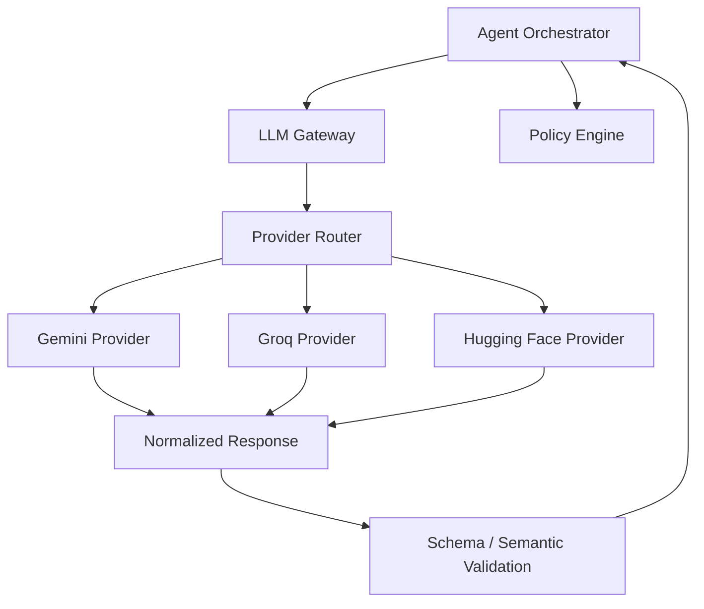
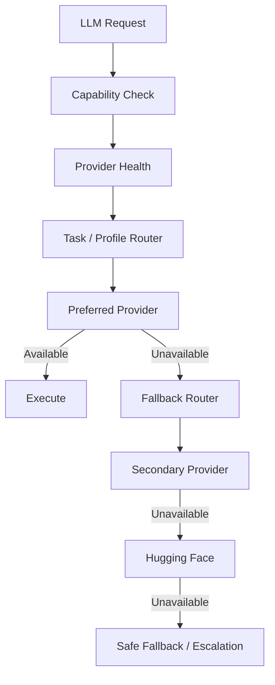
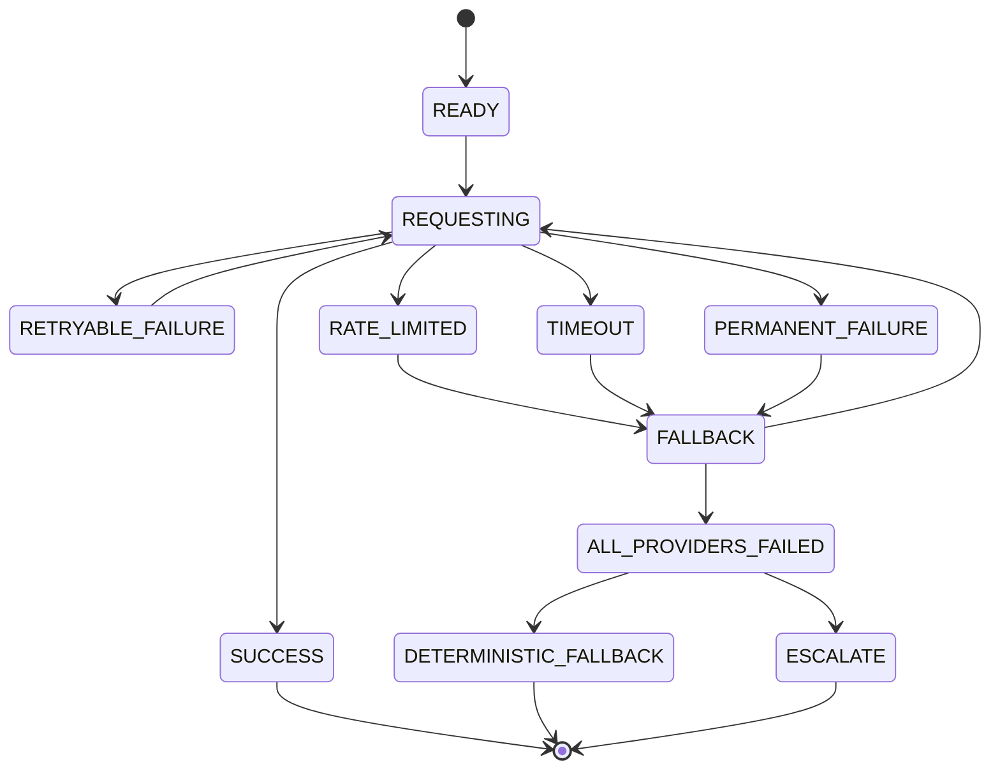

I re-verified the current Gemini, Groq, and Hugging Face documentation before writing this one, especially free-tier availability, rate limits, structured outputs, tool calling, and HF's current routed-provider model. One important correction from our earlier planning is incorporated: **Hugging Face's $0.10 free credit is not a meaningful compute reserve**, so HF should be treated primarily as a provider/model flexibility layer, not as our expected high-volume free fallback. ([Google AI for Developers][1])

# `docs/11_LLM_GATEWAY.md`

````markdown
# RecoverAI — LLM Gateway

**Project:** RecoverAI  
**Track:** Razorpay AI Buildathon — Track 03: AI Revenue Recovery  
**Document:** LLM Gateway, Provider Abstraction, Routing, Structured Output & Failure Handling  
**Status:** Architecture Foundation — Proposed for Freeze  
**Version:** 1.0  
**Last Updated:** 2026-08-26

---

# 1. Purpose

This document defines the LLM Gateway used by RecoverAI.

The gateway isolates the rest of the application from:

- Gemini-specific APIs,
- Groq-specific APIs,
- Hugging Face Inference Provider APIs,
- model-specific request formats,
- provider-specific response formats,
- provider-specific rate limits,
- provider-specific failures,
- provider-specific structured-output behavior,
- and provider-specific tool-calling behavior.

The core principle is:

> **RecoverAI should depend on an internal AI capability contract, not on a specific commercial AI provider.**

The resulting architecture is:

```text
RecoverAI Agent
      |
      v
LLM Gateway
      |
      +---- Gemini
      |
      +---- Groq
      |
      +---- Hugging Face Inference Providers
      |
      v
Normalized Response
````

No domain module may directly instantiate a Gemini, Groq, or Hugging Face client.

---

# 2. Why the LLM Gateway Exists

External LLM providers are dynamic dependencies.

Their:

* model availability,
* free-tier limits,
* rate limits,
* pricing,
* structured-output capabilities,
* latency,
* and API behavior

can change independently of RecoverAI.

Google currently provides free input/output token access for certain Gemini API models with limited access and model/project-specific limits. Google explicitly distinguishes free-tier access from higher-volume paid access. ([Google AI for Developers][1])

Groq currently applies organization-level limits across requests and tokens and returns HTTP `429` when a rate limit is exceeded. ([GroqCloud][2])

Hugging Face Inference Providers currently routes requests to 200+ models/provider combinations, while its Free tier includes only $0.10/month of inference credit, subject to change. ([Hugging Face][3])

Therefore RecoverAI must not architect the core financial workflow around the assumption:

> "Our primary LLM provider will always be available."

---

# 3. LLM Gateway Responsibilities

The LLM Gateway owns:

1. provider abstraction,
2. model configuration,
3. provider routing,
4. request normalization,
5. structured-output handling,
6. response normalization,
7. provider health state,
8. timeout handling,
9. rate-limit handling,
10. bounded retry behavior,
11. fallback,
12. usage metadata,
13. model/provider version metadata,
14. LLM-specific observability,
15. provider error normalization.

The gateway does **not** own:

* recovery policy,
* financial authorization,
* RecoveryCase state,
* business truth,
* payment execution,
* benchmark ground truth,
* or merchant policy.

---

# 4. Architectural Boundary



The Policy Engine remains downstream of the LLM Gateway.

The Gateway cannot authorize a financial action.

---

# 5. Supported Providers

The initial external providers are:

```text
GEMINI
GROQ
HUGGING_FACE
```

No local model is part of this architecture.

The provider abstraction must allow another provider to be added later without changing:

* domain entities,
* RecoveryCase logic,
* Policy Engine,
* Razorpay integration,
* evaluation domain,
* or action executor interfaces.

---

# 6. Provider Roles

The initial provider roles are conceptual rather than permanent.

## Gemini

Primary candidate for:

* complex contextual reasoning,
* root-cause synthesis,
* intervention reasoning,
* merchant-facing explanations.

Google's Gemini API currently offers free access to selected models and paid tiers with higher limits. Model-specific availability and limits must be checked at implementation time. ([Google AI for Developers][1])

---

## Groq

Primary candidate for:

* latency-sensitive reasoning,
* short structured reasoning tasks,
* classification-like tasks,
* fallback.

Groq documents organization-level request and token limits, including RPM, RPD, TPM, TPD, ITPM, and OTPM where applicable. ([GroqCloud][2])

---

## Hugging Face Inference Providers

Candidate for:

* alternate models,
* alternate providers,
* fallback,
* provider/model experimentation.

Hugging Face currently provides access to 200+ models through multiple inference providers and supports both routed requests and custom provider keys. ([Hugging Face][3])

HF's current Free tier includes only $0.10/month of inference credits, so RecoverAI must **not** depend on HF as a high-volume free inference source. ([Hugging Face][3])

---

# 7. Provider Selection Philosophy

Provider selection must be based on task requirements.

It must not simply round-robin requests.

Initial conceptual routing:

```text
Complex contextual reasoning
        ->
Gemini

Fast/simple structured reasoning
        ->
Groq

Alternate model/provider
        ->
Hugging Face

All providers unavailable
        ->
Deterministic fallback / escalation
```

The exact model assignment must be configurable.

---

# 8. Task Classes

RecoverAI should classify LLM requests into internal task types.

Initial vocabulary:

```text
ROOT_CAUSE_ANALYSIS
INTERVENTION_REASONING
MERCHANT_EXPLANATION
CASE_SUMMARY
RECOVERY_REASONING
STRUCTURED_EXTRACTION
```

A provider-routing policy then maps the task type to:

```text
preferred provider
fallback provider(s)
required capabilities
maximum latency
maximum token budget
```

---

# 9. LLM Request Contract

The rest of RecoverAI should call the gateway using an internal request contract.

Conceptual structure:

```json
{
  "task_type": "ROOT_CAUSE_ANALYSIS",

  "model_profile": "reasoning",

  "messages": [
    {
      "role": "system",
      "content": "..."
    },
    {
      "role": "user",
      "content": "..."
    }
  ],

  "response_schema": {
    "type": "object"
  },

  "constraints": {
    "max_output_tokens": 800,
    "timeout_ms": 8000
  },

  "metadata": {
    "case_id": "case_001",
    "prompt_version": "root-cause-v1"
  }
}
```

The provider layer translates this into the provider-specific request.

---

# 10. Do Not Expose Provider-Specific Request Types

The application must not contain:

```python
GeminiGenerateContentRequest
GroqChatCompletionRequest
```

inside domain/application modules.

Instead:

```python
LLMRequest
```

is the application-facing abstraction.

Provider-specific DTOs live inside:

```text
ai/gateway/providers/
```

or equivalent isolated modules.

---

# 11. Normalized Response Contract

All providers must return a normalized internal response.

Conceptually:

```json
{
  "status": "SUCCESS",

  "provider": "gemini",
  "model": "configured-model",

  "request_id": "llm_req_001",

  "content": {
    "recommendation": {
      "action": "CREATE_PAYMENT_LINK"
    }
  },

  "usage": {
    "input_tokens": 1250,
    "output_tokens": 240
  },

  "latency_ms": 732,

  "structured_output": {
    "valid": true,
    "schema_version": "1.0"
  },

  "fallback": {
    "used": false,
    "attempt": 1
  }
}
```

The exact schema is a downstream implementation contract, but the following metadata is mandatory:

* provider,
* model,
* status,
* request identity,
* latency,
* structured-output validation result,
* fallback status.

---

# 12. Normalized Error Contract

Provider-specific failures must be normalized.

Conceptual structure:

```json
{
  "status": "FAILURE",

  "provider": "groq",

  "model": "configured-model",

  "error": {
    "category": "RATE_LIMIT",
    "retryable": true,
    "provider_status": 429
  },

  "fallback_available": true
}
```

Initial internal error categories:

```text
AUTHENTICATION_ERROR
AUTHORIZATION_ERROR
RATE_LIMIT
TIMEOUT
NETWORK_ERROR
INVALID_REQUEST
MODEL_UNAVAILABLE
CONTENT_FILTER
SCHEMA_FAILURE
PROVIDER_ERROR
UNKNOWN
```

These are RecoverAI categories, not claims that every provider exposes identical error names.

---

# 13. Structured Output Is Mandatory for Critical Tasks

For tasks that feed downstream application logic, RecoverAI must request structured output where supported.

Google's current Gemini documentation supports structured output using JSON Schema and states that application-side validation is still necessary because schema conformance does not guarantee semantic correctness. ([Google AI for Developers][1])

Hugging Face Inference Providers currently documents structured-output support using JSON schemas for supported providers/models. ([Hugging Face][4])

Groq currently documents structured outputs using JSON Schema for supported models. ([GroqCloud][2])

Therefore:

```text
LLM
  ->
structured output
  ->
schema validation
  ->
semantic validation
  ->
evidence validation
```

---

# 14. Structured Output Hierarchy

RecoverAI uses four levels of validation:

```text
1. Transport validity
2. JSON/schema validity
3. Semantic validity
4. Evidence validity
```

Example:

### Level 1

Provider returned successfully.

### Level 2

Response matches JSON Schema.

### Level 3

`action` belongs to the allowed action enum.

### Level 4

Every `evidence_id` actually exists for the case.

Only after all four levels pass is the result considered a valid application recommendation.

---

# 15. Provider Capability Registry

The Gateway should maintain a provider/model capability registry.

Conceptually:

```json
{
  "provider": "gemini",
  "model": "configured-model",
  "capabilities": {
    "structured_output": true,
    "tool_calling": true,
    "json_schema": true
  }
}
```

The implementation must verify actual model/provider support rather than assuming every model supports every capability.

---

# 16. Capability-Based Routing

A task may require:

```text
structured_output = true
```

If the selected provider/model cannot satisfy this requirement, the Gateway must:

1. choose another compatible model/provider,
2. or fall back to a safe non-LLM path,
3. or escalate.

It must not silently downgrade a critical structured-output task to unrestricted prose.

---

# 17. Model Profiles

The application should request a **capability profile**, not a hard-coded model wherever practical.

Example:

```text
reasoning
fast_structured
explanation
fallback
```

A configuration layer maps profiles to provider/model combinations.

Example conceptual configuration:

```yaml
profiles:
  reasoning:
    primary:
      provider: gemini
      model: <configured>
    fallbacks:
      - provider: groq
        model: <configured>
      - provider: huggingface
        model: <configured>

  fast_structured:
    primary:
      provider: groq
      model: <configured>
    fallbacks:
      - provider: gemini
        model: <configured>
```

Exact model IDs are intentionally not frozen in this architecture document.

---

# 18. Why Model IDs Are Not Hard-Coded Here

Model availability changes.

For example, Google's current pricing page already documents that some older models have been shut down and recommends migration to newer models. It specifically notes that Gemini 2.0 Flash was shut down on June 1, 2026. ([Google AI for Developers][1])

Therefore:

> **The architecture freezes provider abstraction, not an eternal model identifier.**

The implementation package must select currently available models after checking provider documentation at implementation time.

---

# 19. Provider Routing Decision

The Gateway receives:

```text
task type
required capabilities
latency requirement
token budget
provider health
```

and produces:

```text
selected provider
selected model
fallback chain
```

Conceptually:



---

# 20. Provider Health

The Gateway should maintain lightweight provider health information.

Potential states:

```text
HEALTHY
DEGRADED
RATE_LIMITED
UNAVAILABLE
UNKNOWN
```

Health information may include:

```text
last_success
last_failure
failure_count
rate_limit_until
average_latency
```

The health model must not become a permanent blacklist without recovery.

---

# 21. Rate-Limit Handling

Google's Gemini API has model/project-specific limits and current documentation states that limits vary by model/project and may change. ([Google AI for Developers][1])

Groq documents organization-level rate limits across request/token dimensions and returns HTTP `429` when a limit is exceeded. Its response headers expose remaining/reset information. ([GroqCloud][2])

The Gateway must therefore:

```text
detect
  ->
classify
  ->
respect retry-after/reset information where available
  ->
fallback or bounded retry
```

---

# 22. Rate-Limit State

Conceptual state:

```json
{
  "provider": "groq",
  "status": "RATE_LIMITED",
  "retry_after_seconds": 2,
  "observed_at": "..."
}
```

The Gateway should use provider-provided reset information where available instead of inventing fixed wait periods.

For Groq, `retry-after` is documented for `429` responses, while rate-limit headers expose remaining and reset information. ([GroqCloud][2])

---

# 23. Retry Policy

LLM retries must be bounded.

### Potentially retryable

```text
temporary network error
provider timeout
transient 5xx
rate limit where retry-after permits
```

### Normally non-retryable

```text
invalid API key
invalid request schema
unsupported model
invalid request parameters
persistent schema incompatibility
```

### Schema failure

A bounded correction attempt may be used when appropriate.

It must not loop indefinitely.

---

# 24. Fallback Chain

The application should use an explicit fallback chain.

Example:

```text
Reasoning request
   |
   v
Gemini
   |
   +---- success -> return
   |
   +---- timeout/429/provider failure
            |
            v
          Groq
            |
            +---- success -> return
            |
            +---- failure
                    |
                    v
             Hugging Face
                    |
                    +---- success -> return
                    |
                    +---- failure
                            |
                            v
                     deterministic fallback
                            OR
                         escalation
```

The fallback chain must be configuration-driven.

---

# 25. Fallback Must Preserve Semantics

Provider fallback must not change the task contract.

If the primary request requires:

```text
structured output schema X
```

the fallback must satisfy the same schema.

It is not acceptable to switch from:

```text
structured decision
```

to:

```text
free-form prose
```

and then attempt to parse the prose heuristically for financial decisions.

---

# 26. Provider Fallback Does Not Mean Key Rotation

RecoverAI will use legitimate provider credentials.

It will not:

* create multiple accounts to bypass limits,
* rotate keys to evade quotas,
* intentionally violate provider rate controls.

The Gateway works across:

```text
Gemini account
Groq account
Hugging Face account
```

through legitimate provider interfaces.

---

# 27. Hugging Face Routing Model

Hugging Face currently supports two relevant models:

### Routed by Hugging Face

Hugging Face routes the request to the selected provider.

Billing is handled by Hugging Face.

The request can use the HF account's available credits. ([Hugging Face][3])

### Custom Provider Key

The user supplies a provider key through HF.

Billing is then handled by that provider, and Hugging Face does not apply the monthly HF credit to the request. ([Hugging Face][5])

RecoverAI's architecture should support the routed approach first because it simplifies provider abstraction.

The exact implementation choice will depend on the model/provider selected.

---

# 28. Hugging Face Free Credit Constraint

The current HF documentation says:

```text
Free user:
$0.10 monthly inference credit
```

and explicitly marks this as subject to change. ([Hugging Face][3])

Therefore:

> **Hugging Face is not our expected high-volume free LLM provider.**

It is primarily useful for:

* model/provider diversity,
* fallback,
* testing alternative models,
* routing flexibility.

---

# 29. Gemini Free-Tier Constraint

Google currently advertises free access to selected Gemini models, with limited access and free input/output for qualifying models/projects. Paid tiers provide higher limits and additional capabilities. ([Google AI for Developers][1])

RecoverAI must therefore treat:

```text
free Gemini access
```

as:

```text
quota-limited external infrastructure
```

not:

```text
unlimited inference
```

The exact model and current limits must be checked immediately before implementation.

---

# 30. Groq Free/Rate-Limit Constraint

Groq's current documentation exposes multiple organization-level limits and notes that the exact limits vary by model and organization. When limits are exceeded, the API returns `429`. ([GroqCloud][2])

Therefore:

```text
Groq
  |
  +---- healthy -> use
  |
  +---- rate-limited -> fallback
```

is part of the architecture.

---

# 31. LLM Usage Budget

The Gateway should track usage at least by:

```text
provider
model
task_type
request_count
input_tokens
output_tokens
latency
fallback_count
error_count
```

The purpose is:

* quota management,
* debugging,
* cost visibility,
* provider comparison,
* evaluation.

---

# 32. Token Budget

Every LLM task should have a configured maximum output budget.

Example:

```yaml
task_profiles:
  root_cause_analysis:
    max_output_tokens: 600

  intervention_reasoning:
    max_output_tokens: 500

  merchant_explanation:
    max_output_tokens: 300
```

These numbers are illustrative and must be tuned experimentally.

The important rule is:

> **Token budgets are explicit rather than unlimited.**

---

# 33. Context Budget

LLM context should be minimized.

The Gateway or Context Builder should not blindly provide:

* full customer histories,
* every event ever observed,
* raw database rows,
* entire webhook payload archives.

Instead:

```text
case
+
relevant evidence
+
necessary context
+
available actions
```

This reduces token usage and improves reasoning quality.

---

# 34. Request Deduplication / Caching

RecoverAI may cache repeated safe reasoning requests.

Examples:

```text
same root-cause request
same evidence version
same prompt version
same model profile
```

could potentially use a cached result.

However, caching must not be used where the external/business state has materially changed.

A cache key should therefore include relevant:

```text
case context version
evidence snapshot
prompt version
model profile
```

---

# 35. Do Not Cache Financial Outcome

Never cache:

```text
payment succeeded
```

as a permanent LLM result.

Payment state belongs to the external verification layer.

LLM caching is appropriate for reasoning, not authoritative financial state.

---

# 36. Prompt Versioning

Each LLM request must contain or resolve to:

```text
prompt_version
```

Example:

```text
root-cause-v1
recovery-plan-v1
merchant-explanation-v1
```

Prompt changes must be versioned.

A changed prompt must not silently overwrite the meaning of historical audit records.

---

# 37. Context Versioning

The request should also record:

```text
context_version
```

or an equivalent snapshot reference.

This allows us to reconstruct:

```text
what did the model see?
```

at the time of inference.

---

# 38. Structured Output Schema Versioning

Every structured task should have:

```text
output_schema_version
```

Example:

```text
RecoveryRecommendationV1
```

A breaking schema change should create a new version.

Historical outputs remain interpretable.

---

# 39. LLM Request Audit Record

At minimum:

```json
{
  "request_id": "llm_req_001",
  "case_id": "case_001",
  "task_type": "INTERVENTION_REASONING",
  "provider": "gemini",
  "model": "configured-model",
  "prompt_version": "recovery-plan-v1",
  "context_version": "ctx-12",
  "output_schema_version": "RecoveryRecommendationV1",
  "status": "SUCCESS",
  "fallback_used": false
}
```

Sensitive prompt content need not be stored verbatim if doing so violates data-minimization requirements.

---

# 40. Provider Health and Circuit Breaking

The Gateway may temporarily stop sending requests to a provider that is repeatedly failing.

Conceptually:

```text
HEALTHY
   |
repeated failures
   v
DEGRADED
   |
continued failures
   v
TEMPORARILY_DISABLED
   |
cooldown / successful probe
   v
HEALTHY
```

The exact thresholds are implementation configuration.

The circuit breaker must not permanently disable a provider based on one isolated failure.

---

# 41. Fallback Failure Policy

If all providers fail:

```text
Gemini -> unavailable
Groq -> unavailable
HF -> unavailable
```

then the Gateway returns:

```text
ALL_PROVIDERS_UNAVAILABLE
```

The caller chooses:

```text
deterministic safe fallback
```

or:

```text
ESCALATE
```

The Gateway itself must not decide to authorize a financial action.

---

# 42. Safe Deterministic Fallback

A deterministic fallback can be used when:

* required evidence is sufficient,
* action eligibility is already established,
* the decision does not require contextual LLM reasoning,
* policy remains authoritative.

Example:

```text
Known error category
+
valid payment link workflow
+
no systemic degradation
+
case within limits
```

can potentially use:

```text
CREATE_PAYMENT_LINK
```

without an LLM.

This reinforces the project's AI-judgment principle.

---

# 43. Escalation Fallback

When contextual reasoning is essential and all providers fail:

```text
LLMs unavailable
      |
      v
insufficient decision intelligence
      |
      v
ESCALATE
```

This is safer than guessing.

---

# 44. Tool Calling and Function Calling

Gemini and Groq both support tool/function-calling mechanisms, but RecoverAI treats returned tool calls as **proposals**.

Google's Gemini documentation explicitly states that after a function call is returned, the application is responsible for executing it. ([GroqCloud][6])

Groq documents local tool-calling patterns where the application executes custom tools after interpreting the model's request. ([GroqCloud][6])

Therefore:

```text
LLM
  |
  v
tool proposal
  |
  v
MCP / application validation
  |
  v
Policy Engine
  |
  v
execution
```

---

# 45. Tool Surface Reduction

Groq's current tool-use guidance recommends limiting tools exposed to a model and suggests roughly 3–5 tools as an optimal range, with more capable models potentially handling 10–15. It also recommends routing for larger tool libraries. ([GroqCloud][6])

RecoverAI follows a stricter principle:

> **Expose only the tools required for the current agent task.**

The model should not receive the entire RecoverAI tool registry for every request.

This reduces:

* model confusion,
* token overhead,
* accidental tool selection,
* and attack surface.

---

# 46. Tool Choice vs LLM Provider

The provider should not change the business tool contract.

For example:

```text
create_payment_link(case_id, action_id)
```

must remain the same regardless of whether reasoning was performed by:

```text
Gemini
Groq
Hugging Face
```

Only the provider-specific interpretation layer changes.

---

# 47. Temperature / Stochastic Settings

For structured business reasoning, the gateway should use conservative generation settings.

The exact values are configuration, not architecture.

The principle is:

* prefer repeatability,
* minimize unnecessary variation,
* avoid generating verbose reasoning when a short structured explanation is sufficient.

The system should not assume that a lower temperature alone guarantees correctness.

---

# 48. Reasoning Output vs Hidden Chain of Thought

The application should request a concise structured explanation, not unrestricted internal reasoning.

Example:

```json
{
  "reason": "Customer-specific failure is supported by the payment error and historical behavior; no active systemic degradation was detected.",
  "evidence_ids": [
    "evt_001",
    "sig_002"
  ]
}
```

The audit trail should store the decision rationale/evidence references rather than depending on a model's private chain-of-thought.

---

# 49. LLM Security Boundary

The Gateway must ensure:

* API keys never enter prompts,
* API keys never enter tool arguments,
* secrets never enter model responses,
* raw authorization headers are never returned,
* hidden ground truth never enters LLM context,
* external text is clearly marked as data,
* tool names are allowlisted.

---

# 50. Provider Credential Isolation

Each provider's credentials belong only to its provider adapter.

Conceptually:

```text
LLM Gateway
   |
   +-- Gemini Provider
   |      |
   |      +-- GEMINI_API_KEY
   |
   +-- Groq Provider
   |      |
   |      +-- GROQ_API_KEY
   |
   +-- HF Provider
          |
          +-- HF_TOKEN
```

The Agent Orchestrator must never receive these credentials.

---

# 51. Provider Health Observability

The dashboard or operations view should eventually show:

```text
Gemini
HEALTHY
requests: X
fallbacks: Y

Groq
RATE_LIMITED
reset: ...

Hugging Face
HEALTHY
requests: Z
```

This is useful during the Buildathon demo because it allows us to deliberately demonstrate provider failure.

---

# 52. LLM Gateway Metrics

Minimum metrics:

```text
llm_requests_total
llm_success_total
llm_failures_total
llm_timeouts_total
llm_rate_limits_total
llm_fallback_total
llm_schema_failures_total
llm_semantic_failures_total
llm_input_tokens_total
llm_output_tokens_total
llm_latency_ms
```

All metrics should be tagged carefully to prevent uncontrolled cardinality.

---

# 53. Provider Comparison

The evaluation harness should be able to compare providers on:

```text
structured-output validity
evidence grounding
decision quality
latency
failure rate
fallback frequency
token usage
```

The goal is not:

> "Gemini is best."

The goal is:

> **Choose the provider/model configuration that produces the best system-level result under our actual constraints.**

---

# 54. Provider Selection Must Be Evidence-Based

The initial architecture may nominate:

```text
Gemini = primary reasoning
Groq = fast/fallback
HF = alternate provider/model
```

But the final implementation may change this after experiments.

The implementation must not claim provider superiority before benchmarking.

---

# 55. AI Gateway and Evaluation Separation

The LLM Gateway should remain identical between:

### Live/Test Mode

and:

### Synthetic evaluation.

The provider configuration may differ, but the application-facing interface must remain unchanged.

This allows:

```text
same Agent
+
same Gateway contract
+
different datasets
```

for reproducible evaluation.

---

# 56. Deterministic Evaluation Mode

For certain tests, the system may need to bypass external LLM providers entirely.

This is useful for testing:

* Policy Engine,
* state machine,
* workflow,
* failure behavior.

A test-double provider may implement the same `LLMProvider` interface.

Example:

```text
TestLLMProvider
    ->
predefined structured output
```

This is acceptable for unit/integration testing.

It must not be presented as evidence of real model quality.

---

# 57. Recorded-Replay Mode

The test suite may optionally replay recorded normalized LLM responses.

Purpose:

* regression testing,
* deterministic CI,
* prompt/model-change comparison.

Recorded responses must be clearly labelled as fixtures, not live inference.

---

# 58. Provider Failure Injection

The Gateway should support explicit test injection for:

```text
TIMEOUT
RATE_LIMIT
AUTH_FAILURE
MALFORMED_OUTPUT
SCHEMA_FAILURE
PROVIDER_500
NETWORK_FAILURE
```

This allows the failure-recovery subsystem to be tested without waiting for real providers to fail.

---

# 59. Failure Injection Example

```text
GeminiProvider
    |
    v
Injected TIMEOUT
    |
    v
Gateway
    |
    v
Fallback -> Groq
    |
    v
Success
```

And:

```text
Gemini -> TIMEOUT
Groq -> RATE_LIMIT
HF -> PROVIDER_ERROR
    |
    v
ALL_PROVIDERS_UNAVAILABLE
    |
    v
Safe deterministic fallback / escalation
```

---

# 60. LLM Gateway State Diagram



---

# 61. Gateway Request Lifecycle

```mermaid
sequenceDiagram

    participant A as Agent
    participant G as LLM Gateway
    participant R as Router
    participant P1 as Primary Provider
    participant P2 as Fallback Provider
    participant V as Validator

    A->>G: LLMRequest
    G->>R: select provider
    R-->>G: provider/model

    G->>P1: request

    alt Success
        P1-->>G: structured response
        G->>V: validate
        V-->>G: valid
        G-->>A: normalized result
    else Provider Failure
        P1-->>G: timeout / 429 / error
        G->>R: select fallback
        R-->>G: fallback provider
        G->>P2: request
        P2-->>G: response
        G->>V: validate
        V-->>G: valid
        G-->>A: normalized result
    end
```



---

# 62. Gateway Safety Boundary

The Gateway may return:

```text
SUCCESS
FAILURE
FALLBACK_SUCCESS
ALL_PROVIDERS_FAILED
```

It must never return:

```text
AUTHORIZED
PAYMENT_RECOVERED
```

Those are outside its responsibility.

---

# 63. AI Request Types

The implementation should use explicit task types.

Initial proposal:

```text
ROOT_CAUSE_ANALYSIS
INTERVENTION_REASONING
CASE_SUMMARY
MERCHANT_EXPLANATION
RECOVERY_REASONING
STRUCTURED_EXTRACTION
```

Potential task-specific properties:

```text
requires_structured_output
requires_evidence_grounding
max_output_tokens
preferred_provider_profile
fallback_allowed
```

---

# 64. Example Gateway Usage

Conceptual:

```python
result = llm_gateway.generate(
    task_type="INTERVENTION_REASONING",
    model_profile="reasoning",
    context=context,
    response_schema=RecoveryRecommendationSchema,
)
```

The calling service does not care whether the response came from:

```text
Gemini
Groq
Hugging Face
```

---

# 65. Provider Adapter Interface

Conceptual:

```python
class LLMProvider(Protocol):
    def generate(
        self,
        request: NormalizedLLMRequest,
    ) -> ProviderResponse:
        ...
```

Each provider implementation conforms to the same contract.

Examples:

```text
GeminiProvider
GroqProvider
HuggingFaceProvider
```

---

# 66. Gateway Responsibilities vs Provider Responsibilities

| Responsibility            |     Gateway |                  Provider |
| ------------------------- | ----------: | ------------------------: |
| Task routing              |         Yes |                        No |
| Provider selection        |         Yes |                        No |
| Retry/fallback            |         Yes |                        No |
| Business prompt           |          No |                        No |
| Provider API request      |          No |                       Yes |
| Provider authentication   |          No |                       Yes |
| Response normalization    |         Yes |                   Partial |
| Provider error extraction |     Partial |                       Yes |
| Schema validation         |         Yes | Optional provider support |
| Semantic validation       | Application |                        No |
| Financial policy          |          No |                        No |
| Usage tracking            |         Yes |    Reports provider usage |

---

# 67. Gateway and Policy Separation

This separation must remain:

```text
LLM Gateway
    |
    v
"Here is my structured recommendation."
    |
    v
Agent Orchestrator
    |
    v
Policy Engine
    |
    v
"Allowed / denied / suppressed / escalated."
```

A successful LLM request must never automatically produce an authorized financial action.

---

# 68. No LLM Dependency for Financial State

The following must work without an LLM:

```text
webhook ingestion
case creation
state transitions
policy evaluation
duplicate protection
external verification
audit
metric calculation
```

This is deliberate.

RecoverAI should remain operational for deterministic financial-control tasks even when all LLM providers are unavailable.

---

# 69. LLM Gateway and Buildathon Demo

The final demo should show:

### Normal

```text
Gemini -> structured recommendation
       -> Policy -> Execute
```

### Provider failure

```text
Gemini -> timeout
Groq -> fallback
       -> continue
```

### All providers unavailable

```text
Gemini -> fail
Groq -> fail
HF -> fail
       ->
safe fallback / escalation
```

This directly demonstrates the Buildathon's failure-recovery criterion.

---

# 70. What We Must Not Claim

RecoverAI must not claim:

* unlimited Gemini usage,
* unlimited Groq usage,
* unlimited Hugging Face usage,
* HF Free tier as a high-volume inference source,
* permanent availability of any specific model ID,
* provider superiority without evaluation,
* or that provider fallback eliminates all AI-related failures.

The Gateway is a reliability mechanism, not a guarantee of unlimited inference.

---

# 71. Definition of Done

The LLM Gateway is complete only when:

1. All provider calls go through the gateway.
2. Provider-specific code is isolated.
3. Provider/model selection is configurable.
4. Structured-output requirements are enforced.
5. Responses are schema-validated.
6. Semantic validation is separate.
7. Evidence validation is separate.
8. Provider errors are normalized.
9. Timeouts are bounded.
10. Rate-limit behavior is bounded.
11. Fallback is implemented.
12. All-provider failure is handled safely.
13. Usage/latency/fallback telemetry exists.
14. Provider credentials are isolated.
15. Prompt/model/schema versions are recorded.
16. Financial authorization remains outside the gateway.
17. No key rotation is used to evade provider limits.
18. Provider capabilities are re-verified before implementation.
19. Test doubles can simulate provider failure.
20. Provider configuration can change without modifying domain/application code.

---

# 72. Freeze Decisions

The following decisions are frozen:

1. RecoverAI uses an LLM Gateway rather than direct provider calls.
2. Gemini, Groq, and Hugging Face are the initial external providers.
3. No local models are used.
4. Provider selection is task/capability-based rather than round-robin.
5. Structured output is mandatory for critical downstream reasoning.
6. JSON Schema validation is required.
7. Semantic validation and evidence validation remain application responsibilities.
8. Provider-specific request/response types stay inside provider adapters.
9. Gemini is an initial primary candidate for complex reasoning.
10. Groq is an initial low-latency/fallback candidate.
11. Hugging Face is an alternate provider/model-routing layer, not a high-volume free-compute assumption.
12. Provider failures trigger bounded fallback.
13. All-provider failure triggers deterministic fallback or escalation.
14. Rate limits are respected, not bypassed.
15. Provider credentials never enter model context.
16. Model, provider, prompt, context, and schema versions are observable.
17. The Gateway cannot authorize financial actions.
18. The Gateway cannot establish financial outcomes.
19. LLM function/tool calls are treated as application proposals.
20. Model IDs remain configuration and must be re-verified before implementation.

---

# 73. Next Document

The next specification is:

```text
12_N8N_WORKFLOWS.md
```

It will define:

* exactly where n8n belongs,
* what workflows n8n owns,
* what logic stays inside RecoverAI,
* webhook-triggered workflows,
* delayed recovery sequences,
* wait/observe/replan cycles,
* human approval,
* failure recovery,
* workflow idempotency,
* n8n-to-RecoverAI interfaces,
* n8n-to-Razorpay boundaries,
* and how n8n remains an orchestration layer rather than becoming the financial-control system.

---

# 74. External References

## Google Gemini API

### Pricing / Free Tier

[https://ai.google.dev/gemini-api/docs/pricing](https://ai.google.dev/gemini-api/docs/pricing)

Google documents current free-tier access for selected models, free input/output for qualifying models, and higher limits/capabilities on paid tiers. It also documents model lifecycle changes; the current page notes that Gemini 2.0 Flash was shut down June 1, 2026. ([Google AI for Developers][1])

### Gemini Rate Limits

[https://ai.google.dev/gemini-api/docs/rate-limits](https://ai.google.dev/gemini-api/docs/rate-limits)

Current model/project-specific limits must be re-checked before implementation.

### Structured Output

[https://ai.google.dev/gemini-api/docs/structured-output](https://ai.google.dev/gemini-api/docs/structured-output)

Gemini supports JSON-Schema-based structured output and recommends application-level validation.

### Function Calling

[https://ai.google.dev/gemini-api/docs/function-calling](https://ai.google.dev/gemini-api/docs/function-calling)

Gemini function calling returns function-call information to the application; the application is responsible for executing the function.

---

## Groq

### Rate Limits

[https://console.groq.com/docs/rate-limits](https://console.groq.com/docs/rate-limits)

Groq documents RPM/RPD/TPM/TPD and related limits, `429` behavior, and rate-limit headers. ([GroqCloud][2])

### Structured Outputs

[https://console.groq.com/docs/structured-outputs](https://console.groq.com/docs/structured-outputs)

Current Groq documentation supports JSON-Schema structured outputs for supported models.

### Local Tool Calling

[https://console.groq.com/docs/tool-use/local-tool-calling](https://console.groq.com/docs/tool-use/local-tool-calling)

Groq documents application-controlled tool execution and recommends returning structured tool results. Its current guidance also recommends limiting the number of tools exposed to the model. ([GroqCloud][6])

---

## Hugging Face Inference Providers

### Pricing / Billing

[https://huggingface.co/docs/inference-providers/pricing](https://huggingface.co/docs/inference-providers/pricing)

Current documentation states:

* 200+ models/providers,
* Free user monthly credit of $0.10, subject to change,
* routed inference,
* custom provider keys,
* pay-as-you-go after included credits. ([Hugging Face][3])

### Structured Outputs

[https://huggingface.co/docs/inference-providers/guides/structured-output](https://huggingface.co/docs/inference-providers/guides/structured-output)

Current documentation describes JSON-Schema structured outputs for supported inference providers/models. ([Hugging Face][4])

---

# 75. Verification Status

## VERIFIED

* Current Gemini free/paid API model.
* Current Gemini model lifecycle/pricing page.
* Gemini structured-output support.
* Gemini function calling.
* Current Groq organization-level rate-limit model.
* Groq `429` behavior and rate-limit headers.
* Groq structured-output support on supported models.
* Groq application-controlled tool execution.
* Groq tool-count guidance.
* Hugging Face 200+ provider/model routing.
* Hugging Face routed vs custom-provider-key billing model.
* Hugging Face current Free-tier inference credit.
* Hugging Face structured-output support.

## PROPOSED

* Exact model IDs.
* Exact provider/task routing.
* Exact token budgets.
* Exact timeout values.
* Exact retry counts.
* Exact circuit-breaker thresholds.
* Exact cache policy.
* Exact deterministic fallback behavior per task.

## NOT YET IMPLEMENTED

The entire LLM Gateway.

## IMPORTANT

Provider availability, model IDs, free-tier limits, rate limits, and pricing are external variables. They must be re-verified immediately before the implementation package is executed. The application architecture is provider-independent so that these changes do not require redesigning RecoverAI.

```
```

[1]: https://ai.google.dev/gemini-api/docs/pricing?hl=en&utm_source=chatgpt.com "Gemini Developer API pricing  |  Gemini API  |  Google AI for Developers"
[2]: https://console.groq.com/docs/rate-limits?utm_source=chatgpt.com "Rate Limits - GroqDocs"
[3]: https://huggingface.co/docs/inference-providers/pricing?utm_source=chatgpt.com "Pricing and Billing · Hugging Face"
[4]: https://huggingface.co/docs/inference-providers/en/guides/structured-output?utm_source=chatgpt.com "Structured Outputs with Inference Providers · Hugging Face"
[5]: https://huggingface.co/docs/inference-providers/en/pricing?utm_source=chatgpt.com "Pricing and Billing · Hugging Face"
[6]: https://console.groq.com/docs/tool-use/local-tool-calling?utm_source=chatgpt.com "Local Tool Calling - GroqDocs"
