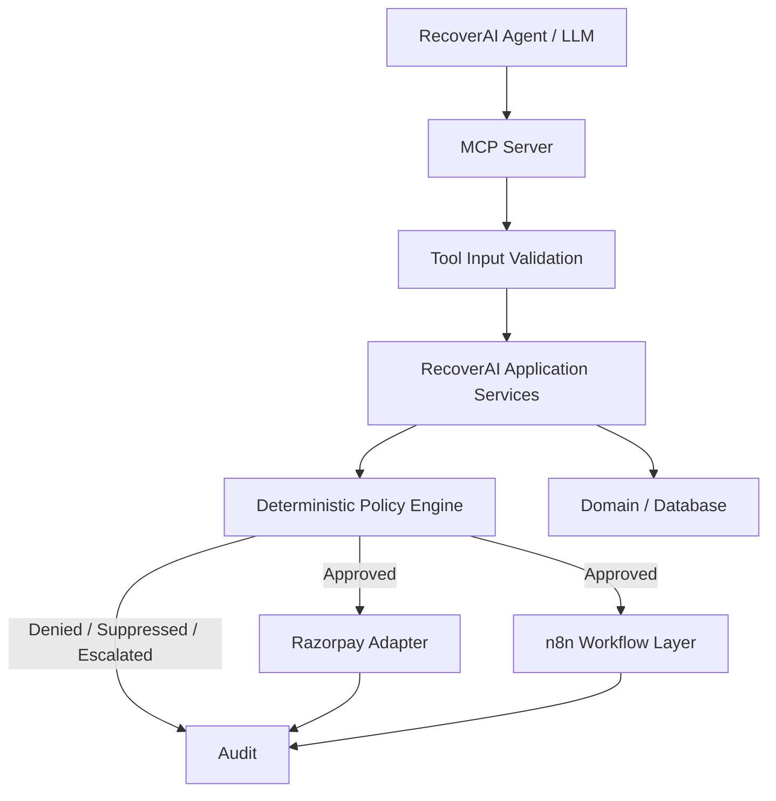
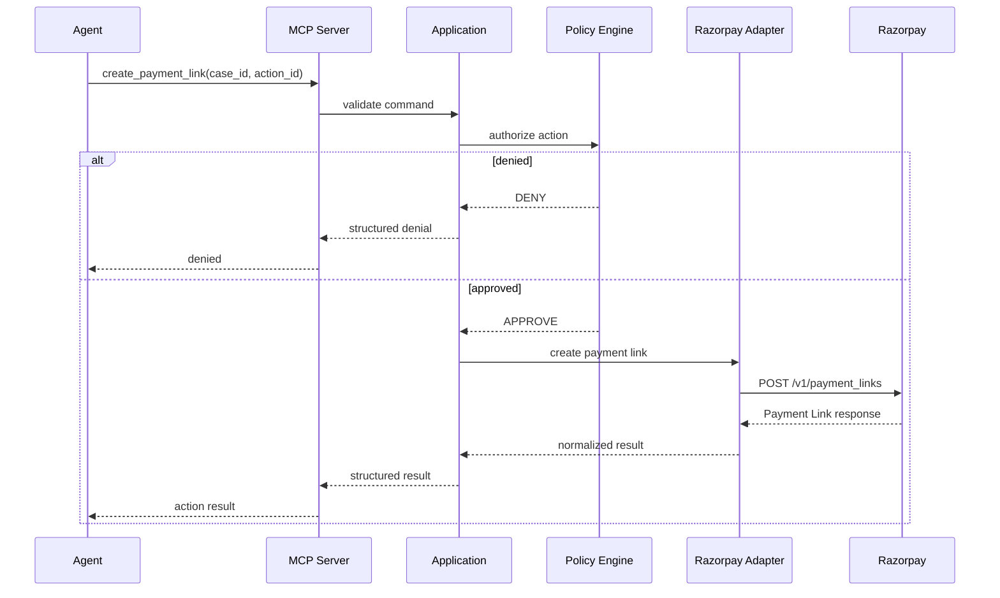
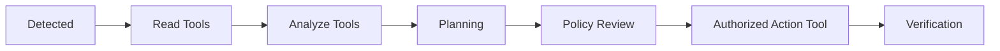
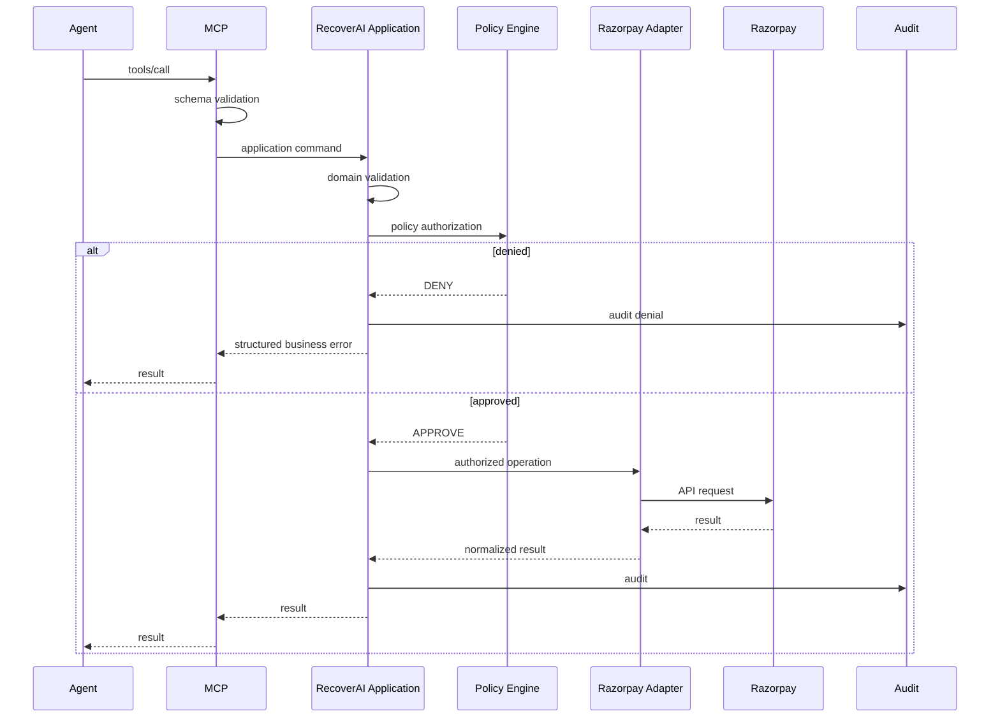

I re-verified the current MCP specification first. One important update since our earlier planning: **the current MCP specification is 2026-07-28**, and it changed the protocol significantly, including a stateless core and full JSON Schema 2020-12 for tool schemas. MCP tool annotations are explicitly **hints, not security guarantees**, so our own Policy Engine must remain authoritative. ([Model Context Protocol Blog][1])

# `docs/10_MCP_TOOL_CONTRACTS.md`

````markdown id="mcp-contracts-2026"
# RecoverAI — MCP Tool Contracts

**Project:** RecoverAI  
**Track:** Razorpay AI Buildathon — Track 03: AI Revenue Recovery  
**Document:** Model Context Protocol (MCP) Tool Architecture & Contracts  
**Status:** Architecture Foundation — Proposed for Freeze  
**Version:** 1.0  
**Last Updated:** 2026-08-26

---

# 1. Purpose

This document defines the MCP boundary used by RecoverAI.

MCP is used to expose controlled, typed capabilities to the AI layer without allowing the model to gain unrestricted access to:

- Razorpay APIs,
- databases,
- workflow infrastructure,
- secrets,
- arbitrary HTTP endpoints,
- or financial execution.

The central principle is:

> **MCP exposes capabilities; RecoverAI Policy authorizes them; the application executes them.**

MCP is therefore an interface layer, not the financial security boundary.

---

# 2. Current MCP Specification

RecoverAI targets the current MCP specification:

```text
2026-07-28
````

The July 28, 2026 MCP release introduced a stateless protocol core, header-based routing, cacheable list results, authorization hardening, and full JSON Schema 2020-12 support for tool schemas. The release also formally deprecated several older mechanisms and changed the lifecycle of long-running Tasks into an extension. ([Model Context Protocol Blog][1])

RecoverAI implementation must target the current MCP specification and current official SDK documentation rather than older examples based on previous MCP protocol versions.

---

# 3. Why RecoverAI Uses MCP

RecoverAI needs a controlled interface between:

```text
AI reasoning
     |
     v
Available capabilities
     |
     v
RecoverAI application
     |
     v
Razorpay / workflow infrastructure
```

Without MCP, an agent implementation could become tightly coupled to provider-specific APIs.

With MCP:

```text
Agent
  |
  v
MCP tools
  |
  v
RecoverAI application
  |
  +--> Policy
  +--> Audit
  +--> Integration
  +--> Verification
```

MCP therefore provides a standardized capability boundary.

---

# 4. MCP Is Not the Authorization Boundary

This is non-negotiable.

MCP tool annotations can describe whether a tool is read-only, destructive, idempotent, or open-world, but the MCP maintainers explicitly describe these annotations as **hints**, not guarantees. A client must not treat them as the security contract unless the tool/server is trusted. ([Model Context Protocol Blog][2])

Therefore:

```text
MCP annotation
    !=
RecoverAI authorization
```

The actual security boundary remains:

```text
LLM recommendation
       |
       v
MCP tool request
       |
       v
RecoverAI validation
       |
       v
Policy Engine
       |
       v
Authorized execution
```

---

# 5. MCP Architecture



The important sequence is:

```text
Tool call
    ->
validation
    ->
domain checks
    ->
policy
    ->
execution
```

---

# 6. MCP Server Responsibilities

The RecoverAI MCP server is responsible for:

* exposing approved tool definitions,
* validating tool arguments,
* authenticating/identifying the calling client where applicable,
* routing tool calls to application services,
* returning structured results,
* returning structured tool errors,
* enforcing tool-level input constraints,
* and providing only the capabilities intentionally exposed by RecoverAI.

The MCP server must not implement business policy independently from the main Policy Engine.

---

# 7. MCP Server Must Not Own Domain Logic

The MCP layer should not contain logic such as:

```python
if amount > 50000:
    deny()
```

or:

```python
if payment_failed:
    create_link()
```

Those decisions belong to:

* domain/application services,
* Revenue Intelligence,
* Policy Engine.

The MCP server only translates:

```text
MCP request
    ->
application command
```

and:

```text
application result
    ->
MCP response
```

---

# 8. Tool Categories

RecoverAI divides MCP tools into four categories:

```text
READ
ANALYZE
PROPOSE
ACT
```

---

# 9. READ Tools

Read tools retrieve information but do not mutate business state.

Initial read tools:

```text
get_recovery_case
get_payment
get_order
get_payment_link
get_customer_context
get_recovery_history
get_system_health
```

The final list is deliberately minimal.

A tool should only exist if the agent actually needs the capability.

---

# 10. ANALYZE Tools

Analyze tools invoke application-side analysis without directly creating financial mutations.

Examples:

```text
assess_recovery_case
assess_payment_degradation
analyze_root_cause
rank_interventions
```

These may invoke ML or LLM reasoning internally.

They must still return structured outputs.

They do not authorize execution.

---

# 11. PROPOSE Tools

The current architecture does not require a separate external-facing MCP proposal tool if the Agent Orchestrator can generate the proposal internally.

Therefore the initial implementation should prefer:

```text
Agent
  ->
application service
  ->
InterventionPlan
```

rather than exposing a generic:

```text
propose_any_action
```

MCP should expose only capabilities that improve the actual agent loop.

---

# 12. ACT Tools

Action tools represent operations that may eventually cause a state mutation.

Initial candidate action tools:

```text
create_payment_link
send_payment_link_notification
cancel_payment_link
escalate_recovery_case
```

These are high-risk compared with read tools.

Every action tool must pass through RecoverAI policy.

---

# 13. Final Initial Tool Registry

The initial tool registry is proposed as:

### READ

```text
get_recovery_case
get_payment
get_order
get_payment_link
get_customer_context
get_recovery_history
get_system_health
```

### ANALYZE

```text
assess_recovery_case
analyze_root_cause
rank_interventions
```

### ACT

```text
create_payment_link
send_payment_link_notification
cancel_payment_link
escalate_recovery_case
```

This registry is intentionally smaller than the potential capabilities of the platform.

New tools require an explicit architecture/implementation decision.

---

# 14. Tool Contract Principle

Every tool must define:

```text
tool name
description
input schema
output schema
permissions
side effects
idempotency semantics
policy requirements
verification behavior
failure behavior
```

A tool without a defined side-effect and verification model must not be exposed as an executable tool.

---

# 15. Current MCP Tool Schema Standard

The current MCP 2026-07-28 specification supports full JSON Schema 2020-12 for tool `inputSchema` and `outputSchema`. The specification retains the root object requirement for `inputSchema` while permitting modern JSON Schema composition and references. ([Model Context Protocol Blog][3])

RecoverAI should therefore use explicit JSON Schemas for all tools.

The implementation must not rely on vague descriptions such as:

```text
"amount": "the amount"
```

without a machine-readable schema.

---

# 16. Example: `get_recovery_case`

## Purpose

Retrieve a specific RecoveryCase.

## Input

```json
{
  "type": "object",
  "properties": {
    "case_id": {
      "type": "string",
      "minLength": 1
    }
  },
  "required": [
    "case_id"
  ],
  "additionalProperties": false
}
```

## Output

Conceptually:

```json
{
  "case_id": "case_001",
  "status": "ASSESSED",
  "amount_at_risk_minor": 50000,
  "currency": "INR",
  "recovery_probability": 0.81,
  "active_action_id": null,
  "systemic_degradation": false
}
```

The actual output schema must reflect the final domain model.

---

# 17. Example: `get_payment`

## Purpose

Retrieve normalized payment information relevant to the recovery case.

## Input

```json
{
  "type": "object",
  "properties": {
    "payment_id": {
      "type": "string",
      "minLength": 1
    }
  },
  "required": [
    "payment_id"
  ],
  "additionalProperties": false
}
```

The tool should return a RecoverAI-normalized payment snapshot rather than a raw Razorpay API response.

---

# 18. Example: `get_order`

## Purpose

Retrieve normalized order information for verification/context.

## Input

```json
{
  "type": "object",
  "properties": {
    "order_id": {
      "type": "string",
      "minLength": 1
    }
  },
  "required": [
    "order_id"
  ],
  "additionalProperties": false
}
```

The application service retrieves the order through the Razorpay adapter.

The MCP layer does not know the Razorpay HTTP endpoint.

---

# 19. Example: `get_payment_link`

## Purpose

Retrieve the current normalized state of a Payment Link.

## Input

```json
{
  "type": "object",
  "properties": {
    "payment_link_id": {
      "type": "string",
      "minLength": 1
    }
  },
  "required": [
    "payment_link_id"
  ],
  "additionalProperties": false
}
```

The tool is read-only.

---

# 20. Example: `get_customer_context`

## Purpose

Provide only customer context relevant to the recovery decision.

The tool must not expose unrestricted customer data.

Potential result:

```json
{
  "customer_id": "customer_001",
  "historical_payment_count": 12,
  "historical_success_rate": 0.91,
  "historical_recovery_rate": 0.67,
  "communication_allowed": true
}
```

The exact fields depend on the finalized domain and privacy requirements.

---

# 21. Example: `get_recovery_history`

The agent can use this tool to understand previous recovery attempts.

Potential result:

```json
{
  "case_id": "case_001",
  "attempts": [
    {
      "action_id": "action_001",
      "action_type": "CREATE_PAYMENT_LINK",
      "status": "VERIFIED_FAILURE"
    }
  ]
}
```

This is important for preventing the agent from proposing an already-failed action repeatedly.

---

# 22. Example: `get_system_health`

This tool exposes normalized system/degradation context.

Potential result:

```json
{
  "systemic_degradation": true,
  "scope": {
    "payment_method": "upi"
  },
  "signals": [
    {
      "type": "RAZORPAY_DOWNTIME",
      "severity": "high"
    },
    {
      "type": "FAILURE_RATE_SPIKE"
    }
  ]
}
```

This is not a raw Razorpay downtime payload.

It is RecoverAI's normalized system-health view.

---

# 23. Analyze Tool: `assess_recovery_case`

This tool invokes the Revenue Intelligence layer.

Purpose:

> Produce a current structured assessment without authorizing an action.

Potential response:

```json
{
  "case_id": "case_001",
  "recovery_probability": 0.81,
  "systemic_degradation": false,
  "root_cause_category": "CUSTOMER_ACTION",
  "cause_confidence": 0.87
}
```

The output is advisory.

No financial mutation occurs.

---

# 24. Analyze Tool: `analyze_root_cause`

This tool invokes the root-cause analysis subsystem.

Potential output:

```json
{
  "category": "CUSTOMER_ACTION",
  "confidence": 0.87,
  "evidence_ids": [
    "evt_001",
    "err_001"
  ],
  "uncertainties": []
}
```

The evidence IDs must be validated.

The model cannot manufacture evidence references.

---

# 25. Analyze Tool: `rank_interventions`

This tool returns candidate interventions.

Example:

```json
{
  "candidates": [
    {
      "action": "CREATE_PAYMENT_LINK",
      "expected_recovery_value_minor": 41000,
      "eligible": true
    },
    {
      "action": "WAIT",
      "expected_recovery_value_minor": 29000,
      "eligible": true
    },
    {
      "action": "ESCALATE",
      "eligible": false,
      "reason": "below_escalation_threshold"
    }
  ]
}
```

The output does not authorize the selected action.

---

# 26. Action Tool: `create_payment_link`

This is a financial-adjacent action tool and therefore requires the strictest controls.

## Input

Conceptually:

```json
{
  "type": "object",
  "properties": {
    "case_id": {
      "type": "string",
      "minLength": 1
    },
    "action_id": {
      "type": "string",
      "minLength": 1
    },
    "requested_expiry": {
      "type": "string",
      "format": "date-time"
    }
  },
  "required": [
    "case_id",
    "action_id"
  ],
  "additionalProperties": false
}
```

The tool should **not** accept arbitrary amount/currency from the LLM if those values can be obtained from the authoritative RecoveryCase.

The application should derive immutable financial fields from the case.

This reduces prompt-level manipulation risk.

---

# 27. `create_payment_link` Execution Flow



The agent does not directly call Razorpay.

---

# 28. `create_payment_link` Policy Requirements

Before execution, RecoverAI must verify:

```text
case is active
payment has not already recovered
no conflicting active action
action is registered
amount/currency come from authoritative case context
recovery attempt limit not exceeded
cooldown satisfied
systemic degradation policy permits action
approval threshold satisfied
current external state permits action
policy version is current
```

The MCP layer must not duplicate this logic.

The Policy Engine is authoritative.

---

# 29. `send_payment_link_notification`

## Input

```json
{
  "type": "object",
  "properties": {
    "case_id": {
      "type": "string",
      "minLength": 1
    },
    "action_id": {
      "type": "string",
      "minLength": 1
    },
    "medium": {
      "type": "string",
      "enum": [
        "sms",
        "email"
      ]
    }
  },
  "required": [
    "case_id",
    "action_id",
    "medium"
  ],
  "additionalProperties": false
}
```

Razorpay currently documents the Payment Link notification API with supported `sms` and `email` media. ([https://razorpay.com/docs/api/payments/payment-links/resend/](https://razorpay.com/docs/api/payments/payment-links/resend/))

---

# 30. Notification Tool Safety

The tool must check:

```text id="u0nqxs"
payment link exists
payment link active
payment not already completed
customer contact exists
medium allowed
notification cooldown satisfied
notification limit not exceeded
case still active
```

A notification operation returning success does not mark the RecoveryCase as recovered.

---

# 31. `cancel_payment_link`

Cancellation is a state mutation.

The tool must require:

```text id="vssrxu"
case_id
action_id
payment_link_id
```

The application verifies that cancellation is actually appropriate.

Valid examples include:

* independent customer payment completed,
* case expired,
* merchant cancelled recovery,
* recovery workflow superseded.

The tool must not be used as a generic cleanup operation after every failed decision.

---

# 32. `escalate_recovery_case`

This action does not perform a Razorpay financial mutation.

It records that autonomous recovery should stop and human/operational handling is required.

Input:

```json
{
  "type": "object",
  "properties": {
    "case_id": {
      "type": "string",
      "minLength": 1
    },
    "reason_code": {
      "type": "string",
      "minLength": 1
    }
  },
  "required": [
    "case_id",
    "reason_code"
  ],
  "additionalProperties": false
}
```

The reason must belong to a controlled taxonomy.

---

# 33. Tool Annotations

Where supported by the current MCP implementation, tools should provide accurate behavior annotations.

For example:

### Read-only tool

```text id="8qohzw"
readOnlyHint = true
```

### Destructive/mutating action

```text id="kp4mfs"
destructiveHint = true
```

### Idempotent operation

```text id="qkw8ax"
idempotentHint = true
```

However, these annotations are only hints according to MCP. They must never be used as the sole financial safety mechanism. ([Model Context Protocol Blog][2])

RecoverAI's Policy Engine remains authoritative.

---

# 34. Tool Risk Classification

RecoverAI should maintain an internal risk classification independent of MCP annotations.

```text id="n8sk13"
READ
LOW

ANALYZE
LOW

COMMUNICATION
MEDIUM

FINANCIAL MUTATION
HIGH

CANCELLATION / REVOCATION
HIGH
```

This classification is internal and drives RecoverAI's own authorization checks.

---

# 35. Internal Tool Registry

Each tool should have metadata:

```json
{
  "name": "create_payment_link",
  "category": "ACT",
  "risk": "HIGH",
  "requires_policy": true,
  "requires_verification": true,
  "idempotency_required": true
}
```

This registry is controlled by the application.

The LLM cannot modify it.

---

# 36. Least Privilege

The agent must only receive tools relevant to its current task.

Example:

## Root-cause analysis

```text
get_payment
get_customer_context
get_recovery_history
get_system_health
```

No action tools.

## Recovery planning

```text
get_recovery_case
get_payment
get_recovery_history
get_system_health
assess_recovery_case
rank_interventions
```

Still no direct financial mutation.

## Authorized recovery workflow

The application may expose the relevant action tool only after the workflow reaches the appropriate stage.

Even then, the Policy Engine performs final authorization.

---

# 37. Progressive Tool Exposure

Tool availability should depend on the workflow phase.

Conceptually:



The model should not see high-risk action capabilities prematurely.

---

# 38. Tool Input Security

Tool inputs must be validated at multiple layers:

```text id="x0kymj"
MCP JSON Schema
        |
        v
Application validation
        |
        v
Domain validation
        |
        v
Policy validation
```

Valid JSON does not imply valid business semantics.

---

# 39. Amount Handling

For financial mutation tools:

> **The LLM should not be trusted to supply the amount.**

The application should derive the amount from the authoritative RecoveryCase.

Example:

Bad:

```json
{
  "case_id": "case_001",
  "amount_minor": 999999999
}
```

Better:

```json
{
  "case_id": "case_001",
  "action_id": "action_001"
}
```

Application:

```text
case_001
   |
   v
authoritative amount
   |
   v
create Payment Link
```

This significantly reduces prompt-manipulation risk.

---

# 40. Currency Handling

Similarly, the LLM should not choose the currency for a financial action.

The application derives it from the RecoveryCase / authoritative financial context.

The tool schema should not accept arbitrary currency where it can be derived.

---

# 41. Tool Output Security

Tool results should expose only information necessary for the next reasoning step.

Do not return:

* API secrets,
* authorization headers,
* internal database credentials,
* raw infrastructure details,
* unrelated customer data.

Example:

Good:

```json
{
  "payment_link_id": "plink_123",
  "short_url": "https://..."
}
```

Potentially unnecessary:

```json
{
  "request_headers": {...},
  "internal_db_row": {...}
}
```

---

# 42. Tool Errors

Tools should return structured errors.

Conceptual response:

```json
{
  "status": "ERROR",
  "error": {
    "code": "POLICY_DENIED",
    "message": "Action is suppressed during active systemic degradation.",
    "retryable": false
  }
}
```

Possible internal categories:

```text
VALIDATION_ERROR
POLICY_DENIED
POLICY_REVALIDATION_REQUIRED
NOT_FOUND
CONFLICT
DUPLICATE_ACTION
EXTERNAL_TIMEOUT
EXTERNAL_ERROR
VERIFICATION_REQUIRED
ESCALATION_REQUIRED
```

The LLM should receive an actionable structured result, not an arbitrary stack trace.

---

# 43. MCP Errors vs Business Errors

The architecture distinguishes:

### Protocol/tool error

```text
invalid tool arguments
unknown tool
schema violation
```

from:

### Business decision

```text
policy denied
case already recovered
systemic degradation
```

and:

### External integration error

```text
Razorpay timeout
Razorpay 429
```

These must not be collapsed into one generic `"error"` string.

---

# 44. Tool Idempotency

Mutation tools should be idempotent at the application level where practical.

For example:

```text id="pby91r"
create_payment_link(case_001, action_001)
```

called twice should not create two logically independent recovery actions.

The application should detect:

```text id="1zdiqg"
action_id already executed
```

and return the existing action state where appropriate.

MCP itself does not guarantee financial idempotency.

RecoverAI must implement it.

---

# 45. Tool Cancellation

Long-running or asynchronously executed operations must have explicit cancellation semantics where the implementation supports them.

The current MCP specification moved long-running Tasks into an extension rather than the core specification. RecoverAI should not assume Task support merely because MCP supports tools. ([Model Context Protocol Blog][1])

For the MVP, long-running recovery workflows should remain controlled by the RecoverAI application/n8n state model unless a concrete MCP Tasks implementation is required and verified.

---

# 46. MCP Statelessness

The current MCP specification uses a stateless protocol core and no longer relies on the old `initialize`/`Mcp-Session-Id` handshake model used by earlier specification versions. ([Model Context Protocol Blog][1])

RecoverAI should therefore avoid building its business correctness around MCP connection/session state.

The authoritative state remains:

```text
RecoverAI database
+
RecoveryCase state machine
+
workflow state
```

MCP is an interface.

---

# 47. MCP Authorization

The current MCP specification contains authorization hardening aligned with OAuth/OIDC deployments, including issuer validation and credential binding to the authorization server. ([Model Context Protocol Blog][1])

For the MVP, if RecoverAI exposes MCP only inside its controlled application boundary, authentication may be simplified appropriately.

However:

> **MCP transport/authentication does not replace RecoverAI's financial Policy Engine.**

Any future remotely exposed MCP server must undergo a separate security design.

---

# 48. Tool Catalog Stability

The current MCP specification introduces cache hints for `tools/list` and deterministic tool-list ordering. ([Model Context Protocol Blog][1])

RecoverAI should maintain a deterministic tool registry and stable ordering where possible.

Tool definitions should not change dynamically based on arbitrary LLM output.

---

# 49. Tool Schema Versioning

Each RecoverAI tool contract should include an internal version.

Example:

```text
create_payment_link.v1
```

A schema change that breaks existing callers should produce a new major version rather than silently changing the old schema.

The MCP protocol version and the RecoverAI tool-contract version are different concepts.

---

# 50. Tool Auditability

Every action-tool invocation should produce:

```text
tool_call_id
case_id
action_id
tool_name
caller
input_hash/reference
policy_decision_id
execution_state
external_reference
outcome
timestamp
```

The audit layer should avoid storing unnecessary sensitive inputs verbatim.

---

# 51. Tool Call Sequence



---

# 52. MCP + n8n Boundary

n8n and MCP solve different problems.

### MCP

Provides structured capabilities to the agent.

### n8n

Executes durable workflows.

The desired relationship is:

```text
Agent
  |
  v
MCP
  |
  v
RecoverAI
  |
  v
Policy
  |
  v
n8n workflow
  |
  v
Razorpay Adapter
```

Not:

```text
Agent
  |
  v
MCP
  |
  v
n8n
  |
  v
raw Razorpay
```

This preserves financial authorization and integration boundaries.

---

# 53. MCP + LLM Provider Boundary

The LLM provider should not know how Razorpay works.

The model sees:

```text
create_payment_link(case_id, action_id)
```

not:

```text
POST https://api.razorpay.com/v1/payment_links
Authorization: Basic ...
```

This prevents provider/model coupling and prevents secrets from entering model context.

---

# 54. MCP + Evaluation Boundary

The synthetic evaluation environment may call the same application services as MCP tools but should not use the model's tool interface as ground truth.

For example:

```text
Simulator
  |
  v
RecoverAI Application
```

and:

```text
Agent
  |
  v
MCP
  |
  v
RecoverAI Application
```

Both converge on the same domain operations.

---

# 55. Tool Reliability Requirements

Every high-risk tool must have:

* explicit timeout,
* bounded retries,
* idempotency,
* audit trail,
* policy authorization,
* verification strategy,
* structured error model.

A tool is not production-worthy merely because an MCP client can call it.

---

# 56. High-Risk Tool Example

For `create_payment_link`:

```text
LLM
 |
 v
MCP call
 |
 v
schema validation
 |
 v
case validation
 |
 v
current external state check
 |
 v
policy
 |
 +---- DENY
 |
 +---- APPROVE
       |
       v
idempotency check
       |
       v
Razorpay adapter
       |
       v
create Payment Link
       |
       v
persist external reference
       |
       v
verification workflow
```

This is the actual financial safety chain.

---

# 57. Tool Exposure Rules

A tool must not be exposed if:

* its executor is not implemented,
* its policy contract is missing,
* its verification strategy is undefined,
* its audit contract is missing,
* its failure behavior is undefined,
* or its external capability is not verified.

This prevents the MCP catalog from promising functionality the system cannot safely deliver.

---

# 58. Initial Tool Registry

| Tool                             | Category | Mutates State | Policy Required |       Verification |
| -------------------------------- | -------- | ------------: | --------------: | -----------------: |
| `get_recovery_case`              | READ     |            No |              No |                 No |
| `get_payment`                    | READ     |            No |              No |                 No |
| `get_order`                      | READ     |            No |              No |                 No |
| `get_payment_link`               | READ     |            No |              No |                 No |
| `get_customer_context`           | READ     |            No |              No |                 No |
| `get_recovery_history`           | READ     |            No |              No |                 No |
| `get_system_health`              | READ     |            No |              No |                 No |
| `assess_recovery_case`           | ANALYZE  |            No |              No |                 No |
| `analyze_root_cause`             | ANALYZE  |            No |              No |                 No |
| `rank_interventions`             | ANALYZE  |            No |              No |                 No |
| `create_payment_link`            | ACT      |           Yes |         **Yes** |            **Yes** |
| `send_payment_link_notification` | ACT      |           Yes |         **Yes** | Operation-specific |
| `cancel_payment_link`            | ACT      |           Yes |         **Yes** |            **Yes** |
| `escalate_recovery_case`         | ACT      |  Domain state |         **Yes** |         Case state |

---

# 59. Tool Registry Freeze Rule

The registry must remain small.

A new tool requires:

1. documented purpose,
2. input schema,
3. output schema,
4. risk classification,
5. policy requirements,
6. idempotency semantics,
7. error behavior,
8. verification strategy,
9. tests,
10. implementation evidence.

A feature is not considered complete merely because its function exists.

---

# 60. Security Invariants

The MCP subsystem must guarantee:

```text
MCP-SEC-001
No arbitrary HTTP tool.

MCP-SEC-002
No direct SQL tool.

MCP-SEC-003
No API-secret exposure to model.

MCP-SEC-004
No financial action without Policy Engine authorization.

MCP-SEC-005
No unknown action names.

MCP-SEC-006
No model-controlled amount/currency override when authoritative case data exists.

MCP-SEC-007
No blind retry after unknown external state.

MCP-SEC-008
All high-risk tool calls are auditable.

MCP-SEC-009
Tool annotations are not treated as authorization.

MCP-SEC-010
MCP protocol/session state does not replace RecoverAI domain state.
```

---

# 61. Failure Matrix

| Failure                  | MCP behavior                   | RecoverAI behavior                 |
| ------------------------ | ------------------------------ | ---------------------------------- |
| Invalid schema           | reject tool call               | no domain action                   |
| Unknown tool             | reject                         | no action                          |
| Policy denied            | structured business error      | audit + no execution               |
| External timeout         | normalized error               | `EXECUTION_UNKNOWN`                |
| Duplicate action         | return existing/conflict state | no duplicate execution             |
| Razorpay 429             | normalized external error      | bounded retry/escalate             |
| n8n unavailable          | workflow failure               | persist case/action state          |
| LLM unavailable          | agent fallback                 | tool layer remains functional      |
| Database unavailable     | fail request                   | no financial mutation              |
| Verification unavailable | action unresolved              | `VERIFICATION_PENDING` / `UNKNOWN` |

---

# 62. Testing Requirements

## Tool contract tests

Verify:

* input validation,
* output schema,
* required fields,
* enum enforcement,
* additional-property rejection.

## Authorization tests

Verify:

* denied action cannot execute,
* approval requirement works,
* stale authorization is rejected,
* terminal cases are blocked.

## Idempotency tests

Verify:

* repeated tool calls don't create duplicate financial actions.

## Integration tests

Verify:

* actual Razorpay Test Mode action,
* webhook correlation,
* verification.

## Security tests

Verify:

* arbitrary tool names rejected,
* arbitrary URLs impossible,
* SQL tool absent,
* secret fields never returned.

---

# 63. MCP Evaluation

The MCP subsystem itself should be evaluated for:

```text
tool schema validity
tool routing correctness
authorization correctness
duplicate prevention
failure handling
latency
audit completeness
```

A tool interface that is technically compliant but bypasses policy is considered a failure.

---

# 64. Definition of Done

MCP integration is complete only when:

1. Current MCP specification is used.
2. Tool schemas are machine-readable.
3. Tool registry is explicit.
4. Read and write tools are separated.
5. High-risk tools are policy-gated.
6. Tool inputs are validated.
7. Tool outputs are structured.
8. Arbitrary HTTP/SQL tools do not exist.
9. Financial amounts are derived from authoritative domain context where possible.
10. Tool calls are auditable.
11. Mutation tools have idempotency behavior.
12. External uncertain state becomes `EXECUTION_UNKNOWN`.
13. MCP annotations are not treated as the security boundary.
14. MCP session/protocol state is not used as domain truth.
15. Current 2026-07-28 specification behavior is reflected in the implementation.

---

# 65. Freeze Decisions

The following decisions are frozen:

1. RecoverAI targets MCP specification `2026-07-28`.
2. MCP is a capability interface, not the financial authorization layer.
3. Policy Engine remains the authoritative safety boundary.
4. Tool schemas use explicit JSON Schema.
5. Tool registry is closed and versioned.
6. Read, analyze, and act capabilities are separated.
7. High-risk action tools require policy authorization.
8. The agent does not receive arbitrary HTTP/database access.
9. Financial amounts/currency should be derived from authoritative domain state.
10. Tool annotations are advisory hints only.
11. MCP protocol state does not represent RecoveryCase state.
12. n8n remains the workflow layer rather than an arbitrary tool backend.
13. Razorpay access occurs through RecoverAI's adapter.
14. Tool failures are normalized and auditable.
15. All high-risk tools require verification semantics.
16. Local MCP server implementation should use the current official SDK compatible with the chosen transport.
17. Long-running MCP Tasks are not required for the initial MVP; n8n/Application state handles long-running workflows unless a specific requirement justifies the MCP Tasks extension.

---

# 66. Next Document

The next specification is:

```text
11_LLM_GATEWAY.md
```

It will define the concrete AI-provider boundary for:

* Gemini,
* Groq,
* Hugging Face Inference Providers,
* provider routing,
* normalized request/response contracts,
* structured output,
* rate-limit behavior,
* retry/fallback strategy,
* token/usage tracking,
* model configuration,
* provider health,
* timeouts,
* prompt versioning,
* and safe degradation when all external AI providers fail.

---

# 67. External References

### MCP — 2026-07-28 Specification

Official MCP specification release information.
[https://blog.modelcontextprotocol.io/posts/2026-07-28/](https://blog.modelcontextprotocol.io/posts/2026-07-28/)
Confirms the current 2026-07-28 protocol, stateless core, header routing, tool catalog caching, authorization hardening, and current protocol lifecycle. ([Model Context Protocol Blog][1])

### MCP — 2026-07-28 Release Candidate

[https://blog.modelcontextprotocol.io/posts/2026-07-28-release-candidate/](https://blog.modelcontextprotocol.io/posts/2026-07-28-release-candidate/)
Documents full JSON Schema 2020-12 support for tool input/output schemas, the Tasks extension, and related breaking changes. ([Model Context Protocol Blog][3])

### MCP Tool Annotations

[https://blog.modelcontextprotocol.io/posts/2026-03-16-tool-annotations/](https://blog.modelcontextprotocol.io/posts/2026-03-16-tool-annotations/)
Documents tool annotations such as `readOnlyHint`, `destructiveHint`, `idempotentHint`, and `openWorldHint`, and explicitly states that annotations are hints rather than guaranteed contracts. ([Model Context Protocol Blog][2])

### MCP TypeScript SDK v2

[https://ts.sdk.modelcontextprotocol.io/v2/](https://ts.sdk.modelcontextprotocol.io/v2/)
Current official TypeScript SDK documentation for the stable MCP v2 line implementing the 2026-07-28 specification. ([Model Context Protocol][4])

---

# 68. Verification Status

## VERIFIED

* Current MCP specification is `2026-07-28`.
* Current specification uses a stateless core.
* Current specification supports full JSON Schema 2020-12 for tool schemas.
* Current specification includes authorization hardening.
* Tool annotations are hints, not security guarantees.
* MCP Tasks are now an extension rather than part of the core protocol.
* Current official SDK documentation targets the 2026-07-28 specification.

## PROPOSED

* Exact RecoverAI tool registry.
* Exact tool schemas.
* Exact tool risk classifications.
* Exact MCP transport choice for the MVP.
* Exact authentication model for the local/controlled deployment.
* Exact idempotency implementation.
* Exact tool-caching strategy.

## NOT YET IMPLEMENTED

All MCP components.

## IMPORTANT

MCP changed materially in the 2026-07-28 specification. The implementation package must use current official SDK/specification documentation rather than older tutorials or examples based on pre-2026-07-28 session semantics.

```
```

[1]: https://blog.modelcontextprotocol.io/posts/2026-07-28/?utm_source=chatgpt.com "The 2026-07-28 Specification | Model Context Protocol Blog"
[2]: https://blog.modelcontextprotocol.io/posts/2026-03-16-tool-annotations/?utm_source=chatgpt.com "Tool Annotations as Risk Vocabulary: What Hints Can and Can't Do | Model Context Protocol Blog"
[3]: https://blog.modelcontextprotocol.io/posts/2026-07-28-release-candidate/?utm_source=chatgpt.com "The 2026-07-28 MCP Specification Release Candidate | Model Context Protocol Blog"
[4]: https://ts.sdk.modelcontextprotocol.io/v2/?utm_source=chatgpt.com "MCP TypeScript SDK"
