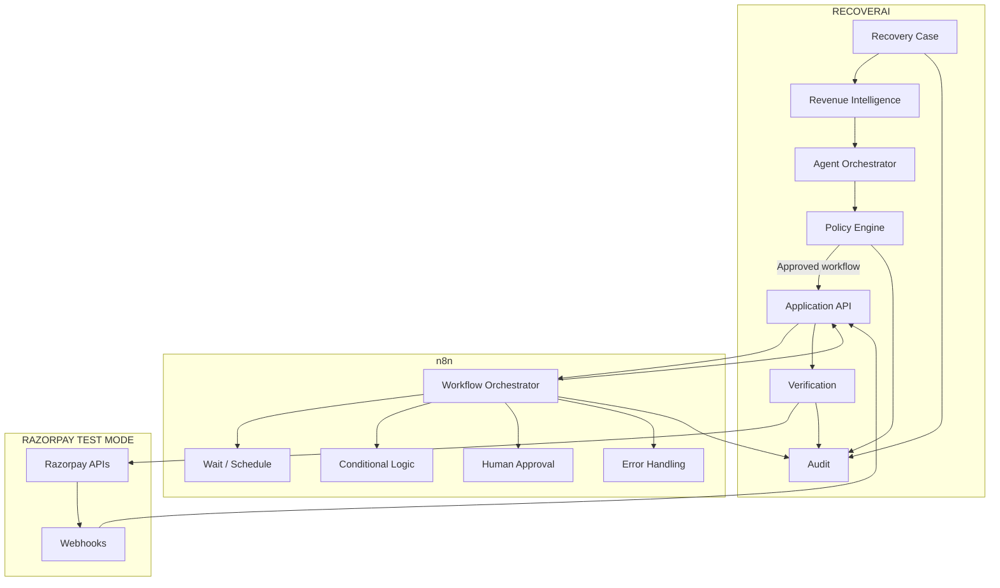
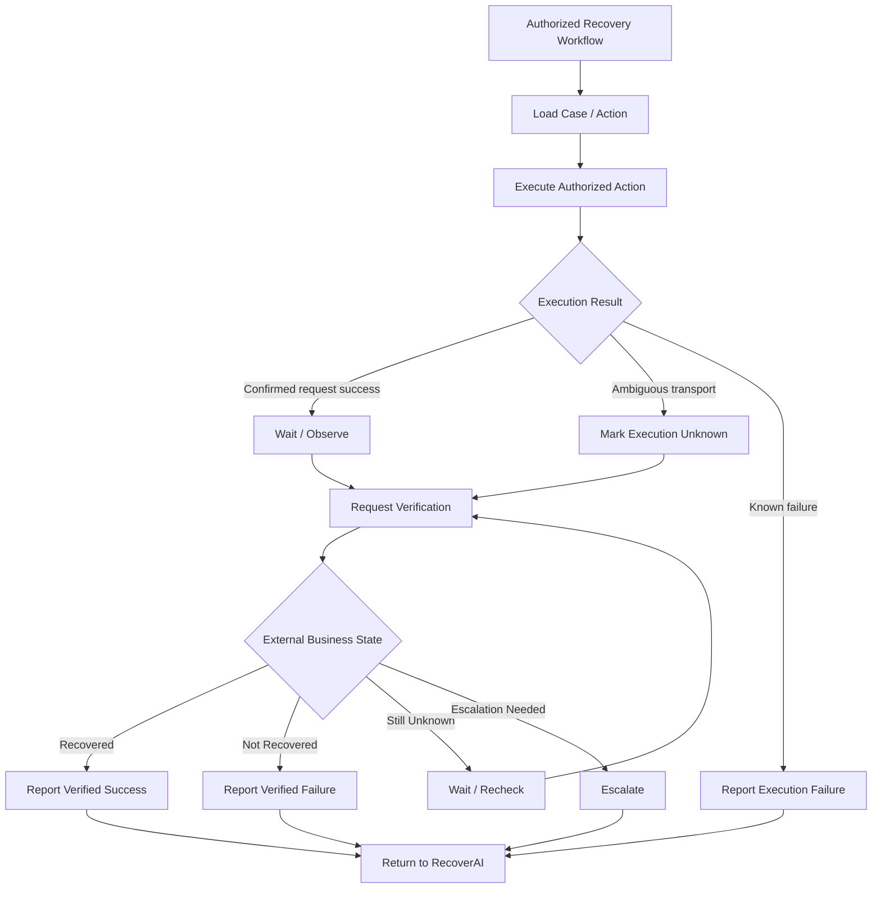
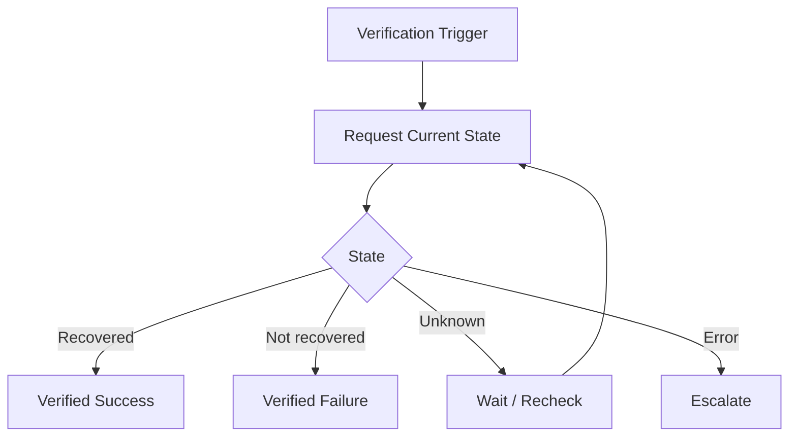
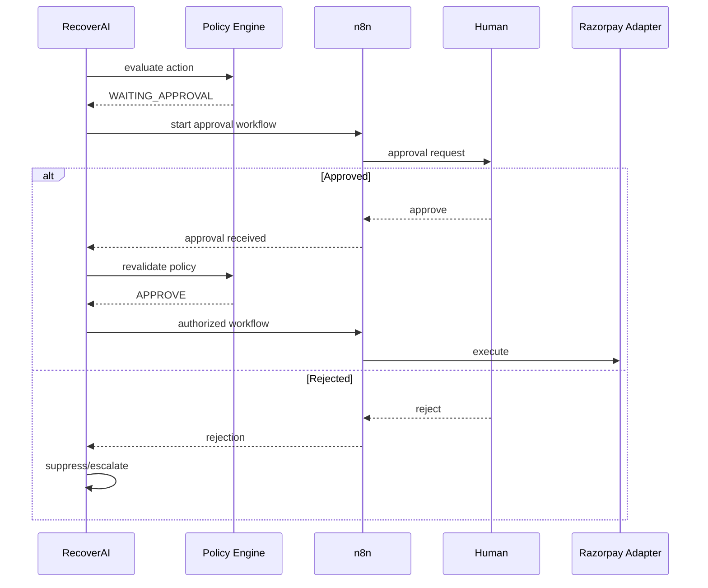
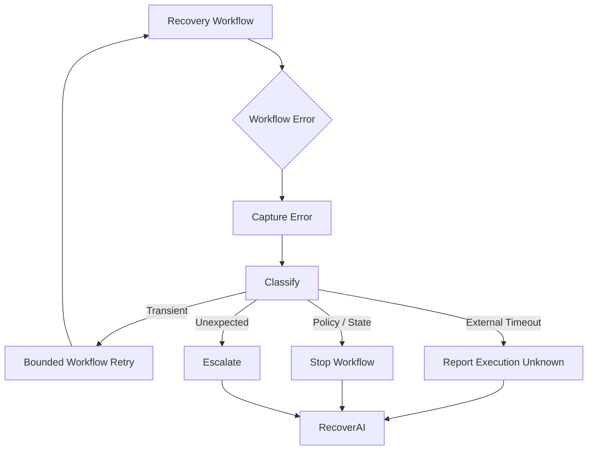
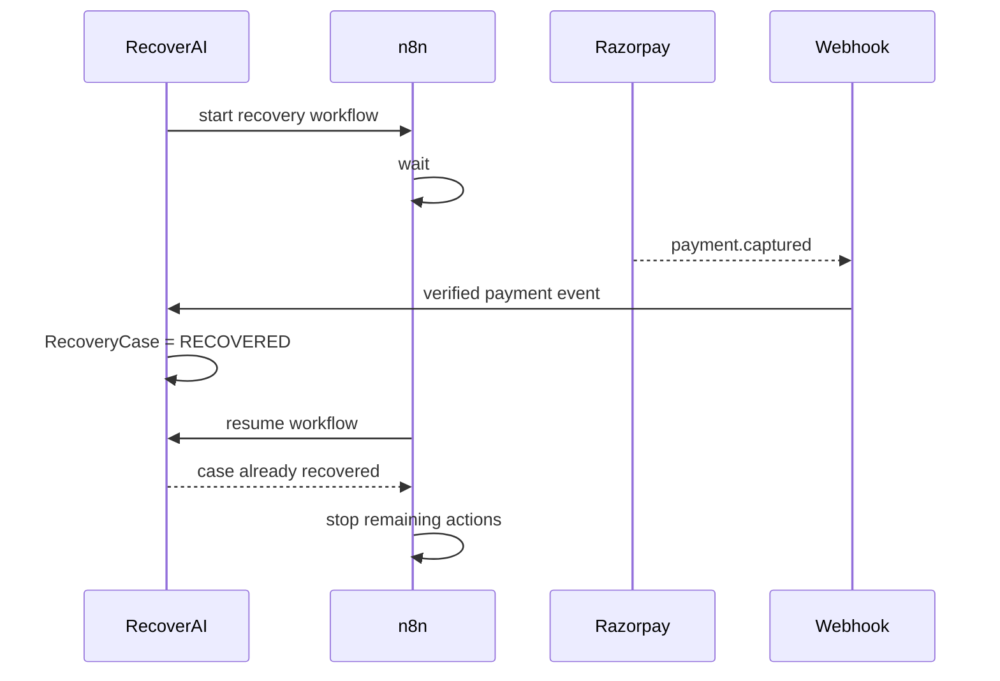
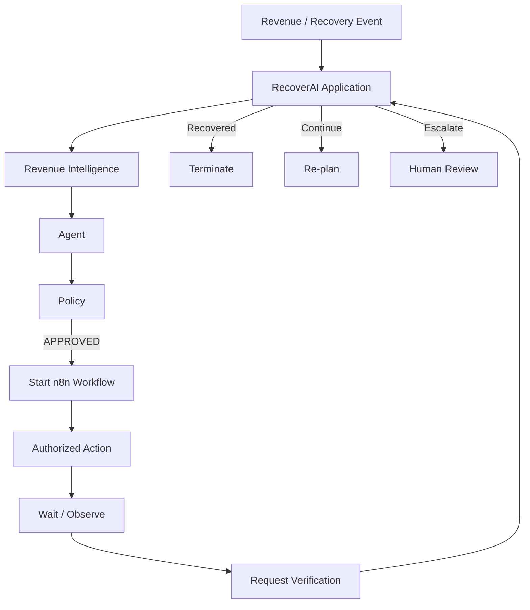

# `docs/12_N8N_WORKFLOWS.md`

````markdown
# RecoverAI — n8n Workflows

**Project:** RecoverAI  
**Track:** Razorpay AI Buildathon — Track 03: AI Revenue Recovery  
**Document:** n8n Workflow Architecture & Execution Contract  
**Status:** Architecture Foundation — Proposed for Freeze  
**Version:** 1.0  
**Last Updated:** 2026-08-26

---

# 1. Purpose

This document defines exactly where n8n fits into RecoverAI and, equally importantly, where it does **not** fit.

n8n is used as a workflow-orchestration component for:

- delayed actions,
- waiting periods,
- scheduled follow-ups,
- workflow branching,
- human approval workflows,
- long-running recovery sequences,
- integration orchestration,
- and operational workflow recovery.

n8n is **not** the source of truth for:

- RecoveryCase state,
- financial authorization,
- policy,
- ML predictions,
- LLM reasoning,
- evaluation ground truth,
- or verified financial outcome.

The central principle is:

> **RecoverAI owns the business decision; n8n owns the durable workflow execution around that decision.**

---

# 2. Why n8n Is Used

RecoverAI contains workflows that naturally span time.

Example:

```text
Payment failure
      |
      v
Assess
      |
      v
Create recovery action
      |
      v
Wait
      |
      v
Check payment
      |
      +---- recovered -> close
      |
      +---- not recovered -> evaluate next step
````

Implementing all of these waiting and scheduling semantics manually would increase application complexity.

n8n already provides workflow primitives for:

* conditional branching,
* looping,
* waiting,
* sub-workflows,
* error handling,
* webhooks,
* schedules,
* and workflow execution management. ([docs.n8n.io](https://docs.n8n.io/workflows/sharing/?utm_source=chatgpt.com))

Therefore n8n is appropriate as an orchestration layer.

---

# 3. Why n8n Is Not the Core Business Engine

n8n is deliberately kept outside the core decision boundary.

Bad architecture:

```text
n8n
 |
 +--> calculate recovery probability
 +--> decide policy
 +--> call LLM
 +--> decide action
 +--> call Razorpay
```

Correct architecture:

```text
RecoverAI
 |
 +--> assess
 +--> decide
 +--> authorize
 |
 v
n8n
 |
 +--> wait
 +--> schedule
 +--> branch
 +--> notify
 +--> trigger verification
 |
 v
RecoverAI
 |
 v
Razorpay
```

The reason is maintainability and safety.

The financial decision must remain:

* typed,
* unit-testable,
* reproducible,
* versioned,
* and independent of a visual workflow definition.

---

# 4. n8n Responsibility Boundary

n8n may own:

```text id="f2p4fy"
WAIT
SCHEDULE
BRANCH
LOOP
WORKFLOW INVOCATION
NOTIFICATION ORCHESTRATION
HUMAN APPROVAL FLOW
ERROR ROUTING
SUB-WORKFLOW COMPOSITION
VERIFICATION TRIGGERS
```

n8n must not own:

```text id="h1b6f1"
RECOVERY PROBABILITY
ROOT-CAUSE TRUTH
POLICY AUTHORIZATION
FINANCIAL OUTCOME
RECOVERYCASE STATE
GROUND TRUTH
MODEL TRAINING
FINANCIAL ARITHMETIC
```

---

# 5. Architecture



---

# 6. Core Principle: RecoverAI Owns State

The authoritative RecoveryCase state remains in RecoverAI.

Example:

```text
RecoverAI:
RecoveryCase = VERIFYING
```

n8n may simultaneously have:

```text
Workflow:
WAITING
```

Those are different states.

n8n workflow status must never be used as the RecoveryCase status.

---

# 7. n8n Workflow Identity

Every n8n workflow invocation associated with a RecoveryCase should be correlated using:

```text
case_id
action_id
workflow_execution_reference
workflow_version/reference
```

Conceptually:

```json
{
  "case_id": "case_001",
  "action_id": "action_001",
  "workflow_name": "payment-recovery-v1",
  "workflow_version": "1",
  "correlation_id": "recovery-case_001-action_001"
}
```

The exact identifiers must be finalized during implementation.

---

# 8. Workflow Boundary

RecoverAI sends n8n an **authorized workflow command**.

Conceptually:

```json
{
  "workflow_type": "PAYMENT_RECOVERY",
  "case_id": "case_001",
  "action_id": "action_001",
  "authorized_action": "CREATE_PAYMENT_LINK",
  "policy_decision_id": "policy_001"
}
```

n8n must not invent another financial action.

The workflow should execute the action that RecoverAI has already authorized.

---

# 9. Workflow Input Must Be Minimal

n8n should receive only information required to execute the workflow.

Do not send:

* API keys,
* webhook secrets,
* full database snapshots,
* hidden evaluation labels,
* unrelated customer history,
* raw LLM prompts.

Example:

```text
case_id
action_id
authorized action
correlation information
workflow configuration
```

The workflow can call RecoverAI APIs for additional data where required.

---

# 10. Workflow Output Must Be Structured

n8n should return a structured execution result to RecoverAI.

Conceptually:

```json
{
  "workflow_execution_id": "exec_001",
  "status": "COMPLETED",
  "case_id": "case_001",
  "action_id": "action_001",
  "result": {
    "action_requested": "CREATE_PAYMENT_LINK",
    "execution_reference": "plink_001"
  }
}
```

This does **not** mean:

```text
recovered = true
```

unless RecoverAI's Verification layer independently establishes the financial outcome.

---

# 11. Primary Workflow: Payment Recovery

The primary n8n workflow is:

```text
Authorized recovery
      |
      v
Execute supported recovery action
      |
      v
Wait / observe
      |
      v
Check external state
      |
      +---- recovered -> RecoverAI
      |
      +---- unresolved -> continue verification
      |
      +---- failed -> RecoverAI for re-planning
```

The workflow should be deliberately small.

---

# 12. Payment Recovery Workflow



The key point is:

> n8n orchestrates the loop; RecoverAI determines what the resulting business state means.

---

# 13. Payment Link Recovery Workflow

The first concrete workflow should be:

```text
Policy approval
      |
      v
Create Payment Link
      |
      v
Persist external Payment Link ID
      |
      v
Optional notification
      |
      v
Wait
      |
      v
Payment Link paid?
      |
  +---+---+
  |       |
 YES      NO
  |       |
  v       v
Verify   Re-check
  |       |
  v       +--> recovery window?
Recovered         |
                  +--> continue
                  |
                  +--> expire/escalate
```

Razorpay provides Payment Link APIs and `payment_link.paid` webhook events suitable for this workflow. ([https://razorpay.com/docs/api/payments/payment-links/](https://razorpay.com/docs/api/payments/payment-links/); [https://razorpay.com/docs/webhooks/payment-links/](https://razorpay.com/docs/webhooks/payment-links/))

---

# 14. n8n Wait Node

n8n provides a Wait node for pausing execution and resuming later. n8n's workflow documentation lists waiting as a core flow-control capability. ([https://docs.n8n.io/workflows/sharing/](https://docs.n8n.io/workflows/sharing/))

RecoverAI can use the Wait node for:

* recovery observation windows,
* customer response windows,
* reminder timing,
* scheduled verification,
* bounded backoff.

Example:

```text
Payment Link created
      |
      v
WAIT
      |
      v
Check status
```

---

# 15. Wait Is Not Business State

When n8n enters:

```text
WAITING
```

RecoverAI should still know:

```text
RecoveryCase = EXECUTING / VERIFYING
```

or another appropriate state.

The n8n wait state is only an orchestration implementation detail.

---

# 16. Verification Workflow

Verification should be a dedicated step rather than assuming workflow completion equals recovery.



RecoverAI owns the interpretation of the result.

n8n only orchestrates the checks.

---

# 17. Event-Driven Verification

Where Razorpay webhooks provide the required event, RecoverAI should prefer event-driven verification rather than unnecessary polling.

For example:

```text
payment_link.paid
      |
      v
RecoverAI Event Ingestion
      |
      v
RecoveryCase verification
```

n8n may then:

* terminate the workflow,
* cancel pending reminder steps,
* trigger case closure.

This avoids unnecessary polling.

---

# 18. Polling as Fallback

Polling may be used when:

* the relevant webhook is unavailable,
* the webhook is delayed,
* a reconciliation operation is required,
* or an external state must be checked after an ambiguous API result.

Polling must be:

* bounded,
* rate-aware,
* cancellable,
* and subject to recovery-window limits.

It must not continue indefinitely.

---

# 19. Verification Backoff

The workflow may use increasing intervals:

```text
30 sec
    ->
2 min
    ->
5 min
    ->
15 min
```

The exact values are not frozen.

They must be selected through implementation/evaluation.

The important principle is:

> **Verification must be bounded by the case's recovery window and external API constraints.**

---

# 20. Human Approval Workflow

n8n supports human-approval patterns. Its documentation provides "send and wait for approval" operations and recommends the Wait node for more complex approval flows. ([https://docs.n8n.io/integrations/builtin/app-nodes/n8n-nodes-base.gmail/message-operations/](https://docs.n8n.io/integrations/builtin/app-nodes/n8n-nodes-base.gmail/message-operations/))

RecoverAI can use n8n to orchestrate:

```text
Policy
  |
  v
WAITING_APPROVAL
  |
  v
n8n approval workflow
  |
  +---- approved
  |
  +---- rejected
  |
  +---- timeout
```

But the resulting approval must return to RecoverAI for policy revalidation before execution.

---

# 21. Human Approval Flow



The critical step is:

```text
approval received
      |
      v
policy revalidation
```

Human approval does not automatically authorize execution.

---

# 22. Workflow Timeouts

Every long-running recovery workflow must have a bounded lifetime.

The bound is based on:

```text
recovery window
```

rather than an arbitrary workflow timeout.

Example:

```text
Recovery window = configured 24h

n8n workflow
    |
    +--> waits/checks within 24h
    |
    +--> expires
```

The exact duration is configuration and must be evaluated.

---

# 23. Workflow Expiry

When the RecoveryCase reaches:

```text
EXPIRED
```

n8n must not continue executing financial actions.

The workflow should:

1. observe the case state,
2. terminate/suppress pending work,
3. notify RecoverAI,
4. record the workflow execution outcome.

---

# 24. Case Closure During Workflow

A case may become recovered independently.

Example:

```text
n8n waiting
    |
    v
customer pays independently
    |
    v
payment.captured
    |
    v
RecoverAI -> RECOVERED
```

The next n8n step must detect:

```text
case.status = RECOVERED
```

and stop pending recovery actions.

This prevents redundant interventions.

---

# 25. Workflow Idempotency

n8n workflow execution must be correlated with RecoverAI's:

```text
case_id
action_id
```

A workflow retry must not automatically create a second financial action.

Example:

```text
Workflow execution #1
    |
    v
create payment link
    |
    v
transport failure
    |
    v
workflow retry
```

The workflow must first check whether:

```text
action_id
```

already has an external Payment Link reference.

If it does:

```text
reuse / reconcile
```

instead of creating another link.

---

# 26. n8n Retry vs Financial Retry

These are different concepts.

### Workflow retry

Retrying an n8n node/workflow after an operational failure.

### Financial retry

Creating another financial recovery action.

A workflow retry must **not** automatically imply a financial retry.

Example:

```text
n8n retry
   |
   v
RecoverAI action state
   |
   +--> action already exists
           |
           v
       reconcile
```

This distinction is mandatory.

---

# 27. Error Handling

n8n provides workflow error-handling capabilities and an Error Trigger node. ([https://docs.n8n.io/workflows/sharing/](https://docs.n8n.io/workflows/sharing/))

RecoverAI should use n8n error handling to:

* capture workflow failures,
* report execution state,
* preserve correlation IDs,
* notify the application,
* and trigger controlled recovery behavior.

It must not use n8n errors to infer financial outcomes.

---

# 28. Error Workflow



---

# 29. n8n Error Handling Does Not Replace Application Error Handling

The application must know:

```text
workflow failed
```

but n8n should not become the only place where failure is recorded.

RecoverAI should persist:

```text
workflow_execution_reference
workflow_status
error_category
timestamp
case_id
action_id
```

in its own operational/audit state.

---

# 30. Sub-Workflows

n8n supports sub-workflows and sub-workflow triggers. ([https://docs.n8n.io/workflows/sharing/](https://docs.n8n.io/workflows/sharing/))

RecoverAI can use sub-workflows for reusable orchestration patterns.

Potential examples:

```text
payment-recovery
    |
    +--> create-payment-link
    |
    +--> send-notification
    |
    +--> verify-payment
    |
    +--> finalize-case
```

However, a sub-workflow should not become a hidden business-rule engine.

---

# 31. Recommended n8n Workflow Decomposition

The initial n8n workflows should be:

```text
01_payment_recovery
02_payment_verification
03_customer_notification
04_human_approval
05_workflow_error_handler
```

Not dozens of tiny workflows.

The exact final workflow count can change based on implementation complexity.

---

# 32. Workflow 01 — Payment Recovery

Purpose:

> Execute an already-authorized recovery action and initiate verification.

Input:

```text
case_id
action_id
authorized_action
policy_decision_id
```

Responsibilities:

* invoke the RecoverAI action API,
* capture external reference,
* schedule/trigger verification,
* stop if case state becomes terminal.

It does not decide whether the action should occur.

---

# 33. Workflow 02 — Payment Verification

Purpose:

> Wait for and/or request evidence needed to determine the external business state.

Possible paths:

```text
Webhook-driven success
API verification
bounded polling
reconciliation
escalation
```

Output:

```text
verified_success
verified_failure
unknown
escalated
```

The application determines how that output affects the RecoveryCase.

---

# 34. Workflow 03 — Customer Notification

Purpose:

> Orchestrate a bounded customer communication sequence.

Example:

```text
Payment Link created
      |
      v
Policy says notification allowed
      |
      v
Send notification
      |
      v
Wait
      |
      v
Payment completed?
      |
      +---- yes -> stop
      |
      +---- no -> continue according to policy
```

Notification itself does not establish recovery.

---

# 35. Workflow 04 — Human Approval

Purpose:

> Orchestrate an approval request generated by the Policy Engine.

n8n owns:

* sending approval request,
* waiting,
* timeout,
* response capture.

RecoverAI owns:

* whether approval is required,
* whether the approval is valid,
* whether the action is still allowed after approval.

---

# 36. Workflow 05 — Error Handler

Purpose:

> Normalize and report workflow failures.

The workflow should include:

```text
error
case_id
action_id
workflow_id
execution_id
timestamp
node
error category
```

RecoverAI then determines:

```text
retry
unknown
escalate
close
```

---

# 37. Workflow Trigger Boundary

n8n may be triggered by:

* RecoverAI API calls,
* webhooks where appropriate,
* schedules,
* workflow-to-workflow execution.

But the primary source of RecoveryCase truth remains RecoverAI.

The preferred pattern is:

```text
RecoverAI command
    |
    v
n8n workflow
```

rather than:

```text
n8n independently decides a recovery case exists
```

---

# 38. n8n Webhook Boundary

If n8n needs to expose a webhook, it should be treated as an integration trigger rather than as the core Razorpay webhook processor unless there is a compelling reason otherwise.

For the MVP:

> Razorpay webhook verification should remain in the RecoverAI integration layer.

Reason:

* raw-body signature verification,
* event deduplication,
* canonicalization,
* domain event processing,
* and financial state correlation

are core application responsibilities.

n8n can orchestrate downstream responses.

---

# 39. Why Razorpay Webhooks Stay Outside n8n

The official Razorpay webhook contract requires raw-body HMAC verification and duplicate handling through `x-razorpay-event-id`. ([https://razorpay.com/docs/webhooks/validate-test/](https://razorpay.com/docs/webhooks/validate-test/))

The RecoverAI architecture therefore keeps:

```text
Razorpay webhook
    |
    v
RecoverAI webhook processor
    |
    v
verified canonical event
    |
    v
n8n if workflow orchestration is required
```

This preserves the financial event boundary.

---

# 40. n8n and MCP

Current n8n documentation includes MCP Client and MCP Server-related nodes. ([https://docs.n8n.io/workflows/sharing/](https://docs.n8n.io/workflows/sharing/))

RecoverAI should still avoid creating:

```text
MCP -> n8n -> arbitrary Razorpay API
```

The preferred relationship is:

```text
MCP
  |
  v
RecoverAI Application
  |
  v
Policy
  |
  v
n8n
```

This avoids making n8n an alternate authorization path.

---

# 41. n8n and Credentials

n8n credentials must be managed through n8n's credential mechanism.

They must not be passed through:

* LLM prompts,
* MCP tool parameters,
* workflow input JSON,
* URLs,
* or custom text fields.

RecoverAI should pass identifiers, not secrets.

---

# 42. n8n Security Audit

n8n currently provides an instance security-audit capability that can inspect:

* credentials,
* database configuration,
* file-system access,
* risky nodes,
* community nodes,
* unprotected webhooks,
* missing security settings,
* and outdated instances. ([https://docs.n8n.io/hosting/securing/security-audit/](https://docs.n8n.io/hosting/securing/security-audit/))

RecoverAI should run the n8n security audit before the final Buildathon demo.

The audit result should be reviewed rather than ignored.

---

# 43. Risky n8n Nodes

n8n's security audit specifically identifies official risky nodes that can execute code or interact with the host system and exposes community/custom nodes as part of the audit. ([https://docs.n8n.io/hosting/securing/security-audit/](https://docs.n8n.io/hosting/securing/security-audit/))

RecoverAI should therefore use the minimum required node set.

Avoid unnecessary use of:

```text
Execute Command
arbitrary file-system operations
untrusted community nodes
unrestricted database query nodes
```

The Buildathon workflow should not rely on host-level command execution.

---

# 44. Workflow Credential Principle

The n8n workflow should not contain:

```text
Razorpay secret
Gemini API key
Groq API key
HF token
database password
```

unless that credential is legitimately required by a specific n8n integration and securely managed by n8n.

For the core financial path, the preferred architecture is:

```text
n8n
   |
   v
RecoverAI internal authenticated endpoint
   |
   v
Razorpay Adapter
```

rather than exposing Razorpay credentials directly to n8n.

---

# 45. n8n Deployment Model

n8n supports multiple hosting approaches, including:

* n8n Cloud,
* npm/self-hosted,
* Docker/self-hosted. ([https://docs.n8n.io/](https://docs.n8n.io/?utm_source=chatgpt.com))

For RecoverAI, the architecture does **not** require Docker.

The chosen deployment method is an implementation/deployment decision and should be optimized for:

* reliable local development,
* simple reproducibility,
* controlled credential management,
* easy demo recovery.

The exact choice belongs in `18_DEPLOYMENT.md`.

---

# 46. Why n8n Should Not Become a Deployment Dependency for Core Logic

RecoverAI's core must remain executable if n8n is temporarily unavailable.

Core operations such as:

```text
event ingestion
case state
policy
verification
audit
evaluation
```

must not disappear because the workflow engine is down.

If n8n is unavailable:

```text
scheduled/delayed workflow
    |
    v
persisted pending state
    |
    v
retry/resume when n8n available
```

rather than:

```text
application failure
```

---

# 47. n8n Failure Model

If n8n becomes unavailable before execution:

```text
RecoverAI
    |
    v
authorized workflow pending
    |
    v
n8n unavailable
```

RecoverAI should persist:

```text
workflow_required = true
```

or an equivalent state.

No financial outcome is assumed.

---

# 48. n8n Failure During Execution

If the workflow is interrupted after an external request may have been sent:

```text
workflow interruption
      |
      v
RecoverAI Action = EXECUTION_UNKNOWN
      |
      v
verification
```

The system must not simply restart the workflow from the beginning.

This is one of the most important boundaries between workflow retry and financial retry.

---

# 49. n8n Failure During Wait

If n8n fails while waiting:

```text
WAIT
  |
  v
n8n unavailable
```

RecoverAI's domain state remains persisted.

When the workflow resumes, it should re-read the current RecoveryCase before performing further action.

This prevents stale workflows from executing after the case has already recovered or expired.

---

# 50. Stale Workflow Protection

Every major n8n step should perform a lightweight state check before a mutating action.

Example:

```text
n8n resumes
    |
    v
Get current case
    |
    +---- RECOVERED -> stop
    |
    +---- EXPIRED -> stop
    |
    +---- SUPPRESSED -> stop
    |
    +---- ACTIVE -> continue only if authorization remains valid
```

This protects against delayed workflow execution.

---

# 51. Workflow Versioning

Workflows should have identifiable versions.

Example:

```text
payment-recovery-v1
payment-verification-v1
```

If a workflow changes materially, the version should change.

Historical executions must remain attributable to the workflow version under which they ran.

---

# 52. n8n Workflow Source Control

n8n documents source-control/environment patterns and recommends avoiding bidirectional push/pull to the same instance because it can cause conflicts and overwritten changes. ([https://docs.n8n.io/source-control-environments/create-environments/](https://docs.n8n.io/source-control-environments/create-environments/))

For RecoverAI, workflow definitions should be versioned with the project where practical.

The implementation process should use a controlled direction:

```text
n8n development
      |
      v
exported workflow artifact
      |
      v
Git
```

or another explicitly chosen one-directional process.

The project must not rely on an undocumented manual workflow copy.

---

# 53. Workflow Artifact Storage

The repository should eventually contain:

```text
workflows/
    n8n/
        payment-recovery.json
        payment-verification.json
        customer-notification.json
        human-approval.json
        error-handler.json
```

These files are source artifacts for the project.

They should not contain production credentials.

The exact export format depends on the n8n implementation.

---

# 54. n8n Execution History

n8n currently provides execution history with statuses including:

```text
Failed
Running
Success
Waiting
```

and allows failed executions to be retried. ([https://docs.n8n.io/workflows/executions/all-executions/](https://docs.n8n.io/workflows/executions/all-executions/))

RecoverAI should use n8n execution history for operational debugging.

However:

> **n8n execution history is not the RecoverAI audit ledger.**

RecoverAI's audit system remains the authoritative record of business decisions and financial actions.

---

# 55. Mapping n8n Execution to RecoverAI

Every workflow invocation should be mapped:

```text
RecoverAI
case_id
action_id
       |
       v
n8n
execution_id
       |
       v
RecoverAI
audit
```

This allows a judge to click:

```text
Recovery Case
    ->
Recovery Action
        ->
n8n Execution
```

and see exactly what happened.

---

# 56. Business Audit vs Workflow Debugging

## RecoverAI audit

Answers:

> What financial/business decision happened?

## n8n execution log

Answers:

> How did the workflow execute?

Both are useful.

They must not be confused.

---

# 57. n8n Workflow Safety Rules

The following rules are mandatory:

```text
N8N-001
No workflow may authorize a financial action.

N8N-002
No workflow may directly modify Policy Engine configuration.

N8N-003
No workflow may declare a payment recovered.

N8N-004
No workflow retry may imply financial retry.

N8N-005
Every mutating step must be correlated to case_id/action_id.

N8N-006
Every long-running workflow must have a bounded lifecycle.

N8N-007
A resumed workflow must re-check current case state.

N8N-008
n8n credentials must not enter LLM/MCP contexts.

N8N-009
Razorpay webhook signature verification remains outside n8n.

N8N-010
High-risk/risky n8n nodes should be minimized and reviewed.
```

---

# 58. Workflow Evaluation

The evaluation system should test:

### Normal completion

Workflow successfully executes and verifies.

### Early recovery

Customer pays before the next workflow step.

### Duplicate trigger

Same recovery workflow is triggered twice.

### Timeout

External request times out.

### Workflow restart

n8n execution is interrupted and resumed.

### Policy invalidation

Case becomes recovered before a delayed step.

### Expiry

Recovery window expires while workflow is waiting.

### n8n failure

Workflow engine becomes unavailable.

---

# 59. Failure Scenario: Independent Recovery



This demonstrates why n8n must read RecoverAI state before continuing.

---

# 60. Failure Scenario: Workflow Retry

```text
n8n
 |
 +--> create Payment Link
 |
 +--> timeout
 |
 v
RecoverAI:
action = EXECUTION_UNKNOWN
 |
 v
n8n retry
 |
 +--> read action state
 |
 +--> external link already exists?
         |
         +--> YES -> reconcile
         |
         +--> NO -> request revalidation
```

The retry does not create a second Payment Link simply because n8n restarted.

---

# 61. Human Approval Timeout

If an approval workflow waits beyond its configured limit:

```text
WAITING_APPROVAL
      |
      v
approval timeout
      |
      v
RecoverAI
      |
      v
EXPIRED / ESCALATED / SUPPRESSED
```

The exact outcome depends on policy.

The workflow must not execute automatically after an approval timeout.

---

# 62. Notification Workflow

Notification orchestration may use:

```text
RecoverAI
   |
   v
n8n
   |
   v
Check active Payment Link
   |
   v
Policy check via RecoverAI
   |
   v
send notification
   |
   v
wait
   |
   v
payment state check
```

The workflow should not use the absence of payment as authorization to continue indefinitely.

---

# 63. Reminder Loop Safety

A reminder workflow must have:

```text
maximum reminders
+
cooldown
+
recovery-window deadline
+
payment-completed termination
```

The exact limits are policy configuration.

Razorpay also provides its own Payment Link reminder functionality, so RecoverAI must ensure that the selected workflow doesn't duplicate Razorpay-managed reminders unintentionally. ([https://razorpay.com/docs/payments/payment-links/reminders/](https://razorpay.com/docs/payments/payment-links/reminders/))

---

# 64. n8n and Revenue Intelligence

n8n must not independently run:

```text
recovery model
degradation model
root cause model
```

Instead:

```text
n8n
   |
   v
RecoverAI API
   |
   v
Revenue Intelligence
```

This ensures that:

* model versions,
* evidence,
* evaluation,
* and audit

remain centralized.

---

# 65. n8n and Policy

n8n may ask:

```text
Is this action still allowed?
```

through a RecoverAI application endpoint.

n8n must not maintain a second copy of policy rules.

Otherwise:

```text
RecoverAI policy
     !=
n8n policy
```

could cause inconsistent authorization.

Single source of truth:

```text
RecoverAI Policy Engine
```

---

# 66. n8n and Razorpay

The preferred path is:

```text
n8n
  |
  v
RecoverAI Action Endpoint
  |
  v
Policy / Action Executor
  |
  v
Razorpay Adapter
  |
  v
Razorpay
```

Avoid:

```text
n8n
  |
  v
raw HTTP Request node
  |
  v
Razorpay
```

for the critical financial path.

The latter creates an alternative execution path capable of bypassing application-level:

* idempotency,
* audit,
* policy,
* verification.

---

# 67. n8n HTTP Requests

n8n may use HTTP Request nodes when interacting with RecoverAI internal services, provided:

* authentication is configured securely,
* inputs are typed/validated,
* endpoints are documented,
* correlation IDs are passed,
* and the application remains the source of financial authority.

n8n's ability to make HTTP requests does not justify giving workflows arbitrary external API access.

---

# 68. n8n and Secrets

n8n credentials must be managed using n8n's credential management.

The workflow JSON exported into Git must be checked to ensure secrets are not embedded.

The final security audit should verify that:

* credentials are protected,
* webhook endpoints are protected,
* risky nodes are reviewed,
* the instance is current,
* and no unnecessary community nodes are installed.

n8n's security audit explicitly checks these areas. ([https://docs.n8n.io/hosting/securing/security-audit/](https://docs.n8n.io/hosting/securing/security-audit/))

---

# 69. Workflow Monitoring

The RecoverAI dashboard should display a normalized workflow status rather than directly exposing all n8n implementation details.

Example:

```text
Recovery Case #42

Workflow:
payment-recovery-v1

State:
WAITING_FOR_PAYMENT

n8n Execution:
exec_9182

Started:
12:32:04

Next Check:
12:37:04
```

This makes the workflow observable without making n8n the product UI.

---

# 70. n8n Availability Requirement

For the golden path:

n8n is allowed to fail.

RecoverAI must degrade gracefully.

Example:

```text
n8n unavailable
      |
      v
Action remains:
AUTHORIZED / WORKFLOW_PENDING
      |
      v
RecoverAI records pending work
      |
      v
workflow resumed later
```

The system should not falsely mark the action as failed or recovered solely because n8n was unavailable.

---

# 71. Minimum n8n Deployment

The MVP should use one n8n instance.

No need for:

* n8n clustering,
* queue-mode scaling,
* multiple worker fleets,
* multi-region orchestration,

unless actual testing proves the workload requires them.

The Buildathon engineering signal comes from clear boundaries and reliable behavior, not infrastructure quantity.

---

# 72. Deployment Flexibility

n8n officially supports Cloud, npm/self-hosting, and Docker-based deployment options. ([https://docs.n8n.io/](https://docs.n8n.io/?utm_source=chatgpt.com))

RecoverAI does not make Docker a core architectural dependency.

The deployment document will select the simplest reliable environment for the final demo.

---

# 73. Workflow Source-of-Truth

The intended source hierarchy is:

```text
Git repository
       |
       v
versioned workflow artifact
       |
       v
n8n instance
       |
       v
execution
```

The project should not rely on manually editing production workflows without exporting/versioning the change.

n8n's source-control documentation recommends one-directional flow between Git and instances to reduce merge conflicts and accidental overwrites. ([https://docs.n8n.io/source-control-environments/create-environments/](https://docs.n8n.io/source-control-environments/create-environments/))

---

# 74. Workflow Documentation

Every workflow must have a small accompanying README or Markdown specification containing:

```text
workflow name
purpose
trigger
inputs
outputs
RecoverAI endpoints used
policy dependency
Razorpay dependency
failure paths
timeout
recovery behavior
version
```

Example:

```text
workflows/
  n8n/
    payment-recovery/
      README.md
      workflow.json
```

---

# 75. Workflow Architecture Diagram



The loop explicitly returns to RecoverAI rather than allowing n8n to decide independently.

---

# 76. n8n Architecture Invariants

The following are immutable:

```text
N8N-ARCH-001
RecoverAI owns RecoveryCase state.

N8N-ARCH-002
RecoverAI Policy Engine owns authorization.

N8N-ARCH-003
Razorpay Adapter owns Razorpay API access.

N8N-ARCH-004
RecoverAI Verification owns financial outcome.

N8N-ARCH-005
n8n owns workflow orchestration.

N8N-ARCH-006
n8n workflow retries do not imply financial retries.

N8N-ARCH-007
All mutating workflow actions require case_id/action_id correlation.

N8N-ARCH-008
Resumed workflows must re-check current case state.

N8N-ARCH-009
n8n cannot modify policy.

N8N-ARCH-010
Razorpay webhook signature verification remains in the application integration layer.
```

---

# 77. Definition of Done

The n8n layer is complete when:

1. Core workflow boundaries are documented.
2. Payment recovery workflow works end-to-end.
3. Waiting/resumption works.
4. Verification is orchestrated correctly.
5. Human approval works where required.
6. Workflow failure is reported back to RecoverAI.
7. Workflow retry does not duplicate financial actions.
8. Stale workflows cannot act on recovered/expired cases.
9. n8n cannot bypass Policy Engine.
10. n8n does not directly own Razorpay financial authority.
11. Workflow artifacts are versioned.
12. Execution IDs are correlated to RecoveryCase/action.
13. n8n security audit passes acceptable checks.
14. Credentials are managed securely.
15. Test Mode demonstration works reliably.
16. n8n failure has a tested graceful-degradation path.

---

# 78. Freeze Decisions

The following are frozen:

1. n8n is a workflow orchestration layer.
2. n8n does not own RecoveryCase state.
3. n8n does not own financial policy.
4. n8n does not define revenue-recovery decisions.
5. n8n does not establish financial outcomes.
6. n8n does not directly bypass the Razorpay Adapter.
7. Razorpay webhook verification remains in RecoverAI.
8. n8n may orchestrate waits, schedules, branching, approvals, notifications, and verification triggers.
9. Workflow retries are distinct from financial retries.
10. Every workflow is correlated using case/action identifiers.
11. Resumed workflows must re-check current RecoverAI state.
12. Workflow execution history supplements, but does not replace, RecoverAI audit.
13. High-risk n8n nodes are minimized and security-audited.
14. n8n availability is not a prerequisite for domain persistence or safe policy enforcement.
15. Docker is not a core architectural requirement for n8n.
16. Versioned workflow artifacts are stored with the repository.
17. The MVP uses a small number of deliberate workflows rather than a fragmented workflow graph.

---

# 79. Next Document

The next specification is:

```text
13_AUDIT_AND_OBSERVABILITY.md
```

It will define:

* the audit event model,
* append-oriented decision history,
* financial-action traceability,
* model/LLM provenance,
* policy provenance,
* Razorpay correlation,
* n8n execution correlation,
* structured logs,
* metrics,
* tracing,
* dashboards,
* privacy/redaction,
* incident reconstruction,
* and the evidence trail needed to demonstrate exactly how RecoverAI recovered or failed to recover revenue.

---

# 80. External References

## n8n Documentation

### n8n overview / hosting options

[https://docs.n8n.io/](https://docs.n8n.io/)
n8n documents Cloud, npm/self-hosting, and Docker deployment options and describes n8n as a workflow automation platform with AI capabilities. ([n8n Documentation][1])

### Workflow control, waiting, sub-workflows, errors, MCP

[https://docs.n8n.io/workflows/sharing/](https://docs.n8n.io/workflows/sharing/)
Current n8n documentation links the relevant workflow-control capabilities including waiting, sub-workflows, error handling, HTTP Request, MCP Client/Server, Wait, Webhook, Schedule Trigger, and related nodes. ([n8n Documentation][2])

### Execution history and retry

[https://docs.n8n.io/workflows/executions/all-executions/](https://docs.n8n.io/workflows/executions/all-executions/)
n8n documents execution-history statuses and retrying failed workflows. ([n8n Documentation][3])

### Human approval

[https://docs.n8n.io/integrations/builtin/app-nodes/n8n-nodes-base.gmail/message-operations/](https://docs.n8n.io/integrations/builtin/app-nodes/n8n-nodes-base.gmail/message-operations/)
n8n documents "Send and Wait for Approval" and recommends the Wait node for more complex approval processes. ([n8n Documentation][4])

### Security audit

[https://docs.n8n.io/hosting/securing/security-audit/](https://docs.n8n.io/hosting/securing/security-audit/)
n8n's security audit checks credentials, database expressions, filesystem access, risky nodes, community/custom nodes, unprotected webhooks, missing settings, and outdated instances. ([n8n Documentation][5])

### Source-control environments

[https://docs.n8n.io/source-control-environments/create-environments/](https://docs.n8n.io/source-control-environments/create-environments/)
n8n recommends avoiding push/pull in both directions against the same instance and recommends controlled source-flow patterns to prevent conflicts and accidental overwrites. ([n8n Documentation][6])

---

# 81. Razorpay References

### Webhook validation

[https://razorpay.com/docs/webhooks/validate-test/](https://razorpay.com/docs/webhooks/validate-test/)
Razorpay documents webhook signature validation, raw-body HMAC verification, duplicate detection and non-guaranteed ordering.

### Payment Webhooks

[https://razorpay.com/docs/webhooks/payments/](https://razorpay.com/docs/webhooks/payments/)
Razorpay documents payment lifecycle events and payment downtime events.

### Payment Links

[https://razorpay.com/docs/api/payments/payment-links/](https://razorpay.com/docs/api/payments/payment-links/)
Razorpay documents Payment Link creation and management APIs.

### Payment Link Webhooks

[https://razorpay.com/docs/webhooks/payment-links/](https://razorpay.com/docs/webhooks/payment-links/)
Razorpay documents Payment Link events including `payment_link.paid`.

### Payment Link Reminders

[https://razorpay.com/docs/payments/payment-links/reminders/](https://razorpay.com/docs/payments/payment-links/reminders/)
Razorpay documents Payment Link reminder behavior and account-level reminder configuration.

---

# 82. Verification Status

## VERIFIED

* n8n provides workflow waiting.
* n8n provides sub-workflows.
* n8n provides error-handling capabilities.
* n8n provides execution history and retry.
* n8n supports human-approval patterns.
* n8n provides MCP Client/Server-related nodes.
* n8n provides a security-audit mechanism.
* n8n supports multiple deployment approaches.
* n8n documents source-control/environment practices.
* Razorpay webhook signature and ordering constraints remain applicable.
* Razorpay Payment Link and Payment Link webhook capabilities remain applicable.

## PROPOSED

* Exact n8n workflow count.
* Exact workflow node structure.
* Exact wait durations.
* Exact retry/backoff configuration.
* Exact approval implementation.
* Exact n8n deployment method.
* Exact RecoverAI↔n8n authentication method.
* Exact workflow artifact format.

## NOT YET IMPLEMENTED

All n8n workflows.

## IMPORTANT

n8n is deliberately treated as an orchestration dependency rather than a source of business truth. Any implementation that moves policy, financial authorization, or authoritative recovery-state logic into n8n must be treated as an architecture violation unless the architecture is explicitly revised.

```
```

[1]: https://docs.n8n.io/?gspk=YmVsYXdpZXJ0ejYxMjI&gsxid=VfgTivn3wWHTVP&ps_partner_key=YmVsYXdpZXJ0ejYxMjI&ps_xid=VfgTivn3wWHTVP&source=belawiertz6122&utm_source=chatgpt.com "Explore n8n Docs: Your Resource for Workflow Automation and Integrations | n8n Docs"
[2]: https://docs.n8n.io/workflows/sharing/?utm_source=chatgpt.com "Sharing | n8n Docs"
[3]: https://docs.n8n.io/workflows/executions/all-executions/?utm_source=chatgpt.com "All executions | n8n Docs"
[4]: https://docs.n8n.io/integrations/builtin/app-nodes/n8n-nodes-base.gmail/message-operations/?utm_source=chatgpt.com "Gmail node Message Operations documentation | n8n Docs"
[5]: https://docs.n8n.io/hosting/securing/security-audit/?utm_source=chatgpt.com "Security audit | n8n Docs"
[6]: https://docs.n8n.io/source-control-environments/create-environments/?utm_source=chatgpt.com "Tutorial - Create environments with source control | n8n Docs"
