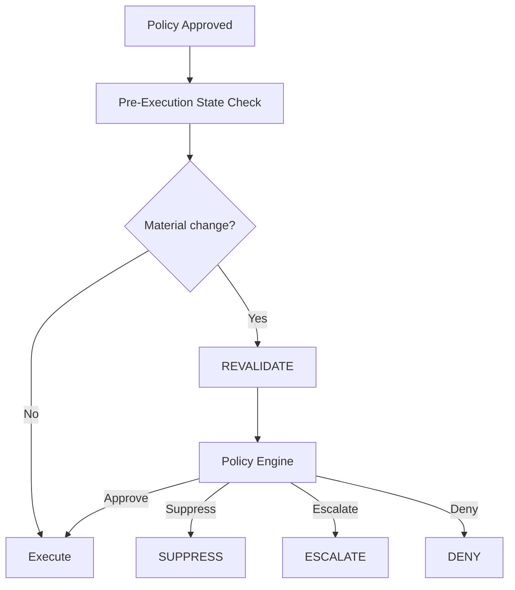
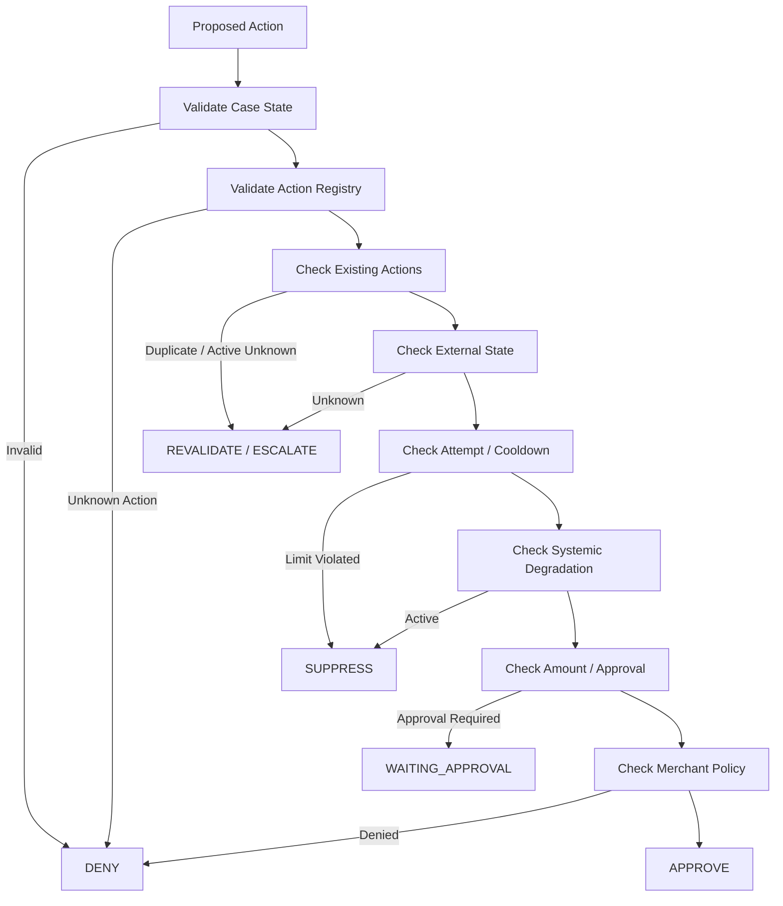
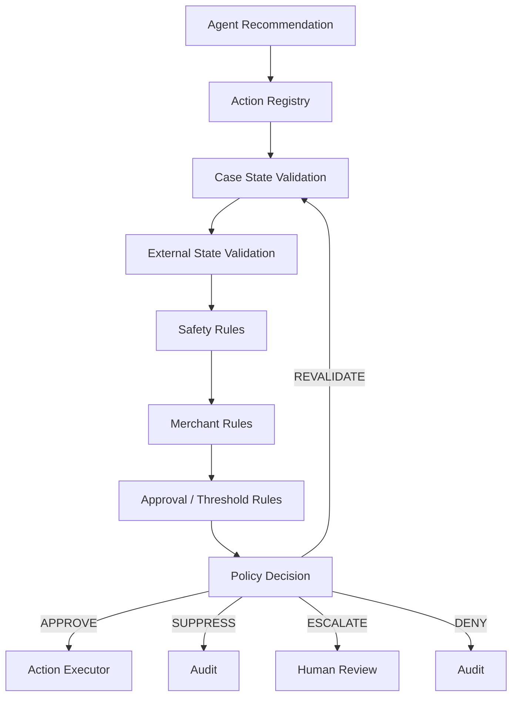

## `docs/08_POLICY_AND_SAFETY.md`

````markdown
# RecoverAI — Policy & Safety

**Project:** RecoverAI  
**Track:** Razorpay AI Buildathon — Track 03: AI Revenue Recovery  
**Document:** Deterministic Policy Engine, Financial Safety & Authorization Contract  
**Status:** Architecture Foundation — Proposed for Freeze  
**Version:** 1.0  
**Last Updated:** 2026-08-26

---

# 1. Purpose

This document defines the deterministic policy and safety boundary of RecoverAI.

The Policy Engine answers one question:

> **Is the proposed recovery action permitted to execute under the current case state, evidence, merchant configuration, system safety rules, and recovery limits?**

The Policy Engine is deliberately separate from:

- the LLM,
- the ML models,
- the Intervention Planner,
- n8n,
- MCP,
- the Razorpay adapter,
- and the frontend.

The most important architectural rule is:

> **AI may recommend a financial action; deterministic policy decides whether that action may execute.**

---

# 2. Safety Objective

RecoverAI is designed to recover revenue.

It must not maximize recovery by ignoring:

- duplicate-action risk,
- uncertain external state,
- customer communication limits,
- recovery attempt limits,
- approval thresholds,
- active system degradation,
- stale case state,
- or other explicitly configured safety constraints.

The Policy Engine therefore acts as a **hard boundary** between probabilistic intelligence and financial execution.

---

# 3. Trust Model

The policy boundary is:

```text
                    PROBABILISTIC
                         |
             +-----------+-----------+
             |                       |
             v                       v
        ML Prediction            LLM Proposal
             |                       |
             +-----------+-----------+
                         |
                         v
                 POLICY ENGINE
                         |
             +-----------+-----------+
             |           |           |
             v           v           v
          APPROVE     SUPPRESS    ESCALATE
             |
             v
        ACTION LAYER
             |
             v
          RAZORPAY
````

The Policy Engine is the first component that can authorize progression toward a financial mutation.

---

# 4. Policy Principles

## 4.1 Deny by default

If an action is not explicitly recognized and eligible:

```text
DENY
```

The system must never infer authorization from an LLM's confidence.

---

## 4.2 No policy bypass

No component may:

* override a policy because recovery probability is high,
* override a policy because the customer is high value,
* override a policy because an LLM recommends it,
* modify policy during execution,
* or create an alternate action to bypass a denied action.

---

## 4.3 Policy is deterministic

Given the same:

```text
policy version
+
normalized case state
+
validated context
+
proposed action
```

the Policy Engine should produce the same decision.

Randomness must not be part of policy evaluation.

---

## 4.4 Authorization is time-sensitive

An authorization is valid only for the state and conditions under which it was produced.

If material state changes before execution, the action must be revalidated.

---

## 4.5 Financial execution requires explicit authorization

No financial mutation may begin from:

```text
PROPOSED
```

or:

```text
PLANNING
```

alone.

The action must reach:

```text
AUTHORIZED
```

through the Policy Engine.

---

# 5. Policy Decision Vocabulary

The Policy Engine returns one of:

```text
APPROVE
DENY
SUPPRESS
ESCALATE
REVALIDATE
```

## `APPROVE`

The proposed action satisfies all required policies and may proceed to the execution layer.

## `DENY`

The proposed action is not allowed.

The case may be replanned or escalated depending on the reason.

## `SUPPRESS`

The system intentionally chooses not to execute the recovery action.

This is a valid business outcome.

## `ESCALATE`

Human or higher-level operational intervention is required.

## `REVALIDATE`

A previously generated decision is no longer valid because relevant state changed.

---

# 6. Policy Domains

RecoverAI policy evaluation is divided into:

```text
1. Case eligibility
2. Action eligibility
3. Attempt limits
4. Duplicate prevention
5. Recovery cooldown
6. Amount / approval thresholds
7. Systemic degradation controls
8. Customer-contact constraints
9. Case freshness
10. External-state uncertainty
11. Workflow validity
12. Merchant configuration
```

Not every merchant needs every rule enabled.

The policy framework should support explicit configuration.

---

# 7. Policy Evaluation Order

Policy evaluation must happen in a deterministic order.

Recommended order:

```text
1. Validate case state
        |
2. Validate action type
        |
3. Validate action eligibility
        |
4. Check terminal/duplicate conditions
        |
5. Check external-state certainty
        |
6. Check attempt/cooldown limits
        |
7. Check systemic degradation
        |
8. Check amount/approval thresholds
        |
9. Check customer communication constraints
        |
10. Check merchant policy
        |
11. Produce final decision
```

The implementation may optimize evaluation internally, but the semantics must remain equivalent.

---

# 8. Policy Evaluation Input

Conceptual input:

```json
{
  "case": {
    "case_id": "case_001",
    "status": "POLICY_REVIEW",
    "amount_at_risk_minor": 50000,
    "currency": "INR",
    "attempt_count": 0,
    "recovery_probability": 0.82
  },

  "proposed_action": {
    "action_type": "CREATE_PAYMENT_LINK"
  },

  "context": {
    "systemic_degradation": false,
    "external_state": "FAILED",
    "customer_contact_allowed": true
  },

  "policy": {
    "policy_version": "1.0"
  }
}
```

The exact domain objects are defined in `03_DOMAIN_MODEL.md`.

---

# 9. Policy Decision Output

Conceptual output:

```json
{
  "policy_decision_id": "pd_001",
  "decision": "APPROVE",

  "policy_version": "1.0",

  "matched_rules": [
    "ACTION_ELIGIBLE",
    "WITHIN_ATTEMPT_LIMIT",
    "NO_ACTIVE_DEGRADATION"
  ],

  "reason_codes": [],

  "evaluated_at": "2026-08-26T12:30:00Z"
}
```

For a denial:

```json
{
  "policy_decision_id": "pd_002",
  "decision": "DENY",

  "policy_version": "1.0",

  "matched_rules": [
    "ACTION_NOT_ALLOWED"
  ],

  "reason_codes": [
    "ACTION_NOT_IN_ALLOWLIST"
  ]
}
```

---

# 10. Action Allowlist

The Policy Engine must evaluate actions against an explicit action registry.

Initial action types:

```text
WAIT
CREATE_PAYMENT_LINK
SEND_PAYMENT_LINK_NOTIFICATION
PAYMENT_LINK_REMINDER
SUPPRESS
ESCALATE
```

Only actions with implemented execution and verification support may become executable.

The list is intentionally smaller than the possible ideas in the Track 03 brief.

---

# 11. Payment Link Safety

Razorpay currently provides APIs to create, fetch, update, cancel, and resend notifications for Payment Links. ([razorpay.com](https://razorpay.com/docs/api/payments/payment-links/))

Razorpay's Create Standard Payment Link API also supports:

* `reference_id`,
* `expire_by`,
* customer details,
* notification options,
* and `reminder_enable`. ([razorpay.com](https://razorpay.com/docs/api/payments/payment-links/create-standard/))

These capabilities create useful policy controls.

For example:

```text
Action:
CREATE_PAYMENT_LINK

Policy checks:
- case active?
- payment still unresolved?
- amount valid?
- no existing active link?
- recovery attempt limit?
- communication permitted?
- expiry allowed?
- systemic degradation?
```

The policy engine may approve the action only after these conditions are satisfied.

---

# 12. Duplicate Recovery Prevention

RecoverAI must prevent multiple active recovery actions from representing the same logical recovery attempt.

Example:

```text
Case #42
    |
    +-- Payment Link Action #1
          |
          +-- EXECUTING
```

A second:

```text
CREATE_PAYMENT_LINK
```

must not automatically execute.

Policy result:

```text
DENY
reason = DUPLICATE_ACTIVE_RECOVERY_ACTION
```

If the first action is `EXECUTION_UNKNOWN`, the system must verify whether it actually succeeded before any new mutating action is considered.

---

# 13. Recovery Attempt Limit

The Policy Engine must support:

```text
max_attempts_per_case
```

The value is configuration, not a universal Razorpay rule.

Example policy:

```yaml
recovery:
  max_attempts_per_case: 2
```

The final default must be determined from the benchmark and product requirements.

Once the limit is reached:

```text
SUPPRESS
```

or:

```text
ESCALATE
```

depending on configured policy.

A model cannot increase the limit.

---

# 14. Cooldown Policy

A cooldown prevents immediate repeated intervention.

Example conceptual configuration:

```yaml
recovery:
  cooldown:
    enabled: true
    duration_seconds: <configured>
```

The exact value must not be invented in architecture documentation.

It must be selected during implementation/evaluation.

The Policy Engine checks:

```text
time_since_last_action >= cooldown
```

before approving another eligible action.

---

# 15. Amount / Approval Thresholds

RecoverAI may support amount-based human approval.

Conceptually:

```yaml
approval:
  high_value_threshold_minor: <configured>
```

Example:

```text
amount > configured threshold
        |
        v
WAITING_APPROVAL
```

The threshold is an internal merchant-policy decision.

It is **not** claimed to be a Razorpay limit.

This distinction must be preserved.

---

# 16. Systemic Degradation Safety Rule

If reliable evidence indicates systemic payment degradation, the system may suppress individual recovery actions.

Example:

```text
Razorpay downtime signal
        +
internal failure-rate spike
        |
        v
systemic_degradation = true
        |
        v
CREATE_PAYMENT_LINK
        |
        v
SUPPRESS
```

Razorpay currently documents payment downtime webhook events such as `payment.downtime.started`, which can provide an external signal that a payment option is underperforming. ([razorpay.com](https://razorpay.com/docs/webhooks/payments/))

RecoverAI must still treat this as contextual evidence rather than blindly assuming every individual payment is unrecoverable.

---

# 17. Degradation Scope

A degradation signal should carry a scope where supported.

Possible examples:

```text
merchant
payment method
instrument/provider
region
time window
```

Policy must not apply a broad suppression rule without evidence supporting that scope.

Example:

```text
UPI degradation
```

does not automatically imply:

```text
all payment methods disabled
```

unless explicit policy says so.

---

# 18. Customer Communication Policy

Razorpay Payment Links support customer notifications and reminders. Razorpay documents SMS/email notification behavior and Payment Link reminders, including the ability to enable/disable reminders and configure reminder behavior. ([razorpay.com](https://razorpay.com/docs/payments/payment-links/reminders/))

RecoverAI therefore needs communication policies for actions such as:

```text
SEND_PAYMENT_LINK_NOTIFICATION
PAYMENT_LINK_REMINDER
```

Potential controls include:

```text
max_notifications_per_case
cooldown_between_notifications
channel_allowlist
customer_contact_available
```

These are RecoverAI/merchant policies, not claims about Razorpay's default behavior.

---

# 19. Payment Link Reminder Safety

Razorpay currently documents a maximum of **three reminders** for account-level Payment Link reminder configurations. ([razorpay.com](https://razorpay.com/docs/payments/payment-links/reminders/))

RecoverAI must not assume that its own application-level reminder policy replaces Razorpay's account-level behavior.

If RecoverAI explicitly manages reminders, it must:

1. know whether reminders are enabled,
2. avoid creating contradictory workflows,
3. avoid duplicate communication,
4. stop reminders when payment is already received,
5. record whether the reminder action was actually requested/executed.

The final integration behavior must be verified in `09_RAZORPAY_INTEGRATION.md`.

---

# 20. Payment Link Expiry Policy

Razorpay's current Create Standard Payment Link documentation supports `expire_by`.

It also documents that:

* the default validity is six months from creation,
* and `expire_by` cannot exceed six months from creation. ([razorpay.com](https://razorpay.com/docs/api/payments/payment-links/create-standard/))

RecoverAI may choose a shorter recovery-specific expiry.

It must not attempt to configure an expiry beyond Razorpay's documented constraint.

Example:

```text
RecoverAI recovery window
       |
       v
proposed expiry
       |
       v
Razorpay-supported expiry
```

If the proposed recovery window exceeds the supported Payment Link expiry range, the policy layer must reject or modify the proposed action rather than silently creating an invalid request.

---

# 21. Merchant Policy

Merchant-configurable policies should be represented separately from system safety invariants.

### Merchant policy examples

```text
maximum recovery attempts
preferred intervention
amount approval threshold
communication preferences
recovery window
```

### System safety invariants

These cannot be disabled by the merchant/agent during autonomous execution.

Examples:

```text
never execute without authorization
never blindly retry unknown state
never declare recovery without verification
never execute an unknown action
never bypass duplicate protection
```

This distinction is important.

---

# 22. Immutable Safety Rules

The following rules should be treated as non-overridable:

```text
SAFETY_001
No financial mutation without policy authorization.

SAFETY_002
No blind retry after EXECUTION_UNKNOWN.

SAFETY_003
No RECOVERED outcome without verification.

SAFETY_004
No execution after terminal case closure.

SAFETY_005
No arbitrary action type outside the action registry.

SAFETY_006
No financial execution based solely on LLM output.

SAFETY_007
No hidden modification of the audit record.

SAFETY_008
No execution when required policy state cannot be evaluated safely.
```

These form the minimum safety kernel.

---

# 23. Policy Rule Structure

Each rule should have a machine-readable structure.

Conceptually:

```json
{
  "rule_id": "SAFETY_002",
  "category": "EXECUTION_SAFETY",
  "priority": 1000,
  "condition": "action.execution_state == EXECUTION_UNKNOWN",
  "decision": "DENY",
  "reason_code": "UNCERTAIN_EXTERNAL_STATE"
}
```

The actual implementation must not evaluate arbitrary expression strings directly from untrusted configuration.

The final rule-engine implementation will define a constrained policy language or typed rule representation.

---

# 24. Policy Priority

Policies may conflict.

Example:

```text
Merchant policy:
maximum 3 recovery attempts

System safety:
maximum autonomous attempts = 2
```

The effective rule must be:

```text
min(merchant_allowance, system_safety_limit)
```

A merchant policy can make the system **more restrictive**.

It cannot weaken an immutable safety invariant.

---

# 25. Policy Decision Precedence

Recommended precedence:

```text
1. System safety invariants
2. Current external-state validity
3. Terminal-case protection
4. Duplicate-action protection
5. Merchant policy
6. Recovery optimization preferences
```

Higher-priority constraints cannot be overridden by lower-priority preferences.

Example:

```text
High recovery probability
        |
        v
Merchant prefers aggressive recovery
        |
        v
System says state = EXECUTION_UNKNOWN
        |
        v
DENY / VERIFY
```

The system must verify first.

---

# 26. Revalidation

A policy decision becomes stale when a material fact changes.

Examples:

```text
payment captured
systemic downtime starts
case expires
attempt count changes
merchant policy changes
active recovery action appears
```

The Policy Engine must detect or receive a signal that revalidation is required.



---

# 27. Case Freshness

A policy decision may depend on current data.

Each decision should retain:

```text
decision_timestamp
context_timestamp / snapshot reference
policy_version
```

Where the action requires fresh external state, the system should verify that the required state has not materially changed before execution.

The exact freshness thresholds are action-specific.

They must be evaluated rather than arbitrarily set.

---

# 28. External State Unknown

If authoritative external state cannot be determined:

```text
Policy decision
        |
        v
external state unknown
        |
        v
REVALIDATE / ESCALATE
```

The Policy Engine must not assume:

```text unknown = safe
```

or:

```text unknown = failed
```

Unknown state remains unknown until resolved.

---

# 29. High-Value Approval

An amount threshold may require:

```text
WAITING_APPROVAL
```

The flow is:

```text
Proposed action
      |
      v
Policy evaluation
      |
      v
amount exceeds autonomous threshold
      |
      v
WAITING_APPROVAL
      |
      +---- APPROVE
      |       |
      |       v
      |   Revalidate
      |       |
      |       v
      |    EXECUTE
      |
      +---- REJECT
              |
              v
          SUPPRESS / ESCALATE
```

Approval does not bypass execution verification.

---

# 30. Human Approval Is Not Policy Override

A human approving a case does not mean:

> "All system safety rules are disabled."

Human approval can satisfy a declared approval requirement.

It cannot authorize:

* an unsupported action,
* an invalid state transition,
* a duplicate unresolved financial action,
* or a known unsafe operation.

---

# 31. Policy Change During Workflow

If the merchant changes a configurable policy while a case is awaiting execution:

```text
Policy Version 10
        |
        v
Action approved
        |
        v
Merchant changes policy
        |
        v
Policy Version 11
        |
        v
Execution attempt
        |
        v
REVALIDATE
```

The old policy decision must not silently authorize execution under the new policy.

---

# 32. Action Registry

The Action Registry defines:

```text
action_type
description
required_context
required_policy_checks
executor
verification_strategy
```

Conceptually:

```json
{
  "action_type": "CREATE_PAYMENT_LINK",
  "executor": "razorpay.payment_links.create",
  "requires": [
    "active_case",
    "verified_amount",
    "valid_customer_context"
  ],
  "verification": "payment_link_paid_or_expired"
}
```

The registry prevents an LLM from inventing executable actions.

---

# 33. Action-Specific Policy Example

## `CREATE_PAYMENT_LINK`

Required checks:

```text
case active
payment not already recovered
no duplicate active payment link
amount valid
currency valid
customer contact available if notification requested
recovery attempt limit
cooldown
systemic degradation
merchant policy
approval threshold
```

If all required checks pass:

```text
APPROVE
```

Otherwise:

```text
DENY / SUPPRESS / ESCALATE / REVALIDATE
```

---

# 34. Action-Specific Policy: Notification

For:

```text
SEND_PAYMENT_LINK_NOTIFICATION
```

required checks may include:

```text
payment link exists
link is active
payment not already completed
customer contact exists
notification channel permitted
communication cooldown satisfied
maximum notifications not exceeded
```

Razorpay currently provides an API to send/resend Payment Link notifications via email or SMS. ([razorpay.com](https://razorpay.com/docs/api/payments/payment-links/resend/))

The Policy Engine decides whether RecoverAI is allowed to invoke that capability.

---

# 35. Action-Specific Policy: Reminder

For:

```text
PAYMENT_LINK_REMINDER
```

the system must verify:

```text
payment link still active
payment not completed
reminder policy permits
cooldown elapsed
reminder count below application limit
```

Razorpay itself supports reminder configuration for Payment Links, including SMS/email reminders, and documents a maximum of three reminders in account-level configuration. ([razorpay.com](https://razorpay.com/docs/payments/payment-links/reminders/))

RecoverAI must not accidentally create a second reminder mechanism that conflicts with the merchant's configured Razorpay reminders.

---

# 36. Suppression Rules

Suppression may occur when:

```text
1. Systemic degradation active
2. Recovery probability below configured threshold
3. Expected value below intervention threshold
4. Cooldown active
5. Maximum attempts reached
6. Customer contact not allowed
7. Payment already recovered
8. Duplicate active recovery
9. Recovery window expired
10. Merchant policy says no intervention
```

Each suppression decision must include a reason code.

---

# 37. Suppression Reason Codes

Initial examples:

```text
SYSTEMIC_DEGRADATION
LOW_EXPECTED_VALUE
COOLDOWN_ACTIVE
MAX_ATTEMPTS_REACHED
ALREADY_RECOVERED
DUPLICATE_ACTION
CUSTOMER_CONTACT_RESTRICTED
RECOVERY_WINDOW_EXPIRED
MERCHANT_POLICY
REQUIRED_CONTEXT_UNAVAILABLE
```

Reason codes must remain machine-readable.

Human-readable explanations can be generated separately.

---

# 38. Escalation Rules

Escalation may occur when:

```text
HIGH_VALUE
STATE_UNKNOWN
POLICY_CONFLICT
INSUFFICIENT_EVIDENCE
REPEATED_FAILURE
REQUIRED_PROVIDER_UNAVAILABLE
UNSUPPORTED_CASE
MANUAL_REVIEW_REQUIRED
```

Escalation must record:

```text
reason_code
case_id
decision_id
timestamp
supporting evidence
```

---

# 39. Fail-Closed Behavior

When policy evaluation itself cannot be safely completed:

```text
Policy Engine unavailable
        |
        v
NO FINANCIAL MUTATION
        |
        +--> persist case
        |
        +--> retry evaluation if safe
        |
        +--> escalate
```

The system must not treat:

```text
policy engine unavailable
```

as:

```text
approve
```

---

# 40. Safety Around AI Provider Failure

If the LLM fails while preparing a proposal:

```text
LLM failure
   |
   +--> deterministic action is already justified
   |       |
   |       v
   |    evaluate policy normally
   |
   +--> contextual reasoning is required
           |
           v
       ESCALATE / SUPPRESS
```

The Policy Engine remains functional even when LLM providers are unavailable.

---

# 41. Safety Around ML Failure

If the recovery-risk model is unavailable:

```text
ML unavailable
      |
      v
No recovery probability
      |
      +--> deterministic strategy sufficient
      |        |
      |        v
      |    continue safely
      |
      +--> decision depends on prediction
               |
               v
            ESCALATE
```

A missing model score must not become:

```text probability = 1.0
```

or any fabricated default that causes aggressive recovery.

---

# 42. Safety Around Degradation Detector Failure

If the degradation detector is unavailable:

```text
degradation status = UNKNOWN
```

The system must not claim:

```text no degradation
```

unless an independent trusted signal establishes it.

A conservative policy may therefore:

```text
avoid aggressive autonomous recovery
```

for cases whose safety depends materially on the degradation signal.

---

# 43. Safety Around Webhook Duplicates

Razorpay documents that duplicate webhook events can occur and recommends `x-razorpay-event-id` for deduplication. ([razorpay.com](https://razorpay.com/docs/webhooks/validate-test/))

Therefore duplicate events must never cause duplicate financial actions.

Example:

```text
Webhook #1
    |
    v
Case updated

Webhook #2
same event ID
    |
    v
ignored
```

---

# 44. Safety Around Out-of-Order Webhooks

Razorpay warns that webhook events may not arrive in order. ([razorpay.com](https://razorpay.com/docs/webhooks/validate-test/))

Therefore:

```text
payment.captured
```

received before:

```text
payment.failed
```

must not cause an automatic downgrade of a recovered case without reconciliation.

Events remain historical observations.

The domain state machine decides the current state.

---

# 45. Financial Outcome Authority

The Policy Engine does not determine whether revenue was recovered.

The outcome is established by:

```text
Verification Layer
        |
        v
Authoritative external state
```

Examples:

```text
payment captured
payment link paid
```

can provide outcome evidence when correctly correlated.

The system must never use:

```text
policy approved
```

as evidence of recovery.

---

# 46. Audit Requirements

Every Policy Decision must record:

```text
policy_decision_id
case_id
action
decision
policy_version
matched_rules
reason_codes
decision_timestamp
input_snapshot/reference
```

Example:

```json
{
  "policy_decision_id": "pd_001",
  "case_id": "case_42",
  "action": "CREATE_PAYMENT_LINK",
  "decision": "SUPPRESS",
  "policy_version": "1.2",
  "matched_rules": [
    "SYSTEMIC_DEGRADATION"
  ],
  "reason_codes": [
    "PAYMENT_DEGRADATION_ACTIVE"
  ],
  "evaluated_at": "..."
}
```

---

# 47. Policy Evaluation Sequence



The implementation may combine checks internally, but all required safety constraints must be semantically enforced.

---

# 48. Policy Engine vs LLM

The following division is mandatory:

| Responsibility                   | LLM |               Policy Engine |
| -------------------------------- | --: | --------------------------: |
| Explain evidence                 | Yes |                          No |
| Generate hypothesis              | Yes |                          No |
| Recommend action                 | Yes |                          No |
| Calculate exact financial amount |  No | Yes / deterministic service |
| Check max attempts               |  No |                         Yes |
| Check cooldown                   |  No |                         Yes |
| Check duplicate action           |  No |                         Yes |
| Check approval threshold         |  No |                         Yes |
| Decide authorization             |  No |                     **Yes** |
| Override policy                  |  No |                      **No** |
| Determine actual payment outcome |  No |           No — Verification |
| Execute Razorpay mutation        |  No |        No — Action Executor |

---

# 49. Policy Testing Requirements

The Policy Engine must have exhaustive tests for:

### Happy path

Eligible action → approve.

### Unknown action

→ deny.

### Duplicate active action

→ deny/revalidate.

### Max attempts

→ suppress/escalate.

### Cooldown active

→ suppress.

### Systemic degradation

→ suppress.

### Amount threshold

→ human approval.

### Unknown external state

→ revalidate/escalate.

### Terminal case

→ deny.

### LLM proposes prohibited action

→ deny.

### Merchant policy conflict

→ higher-priority safety rule wins.

---

# 50. Policy Property Tests

The implementation should include invariants such as:

```text
For any action:
if action not in registry -> decision != APPROVE

For any case:
if case is terminal -> decision != APPROVE

For any action:
if external state is UNKNOWN -> decision != APPROVE
unless a non-mutating verification operation is being approved

For any financial mutation:
if policy authorization absent -> execution forbidden
```

These properties are more important than testing only individual example cases.

---

# 51. Policy Simulation

Before enabling a new policy in the live/Test Mode workflow, it should be testable against synthetic Recovery Cases.

Example:

```text
1000 cases
   |
   v
Policy Engine
   |
   +--> approve
   +--> deny
   +--> suppress
   +--> escalate
```

This allows us to detect overly restrictive or overly permissive policies before they reach the live demo.

---

# 52. Policy Metrics

The evaluation environment should report:

```text
policy adherence
policy violation rate
false approval rate
false suppression rate
escalation rate
duplicate-prevention rate
unknown-state safety rate
```

The critical safety metric is:

> **Unauthorized financial mutations = 0**

This is a target, not a result until the implementation and tests prove it.

---

# 53. Policy Explainability

For every denial/suppression/escalation, the system should answer:

```text
What was proposed?
Which rule blocked it?
What policy version applied?
What evidence triggered the rule?
What would need to change for the action to become eligible?
```

Example:

```text
Action:
CREATE_PAYMENT_LINK

Decision:
SUPPRESS

Rule:
SYSTEMIC_DEGRADATION

Evidence:
Razorpay payment downtime signal +
failure rate above configured baseline

Policy:
v1.2

Next eligible condition:
degradation cleared and case re-evaluated
```

This is valuable for both the merchant and the Buildathon evaluator.

---

# 54. Policy Architecture



The Policy Engine is deterministic and sits between recommendation and execution.

---

# 55. Policy Versioning

Every decision must reference:

```text
policy_version
```

Policy changes create a new version.

Historical decisions remain associated with the version used at decision time.

This allows:

* audit,
* reproducibility,
* incident analysis,
* benchmark comparison.

---

# 56. Policy Configuration vs Code

Policy should be configurable where appropriate:

```text
attempt limits
cooldowns
approval thresholds
recovery windows
communication preferences
```

But safety-critical invariants should remain protected by code-level constraints.

The system must not allow a configuration value to turn:

```text
unknown financial state
```

into:

```text
safe to retry
```

without an explicit verification path.

---

# 57. Policy Security

Policy configuration must be treated as sensitive operational configuration.

Changes should be:

* authenticated,
* authorized,
* validated,
* versioned,
* audited.

An LLM cannot modify policy.

A workflow cannot silently modify policy.

The recovery agent cannot modify policy to make its own recommendation succeed.

---

# 58. What the Agent Must Never Be Able to Do

The agent must never:

```text
change_attempt_limit()
disable_duplicate_protection()
disable_verification()
approve_own_action()
modify_policy()
create_unknown_action()
mark_recovered()
delete_audit_event()
```

Such operations must not exist as agent tools.

---

# 59. Policy Failure Behavior

If the Policy Engine crashes or cannot evaluate a required safety rule:

```text
NO FINANCIAL MUTATION
```

The case should enter:

```text
ESCALATED
```

or remain in a pre-execution state until policy becomes available.

The failure must be observable and auditable.

---

# 60. Minimum Safety Kernel

The following six rules are the minimum non-negotiable safety kernel:

```text
1. Unknown financial state cannot trigger blind retry.

2. No financial mutation without explicit policy authorization.

3. No terminal recovery case can execute a new action.

4. No recovery success without authoritative verification.

5. No action outside the explicit action registry.

6. No AI component can modify or bypass these rules.
```

These rules should be tested independently from the AI layer.

---

# 61. Safety Demonstration for Buildathon

The final demo should intentionally demonstrate at least three policy decisions.

## Case 1 — APPROVE

```text
Normal payment failure
+
valid recovery action
+
within limits
+
no degradation
```

Result:

```text
APPROVE
```

---

## Case 2 — SUPPRESS

```text
Payment failure
+
active systemic degradation
```

Result:

```text
SUPPRESS
```

---

## Case 3 — ESCALATE

```text
High-value recovery action
+
above autonomous approval threshold
```

Result:

```text
WAITING_APPROVAL
```

Then a failure scenario:

```text
Razorpay/API timeout
```

Result:

```text
EXECUTION_UNKNOWN
→ VERIFY
```

This demonstrates that policy is actively controlling the system rather than being a static document.

---

# 62. Definition of Done

The Policy & Safety layer is complete only when:

1. Every executable action is registered.
2. Unknown actions are denied.
3. All financial actions require authorization.
4. Duplicate active actions are prevented.
5. Attempt/cooldown policies work.
6. Systemic degradation can trigger suppression.
7. High-value actions can require approval.
8. External unknown state prevents blind mutation.
9. Policy versions are persisted.
10. Material policy changes cause revalidation.
11. Policy failures fail closed.
12. Every policy decision is auditable.
13. The agent cannot modify policy.
14. Automated tests cover the safety invariants.
15. The full system demonstrates at least one approval, suppression, escalation, and uncertain-state scenario.

---

# 63. Policy Freeze

The following decisions are frozen:

1. The Policy Engine is deterministic.
2. The Policy Engine is the financial authorization boundary.
3. The action vocabulary is closed.
4. Unknown external state cannot authorize blind retries.
5. Duplicate active recovery actions are blocked.
6. Attempt limits and cooldowns are deterministic.
7. Systemic degradation can suppress individual recovery actions.
8. Amount thresholds may require human approval.
9. Merchant policy cannot weaken immutable safety rules.
10. Policy decisions are versioned and auditable.
11. Material state changes require revalidation.
12. Policy failure fails closed.
13. LLM output cannot directly modify or bypass policy.
14. Recovery success is established by verification, not policy approval.
15. Razorpay-specific capabilities are used only as actually documented and implemented.

---

# 64. Next Document

The next specification is:

```text
09_RAZORPAY_INTEGRATION.md
```

It will define the exact live/Test Mode integration contract, including:

* authentication,
* API client design,
* Payment Links,
* payment retrieval,
* Order correlation,
* webhook registration,
* webhook signature verification,
* event mapping,
* Payment Link correlation,
* notification/reminder operations,
* Test Mode constraints,
* error handling,
* rate/usage considerations where documented,
* API verification,
* and the exact set of Razorpay capabilities RecoverAI is allowed to claim in its demo.

---

# 65. External References

### Razorpay Payment Links APIs

[https://razorpay.com/docs/api/payments/payment-links/](https://razorpay.com/docs/api/payments/payment-links/)
Razorpay documents creation, fetching, updating, cancellation, and notification operations for Payment Links. ([Razorpay][1])

### Create Standard Payment Link

[https://razorpay.com/docs/api/payments/payment-links/create-standard/](https://razorpay.com/docs/api/payments/payment-links/create-standard/)
Razorpay documents `reference_id`, `expire_by`, `notify`, `reminder_enable`, and current Payment Link expiry behavior. ([Razorpay][2])

### Payment Link Notifications

[https://razorpay.com/docs/api/payments/payment-links/resend/](https://razorpay.com/docs/api/payments/payment-links/resend/)
Razorpay documents sending/resending Payment Link notifications through SMS/email. ([Razorpay][3])

### Payment Link Reminders

[https://razorpay.com/docs/payments/payment-links/reminders/](https://razorpay.com/docs/payments/payment-links/reminders/)
Razorpay documents automated reminders, reminder configuration, and a maximum of three account-level reminders. ([Razorpay][4])

### Webhook Validation and Idempotency

[https://razorpay.com/docs/webhooks/validate-test/](https://razorpay.com/docs/webhooks/validate-test/)
Razorpay documents raw-body signature validation, duplicate webhook handling through `x-razorpay-event-id`, and non-guaranteed webhook ordering. ([Razorpay][5])

### Payment Webhooks / Downtime

[https://razorpay.com/docs/webhooks/payments/](https://razorpay.com/docs/webhooks/payments/)
Razorpay documents payment lifecycle events and payment downtime signals used by RecoverAI's degradation-aware policy path. ([Razorpay][5])

---

# 66. Verification Status

## VERIFIED

* Payment Link creation/management capabilities.
* Payment Link `reference_id`.
* Payment Link `expire_by` behavior.
* Payment Link notification API.
* Payment Link reminder behavior.
* Current documented maximum of three account-level reminders.
* Razorpay webhook signature validation.
* Razorpay duplicate-event semantics.
* Razorpay non-guaranteed webhook ordering.
* Razorpay payment downtime webhook availability.

## PROPOSED

* RecoverAI policy schema.
* RecoverAI immutable safety rules.
* Attempt limits.
* Cooldowns.
* Approval thresholds.
* Suppression thresholds.
* Policy rule priorities.
* Policy configuration format.
* Action registry implementation.
* Exact policy-engine execution order where equivalent implementations are possible.

## NOT YET IMPLEMENTED

All policy and safety components.

## IMPORTANT

Razorpay's documented limits and product behavior are external constraints. RecoverAI must not encode assumptions that contradict current Razorpay documentation. Internal limits such as recovery attempt counts, cooldowns, and approval thresholds are product-policy choices and must be experimentally evaluated rather than presented as Razorpay requirements.

```
```

[1]: https://razorpay.com/docs/api/payments/payment-links/?utm_source=chatgpt.com "Razorpay Docs"
[2]: https://razorpay.com/docs/api/payments/payment-links/create-standard/?utm_source=chatgpt.com "Razorpay Docs"
[3]: https://razorpay.com/docs/api/payments/payment-links/resend/?preferred-country=IN&utm_source=chatgpt.com "Razorpay Docs"
[4]: https://razorpay.com/docs/payments/payment-links/reminders/?preferred-country=IN&utm_source=chatgpt.com "Send Reminders | Razorpay Docs"
[5]: https://razorpay.com/docs/webhooks/validate-test/?utm_source=chatgpt.com "Validate and Test Webhooks | Razorpay Docs"
