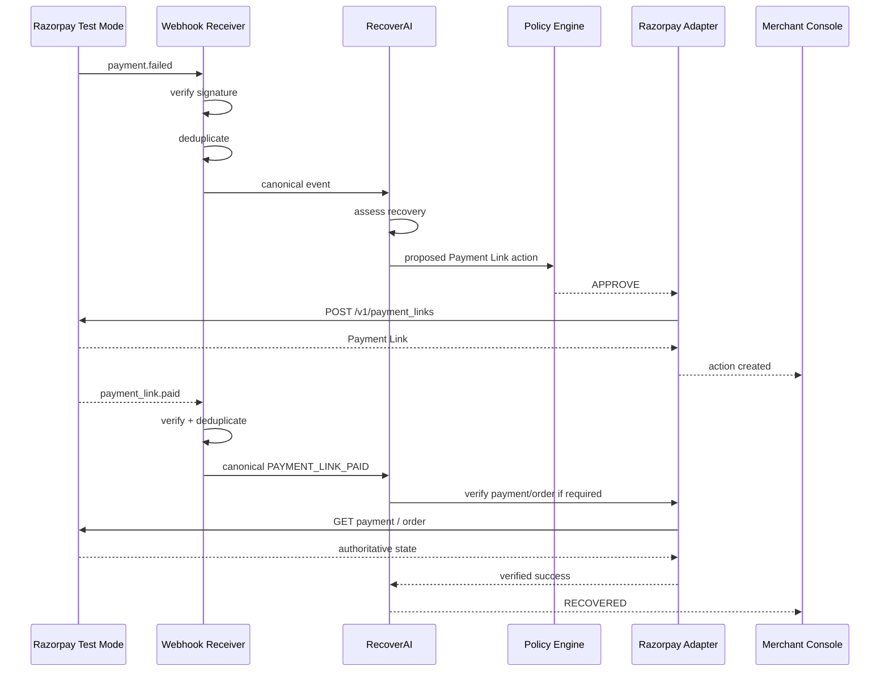
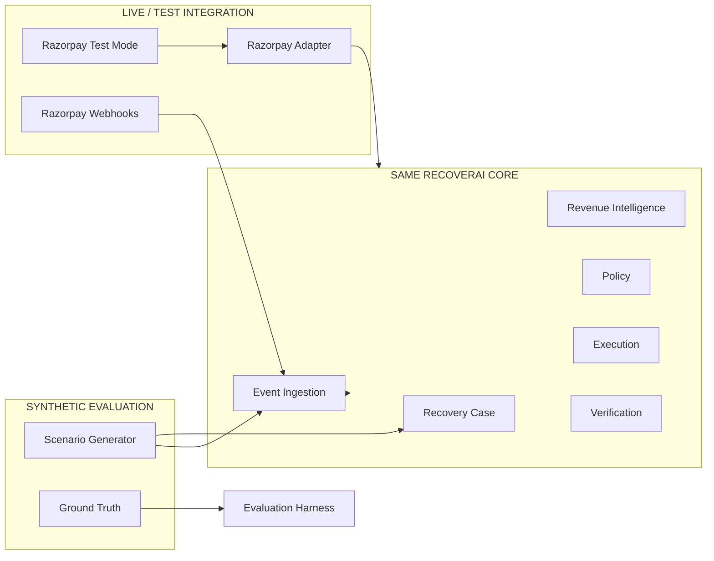
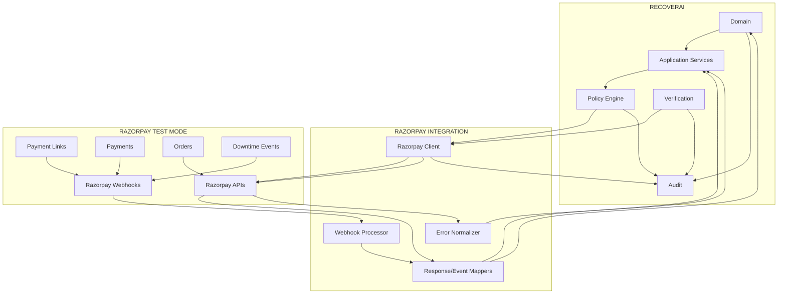

# RecoverAI — Razorpay Integration

**Project:** RecoverAI  
**Track:** Razorpay AI Buildathon — Track 03: AI Revenue Recovery  
**Document:** Razorpay API, Payment Links, Webhooks, Authentication & Integration Contract  
**Last Updated:** 2026-08-26

---

# 1. Purpose

This document defines the exact boundary between RecoverAI and Razorpay.

It establishes:

- authentication,
- API gateway usage,
- Test Mode usage,
- supported Razorpay capabilities,
- Payment Link operations,
- payment retrieval,
- webhook registration and validation,
- event mapping,
- Payment Link correlation,
- verification behavior,
- error handling,
- duplicate handling,
- API-specific constraints,
- and the capabilities RecoverAI may legitimately claim.

The central integration principle is:

> **RecoverAI uses Razorpay as the financial execution and external-state authority. RecoverAI does not attempt to recreate Razorpay's payment infrastructure.**

---

# 2. Integration Boundary

RecoverAI interacts with Razorpay through an explicit adapter.

```mermaid
flowchart LR

    RC["RecoverAI Core"]

    RA["Razorpay Adapter"]

    API["Razorpay APIs"]

    WH["Razorpay Webhooks"]

    VER["Verification Layer"]

    RC --> RA
    RA --> API

    API --> RA
    RA --> RC

    WH --> VER
    VER --> RC
````

The domain layer must not directly construct Razorpay HTTP requests.

The integration layer owns:

* authentication,
* endpoint selection,
* request/response mapping,
* Razorpay-specific error normalization,
* webhook parsing,
* signature verification,
* external identifiers,
* and provider-specific behavior.

---

# 3. Current Razorpay Integration Scope

The initial RecoverAI implementation uses:

### Core

* Razorpay Test Mode.
* Payment-related APIs.
* Payment Links.
* Payment Link notifications where required.
* Payment and Payment Link webhooks.
* Payment status retrieval for verification.
* Order/payment correlation where required.
* Razorpay payment downtime signals where configured.

### Explicitly not required for P0

* Live-mode payments.
* Production merchant onboarding.
* RazorpayX.
* Payouts.
* Route/Linked Accounts.
* Refund automation.
* Arbitrary third-party Razorpay products.
* Generic arbitrary API execution by the agent.

---

# 4. Razorpay Test Mode

Razorpay documents Test Mode as a simulation/testing environment and provides separate Test API Keys. Test Mode transactions do not represent live customer payments. ([https://razorpay.com/docs/api/authentication/](https://razorpay.com/docs/api/authentication/))

RecoverAI must therefore distinguish:

```text
TEST_MODE
```

from:

```text
LIVE_MODE
```

at configuration and runtime.

The MVP must run exclusively against Test Mode.

No Live API credential should be required by the project.

---

# 5. API Authentication

Razorpay APIs currently use HTTP Basic Authentication.

The credentials are:

```text
KEY_ID
KEY_SECRET
```

Razorpay documents the equivalent authorization format as:

```text
Authorization: Basic base64(KEY_ID:KEY_SECRET)
```

and warns that the key secret must be kept secure. ([https://razorpay.com/docs/api/authentication/](https://razorpay.com/docs/api/authentication/))

RecoverAI must never construct authentication headers throughout the application.

Instead:

```text
RecoverAI
    |
    v
Razorpay Client
    |
    v
Authenticated Request
```

---

# 6. Credential Storage

Razorpay credentials must be supplied through environment/configuration mechanisms.

They must never be:

* hard-coded in source,
* committed to Git,
* embedded in frontend code,
* placed in Mermaid diagrams,
* included in test fixtures,
* returned through APIs,
* or exposed in logs.

Expected configuration pattern:

```text
RAZORPAY_KEY_ID
RAZORPAY_KEY_SECRET
RAZORPAY_WEBHOOK_SECRET
```

The exact environment-variable names may be finalized during implementation, but the principle is fixed.

---

# 7. Test and Live Credential Isolation

Configuration must prevent accidental cross-environment use.

Conceptually:

```yaml
razorpay:
  mode: test
```

The application should validate that the configured environment is:

```text
TEST
```

for the Buildathon deployment.

A future live configuration must be explicit and separately configured.

RecoverAI must not automatically "fall back" from Test credentials to Live credentials.

---

# 8. API Gateway

Razorpay currently documents:

```text
https://api.razorpay.com/v1
```

as the gateway URL for most V1 APIs, while some APIs use V2 endpoints. ([https://razorpay.com/docsapi/](https://razorpay.com/docsapi/))

The adapter must therefore construct endpoints through a centralized configuration rather than scattering the gateway URL throughout the codebase.

Example:

```text
RazorpayClient
    |
    +-- gateway_url
    +-- api_version
    +-- endpoint
```

---

# 9. Payments API Boundary

Razorpay explicitly documents that the Payments APIs are used to:

* fetch payment details,
* capture authorized payments,
* retrieve payment-related information.

Razorpay also explicitly states that the Payments API is **not used to collect payments**. ([https://razorpay.com/docs/api/payments/](https://razorpay.com/docs/api/payments/))

This is an important architectural constraint.

RecoverAI therefore must **not** implement or describe:

```text
failed payment
    ->
POST /payments/retry
```

as a Razorpay capability.

That endpoint is not part of the documented Payments API.

---

# 10. Supported Payment API Usage

For RecoverAI, payment APIs are primarily used for:

```text
FETCH PAYMENT
VERIFY PAYMENT STATE
CORRELATE PAYMENT TO ORDER
```

Potentially:

```text
CAPTURE AUTHORIZED PAYMENT
```

may be relevant to some flows, but it is not the primary Track 03 recovery mechanism.

The initial golden path should use Payment Links for payment collection/recovery.

---

# 11. Fetch Payment

Razorpay provides:

```text
GET /v1/payments/:id
```

for retrieving a specific payment. ([https://razorpay.com/docs/api/payments/fetch-payment-expanded-card/](https://razorpay.com/docs/api/payments/fetch-payment-expanded-card/))

The integration adapter should expose a domain-neutral operation:

```text
get_payment(payment_id)
```

and translate the Razorpay response into a RecoverAI payment-state representation.

The domain must not depend on the raw Razorpay response object.

---

# 12. Payment State

Razorpay currently documents payment states including:

```text
created
authorized
captured
refunded
failed
```

for payment retrieval. ([https://razorpay.com/docs/api/payments/fetch-payment-expanded-card/](https://razorpay.com/docs/api/payments/fetch-payment-expanded-card/))

RecoverAI must preserve the external payment state as evidence.

It must not directly reuse it as the RecoveryCase state.

Example:

```text
Razorpay:
payment.failed

RecoverAI:
RecoveryCase = ASSESSED
```

These represent different domains.

---

# 13. Payment Link Integration

Payment Links are the primary live/Test Mode recovery mechanism for the initial MVP.

Razorpay documents Payment Links as URLs that can be sent to customers through email/SMS and used to collect payments. It provides APIs to create, fetch, update, cancel, and send/resend Payment Link notifications. ([https://razorpay.com/docs/api/payments/payment-links/](https://razorpay.com/docs/api/payments/payment-links/))

This gives RecoverAI a legitimate recovery workflow:

```text
Payment-related revenue event
        |
        v
Recovery decision
        |
        v
Policy approval
        |
        v
Create Payment Link
        |
        v
Customer completes payment
        |
        v
Webhook / API verification
        |
        v
Recovered
```

---

# 14. Create Standard Payment Link

Razorpay currently provides:

```http
POST /v1/payment_links
```

for creating a Standard Payment Link. ([https://razorpay.com/docs/api/payments/payment-links/create-standard/](https://razorpay.com/docs/api/payments/payment-links/create-standard/))

The documented request supports fields including:

* amount,
* currency,
* reference_id,
* description,
* customer,
* expire_by,
* notify,
* notes,
* callback_url,
* callback_method,
* reminder_enable.

RecoverAI must use only fields that are actually required for its recovery workflow.

---

# 15. RecoverAI Payment Link Request

The internal domain should not directly expose the entire Razorpay request.

Conceptual application command:

```json
{
  "case_id": "case_001",
  "action_id": "action_001",
  "amount_minor": 50000,
  "currency": "INR",
  "reference_id": "REC-case_001-action_001",
  "description": "Recovery payment request",
  "customer": {
    "name": "Customer",
    "contact": "+91..."
  },
  "expire_by": 0
}
```

The Razorpay adapter converts this into the actual API request.

The precise field mapping must be implemented and tested against the current API schema.

---

# 16. Payment Link `reference_id`

Razorpay documents `reference_id` as a unique reference number for each Payment Link. ([https://razorpay.com/docs/api/payments/payment-links/create-standard/](https://razorpay.com/docs/api/payments/payment-links/create-standard/))

RecoverAI should use this field to establish deterministic correlation between:

```text
RecoveryCase
      |
      v
RecoveryAction
      |
      v
Razorpay Payment Link
```

A suitable internal format can be:

```text
REC-{case_id}-{action_id}
```

subject to the documented size/format constraints.

The implementation must verify the final generated string length before sending it.

---

# 17. Payment Link Correlation Records

For every RecoveryAction that creates a Payment Link, RecoverAI should persist:

```text
case_id
action_id
reference_id
payment_link_id
created_at
```

Additional Razorpay identifiers may be stored where needed for verification.

This creates a direct correlation path:

```text
RecoveryCase
   |
RecoveryAction
   |
reference_id
   |
payment_link_id
   |
payment_link.paid
```

---

# 18. Payment Link Test Mode Limit

Razorpay currently documents:

> In Test Mode, you can create up to 30 Payment Links per business.

Additional testing beyond this requires contacting Razorpay Support. ([https://razorpay.com/docs/api/payments/payment-links/create-standard/](https://razorpay.com/docs/api/payments/payment-links/create-standard/))

This is a hard external constraint.

Therefore:

### Live/Test Mode

Use a small deterministic number of scenarios.

### Synthetic evaluation

Use a much larger batch.

We must not design the benchmark around thousands of actual Payment Link creations.

---

# 19. Payment Link Test Flow

Razorpay documents that Test Mode Payment Links can be opened and tested with a selected success or failure outcome. ([https://razorpay.com/docs/payments/payment-links/create/](https://razorpay.com/docs/payments/payment-links/create/))

This is useful for the final demo.

A controlled live sequence can therefore be:

```text
Create Payment Link
      |
      v
Open Test Payment Page
      |
      +---- SUCCESS
      |
      +---- FAILURE
```

The demonstration should explicitly state that this is a Razorpay Test Mode flow.

---

# 20. Payment Link Expiry

Razorpay documents `expire_by` as a Unix timestamp and states that the default validity is six months, with the expiry date not allowed to exceed six months from creation. ([https://razorpay.com/docs/api/payments/payment-links/create-standard/](https://razorpay.com/docs/api/payments/payment-links/create-standard/))

RecoverAI may choose a shorter recovery-specific expiry.

The system must validate the requested expiry before sending the API request.

Invalid values must be rejected locally rather than relying on Razorpay to reject them.

---

# 21. Payment Link Notifications

Razorpay provides:

```http
POST /v1/payment_links/:id/notify_by/:medium
```

for sending/resending Payment Link notifications. Supported media are:

```text
sms
email
```

Razorpay documents a `429` error when the notification rate limit for the same link/medium is exceeded. ([https://razorpay.com/docs/api/payments/payment-links/resend/](https://razorpay.com/docs/api/payments/payment-links/resend/))

RecoverAI must therefore treat notification attempts as bounded actions.

The action lifecycle should be:

```text
PROPOSED
   ->
POLICY_REVIEW
   ->
AUTHORIZED
   ->
EXECUTING
   ->
VERIFIED / FAILED / UNKNOWN
```

---

# 22. Notification Policy Boundary

Creating a Payment Link and notifying the customer are two distinct operations.

The agent may recommend:

```text
CREATE_PAYMENT_LINK
```

without necessarily recommending:

```text
SEND_PAYMENT_LINK_NOTIFICATION
```

This distinction allows future workflows such as:

```text
create link
    ->
wait
    ->
send notification
```

rather than automatically sending a message after every link creation.

---

# 23. Payment Link Reminder

Razorpay documents reminder functionality for Payment Links and provides account-level controls for reminders. ([https://razorpay.com/docs/payments/payment-links/reminders/](https://razorpay.com/docs/payments/payment-links/reminders/))

RecoverAI must not assume it controls all Payment Link reminders itself.

There are two possible approaches:

### Approach A — Razorpay-managed reminders

RecoverAI configures `reminder_enable` and lets Razorpay manage the reminder lifecycle.

### Approach B — RecoverAI-managed workflow

RecoverAI explicitly schedules and executes reminder actions through its workflow layer.

The MVP should select **one** behavior for a given demo path to avoid duplicate reminder mechanisms.

The final implementation decision must be made after integration testing.

---

# 24. Payment Link Webhooks

Razorpay currently documents Payment Link webhook events, including:

```text
payment_link.paid
payment_link.cancelled
```

and other Payment Link lifecycle events. ([https://razorpay.com/docs/webhooks/payment-links/](https://razorpay.com/docs/webhooks/payment-links/))

The `payment_link.paid` event includes Payment Link, Order, and Payment data in its payload. ([https://razorpay.com/docs/webhooks/payment-links/](https://razorpay.com/docs/webhooks/payment-links/))

This is the primary webhook we need for successful Payment Link recovery.

---

# 25. `payment_link.paid` Handling

When:

```text
payment_link.paid
```

arrives:

```text
Webhook
   |
   v
Signature validation
   |
   v
Deduplicate
   |
   v
Normalize
   |
   v
Identify payment_link_id
   |
   v
Find RecoveryAction
   |
   v
Verify payment/order state if required
   |
   v
Mark action VERIFIED_SUCCESS
   |
   v
Mark RecoveryCase RECOVERED
```

The system must not mark the case recovered merely because the webhook was delivered.

It must correctly correlate the event and determine the financial outcome.

---

# 26. Payment Link Failure/Expiry

A Payment Link may fail to produce recovery.

Where the relevant Payment Link lifecycle event is available, RecoverAI should map it to an appropriate internal observation.

The domain may then transition:

```text
RecoveryCase
   |
   v
NOT_RECOVERED
```

or:

```text
PLANNING
```

if another bounded intervention is still eligible.

The decision is governed by policy and recovery-window rules.

---

# 27. Payment Link Cancellation

Razorpay provides a Payment Link cancellation API. ([https://razorpay.com/docs/api/payments/payment-links/](https://razorpay.com/docs/api/payments/payment-links/))

RecoverAI may use cancellation only when there is a clear domain reason, for example:

```text
customer independently paid
case no longer valid
workflow expired
merchant explicitly cancelled recovery
```

Cancellation must never be used merely because the agent wants to "reset" a workflow.

Every cancellation must be audited.

---

# 28. Payment Verification Strategy

RecoverAI should distinguish:

### Event-based observation

```text
payment.captured
payment_link.paid
```

from:

### API verification

```text
GET payment
GET payment link
GET order
```

The appropriate combination depends on the action.

For critical recovery outcomes, the Verification Layer may use both webhook evidence and current API state.

Razorpay documents payment APIs for fetching payment details and webhook mechanisms for event notification. ([https://razorpay.com/docs/api/payments/](https://razorpay.com/docs/api/payments/))

---

# 29. Verification Is Action-Specific

Example:

### Create Payment Link

Verification may use:

```text
payment_link.paid
+
payment/order state
```

### Send notification

Verification is different:

```text
API response
+
notification operation result
```

This does **not** mean:

```text
notification successful = revenue recovered
```

The action's operational success and the financial outcome remain separate.

---

# 30. Webhook Authentication

Razorpay webhook requests contain:

```text
X-Razorpay-Signature
```

Razorpay documents that the signature is an HMAC-SHA256 hash using the webhook secret and the raw request body. ([https://razorpay.com/docs/webhooks/validate-test/](https://razorpay.com/docs/webhooks/validate-test/))

The integration pipeline must therefore be:

```text
HTTP Request
    |
    v
Raw Body
    |
    v
HMAC Verification
    |
    +---- INVALID -> Reject
    |
    v
Event ID
    |
    v
Deduplication
    |
    v
JSON Parse
    |
    v
Normalization
```

The body must not be parsed and reconstructed before signature verification.

---

# 31. Webhook Secret Rotation

Razorpay documents that if the webhook secret changes, the old secret should be used to validate older requests while retrying those requests. ([https://razorpay.com/docs/webhooks/validate-test/](https://razorpay.com/docs/webhooks/validate-test/))

RecoverAI should therefore support, at minimum, a controlled secret-rotation mechanism or explicit operational configuration for current/previous webhook secrets.

The implementation must not hard-code a single secret in application code.

---

# 32. Webhook Idempotency

Razorpay documents that duplicate webhook events can occur and recommends `x-razorpay-event-id` for deduplication. ([https://razorpay.com/docs/webhooks/validate-test/](https://razorpay.com/docs/webhooks/validate-test/))

RecoverAI must persist the external event ID before allowing the event to create downstream financial effects.

Conceptually:

```text
incoming event
    |
    v
event_id exists?
   /       \
 yes       no
  |         |
ignore    persist
            |
            v
         process
```

The persistence operation must protect against concurrent duplicate processing.

---

# 33. Webhook Ordering

Razorpay explicitly states that webhook order may not always match event order. ([https://razorpay.com/docs/webhooks/validate-test/](https://razorpay.com/docs/webhooks/validate-test/))

RecoverAI therefore uses:

```text
event history
+
current authoritative state
+
domain transition validation
```

rather than:

```text
last webhook received = truth
```

---

# 34. Payment Failure Followed by Capture

Razorpay's current payment webhook documentation describes a case where:

```text
payment.failed
```

can be followed later by:

```text
payment.captured
```

for the same transaction, including user-initiated retry/late authorization scenarios. ([https://razorpay.com/docs/webhooks/payments/](https://razorpay.com/docs/webhooks/payments/))

RecoverAI must therefore support:

```text
payment.failed
    |
    v
Recovery Case
    |
    +---- customer independently retries
    |
    v
payment.captured
    |
    v
Recovery = SUCCESS
```

Any pending automated recovery action must then be cancelled/suppressed to prevent redundant intervention.

---

# 35. Payment Downtime Webhooks

Razorpay currently documents payment downtime webhook events such as:

```text
payment.downtime.started
payment.downtime.updated
```

and provides downtime information such as method, severity/status, beginning and ending times where available. ([https://razorpay.com/docs/webhooks/payments/](https://razorpay.com/docs/webhooks/payments/))

RecoverAI should consume these events as **contextual system-health signals**.

They should feed:

```text
Revenue Intelligence
    ->
Systemic Degradation Assessment
    ->
Recovery Policy
```

They should not directly mutate individual RecoveryCases without domain evaluation.

---

# 36. Razorpay Integration Error Model

The adapter must normalize Razorpay API errors into internal categories.

Potential categories:

```text
AUTHENTICATION_ERROR
VALIDATION_ERROR
NOT_FOUND
CONFLICT
RATE_LIMITED
TEMPORARY_PROVIDER_ERROR
NETWORK_ERROR
TIMEOUT
UNKNOWN_EXTERNAL_ERROR
```

These are RecoverAI categories.

They are not claims that Razorpay uses exactly these names.

The original Razorpay response/error information should remain available in integration-level diagnostics where safe.

---

# 37. HTTP Status Handling

The adapter must not treat:

```text
HTTP 200
```

as:

```text
financial_success
```

nor:

```text
HTTP 4xx
```

as:

```text
payment_failed
```

Instead:

```text
HTTP response
    |
    v
Razorpay response interpretation
    |
    +--> API operation success/failure
    |
    v
separate business-state verification
```

This distinction is mandatory.

---

# 38. Rate Limiting

Razorpay APIs can return rate-limit errors. For example, Razorpay's Payment Link notification API documents a `429` response when the per-link/per-medium notification limit is exceeded. ([https://razorpay.com/docs/api/payments/payment-links/resend/](https://razorpay.com/docs/api/payments/payment-links/resend/))

RecoverAI must implement bounded handling:

```text
429
 |
 +--> wait according to configured retry policy
 |
 +--> retry only if operation is safely retryable
 |
 +--> otherwise escalate / fail
```

The project must not blindly retry a mutating action indefinitely.

---

# 39. Retry Classification

Razorpay errors should be classified into:

### Safe-to-retry

Only where:

* the operation is known to be safely retryable,
* idempotency/correlation is preserved,
* the prior execution state is known or independently verified,
* retry count remains within policy.

### Verify-before-retry

For ambiguous transport outcomes:

```text
timeout
connection reset
unknown response
```

### Do-not-retry

For deterministic errors such as:

```text
invalid request
invalid credentials
unsupported action
```

The exact error mapping will be implemented after testing actual Test Mode responses.

---

# 40. Razorpay Adapter Interface

The internal interface should be domain-oriented.

Conceptually:

```python
class RazorpayGateway:
    def get_payment(self, payment_id: str) -> PaymentSnapshot:
        ...

    def get_order(self, order_id: str) -> OrderSnapshot:
        ...

    def create_payment_link(
        self,
        request: CreatePaymentLinkRequest,
    ) -> PaymentLinkSnapshot:
        ...

    def get_payment_link(
        self,
        payment_link_id: str,
    ) -> PaymentLinkSnapshot:
        ...

    def send_payment_link_notification(
        self,
        payment_link_id: str,
        medium: NotificationMedium,
    ) -> NotificationResult:
        ...

    def cancel_payment_link(
        self,
        payment_link_id: str,
    ) -> PaymentLinkSnapshot:
        ...
```

This is a **conceptual contract**, not final implementation code.

Methods must only be added after the corresponding official Razorpay API capability is verified.

---

# 41. Adapter Responsibilities

The adapter owns:

```text
authentication
endpoint construction
HTTP client
timeouts
request serialization
response parsing
Razorpay error mapping
external ID extraction
```

The adapter does not own:

```text
recovery strategy
policy
ML predictions
LLM reasoning
RecoveryCase state transitions
evaluation scoring
```

---

# 42. Integration DTOs vs Domain Objects

The integration layer should define Razorpay-specific DTOs.

Example:

```text
RazorpayPaymentResponse
RazorpayPaymentLinkResponse
RazorpayOrderResponse
RazorpayWebhookPayload
```

These must be translated into:

```text
PaymentSnapshot
PaymentLinkSnapshot
OrderSnapshot
RevenueEvent
```

This prevents the Razorpay API schema from becoming the domain schema.

---

# 43. Webhook Adapter Contract

The webhook adapter should expose something like:

```python
class RazorpayWebhookProcessor:
    def verify_signature(
        self,
        raw_body: bytes,
        signature: str,
        secret: str,
    ) -> None:
        ...

    def extract_event_id(
        self,
        headers: Mapping[str, str],
    ) -> str:
        ...

    def normalize(
        self,
        raw_event: Mapping[str, Any],
    ) -> CanonicalRevenueEvent:
        ...
```

The final implementation must use the actual Razorpay webhook headers and raw-body signature behavior documented by Razorpay. ([https://razorpay.com/docs/webhooks/validate-test/](https://razorpay.com/docs/webhooks/validate-test/))

---

# 44. Razorpay Webhook Registration

Razorpay allows webhook configuration in Test Mode for a staging endpoint. ([https://razorpay.com/docs/webhooks/validate-test/](https://razorpay.com/docs/webhooks/validate-test/))

For local development, the project should use a controlled public/staging endpoint or appropriate tunneling solution.

Razorpay currently notes that many common tunneling services are blacklisted and documents `zrok` as one option. ([https://razorpay.com/docs/webhooks/validate-test/](https://razorpay.com/docs/webhooks/validate-test/))

The implementation should not assume that arbitrary public tunnel providers will work.

---

# 45. Webhook Test Configuration

The development workflow should support:

```text
Test Mode webhook
      |
      v
RecoverAI webhook endpoint
      |
      v
signature verification
      |
      v
canonical event
```

Webhook configuration itself should not be generated dynamically by the recovery agent.

It is deployment/integration configuration.

---

# 46. Integration Testing Strategy

The Razorpay integration must have three levels of testing.

## Unit

Mock HTTP responses and verify:

* request construction,
* response mapping,
* error mapping,
* signature verification.

## Contract

Validate our DTO mappings against current Razorpay documentation/sample payloads.

## Live Test Mode

Use actual Razorpay Test Mode to verify:

* credentials,
* Payment Link creation,
* Payment Link test payment,
* webhooks,
* payment verification,
* notification flow where included.

No production credentials are needed.

---

# 47. Live Integration Golden Path

The initial end-to-end Razorpay path is:



This is the primary live/Test Mode demonstration path.

---

# 48. Live Demo Constraint

Because Razorpay currently limits Test Mode Payment Link creation to 30 per business, the live demo must be designed around a small number of pre-planned cases. ([https://razorpay.com/docs/api/payments/payment-links/create-standard/](https://razorpay.com/docs/api/payments/payment-links/create-standard/))

The final presentation should therefore show:

### Live

A few actual Razorpay flows.

### Batch

A synthetic benchmark.

The two should never be conflated.

---

# 49. Synthetic vs Live Boundary



The purpose is to ensure that live integration and synthetic evaluation exercise the same application core.

---

# 50. Razorpay Integration and MCP

MCP tools should call the RecoverAI application/integration layer rather than embedding raw Razorpay credentials into agent tools.

Correct:

```text
Agent
  |
  v
MCP Tool
  |
  v
RecoverAI Application
  |
  v
Policy
  |
  v
Razorpay Adapter
  |
  v
Razorpay
```

Incorrect:

```text
Agent
  |
  v
MCP
  |
  v
raw Razorpay HTTP
```

This preserves:

* authentication boundaries,
* policy enforcement,
* audit,
* retries,
* verification.

---

# 51. Razorpay Integration and n8n

n8n should not call arbitrary Razorpay endpoints independently.

Correct:

```text
RecoverAI
    |
    v
Authorized Workflow
    |
    v
n8n
    |
    v
RecoverAI Action/API
    |
    v
Razorpay Adapter
```

This ensures that n8n cannot bypass:

* policy,
* idempotency,
* audit,
* verification.

---

# 52. Payment Link Success Verification

A Payment Link creation response proves:

> **The link was created.**

It does not prove:

> **The customer paid.**

The recovery outcome therefore requires:

```text
Payment Link created
       |
       v
customer payment
       |
       v
payment_link.paid
       |
       v
payment/order verification where required
       |
       v
RECOVERED
```

Razorpay documents `payment_link.paid` as an available Payment Link webhook event with payment/order/payment-link payloads. ([https://razorpay.com/docs/webhooks/payment-links/](https://razorpay.com/docs/webhooks/payment-links/))

---

# 53. Payment Link Notification Success

A successful response from:

```text
POST /v1/payment_links/:id/notify_by/:medium
```

means the notification operation succeeded according to the API response.

It does not mean:

```text
revenue recovered
```

The action should therefore be recorded as:

```text
Notification operation = success
```

while the RecoveryCase remains unresolved until payment state is verified.

Razorpay documents `success: true` for successful notification operations. ([https://razorpay.com/docs/api/payments/payment-links/resend/](https://razorpay.com/docs/api/payments/payment-links/resend/))

---

# 54. Razorpay Error Preservation

When the adapter receives an error, it should preserve enough information for debugging without leaking secrets.

Conceptually:

```json
{
  "category": "RATE_LIMITED",
  "http_status": 429,
  "razorpay_error_code": "...",
  "razorpay_description": "...",
  "retryable": true,
  "request_id": "..."
}
```

The exact Razorpay error fields must be taken from the actual response rather than assumed.

Raw credentials, Authorization headers, and secrets must always be redacted.

---

# 55. Integration Idempotency

RecoverAI needs application-level idempotency even where an individual endpoint may have its own semantics.

For example:

```text
RecoveryAction action_123
```

must not create:

```text
Payment Link A
Payment Link B
```

because the worker was restarted.

The adapter should persist the action state before/around execution and use the resulting external identifier to establish whether the operation was already completed.

The exact mechanism depends on the API endpoint and must be validated during implementation.

---

# 56. Unknown External Result

Example:

```text
POST /v1/payment_links
        |
        v
network timeout
```

RecoverAI must not immediately assume:

```text
Payment Link = not created
```

Instead:

```text
RecoveryAction
   ->
EXECUTION_UNKNOWN
   ->
reconcile external state
```

Possible reconciliation mechanisms include:

* existing action/external reference lookup,
* Payment Link lookup,
* correlated reference ID,
* documented API state,
* manual escalation if state remains unresolved.

Only after the external state is determined should the case continue.

---

# 57. Integration Safety Rule

The Razorpay Adapter must **never** contain logic such as:

```python
if timeout:
    create_payment_link_again()
```

That would violate the architecture.

Instead:

```text
Transport failure
    |
    v
EXECUTION_UNKNOWN
    |
    v
Verification / reconciliation
    |
    v
Policy revalidation
    |
    v
New action only if explicitly authorized
```

---

# 58. Integration Observability

Every Razorpay operation should expose:

```text
request_id
case_id
action_id
endpoint category
external object ID
timestamp
duration
HTTP status
error category
verification status
```

Secrets must never be logged.

---

# 59. Test Mode Credentials and Secrets

The project should use only Razorpay Test Mode credentials.

The `.env` or equivalent local secret file must be ignored by Git.

Example:

```text
.env
.env.local
secrets/
```

must not be committed.

The repository should provide:

```text
.env.example
```

containing names but not secrets.

---

# 60. Integration Documentation Requirements

The integration implementation must maintain an internal mapping document/code structure for:

```text
Razorpay event
    ->
canonical event

Razorpay response
    ->
integration DTO

integration DTO
    ->
domain object
```

This mapping should be testable independently.

---

# 61. Capabilities We May Claim

Based on current official documentation, RecoverAI may claim:

### Verified

* Razorpay Test Mode integration.
* Basic authentication using Test API keys.
* Payment retrieval.
* Payment Link creation.
* Payment Link retrieval.
* Payment Link update/cancel capability.
* Payment Link notification/resend capability.
* Payment Link webhook handling.
* Payment status verification.
* Razorpay payment webhooks.
* Razorpay payment downtime webhook consumption where configured.
* Test Mode Payment Link success/failure demonstration.
* Webhook signature validation.
* Webhook deduplication.

---

# 62. Capabilities We Must Not Claim

RecoverAI must not claim:

### Unsupported generic payment retry

The Payments API is not a generic payment-collection/retry API. ([https://razorpay.com/docs/api/payments/](https://razorpay.com/docs/api/payments/))

### Production merchant recovery performance

We do not have Razorpay's production merchant data.

### Unlimited Test Mode Payment Links

Test Mode currently documents a 30-link per-business limit. ([https://razorpay.com/docs/api/payments/payment-links/create-standard/](https://razorpay.com/docs/api/payments/payment-links/create-standard/))

### Notification = payment recovery

Notification success is not payment success.

### API request success = revenue recovered

Financial outcome requires verification.

---

# 63. Razorpay Capability Verification Matrix

| Capability                          | Status                           | RecoverAI use           |
| ----------------------------------- | -------------------------------- | ----------------------- |
| Test API Keys                       | **Verified**                     | Authentication          |
| Basic Auth                          | **Verified**                     | API calls               |
| Payment retrieval                   | **Verified**                     | Verification/context    |
| Payment collection via Payments API | **Not supported**                | Not used                |
| Standard Payment Link creation      | **Verified**                     | Primary recovery action |
| UPI Payment Link creation           | **Verified**                     | Potential extension     |
| Payment Link fetch                  | **Verified**                     | Verification            |
| Payment Link update                 | **Verified**                     | Optional                |
| Payment Link cancel                 | **Verified**                     | Workflow cleanup        |
| Payment Link notifications          | **Verified**                     | Recovery communication  |
| Payment Link webhooks               | **Verified**                     | Outcome/events          |
| Payment webhooks                    | **Verified**                     | Event ingestion         |
| Downtime webhook                    | **Verified**                     | Degradation signal      |
| Duplicate webhook handling          | **Required**                     | Event ingestion         |
| Ordered webhook assumption          | **Not valid**                    | Reconciliation required |
| 30 Test Mode Payment Links          | **Verified**                     | Demo constraint         |
| Large-scale live benchmark          | **Not feasible from this limit** | Synthetic evaluation    |

---

# 64. Definition of Done

The Razorpay integration is complete only when:

1. Test Mode credentials work.
2. Authentication is isolated in the adapter.
3. Payment retrieval works.
4. Payment Link creation works.
5. Payment Link correlation works.
6. Payment Link success is observed through the configured event/verification path.
7. Webhook signatures are verified.
8. Duplicate webhooks are ignored safely.
9. Out-of-order events do not break RecoveryCase state.
10. Payment failure followed by later capture is handled correctly.
11. Payment downtime signals can enter the intelligence path where configured.
12. API errors are normalized.
13. Unknown transport results become `EXECUTION_UNKNOWN`.
14. No unsafe retry occurs after an unknown result.
15. No financial action bypasses the Policy Engine.
16. No credentials appear in the repository or logs.
17. Live/Test integration and synthetic evaluation remain separate.
18. The final demo remains within Test Mode operational limits.

---

# 65. Integration Test Matrix

Minimum Test Mode scenarios:

### T01 — Payment failure event

```text
payment.failed
```

Expected:

```text
RevenueEvent created
RecoveryCase created
```

### T02 — Payment Link creation

Expected:

```text
Razorpay Payment Link created
external ID persisted
reference ID correlated
```

### T03 — Payment Link success

Expected:

```text
payment_link.paid
Verification
RECOVERED
```

### T04 — Payment Link failure

Expected:

```text
payment not recovered
case remains eligible/replans according to policy
```

### T05 — Duplicate webhook

Expected:

```text
single business effect
```

### T06 — Out-of-order events

Expected:

```text
valid current state
historical events preserved
```

### T07 — API timeout

Expected:

```text
EXECUTION_UNKNOWN
no duplicate action
verification
```

### T08 — Notification rate-limit/error

Expected:

```text
bounded retry or escalation
```

### T09 — Independent customer recovery

Expected:

```text
payment capture recognized
pending recovery action suppressed/cancelled
```

### T10 — Downtime event

Expected:

```text
degradation signal enters Revenue Intelligence
```

---

# 66. Integration Architecture Diagram



---

# 67. Final Integration Flow

```text
Razorpay
   |
   +---- API request
   |        |
   |        v
   |    Razorpay Adapter
   |        |
   |        v
   |      Domain
   |
   +---- Webhook
            |
            v
     Signature Validation
            |
            v
        Deduplication
            |
            v
        Normalization
            |
            v
          Domain
```

The integration layer is therefore an **anti-corruption boundary**:

> Razorpay's external API model is translated into RecoverAI's internal domain model rather than becoming the domain model.

---

# 68. Freeze Decisions

The following are frozen:

1. Razorpay Test Mode is the only live integration environment for the MVP.
2. API authentication uses Test Mode `KEY_ID` + `KEY_SECRET`.
3. Credentials are environment-managed.
4. The Razorpay gateway is isolated in a dedicated adapter.
5. Payments API is used for retrieval/verification, not generic payment collection.
6. Payment Links are the primary live recovery mechanism.
7. Payment Link `reference_id` is used for recovery correlation.
8. Payment Link creation must respect the current Test Mode 30-link limit.
9. Payment Link notifications are separate recovery actions.
10. Payment outcome requires verification.
11. Webhook signature validation uses the raw request body.
12. `x-razorpay-event-id` is used for webhook deduplication.
13. Webhook ordering is not assumed.
14. `payment.failed` is not treated as terminal business failure.
15. `payment.captured` can resolve a previously failed recovery case.
16. Payment downtime signals can contribute to systemic-degradation detection.
17. Transport uncertainty produces `EXECUTION_UNKNOWN`.
18. Unknown external state cannot trigger blind financial retry.
19. MCP and n8n must not bypass the Razorpay adapter or Policy Engine.
20. Synthetic evaluation remains separate from Test Mode integration.

---

# 69. Next Document

The next specification is:

```text
10_MCP_TOOL_CONTRACTS.md
```

It will define:

* MCP architecture,
* tool registry,
* read vs write tools,
* typed input/output schemas,
* tool permissions,
* policy enforcement,
* idempotency,
* execution boundaries,
* error handling,
* tool visibility to the agent,
* and the exact tools the RecoverAI agent is allowed to use.

---

# 70. External References

### Razorpay API Authentication

[https://razorpay.com/docs/api/authentication/](https://razorpay.com/docs/api/authentication/)
Confirms Basic Auth using `KEY_ID` and `KEY_SECRET`, separate Test/Live keys, and credential security requirements. ([https://razorpay.com/docs/api/authentication/](https://razorpay.com/docs/api/authentication/))

### Razorpay API Gateway

[https://razorpay.com/docsapi/](https://razorpay.com/docsapi/)
Confirms the standard V1 API gateway URL and API-version separation. ([https://razorpay.com/docsapi/](https://razorpay.com/docsapi/))

### Razorpay Payments API

[https://razorpay.com/docs/api/payments/](https://razorpay.com/docs/api/payments/)
Confirms payment retrieval/capture behavior and explicitly states that the Payments API is not used for collecting payments. ([https://razorpay.com/docs/api/payments/](https://razorpay.com/docs/api/payments/))

### Razorpay Fetch Payment

[https://razorpay.com/docs/api/payments/fetch-payment-expanded-card/](https://razorpay.com/docs/api/payments/fetch-payment-expanded-card/)
Confirms the payment retrieval endpoint and documented payment fields/statuses. ([https://razorpay.com/docs/api/payments/fetch-payment-expanded-card/](https://razorpay.com/docs/api/payments/fetch-payment-expanded-card/))

### Razorpay Payment Links API

[https://razorpay.com/docs/api/payments/payment-links/](https://razorpay.com/docs/api/payments/payment-links/)
Confirms Payment Link creation, retrieval, update, cancellation, and notification APIs. ([https://razorpay.com/docs/api/payments/payment-links/](https://razorpay.com/docs/api/payments/payment-links/))

### Create Standard Payment Link

[https://razorpay.com/docs/api/payments/payment-links/create-standard/](https://razorpay.com/docs/api/payments/payment-links/create-standard/)
Confirms `POST /v1/payment_links`, `reference_id`, expiry behavior, and the current Test Mode 30-link limit. ([https://razorpay.com/docs/api/payments/payment-links/create-standard/](https://razorpay.com/docs/api/payments/payment-links/create-standard/))

### Payment Link Notifications

[https://razorpay.com/docs/api/payments/payment-links/resend/](https://razorpay.com/docs/api/payments/payment-links/resend/)
Confirms notification API, supported `sms`/`email` media, and documented notification rate limiting. ([https://razorpay.com/docs/api/payments/payment-links/resend/](https://razorpay.com/docs/api/payments/payment-links/resend/))

### Payment Link Webhooks

[https://razorpay.com/docs/webhooks/payment-links/](https://razorpay.com/docs/webhooks/payment-links/)
Confirms `payment_link.paid` and other Payment Link lifecycle events. ([https://razorpay.com/docs/webhooks/payment-links/](https://razorpay.com/docs/webhooks/payment-links/))

### Payment Webhooks

[https://razorpay.com/docs/webhooks/payments/](https://razorpay.com/docs/webhooks/payments/)
Confirms payment lifecycle and downtime webhook events. ([https://razorpay.com/docs/webhooks/payments/](https://razorpay.com/docs/webhooks/payments/))

### Webhook Validation and Testing

[https://razorpay.com/docs/webhooks/validate-test/](https://razorpay.com/docs/webhooks/validate-test/)
Confirms raw-body HMAC validation, duplicate-event behavior, `x-razorpay-event-id`, and non-guaranteed webhook ordering. ([https://razorpay.com/docs/webhooks/validate-test/](https://razorpay.com/docs/webhooks/validate-test/))

### Payment Link Testing

[https://razorpay.com/docs/payments/payment-links/create/](https://razorpay.com/docs/payments/payment-links/create/)
Confirms Test Mode Payment Link testing and selectable success/failure flows. ([https://razorpay.com/docs/payments/payment-links/create/](https://razorpay.com/docs/payments/payment-links/create/))

### Payment Link Reminders

[https://razorpay.com/docs/payments/payment-links/reminders/](https://razorpay.com/docs/payments/payment-links/reminders/)
Confirms Payment Link reminder behavior and account-level reminder configuration. ([https://razorpay.com/docs/payments/payment-links/reminders/](https://razorpay.com/docs/payments/payment-links/reminders/))

---

# 71. Verification Status

## VERIFIED

* Razorpay Basic Authentication.
* Test Mode API keys.
* Standard V1 API gateway.
* Payment retrieval.
* Payment API limitation regarding collection.
* Standard Payment Link creation.
* Payment Link correlation via `reference_id`.
* Payment Link expiry constraints.
* Payment Link Test Mode 30-link limit.
* Payment Link notification API.
* Notification `429` behavior.
* Payment Link webhook events.
* Payment webhook events.
* Payment downtime webhook events.
* Webhook signature validation.
* Raw-body signature requirement.
* Webhook event ID deduplication.
* Non-guaranteed webhook ordering.
* Test Mode Payment Link success/failure testing.

## PROPOSED

* Exact Razorpay adapter interface.
* Exact error-normalization taxonomy.
* Exact retry policy.
* Exact Payment Link reminder strategy.
* Exact API timeout values.
* Exact reference ID generation implementation.
* Exact verification sequence for each action.

## NOT YET IMPLEMENTED

All Razorpay integration components.

## IMPORTANT

The implementation package for this document must re-check the current official Razorpay API documentation before coding. Any discrepancy between this specification and the current API documentation must be resolved in favor of the current official documentation and recorded as an architecture/documentation change before implementation proceeds.

```
`