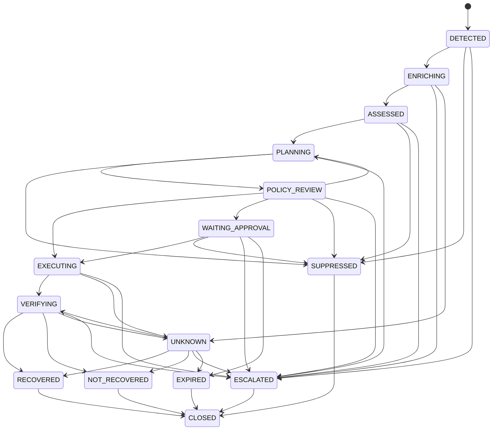
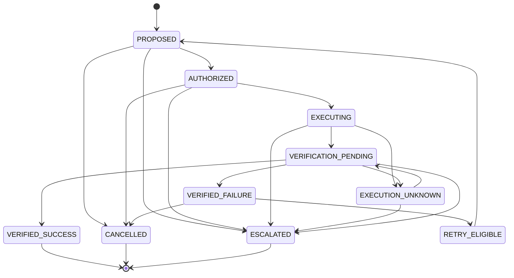
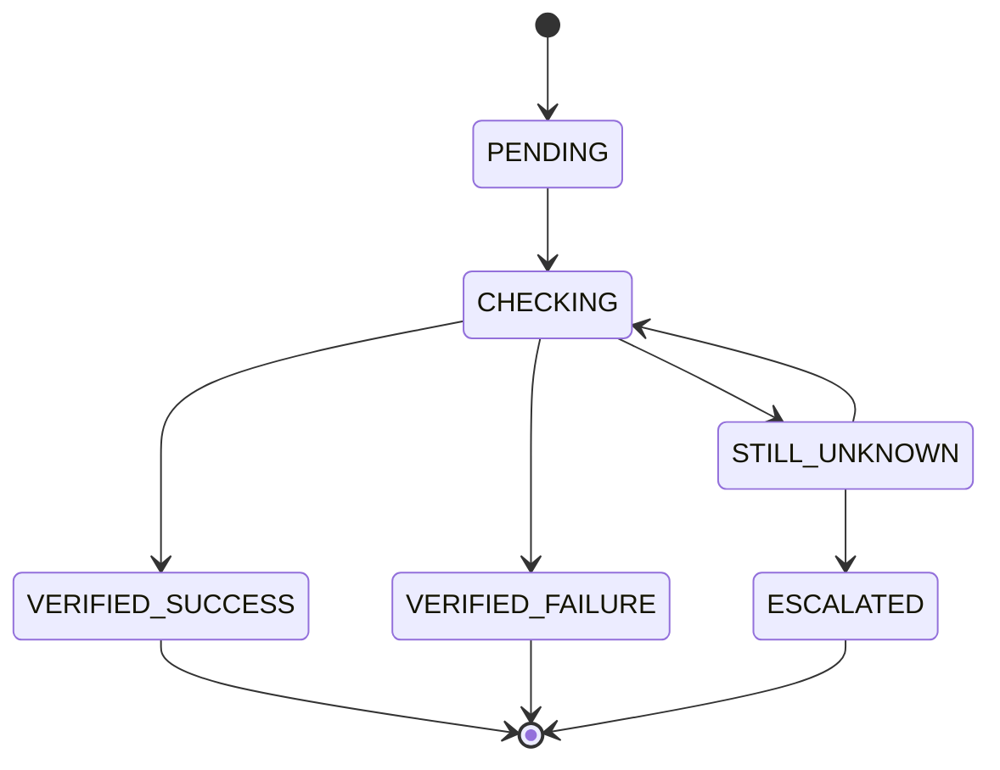
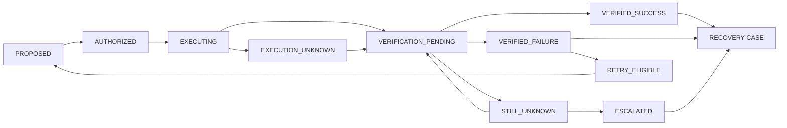
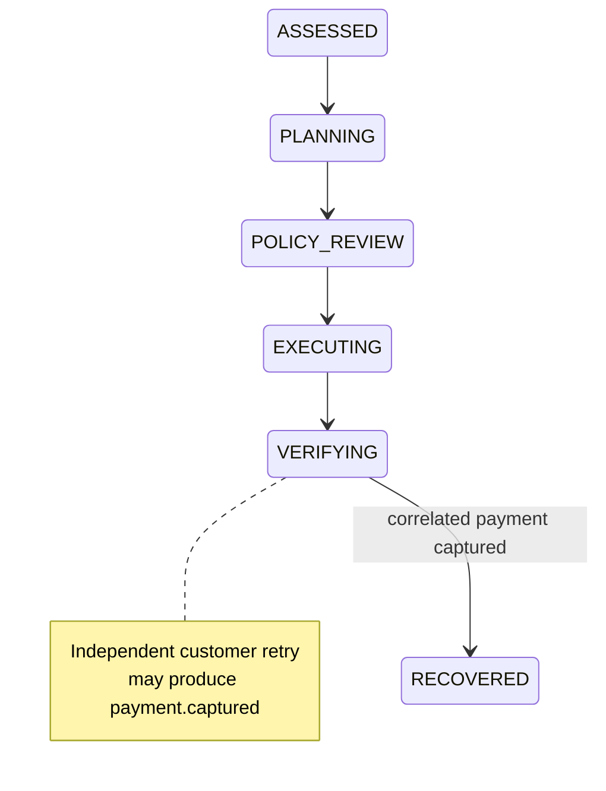

# RecoverAI — Recovery State Machine

**Project:** RecoverAI
**Track:** Razorpay AI Buildathon — Track 03: AI Revenue Recovery
**Document:** Recovery Case, Recovery Action & Verification State Machines
**Status:** Architecture Foundation — Proposed for Freeze
**Version:** 1.0
**Last Updated:** 2026-08-26

---

# 1. Purpose

This document defines the legal lifecycle of a RecoverAI revenue-recovery case and the lifecycle of each recovery action executed against that case.

The state machine exists to prevent:

* duplicate financial actions,
* unsafe retries,
* treating transport errors as business failures,
* executing actions after a case has become irrelevant,
* bypassing policy,
* declaring revenue recovered without verification,
* and allowing an uncertain external state to disappear into an ordinary success/failure path.

The system uses **three related but distinct state machines**:

1. `RecoveryCase` — the lifecycle of the revenue opportunity.
2. `RecoveryAction` — the lifecycle of a specific proposed/executed intervention.
3. `Verification` — the lifecycle of determining what actually happened externally.

These state machines must not be collapsed into a single generic `status` field.

---

# 2. State-Machine Principles

## 2.1 State represents current domain status

A state is not:

* an LLM recommendation,
* a webhook event,
* an API response code,
* or a workflow execution status.

A state reflects the current RecoverAI domain interpretation after applying validated evidence and legal transitions.

---

## 2.2 Events trigger transitions

The state machine changes because of events or explicit domain commands.

Examples:

```text
PAYMENT_FAILED_RECEIVED
ASSESSMENT_COMPLETED
PLAN_GENERATED
POLICY_APPROVED
ACTION_STARTED
EXECUTION_TIMEOUT
STATE_VERIFIED
```

An external event does not automatically imply an internal state transition unless the transition is legal.

---

## 2.3 Unknown is a real state

The system must distinguish:

```text
FAILED
```

from:

```text
UNKNOWN
```

A timeout only tells the system that it did not receive a definitive response.

It does not prove that a financial action failed.

Therefore:

> **Transport uncertainty must never be silently converted into business failure.**

---

## 2.4 Terminal states are explicit

A terminal state means RecoverAI will perform no further automatic work for that case unless an explicit administrative or re-open operation is introduced later.

Initial terminal `RecoveryCase` states:

```text
RECOVERED
NOT_RECOVERED
SUPPRESSED
ESCALATED
EXPIRED
CLOSED
```

`UNKNOWN` is **not necessarily terminal**.

---

# 3. RecoveryCase State Machine

## 3.1 State List

Initial states:

```text
DETECTED
ENRICHING
ASSESSED
PLANNING
POLICY_REVIEW
WAITING_APPROVAL
EXECUTING
VERIFYING
RECOVERED
NOT_RECOVERED
UNKNOWN
SUPPRESSED
ESCALATED
EXPIRED
CLOSED
```

---

# 4. RecoveryCase State Definitions

## `DETECTED`

A qualifying revenue event has been accepted and associated with a RecoveryCase.

### Entry requirements

* source event is valid,
* event is persisted,
* event is not an already-processed duplicate,
* sufficient identity exists to create a case.

### Allowed transitions

```text
DETECTED -> ENRICHING
DETECTED -> SUPPRESSED
DETECTED -> ESCALATED
```

A case may be suppressed or escalated immediately if policy requires it.

---

# 5. `ENRICHING`

RecoverAI is retrieving relevant context.

Possible enrichment:

* payment details,
* order information,
* customer history,
* previous recovery attempts,
* relevant merchant context,
* degradation signals,
* applicable policy.

### Requirements

Enrichment must not fabricate missing data.

Missing context must be represented explicitly.

### Allowed transitions

```text
ENRICHING -> ASSESSED
ENRICHING -> ESCALATED
ENRICHING -> UNKNOWN
```

`UNKNOWN` may be used when required authoritative state cannot be established.

---

# 6. `ASSESSED`

The Recovery Case has enough validated information to determine:

* revenue amount at risk,
* recovery probability or equivalent assessment,
* systemic-degradation signals,
* evidence,
* and relevant cause hypotheses.

### Allowed transitions

```text
ASSESSED -> PLANNING
ASSESSED -> SUPPRESSED
ASSESSED -> ESCALATED
```

A case should not enter planning when essential evidence is unavailable and the resulting action could be unsafe.

---

# 7. `PLANNING`

RecoverAI is constructing candidate recovery interventions.

Examples:

```text
CREATE_PAYMENT_LINK
WAIT
SUPPRESS
ESCALATE
```

The planner must generate only actions that are known to exist within the current implementation.

### Allowed transitions

```text
PLANNING -> POLICY_REVIEW
PLANNING -> SUPPRESSED
PLANNING -> ESCALATED
```

A plan is not authorization.

---

# 8. `POLICY_REVIEW`

A proposed intervention is being evaluated by the deterministic Policy Engine.

The policy engine evaluates:

* action eligibility,
* attempt count,
* amount limits,
* cooldowns,
* duplicate protection,
* degradation suppression,
* approval requirements,
* case state,
* and any other declared policy.

### Allowed outcomes

```text
POLICY_REVIEW
    |
    +--> EXECUTING
    |
    +--> WAITING_APPROVAL
    |
    +--> SUPPRESSED
    |
    +--> ESCALATED
    |
    +--> PLANNING
```

`PLANNING` is allowed when policy requests a different action rather than simply denying the case.

---

# 9. `WAITING_APPROVAL`

The system requires explicit human authorization.

Examples:

* high-value action,
* ambiguous financial situation,
* unresolved policy conflict,
* insufficient confidence,
* external state cannot safely be determined.

### Allowed transitions

```text
WAITING_APPROVAL -> EXECUTING
WAITING_APPROVAL -> SUPPRESSED
WAITING_APPROVAL -> ESCALATED
WAITING_APPROVAL -> EXPIRED
```

Approval must be recorded as an auditable event.

The human approval must not modify policy behind the system's back.

---

# 10. `EXECUTING`

An approved RecoveryAction is currently being sent to the external workflow/integration.

This state means:

> **RecoverAI has authorized the action and execution has begun.**

It does not mean:

> **The financial outcome is successful.**

### Allowed transitions

```text
EXECUTING -> VERIFYING
EXECUTING -> UNKNOWN
EXECUTING -> NOT_RECOVERED
EXECUTING -> ESCALATED
```

`UNKNOWN` is preferred when an ambiguous transport outcome occurs.

---

# 11. `VERIFYING`

The action has been submitted or an external state change has been observed, and RecoverAI is establishing the authoritative business outcome.

Verification may involve:

* Razorpay webhook observations,
* Razorpay API state,
* Payment Link state,
* correlated payment/order state,
* or simulation state in the evaluation environment.

### Allowed transitions

```text
VERIFYING -> RECOVERED
VERIFYING -> NOT_RECOVERED
VERIFYING -> UNKNOWN
VERIFYING -> ESCALATED
```

The system must not leave `VERIFYING` and mark the case recovered merely because an API request returned HTTP success.

---

# 12. `UNKNOWN`

The system cannot yet determine the authoritative business state.

Typical causes:

* API timeout,
* network interruption,
* missing/delayed webhook,
* conflicting observations,
* unavailable authoritative API,
* unresolved external state.

### Required behavior

While `UNKNOWN`:

* no duplicate financial action may be created blindly,
* the system may retry **verification**,
* the system may query authoritative state,
* the case may remain waiting,
* the case may eventually escalate.

### Allowed transitions

```text
UNKNOWN -> VERIFYING
UNKNOWN -> RECOVERED
UNKNOWN -> NOT_RECOVERED
UNKNOWN -> ESCALATED
UNKNOWN -> EXPIRED
```

A direct:

```text
UNKNOWN -> EXECUTING
```

is forbidden unless an explicit verification step has established that the previous action did not succeed and the policy has re-authorized a new action.

---

# 13. `RECOVERED`

The system has authoritative evidence that the revenue opportunity has been successfully recovered.

### Mandatory requirement

A `VerificationRecord` must exist.

### Required information

At minimum:

```text
action_id
verification_source
external_reference
verified_state
verified_at
recovered_amount
```

### Terminal

Yes.

No automatic recovery action may execute after this state.

Pending workflows must be cancelled/suppressed where possible.

---

# 14. `NOT_RECOVERED`

The system has verified that the relevant recovery opportunity was not successfully recovered.

### Examples

* payment link expired without payment,
* verified payment failure after all permitted interventions,
* customer did not complete recovery within the configured recovery window,
* eligible interventions exhausted.

### Terminal

Yes, unless a future explicit case-reopen mechanism is introduced.

---

# 15. `SUPPRESSED`

RecoverAI intentionally chose not to execute an intervention.

This is a **successful policy/decision outcome**, not an error.

Possible reasons:

```text
SYSTEMIC_DEGRADATION
LOW_EXPECTED_VALUE
COOLDOWN_ACTIVE
INTERVENTION_NOT_JUSTIFIED
CUSTOMER_COMMUNICATION_LIMIT
POLICY_RESTRICTION
DUPLICATE_RECOVERY_PREVENTED
```

### Requirements

The audit record must contain:

* suppression reason,
* evidence,
* policy version,
* decision timestamp.

### Terminal

Normally yes.

---

# 16. `ESCALATED`

The case requires human or higher-level operational handling.

Possible reasons:

* high-value action,
* ambiguous outcome,
* unresolved external state,
* policy conflict,
* insufficient evidence,
* repeated failure,
* provider/system outage,
* unsupported recovery condition.

### Terminal

Yes for the current autonomous workflow.

The merchant may resolve/escalate it outside the autonomous path.

---

# 17. `EXPIRED`

A Recovery Case exceeded its allowed recovery window.

Examples:

* payment link expired,
* recovery window elapsed,
* case exceeded maximum lifecycle duration,
* relevant customer/revenue opportunity is no longer actionable.

### Terminal

Yes.

---

# 18. `CLOSED`

`CLOSED` represents explicit final administrative closure after the business outcome has already been resolved.

Examples:

```text
RECOVERED -> CLOSED
NOT_RECOVERED -> CLOSED
SUPPRESSED -> CLOSED
ESCALATED -> CLOSED
EXPIRED -> CLOSED
```

Whether `CLOSED` is physically persisted or represented only through a terminal outcome is an implementation detail.

The domain must nevertheless distinguish:

> **business outcome**

from:

> **administrative closure**.

---

# 19. RecoveryCase State Diagram



---

# 20. Forbidden RecoveryCase Transitions

The following transitions are illegal:

```text
RECOVERED -> EXECUTING
RECOVERED -> PLANNING

NOT_RECOVERED -> EXECUTING

SUPPRESSED -> EXECUTING

EXPIRED -> EXECUTING

CLOSED -> EXECUTING

UNKNOWN -> EXECUTING
```

The last transition is especially important.

An `UNKNOWN` state must be reconciled before another financial mutation is attempted.

---

# 21. RecoveryAction State Machine

A RecoveryAction tracks one specific intervention.

It is independent of the broader case state.

Initial states:

```text
PROPOSED
AUTHORIZED
EXECUTING
EXECUTION_UNKNOWN
VERIFICATION_PENDING
VERIFIED_SUCCESS
VERIFIED_FAILURE
RETRY_ELIGIBLE
CANCELLED
ESCALATED
```

---

# 22. `PROPOSED`

An agent or deterministic planner has proposed an action.

Example:

```text
CREATE_PAYMENT_LINK
```

### Important

`PROPOSED` has no financial authority.

No external financial mutation may occur in this state.

---

# 23. `AUTHORIZED`

The deterministic Policy Engine has approved the action.

The authorization must reference:

```text
policy_decision_id
policy_version
case_id
action_id
```

An action that is not authorized cannot enter `EXECUTING`.

---

# 24. `EXECUTING`

The action has begun.

Examples:

```text
POST /v1/payment_links
```

or the start of a supported workflow.

The system must persist the action state before or as part of the execution protocol so that a crash does not cause the action to disappear from RecoverAI's history.

---

# 25. `EXECUTION_UNKNOWN`

The action may or may not have succeeded, but the calling layer cannot determine the result.

Examples:

* timeout after request transmission,
* connection closed before response,
* provider gateway uncertainty.

### Rule

> **No blind retry.**

The next legal transition is:

```text
EXECUTION_UNKNOWN -> VERIFICATION_PENDING
```

or an equivalent verification operation.

---

# 26. `VERIFICATION_PENDING`

RecoverAI is checking authoritative external state.

Potential checks:

```text
Razorpay API
Razorpay webhook
Payment Link state
Payment state
Order state
```

The verification mechanism must depend on the action being verified.

---

# 27. `VERIFIED_SUCCESS`

The external business state confirms the action succeeded.

This is a terminal state for the individual action.

The associated RecoveryCase may then transition to:

```text
RECOVERED
```

if the verified result represents recovered revenue.

---

# 28. `VERIFIED_FAILURE`

The external business state confirms the action did not succeed.

The action itself is terminal.

The RecoveryCase may transition to:

```text
PLANNING
```

for a new action,

or:

```text
NOT_RECOVERED
```

if no additional intervention is justified.

---

# 29. `RETRY_ELIGIBLE`

A failed action has been verified as unsuccessful and is eligible for another attempt.

Conditions must include:

* previous action verified unsuccessful,
* recovery case remains active,
* retry count below limit,
* policy permits retry,
* new action identity can be safely generated.

`RETRY_ELIGIBLE` is not itself execution authority.

---

# 30. `CANCELLED`

The action will no longer execute.

Examples:

* payment already recovered independently,
* case suppressed,
* action superseded,
* policy changed,
* workflow expired.

The cancellation must be audited.

---

# 31. `ESCALATED`

The action requires manual handling rather than autonomous continuation.

This can occur when:

* verification cannot establish state,
* action exceeds autonomous limits,
* policy conflict exists,
* repeated retries are exhausted.

---

# 32. RecoveryAction State Diagram



---

# 33. Relationship Between Case and Action States

One RecoveryCase can have multiple RecoveryActions.

Example:

```text
RecoveryCase #42
    |
    +-- Action #1: CREATE_PAYMENT_LINK
    |       |
    |       +-- VERIFIED_FAILURE
    |
    +-- Action #2: PAYMENT_LINK_REMINDER
    |       |
    |       +-- VERIFIED_SUCCESS
    |
    +-- Case
            |
            -> RECOVERED
```

This allows the system to distinguish:

> **The recovery case succeeded**

from:

> **Every individual intervention succeeded.**

Only verified business outcome determines case success.

---

# 34. Verification State Machine

Verification is treated separately because an execution attempt can produce an uncertain result.

States:

```text
NOT_REQUIRED
PENDING
CHECKING
VERIFIED_SUCCESS
VERIFIED_FAILURE
STILL_UNKNOWN
ESCALATED
```

---

# 35. Verification Rules

## `PENDING`

A verification operation is required.

## `CHECKING`

The system is querying authoritative evidence.

## `VERIFIED_SUCCESS`

Authoritative state confirms the expected result.

## `VERIFIED_FAILURE`

Authoritative state confirms the expected action did not produce the intended result.

## `STILL_UNKNOWN`

Available evidence is insufficient.

## `ESCALATED`

The system cannot safely determine the outcome automatically.

---

# 36. Verification State Diagram



---

# 37. Combined Financial Action Flow



---

# 38. Payment Failure → Independent Payment Capture

Razorpay currently documents that a `payment.failed` webhook may be followed by `payment.captured` for the same transaction, including user-initiated retries/late authorization in certain cases. ([razorpay.com](https://razorpay.com/docs/webhooks/payments/))

Therefore the state machine must allow:



RecoverAI must then:

1. record the successful payment event,
2. identify any pending recovery action,
3. cancel or suppress redundant recovery work,
4. verify the recovered amount,
5. close the case.

---

# 39. Systemic Degradation and Case Suppression

When RecoverAI receives:

```text
payment.downtime.started
```

or independently detects systemic degradation, individual cases may change behavior.

Example:

```text
PAYMENT_FAILED
     |
     v
ASSESSED
     |
     +---- SYSTEMIC_DEGRADATION = TRUE
     |
     v
SUPPRESSED
```

The suppression reason must be recorded.

Razorpay's current payment webhook documentation includes payment downtime webhook events, making this a concrete integration signal rather than merely a synthetic feature. ([razorpay.com](https://razorpay.com/docs/webhooks/payments/))

---

# 40. Recovery Suppression Is Not Failure

The system must not report:

```text
SUPPRESSED = system failure
```

Suppression means:

> RecoverAI deliberately decided that executing a recovery intervention was not appropriate under the current evidence and policy.

The evaluation must measure suppression quality separately from recovery failure.

---

# 41. Recovery Retry Rules

Retries are permitted only when all of the following are true:

```text
1. Previous action is VERIFIED_FAILURE.
2. Previous action did not succeed.
3. The case is still active.
4. Retry limit has not been reached.
5. Cooldown, if any, has elapsed.
6. Current policy permits another attempt.
7. The proposed action is still valid.
8. Relevant external state has not materially changed.
9. The retry has a new action identity.
10. No duplicate active action exists.
```

A retry must not occur merely because an exception was raised.

---

# 42. Retry Is Not Allowed After Uncertain Execution

Example:

```text
EXECUTING
   |
   v
timeout
   |
   v
EXECUTION_UNKNOWN
```

This does **not** allow:

```text
EXECUTION_UNKNOWN
   |
   v
EXECUTING AGAIN
```

The correct path is:

```text
EXECUTION_UNKNOWN
   |
   v
VERIFYING
   |
   +---- SUCCESS
   |
   +---- FAILURE -> RETRY_ELIGIBLE
   |
   +---- UNKNOWN -> ESCALATE / CONTINUE VERIFICATION
```

This is one of the most important financial-safety invariants in the entire system.

---

# 43. Policy Revalidation

A previously approved action may become invalid before execution.

Examples:

* the case state changed,
* the payment succeeded independently,
* the customer became ineligible,
* the recovery limit was reached,
* systemic degradation began,
* merchant policy changed.

Therefore:

> **Authorization must be valid for the action actually being executed at execution time.**

Where material state changes, the action must return to policy review.

Conceptually:

```text
AUTHORIZED
    |
    v
state changed
    |
    v
REVALIDATE
    |
    +--> APPROVE -> EXECUTING
    |
    +--> SUPPRESS
    |
    +--> ESCALATE
```

---

# 44. Human Approval

Human approval is an explicit state transition.

```text
WAITING_APPROVAL
      |
      +---- APPROVED
      |       |
      |       v
      |   POLICY_REVIEW
      |       |
      |       v
      |   EXECUTING
      |
      +---- REJECTED
      |
      v
SUPPRESSED / ESCALATED
```

The system must record:

```text
approver identity
approval decision
timestamp
reason
policy version
action
```

A human approval must not modify the original AI reasoning record.

---

# 45. Workflow State vs Domain State

n8n may have its own execution state:

```text
running
waiting
success
error
```

These are **workflow states**.

They do not replace:

```text
RecoveryCase.status
RecoveryAction.status
Verification.state
```

Example:

```text
n8n = SUCCESS
```

does **not** imply:

```text
RecoveryCase = RECOVERED
```

It only means the n8n workflow completed successfully.

RecoverAI must still verify the financial outcome.

---

# 46. Crash Recovery

If the RecoverAI process crashes while a RecoveryAction is in progress:

1. persisted state must identify the action,
2. action state must remain `EXECUTING` or `EXECUTION_UNKNOWN`,
3. the system must not create a duplicate action during restart,
4. verification must determine the external result,
5. only then may the action transition to success, failure, retry eligibility, or escalation.

---

# 47. State Transition Audit

Every state change must create an audit event.

Example:

```json id="7sqo5b"
{
  "event_type": "RECOVERY_STATE_CHANGED",
  "case_id": "case_42",
  "previous_state": "EXECUTING",
  "new_state": "EXECUTION_UNKNOWN",
  "reason_code": "EXTERNAL_TIMEOUT",
  "timestamp": "..."
}
```

The audit record must not itself trigger a financial action.

---

# 48. State Transition Invariants

The implementation must enforce:

### Invariant 1

No financial mutation from a non-authorized state.

### Invariant 2

No retry from `EXECUTION_UNKNOWN` without verification.

### Invariant 3

No `RECOVERED` without verified financial evidence.

### Invariant 4

No action after case closure.

### Invariant 5

No duplicate active action for the same recovery intent.

### Invariant 6

No terminal state can transition back into autonomous execution.

### Invariant 7

Policy must be re-evaluated after material case changes.

### Invariant 8

State transitions must be auditable.

### Invariant 9

A webhook event alone cannot override a stronger authoritative state without reconciliation.

### Invariant 10

LLM output cannot directly cause a state transition to a financial execution state.

---

# 49. State Transition Table

| Current State      | Trigger              | Next State                   | Conditions                   |
| ------------------ | -------------------- | ---------------------------- | ---------------------------- |
| `DETECTED`         | enrichment started   | `ENRICHING`                  | valid case                   |
| `ENRICHING`        | assessment complete  | `ASSESSED`                   | required evidence present    |
| `ASSESSED`         | plan requested       | `PLANNING`                   | recovery remains relevant    |
| `PLANNING`         | plan ready           | `POLICY_REVIEW`              | candidate action exists      |
| `POLICY_REVIEW`    | approve              | `EXECUTING`                  | policy valid                 |
| `POLICY_REVIEW`    | approval required    | `WAITING_APPROVAL`           | threshold/policy             |
| `POLICY_REVIEW`    | suppress             | `SUPPRESSED`                 | suppression rule             |
| `POLICY_REVIEW`    | escalate             | `ESCALATED`                  | uncertainty/high risk        |
| `EXECUTING`        | action sent          | `VERIFYING`                  | immediate evidence available |
| `EXECUTING`        | timeout              | `UNKNOWN`                    | outcome uncertain            |
| `VERIFYING`        | success              | `RECOVERED`                  | authoritative confirmation   |
| `VERIFYING`        | failure              | `NOT_RECOVERED` / `PLANNING` | depends on retry eligibility |
| `UNKNOWN`          | verification started | `VERIFYING`                  | authoritative check          |
| `UNKNOWN`          | state unresolved     | `ESCALATED`                  | unsafe to continue           |
| `WAITING_APPROVAL` | approved             | `EXECUTING`                  | approval valid               |
| `WAITING_APPROVAL` | rejected             | `SUPPRESSED`                 | no action                    |
| `RECOVERED`        | administrative close | `CLOSED`                     | outcome persisted            |
| `NOT_RECOVERED`    | administrative close | `CLOSED`                     | outcome persisted            |
| `SUPPRESSED`       | administrative close | `CLOSED`                     | audit persisted              |
| `ESCALATED`        | administrative close | `CLOSED`                     | escalation persisted         |
| `EXPIRED`          | administrative close | `CLOSED`                     | outcome persisted            |

The final implementation may add states or transitions only through an Architecture Decision Record.

---

# 50. Failure Matrix

| Failure                              | RecoveryCase                  | RecoveryAction                      | Required response                 |
| ------------------------------------ | ----------------------------- | ----------------------------------- | --------------------------------- |
| LLM timeout before recommendation    | `ASSESSED` / `PLANNING`       | `PROPOSED`                          | fallback or escalate              |
| Invalid LLM output                   | remains pre-execution         | `PROPOSED`                          | reject output                     |
| Policy engine unavailable            | `POLICY_REVIEW`               | `PROPOSED`                          | fail closed                       |
| n8n unavailable before execution     | `POLICY_REVIEW` or waiting    | `AUTHORIZED`                        | persist and retry workflow safely |
| Razorpay API timeout during mutation | `UNKNOWN`                     | `EXECUTION_UNKNOWN`                 | verify                            |
| Duplicate webhook                    | unchanged                     | unchanged                           | ignore duplicate                  |
| Out-of-order webhook                 | reconcile                     | reconcile                           | verify current state              |
| Payment independently succeeds       | `RECOVERED`                   | `CANCELLED` if pending              | suppress redundant recovery       |
| Recovery action verified failed      | `PLANNING` or `NOT_RECOVERED` | `RETRY_ELIGIBLE`                    | re-plan if permitted              |
| Systemic degradation detected        | `SUPPRESSED` or waiting       | pending action cancelled/suppressed | avoid mass recovery               |
| Human rejects action                 | `SUPPRESSED` / `ESCALATED`    | `CANCELLED`                         | audit                             |
| Recovery window expires              | `EXPIRED`                     | `CANCELLED`                         | close                             |

---

# 51. Canonical Recovery Scenarios

## Scenario A — Standard Recovery

```text
PAYMENT_FAILED
    ->
DETECTED
    ->
ENRICHING
    ->
ASSESSED
    ->
PLANNING
    ->
POLICY_REVIEW
    ->
EXECUTING
    ->
VERIFYING
    ->
RECOVERED
```

---

## Scenario B — Customer Independently Recovers

```text
PAYMENT_FAILED
    ->
ASSESSED
    ->
PLANNING

Customer independently retries
    ->
PAYMENT_CAPTURED

RecoverAI
    ->
VERIFYING
    ->
RECOVERED

Pending recovery action
    ->
CANCELLED
```

---

## Scenario C — Payment Link Recovery

```text
PAYMENT_FAILED
    ->
PLANNING
    ->
CREATE_PAYMENT_LINK
    ->
POLICY_REVIEW
    ->
EXECUTING
    ->
PAYMENT_LINK_CREATED

Customer pays
    ->
PAYMENT_LINK_PAID

Verification
    ->
RECOVERED
```

Razorpay currently documents Payment Link creation via `POST /v1/payment_links` and provides Payment Link webhook events such as `payment_link.paid`. ([razorpay.com](https://razorpay.com/docs/api/payments/payment-links/create-standard/))

---

## Scenario D — Systemic Degradation

```text
PAYMENT_FAILED
    +
payment.downtime.started
    +
failure spike
    ->
ASSESSED
    ->
SYSTEMIC_DEGRADATION
    ->
SUPPRESSED
    ->
MERCHANT ESCALATION
```

Razorpay currently documents payment downtime webhook events, which can provide a direct external signal for this condition. ([razorpay.com](https://razorpay.com/docs/webhooks/payments/))

---

## Scenario E — Timeout

```text
EXECUTING
    ->
network timeout
    ->
EXECUTION_UNKNOWN
    ->
VERIFYING

    +--> payment/action exists
    |        ->
    |      VERIFIED_SUCCESS
    |
    +--> action absent
    |        ->
    |      VERIFIED_FAILURE
    |        ->
    |      RETRY_ELIGIBLE
    |
    +--> state cannot be established
             ->
           ESCALATED
```

---

# 52. Recovery Window

Each RecoveryCase should have a configurable recovery window.

The window determines how long automated recovery remains eligible.

Examples:

```text
short-lived payment recovery
subscription recovery
receivable recovery
```

The exact durations are intentionally not frozen in this document because they are product-policy parameters that must be evaluated against the synthetic benchmark.

A case must transition to `EXPIRED` after its authorized recovery window closes.

---

# 53. State Machine and Evaluation

The evaluation harness must test state transitions, not only final outcomes.

For every failure scenario it should assert:

```text id="5f5isf"
expected state
actual state
expected action
actual action
duplicate action count
verification behavior
audit event
```

For example:

```text
Scenario:
Razorpay timeout

Expected:
RecoveryAction = EXECUTION_UNKNOWN
No duplicate action
Verification attempted
No unsafe retry
```

This allows failure recovery to be quantitatively tested.

---

# 54. State Machine Testing Requirements

The implementation must include:

### Unit tests

For every legal and critical illegal transition.

### Property/invariant tests

For:

* terminal-state protection,
* no execution without authorization,
* no retry from unknown,
* no recovery without verification.

### Integration tests

For:

* Razorpay events,
* Payment Link events,
* duplicate webhook handling,
* out-of-order event handling.

### Failure-injection tests

For:

* API timeout,
* provider timeout,
* webhook delay,
* duplicate webhook,
* missing verification,
* workflow interruption.

---

# 55. Mermaid State Diagram Requirements

The repository must maintain the state machine as Mermaid source in Markdown.

The implementation and documentation must remain synchronized.

If the implementation changes a legal transition:

1. update the state machine specification,
2. create/update the relevant ADR,
3. update tests,
4. update the implementation plan,
5. then continue implementation.

No undocumented transition may be introduced silently.

---

# 56. State Machine Freeze

The following rules are frozen at the architecture level:

1. `UNKNOWN` is first-class.
2. `payment.failed` is not terminal business failure.
3. A timeout is not proof of failure.
4. Recovery success requires authoritative verification.
5. Retries require verified prior failure.
6. Suppression is a valid business outcome.
7. Systemic degradation can suppress individual recovery actions.
8. Policy must authorize financial mutations.
9. Terminal cases cannot re-enter autonomous execution.
10. Case state and action state are separate.
11. Workflow state does not replace domain state.
12. Every state transition affecting a recovery decision must be auditable.

---

# 57. External Evidence

Current official Razorpay documentation consulted for this state machine:

* **Payments Webhook Events**
  https://razorpay.com/docs/webhooks/payments/
  Confirms webhook snapshot semantics, payment state events, and payment downtime events.

* **Webhook validation and testing**
  https://razorpay.com/docs/webhooks/validate-test/
  Confirms duplicate-event handling and non-guaranteed ordering.

* **Payments API**
  https://razorpay.com/docs/api/payments/
  Confirms that the Payments API is for capture/fetch operations rather than generic payment collection.

* **Payment Links API**
  https://razorpay.com/docs/api/payments/payment-links/
  Confirms create/fetch/update/cancel/notification operations.

* **Create Standard Payment Link**
  https://razorpay.com/docs/api/payments/payment-links/create-standard/
  Confirms `POST /v1/payment_links`, unique `reference_id`, and the current Test Mode limit of 30 Payment Links per business.

---

# 58. Verification Status

### VERIFIED

* Razorpay payment webhook states relevant to the lifecycle.
* Payment webhook snapshot behavior.
* Payment failure followed by later capture behavior.
* Payment downtime webhook availability.
* Duplicate webhook behavior.
* Non-guaranteed webhook ordering.
* Payment Link creation capability.
* Payment Link `reference_id` requirement.
* Payment Link Test Mode limit.

### PROPOSED

* Exact internal RecoveryCase states.
* Exact RecoveryAction states.
* Exact Verification states.
* Retry eligibility rules.
* Recovery-window semantics.
* Suppression semantics.
* Human-approval transitions.

### NOT YET IMPLEMENTED

All state machines.

### NEXT FREEZE TARGET

`06_REVENUE_INTELLIGENCE.md` must define exactly how the system computes recovery probability, detects systemic degradation, constructs cause assessments, and converts evidence into intervention candidates without allowing AI predictions to become financial truth.
