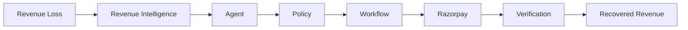
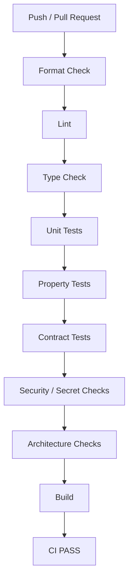
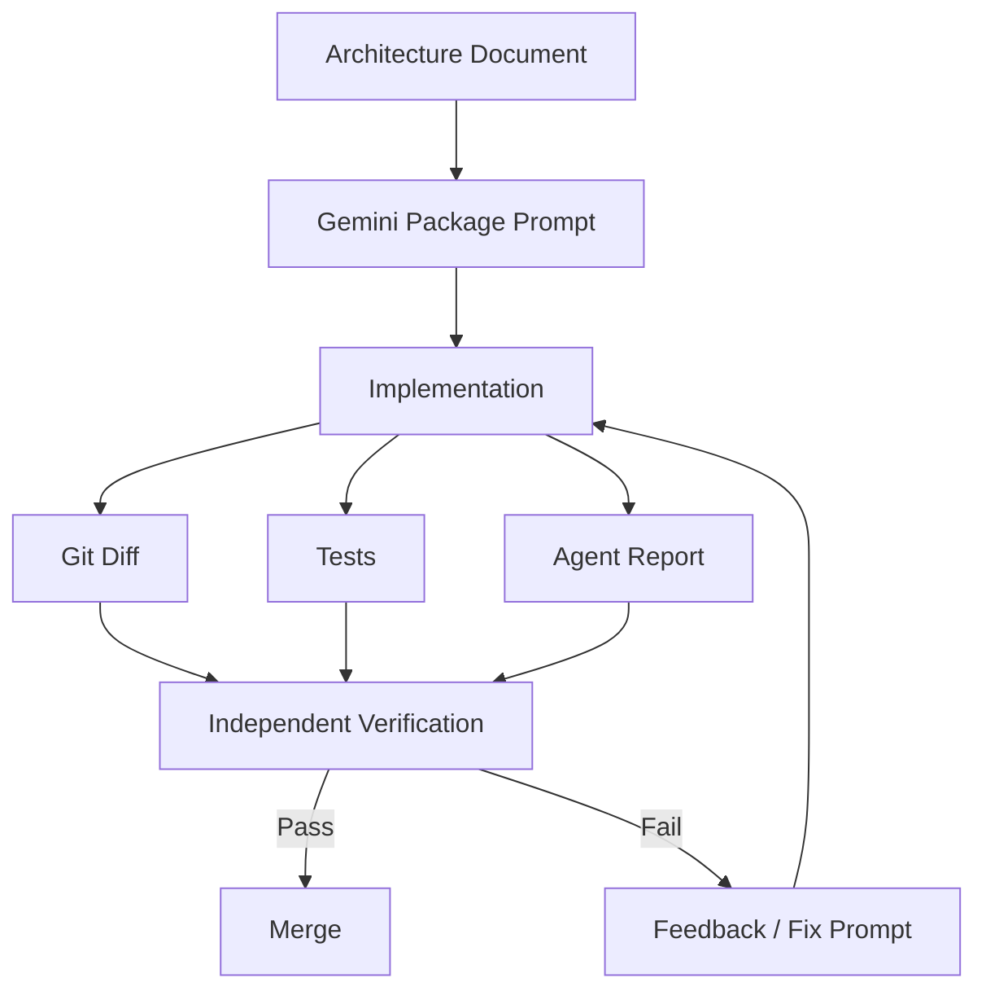
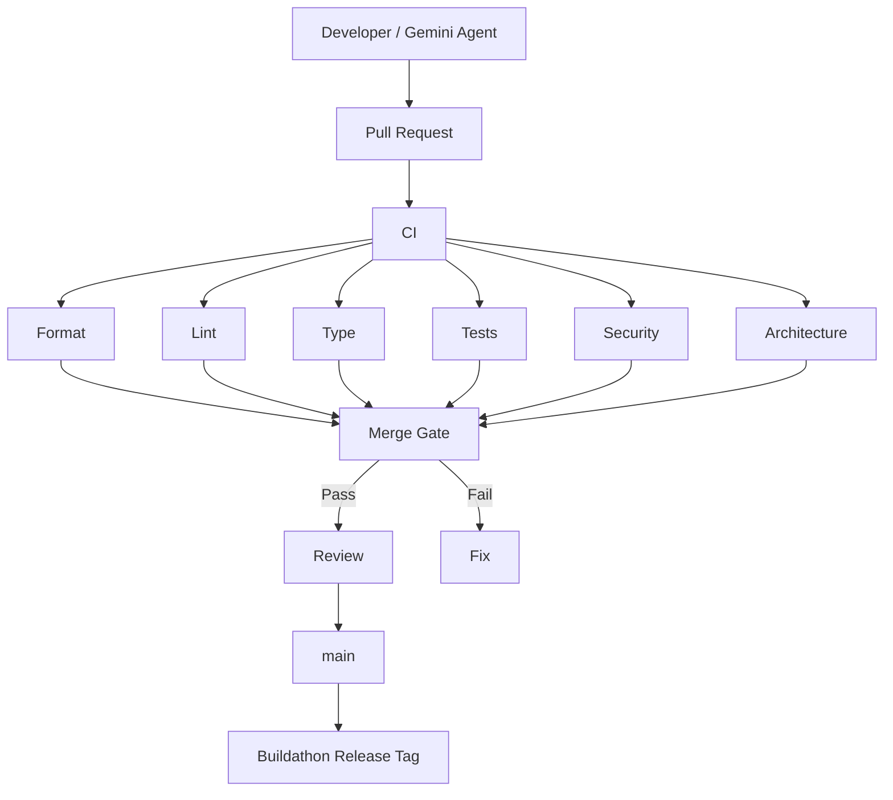

# `docs/19_REPOSITORY_AND_CI.md`

````markdown
# RecoverAI — Repository & CI

**Project:** RecoverAI  
**Track:** Razorpay AI Buildathon — Track 03: AI Revenue Recovery  
**Document:** Repository Architecture, Git Workflow, CI/CD, Quality Gates & Engineering Governance  
**Status:** Architecture Foundation — Proposed for Freeze  
**Version:** 1.0  
**Last Updated:** 2026-08-26

---

# 1. Purpose

This document defines how RecoverAI is organized and how engineering changes are validated.

The goal is not to make the repository look enterprise-sized.

The goal is to make the repository demonstrate:

- clear architectural boundaries,
- disciplined dependency direction,
- reproducible development,
- safe changes,
- automated verification,
- traceable implementation decisions,
- and a professional engineering workflow.

The repository should make it possible for a reviewer to answer:

> "Where is the business logic?"

> "Where is AI?"

> "Where is the Razorpay integration?"

> "Where is policy?"

> "Where are the tests?"

> "How do I run it?"

> "How do I know a change is safe?"

---

# 2. Repository Philosophy

RecoverAI follows:

> **Stable architecture first, implementation second, verification continuously.**

A feature is not complete when code exists.

It is complete when:

```text
SPECIFICATION
    +
IMPLEMENTATION
    +
TESTS
    +
FAILURE HANDLING
    +
OBSERVABILITY
    +
DOCUMENTATION
````

are all present.

---

# 3. Repository as an Engineering Artifact

The Git repository is part of the Buildathon submission.

It should communicate:

```text
Problem
  |
Architecture
  |
Implementation
  |
Tests
  |
Evaluation
  |
Evidence
```

The repository must therefore avoid becoming:

```text
random source files
+
unused experiments
+
secret keys
+
unversioned workflows
+
generated junk
```

---

# 4. Canonical Repository Structure

The proposed repository structure is:

```text
recoverai/
│
├── docs/
│   ├── 00_PROJECT_CHARTER.md
│   ├── 01_SYSTEM_OVERVIEW.md
│   ├── 02_ARCHITECTURE.md
│   ├── 03_DOMAIN_MODEL.md
│   ├── 04_EVENT_MODEL.md
│   ├── 05_RECOVERY_STATE_MACHINE.md
│   ├── 06_REVENUE_INTELLIGENCE.md
│   ├── 07_AI_JUDGMENT.md
│   ├── 08_POLICY_AND_SAFETY.md
│   ├── 09_RAZORPAY_INTEGRATION.md
│   ├── 10_MCP_TOOL_CONTRACTS.md
│   ├── 11_LLM_GATEWAY.md
│   ├── 12_N8N_WORKFLOWS.md
│   ├── 13_AUDIT_AND_OBSERVABILITY.md
│   ├── 14_EVALUATION.md
│   ├── 15_FAILURE_RECOVERY.md
│   ├── 16_TESTING_STRATEGY.md
│   ├── 17_SECURITY.md
│   ├── 18_DEPLOYMENT.md
│   ├── 19_REPOSITORY_AND_CI.md
│   └── ...
│
├── backend/
│
├── frontend/
│
├── domain/
│
├── application/
│
├── integrations/
│   ├── razorpay/
│   ├── database/
│   └── ...
│
├── ai/
│   ├── gateway/
│   ├── providers/
│   ├── prompts/
│   ├── models/
│   └── validation/
│
├── policy/
│
├── mcp/
│
├── workflows/
│   └── n8n/
│
├── evaluation/
│   ├── simulator/
│   ├── baselines/
│   ├── metrics/
│   ├── datasets/
│   └── reports/
│
├── tests/
│   ├── unit/
│   ├── property/
│   ├── contract/
│   ├── integration/
│   ├── failure/
│   ├── e2e/
│   ├── evaluation/
│   └── fixtures/
│
├── scripts/
│
├── deployment/
│
├── .github/
│   ├── workflows/
│   ├── CODEOWNERS
│   ├── dependabot.yml
│   └── ...
│
├── .env.example
├── .gitignore
├── README.md
├── LICENSE
├── pyproject.toml
├── package.json
└── ...
```

The final physical structure may change during implementation, but dependency boundaries must remain equivalent.

---

# 5. Source-Code Boundary

The most important separation is:

```text
domain/
    |
    X --> infrastructure
    X --> providers
    X --> n8n
    X --> frontend
```

The domain should remain infrastructure-independent.

---

# 6. Domain Package

Contains:

```text
Money
RevenueEvent
RecoveryCase
RecoveryAction
PolicyDecision
VerificationRecord
CustomerContext
MerchantContext
```

The package must contain pure business concepts and rules.

It should not contain:

```text
HTTP
SQL
Razorpay SDK
Gemini SDK
Groq SDK
Hugging Face SDK
MCP transport
n8n APIs
browser code
```

---

# 7. Application Package

Contains use cases such as:

```text
create_recovery_case
assess_recovery_case
plan_recovery
authorize_action
execute_action
verify_recovery
close_recovery_case
```

Application code orchestrates domain and infrastructure interfaces.

It should not become a dumping ground for arbitrary helper functions.

---

# 8. Integration Package

External systems belong behind explicit adapters.

Examples:

```text
integrations/
    razorpay/
    database/
```

The application should interact with interfaces such as:

```text
RazorpayGateway
RecoveryCaseRepository
AuditRepository
```

rather than concrete SDKs.

---

# 9. AI Package

AI code should remain isolated.

Conceptually:

```text
ai/
    gateway/
    providers/
    prompts/
    validation/
    models/
```

Provider-specific SDK usage should remain inside:

```text
ai/providers/
```

and not leak into:

```text
application/
domain/
policy/
```

---

# 10. Policy Package

Policy must have a dedicated package because it is a critical financial-control boundary.

Example:

```text
policy/
    engine
    rules
    registry
    configuration
```

The Policy Engine should not depend on the LLM.

---

# 11. MCP Package

MCP implementation belongs in its own package.

It translates:

```text
MCP tool request
```

into:

```text
application command
```

and:

```text
application result
```

into:

```text
MCP response
```

MCP should not contain its own independent business rules.

---

# 12. Workflow Package

Workflow definitions belong in:

```text
workflows/n8n/
```

They should be versioned/exported artifacts.

n8n's source-control documentation supports environment/source-control workflows, but native source-control availability depends on plan; therefore Git-versioned workflow exports remain the safe baseline for the MVP. ([docs.n8n.io](https://docs.n8n.io/source-control-environments/create-environments/?utm_source=chatgpt.com))

---

# 13. Evaluation Package

Evaluation code must be isolated from production decision code.

This is important because the evaluator has access to:

```text
hidden ground truth
counterfactual outcomes
simulation state
```

Those must never become normal application dependencies.

Correct:

```text
RecoverAI
    ^
    |
Evaluation Harness
```

Not:

```text
RecoverAI
    |
    v
Evaluation Ground Truth
```

---

# 14. Test Package

Tests should mirror the system boundaries.

```text
tests/
    unit/
    property/
    contract/
    integration/
    failure/
    e2e/
    evaluation/
```

A test's location should communicate what kind of dependency it has.

---

# 15. Scripts Package

The scripts directory should contain operator/developer commands.

Examples:

```text
scripts/
    start-all.ps1
    stop-all.ps1
    health-check.ps1
    backup.ps1
    run-tests.ps1
    run-evaluation.ps1
    run-razorpay-smoke.ps1
    export-n8n.ps1
```

Exact scripts will be created during implementation.

---

# 16. Deployment Package

Deployment-specific artifacts belong in:

```text
deployment/
```

This includes:

* n8n deployment configuration,
* environment documentation,
* setup instructions,
* deployment helpers.

The repository must not mix deployment infrastructure with core domain code.

---

# 17. Documentation Structure

The `docs/` directory is the architecture source of truth.

Each document should contain:

```text
Purpose
Scope
Architecture
Contracts
Failure behavior
Testing requirements
Definition of Done
Freeze decisions
References
Verification status
Next document
```

This creates a deterministic handoff between architecture and implementation.

---

# 18. README Responsibilities

The root `README.md` should answer:

```text
What is RecoverAI?
What problem does it solve?
Why Track 03?
What is the architecture?
How do I run it?
How do I run tests?
How do I run evaluation?
How do I configure Test Mode?
Where is the audit trail?
What are the limitations?
```

It should not duplicate all architecture documents.

The README is the entry point.

---

# 19. README Architecture Section

The README should contain a high-level diagram:



The detailed diagrams remain in the numbered architecture documents.

---

# 20. Repository Naming Conventions

Use:

```text
snake_case
```

for Python modules where appropriate.

Use:

```text
PascalCase
```

for classes.

Use:

```text
UPPER_SNAKE_CASE
```

for constants.

Use:

```text
lowercase-with-hyphens
```

for Git branch names where practical.

Consistency is more important than a specific convention.

---

# 21. File Naming

Architecture documents:

```text
NN_NAME.md
```

Tests:

```text
test_<component>.py
```

Configuration:

```text
*.yaml
*.toml
*.json
```

Workflows:

```text
<workflow-name>.json
```

No unexplained filenames such as:

```text
final.py
new.py
test2.py
latest.py
new_final_v3.py
```

---

# 22. No "Final" Files

The repository must not accumulate:

```text
app_final.py
app_final2.py
deployment_final.json
architecture_new.md
workflow_latest.json
```

Git already provides version history.

Use meaningful versioned artifacts when versioning is genuinely required.

---

# 23. Dependency Direction

The intended dependency direction is:

```text
Frontend
    |
Backend/API
    |
Application
    |
Domain
```

External adapters point inward through interfaces.

Conceptually:

```text
Razorpay Adapter ---> Application Interface
LLM Provider -------> AI Gateway Interface
n8n ----------------> Application API
MCP ----------------> Application API
Database Adapter ----> Repository Interface
```

The domain remains at the center.

---

# 24. Dependency Rule

The following are architecture violations:

```text
domain -> Razorpay SDK
domain -> Gemini SDK
domain -> Groq SDK
domain -> n8n
domain -> database driver
domain -> HTTP
policy -> LLM SDK
LLM provider -> Policy implementation
n8n workflow -> raw database access
frontend -> Razorpay secret
```

These should be caught during code review and, where practical, automated checks.

---

# 25. Architectural Import Checks

CI should eventually validate prohibited imports.

Examples:

```text
domain/
    cannot import integrations/
    cannot import ai/providers/
    cannot import mcp/
```

and:

```text
ai/providers/
    cannot import policy/
```

The exact static-analysis mechanism can be selected during implementation.

---

# 26. Git Strategy

The recommended strategy is:

```text
main
  |
  +-- feature/*
  +-- fix/*
  +-- test/*
  +-- docs/*
```

`main` should represent a known-good state.

Because this is a Buildathon project, the team does not need a complicated GitFlow hierarchy.

---

# 27. `main` Branch Rule

`main` should be:

```text
protected
reviewed
CI-validated
demo-safe
```

GitHub protected branches can require reviews, required status checks, conversation resolution, signed commits, linear history, and other merge restrictions. ([docs.github.com](https://docs.github.com/en/repositories/configuring-branches-and-merges-in-your-repository/managing-protected-branches/about-protected-branches))

For RecoverAI, at minimum:

```text
required CI checks
no force push
no accidental deletion
```

should be enabled.

---

# 28. Pull Requests

Meaningful implementation work should enter `main` through Pull Requests.

A PR should contain:

```text
What changed?
Why?
What architecture document does this implement?
What tests were added?
What tests were run?
Did the architecture change?
Are there known limitations?
```

This directly supports the planned Antigravity/Gemini implementation workflow.

---

# 29. No Unreviewed Core Changes

The following areas should require deliberate review:

```text
domain/
policy/
integrations/razorpay/
ai/gateway/
mcp/
workflows/n8n/
evaluation/
security-sensitive configuration
```

CODEOWNERS can be used to automatically request reviewers for specific paths. GitHub documents CODEOWNERS as a mechanism for defining code ownership and optionally requiring code-owner approval before merging. ([docs.github.com](https://docs.github.com/en/repositories/managing-your-repositorys-settings-and-features/customizing-your-repository/about-code-owners))

---

# 30. Proposed CODEOWNERS

Conceptually:

```text
/domain/              @team
/policy/              @team
/integrations/        @team
/ai/                   @team
/mcp/                  @team
/workflows/n8n/        @team
/evaluation/           @team
/.github/              @team
```

The actual GitHub usernames/team names must be inserted in the repository.

---

# 31. Commit Convention

Commits should be meaningful.

Recommended format:

```text
feat: add recovery case state machine
fix: prevent duplicate payment link actions
test: cover out-of-order payment events
docs: define policy authorization boundary
refactor: isolate Razorpay adapter
chore: update CI checks
```

Do not use:

```text
final
changes
done
fix
working
asdf
```

for meaningful architectural work.

---

# 32. Commit Size

Prefer small coherent commits.

Bad:

```text
one commit
+
backend
+
frontend
+
ML
+
n8n
+
database
+
docs
```

Good:

```text
domain: add RecoveryAction entity
policy: add action authorization
razorpay: add Payment Link adapter
tests: add duplicate-action property tests
```

This makes debugging and rollback easier.

---

# 33. Implementation Package Workflow

Each package should follow:

```text
Architecture Document
      |
      v
Gemini Package Prompt
      |
      v
Gemini Implementation
      |
      v
Walkthrough
      |
      v
Verification
      |
      v
Fixes
      |
      v
Package Report
      |
      v
Commit / Merge
```

This is the intended implementation process for RecoverAI.

---

# 34. Package Completion Record

Every major implementation package should produce a report:

```text
docs/reports/
    package-01-report.md
    package-02-report.md
    ...
```

A package report should record:

```text
Package
Architecture reference
Implemented files
Tests
Validation
Known issues
Architecture deviations
Changes made after verification
Commit
Status
```

---

# 35. Architecture Deviations

If Gemini/Antigravity proposes changing an architectural decision:

```text
implementation
    |
    v
deviation discovered
```

the change must not silently enter the codebase.

Instead:

```text
Observation
   |
   v
Architecture impact
   |
   v
Decision
   |
   v
Documentation update
   |
   v
Implementation update
```

This keeps architecture and code synchronized.

---

# 36. Frozen Architecture Rule

A "frozen" decision means:

> The implementation agent must not change it silently.

Examples:

```text
Docker is not a core RecoverAI dependency.
Policy is deterministic.
LLM cannot authorize financial actions.
Razorpay Test Mode is used.
Payment Links are the primary live recovery path.
SQLite is MVP persistence.
n8n is orchestration, not financial authority.
```

A justified change can still happen, but must be explicitly documented and verified.

---

# 37. CI Philosophy

CI must validate the things that could invalidate the architecture.

It should not merely run:

```text
pytest
```

The CI pipeline should eventually cover:

```text
format
lint
type checks
unit tests
property tests
contract tests
security checks
architecture checks
build
```

Protected branches can require successful status checks before merging. GitHub documents required status checks as a branch-protection mechanism. ([docs.github.com](https://docs.github.com/en/repositories/configuring-branches-and-merges-in-your-repository/managing-protected-branches/about-protected-branches))

---

# 38. CI Pipeline



Integration, Test Mode, and full evaluation may run in additional workflows/jobs.

---

# 39. GitHub Actions

GitHub Actions should be the default CI mechanism unless the repository uses another established CI platform.

GitHub's current Python CI documentation supports workflows for:

* selecting Python versions,
* installing dependencies,
* running tests,
* and uploading artifacts. ([docs.github.com](https://docs.github.com/en/actions/tutorials/build-and-test-code/python))

RecoverAI should use Actions primarily for reproducible validation.

---

# 40. CI Workflow Separation

Do not create one giant workflow.

Recommended:

```text
.github/workflows/
    ci.yml
    security.yml
    integration.yml
    evaluation.yml
```

Potentially:

```text
    razorpay-smoke.yml
```

for manually triggered external Test Mode checks.

---

# 41. `ci.yml`

Runs on:

```text
pull_request
push to main
```

Should execute:

```text
format check
lint
type check
unit tests
property tests
contract tests
architecture checks
```

This should be fast enough to run frequently.

---

# 42. `security.yml`

Runs:

```text
pull_request
push
scheduled
manual
```

Potential checks:

```text
secret scanning
dependency vulnerabilities
security lint
configuration checks
```

GitHub's Secret Scanning/Push Protection can block pushes containing supported secrets; this should be enabled where available. ([docs.github.com](https://docs.github.com/en/code-security/how-tos/secure-your-secrets/prevent-future-leaks/enable-push-protection))

---

# 43. `integration.yml`

Should contain tests that require:

* application services,
* database,
* MCP,
* n8n,
* local integration infrastructure.

External provider tests should be controlled.

They should not run on every ordinary PR unless the runtime is stable and quota usage is acceptable.

---

# 44. `evaluation.yml`

Runs the synthetic evaluation.

It should:

```text
generate/retrieve benchmark
run baselines
run RecoverAI
calculate metrics
save report
```

The benchmark configuration must be versioned.

Evaluation should not silently replace production/test artifacts.

---

# 45. Razorpay Smoke Tests

Razorpay Test Mode integration should preferably be:

```text
manual
or protected
```

because it consumes external Test Mode resources.

The current Razorpay Payment Link API documents a 30-Payment-Link Test Mode limit per business. ([razorpay.com](https://razorpay.com/docs/api/payments/payment-links/create-standard/))

Therefore CI must not accidentally create dozens of Payment Links on every PR.

---

# 46. Razorpay Smoke Workflow

Conceptually:

```text
manual trigger
    |
    v
load Test Mode secrets
    |
    v
run small smoke suite
    |
    v
upload report
    |
    v
revoke/clean temporary artifacts if required
```

The workflow should use GitHub Actions secrets rather than repository files.

---

# 47. Secrets in GitHub Actions

Secrets should be injected through GitHub's secret-management facilities, not stored in workflow YAML.

Examples:

```text
RAZORPAY_KEY_ID
RAZORPAY_KEY_SECRET
RAZORPAY_WEBHOOK_SECRET
GEMINI_API_KEY
GROQ_API_KEY
HF_TOKEN
```

The values must never appear in:

```text
workflow YAML
logs
test reports
artifacts
```

Secret scanning and push protection should be enabled where available. ([docs.github.com](https://docs.github.com/en/code-security/how-tos/secure-your-secrets/prevent-future-leaks/enable-push-protection))

---

# 48. GitHub Actions Permissions

Each workflow should request the minimum GitHub token permissions necessary.

Prefer:

```yaml
permissions:
  contents: read
```

for CI jobs that only need to check out code.

Do not use broad write permissions unless a workflow genuinely requires them.

This follows the least-privilege principle.

---

# 49. Dependency Pinning

Python dependencies should use a reproducible lock/constraint mechanism.

Node dependencies should use:

```text
package-lock.json
```

or the chosen package manager's lockfile.

n8n deployment should pin a known-good tested version.

The repository should not rely on:

```text
latest
```

for infrastructure components.

---

# 50. Dependency Security

GitHub Dependabot security updates can automatically raise pull requests to address known vulnerable dependencies. ([docs.github.com](https://docs.github.com/en/code-security/concepts/supply-chain-security/dependabot-security-updates))

RecoverAI should enable:

```text
dependency graph
Dependabot alerts
Dependabot security updates
```

where available.

The exact update cadence should avoid destabilizing the Buildathon build immediately before the final demo.

---

# 51. Dependabot Strategy

During active development:

```text
security updates
-> accepted quickly after testing
```

Non-security version upgrades:

```text
scheduled/controlled
-> test
-> review
-> merge
```

Do not blindly merge every dependency update immediately before a demo.

---

# 52. Dependency Freeze Before Demo

A short time before submission:

```text
DEMO FREEZE
```

should be declared.

After freeze:

```text
no casual dependency upgrades
no model upgrades
no n8n upgrades
no major framework upgrades
```

without explicit verification.

---

# 53. Model Configuration Freeze

The same rule applies to AI models.

Before final evaluation:

```text
provider
model
prompt
schema
thresholds
policy
```

should be frozen.

Changing them requires a new evaluation run.

---

# 54. CI and Model Calls

CI should not call external LLM APIs for every unit test.

Use:

```text
test providers
recorded outputs
mock providers
```

for most tests.

Use live provider tests only for:

```text
provider contract
manual smoke
final integration
```

This avoids flaky tests and quota consumption.

---

# 55. Architecture Tests

CI should verify the frozen architecture.

Examples:

```text
domain does not import provider SDKs
policy does not import LLM SDK
frontend contains no provider secrets
n8n workflow exports contain no secrets
evaluation code is not imported into runtime
```

These are high-value engineering checks.

---

# 56. Secret Scan Tests

At minimum:

```text
.gitignore exists
.env ignored
secret scanner passes
no obvious key patterns
```

GitHub push protection should be enabled where available; it blocks pushes containing detected supported secrets and surfaces bypass events. ([docs.github.com](https://docs.github.com/en/code-security/how-tos/secure-your-secrets/prevent-future-leaks/enable-push-protection))

---

# 57. Secret Bypass Policy

Developers should not bypass secret protection merely because:

```text
"it's only a Test Mode key."
```

A Test Mode credential is still a credential.

If a false positive must be bypassed, the bypass should be deliberate and documented according to the repository's security rules.

GitHub records push-protection bypasses as security alerts when repository push protection is enabled. ([docs.github.com](https://docs.github.com/en/code-security/concepts/secret-security/about-alerts))

---

# 58. Static Analysis

The CI pipeline should include:

```text
formatter
linter
type checker
security linter
```

The exact tools will be selected during implementation.

The architecture prefers a small, well-understood toolchain rather than dozens of overlapping linters.

---

# 59. Type Checking

Type checking is particularly important for:

```text
domain models
MCP schemas
Razorpay DTOs
LLM normalized responses
policy decisions
evaluation metrics
```

Many failures in agentic systems are contract mismatches rather than syntax errors.

---

# 60. Formatting

Code formatting must be automated.

The repository should not depend on manual style decisions during every review.

CI should fail on formatting drift.

---

# 61. Test Coverage

Coverage should be tracked, but no arbitrary global percentage should be claimed before implementation.

More important than a headline percentage:

```text
Policy Engine
State Machine
Razorpay Adapter
Execution Unknown
Idempotency
Verification
```

must have strong coverage.

---

# 62. Critical Mutation Coverage

Any code path that can:

```text
create_payment_link
send_notification
cancel_payment_link
```

should have:

```text
happy-path
denial
duplicate
timeout
concurrency
stale-state
```

tests.

---

# 63. CI Build Artifact

A successful CI build should produce a reproducible application artifact or package where applicable.

Examples:

```text
backend package
frontend build
workflow exports
evaluation report
```

The exact artifact set depends on the final stack.

---

# 64. Artifact Retention

GitHub Actions can upload build/test artifacts. GitHub's Python CI documentation explicitly documents artifact upload as part of CI workflows. ([docs.github.com](https://docs.github.com/en/actions/tutorials/build-and-test-code/python))

For RecoverAI, artifacts may include:

```text
test-results
coverage-report
evaluation-report
security-report
build-package
```

Secrets must never be included in artifacts.

---

# 65. Evaluation Artifact

The final evaluation workflow should retain:

```text
evaluation_run_id
dataset version
simulator version
seed
metrics
scenario breakdown
failure results
model configuration
policy version
```

This makes the final result auditable.

---

# 66. Pull Request Template

The repository should include:

```text
.github/
    PULL_REQUEST_TEMPLATE.md
```

Template:

```text
## Change

## Architecture Reference

## Why

## Tests

## Failure Cases

## Security Impact

## Documentation Updated

## Architecture Changed?
- [ ] No
- [ ] Yes — explain below

## Known Limitations
```

This keeps implementation aligned with the architecture documents.

---

# 67. Issue Templates

Useful issue types:

```text
Bug
Architecture Decision
Implementation Task
Research / Verification
Security Issue
Evaluation Issue
```

This prevents architecture decisions from being buried inside coding issues.

---

# 68. Architecture Decision Records

If a major decision changes after architecture freeze, record it as an ADR.

Example:

```text
docs/adr/
    ADR-001-why-payment-links.md
    ADR-002-why-sqlite.md
```

An ADR should contain:

```text
Context
Decision
Alternatives
Consequences
Status
```

The existing numbered architecture documents remain the primary system specifications.

ADRs document material changes/choices made later.

---

# 69. Change Control

A change to a frozen component should follow:

```text
Issue
  |
  v
Impact analysis
  |
  v
Architecture decision
  |
  v
Documentation update
  |
  v
Implementation
  |
  v
Tests
```

This avoids architecture drift.

---

# 70. Implementation Reports

Every major package completed through Antigravity/Gemini should produce:

```text
reports/
    package-<N>/
        implementation.md
        verification.md
        walkthrough.md
```

These are implementation artifacts, not architecture specifications.

The implementation report should explicitly identify:

```text
what was built
what was not built
what changed
what failed
what was fixed
```

---

# 71. Gemini/Antigravity Contract

When giving a package prompt to Gemini 3.1 Pro (High), the agent should be instructed to:

```text
1. Read the referenced architecture documents.
2. Inspect the current repository.
3. Do not silently change frozen architecture.
4. Implement only the requested package.
5. Add tests.
6. Run tests.
7. Report failures honestly.
8. Report deviations.
9. Produce a walkthrough.
10. Produce implementation notes.
```

This should become a standard template for all future package prompts.

---

# 72. Agent Completion Is Not Proof

Gemini saying:

```text
"Implemented successfully."
```

is not evidence.

The verification process must independently inspect:

```text
git diff
source
tests
test results
logs
runtime behavior
walkthrough
```

The agent report is evidence about what the agent claims to have done.

The system itself is the source of truth.

---

# 73. Package Verification Workflow



This workflow should be used consistently.

---

# 74. Verification Checklist for Every Package

```text
[ ] Architecture reference read
[ ] Scope respected
[ ] No unintended package changes
[ ] Tests added
[ ] Tests executed
[ ] Failure cases tested
[ ] Security implications checked
[ ] Audit behavior checked if relevant
[ ] Documentation updated
[ ] No secrets introduced
[ ] Git diff reviewed
[ ] Runtime walkthrough reviewed
[ ] Known limitations recorded
```

---

# 75. Git Diff Review

Before a package is considered complete:

```text
git diff
```

must be inspected.

Look specifically for:

```text
unexpected files
generated files
dependency changes
secret-like values
architecture drift
large unrelated refactors
disabled tests
TODOs replacing implementation
```

---

# 76. Disabled Tests

The repository must not accept:

```text
pytest.mark.skip
```

or equivalent as a way to hide an unresolved critical failure.

A skipped critical test must have:

```text
documented reason
issue/reference
explicit approval
```

before merge.

---

# 77. Test Manipulation Prohibition

Do not:

```text
weaken assertions
remove failing cases
reduce benchmark size selectively
exclude difficult scenarios
hard-code expected output
```

merely to make CI green.

This would destroy evaluation credibility.

---

# 78. Evaluation Integrity

The evaluation pipeline must be treated as protected infrastructure.

Changes to:

```text
evaluation/
simulator/
baselines/
metrics/
```

should receive deliberate review.

A change that improves a headline number must be verified for:

```text
dataset leakage
baseline consistency
ground-truth integrity
```

---

# 79. Baseline Integrity

Baseline implementations must remain versioned.

Do not change the baseline after seeing RecoverAI's results merely to make RecoverAI look stronger.

If the baseline changes:

```text
new baseline version
+
new evaluation run
```

must be created.

---

# 80. Dataset Integrity

The final held-out dataset must be frozen.

Do not:

```text
remove difficult cases
change labels
change scenario distribution
```

after seeing results.

Any change creates:

```text
new dataset version
```

and a new benchmark.

---

# 81. Branch Protection

For `main`, enable appropriate protections:

```text
pull request required
status checks required
no force push
no deletion
conversation resolution
```

Optionally:

```text
CODEOWNERS approval
signed commits
linear history
```

GitHub documents these branch-protection capabilities. ([docs.github.com](https://docs.github.com/en/repositories/configuring-branches-and-merges-in-your-repository/managing-protected-branches/about-protected-branches))

For a two-person Buildathon team, a simple required-review + CI policy is sufficient.

---

# 82. Required CI Status Checks

At minimum:

```text
ci-build
security-check
unit-tests
```

The exact job names should be unique because GitHub notes that duplicate required check names across workflows can create ambiguous status results. ([docs.github.com](https://docs.github.com/en/repositories/configuring-branches-and-merges-in-your-repository/managing-protected-branches/about-protected-branches))

---

# 83. Main Branch Meaning

A commit on `main` should mean:

```text
builds
tests pass
architecture is coherent
no known critical security failure
```

It does not necessarily mean:

```text
perfect production software
```

The branch represents the current known-good engineering baseline.

---

# 84. Release Tags

Important submission snapshots should be tagged.

Example:

```text
v0.1-architecture
v0.2-mvp
v0.3-integrated
v0.4-evaluated
v1.0-buildathon
```

The exact tagging scheme can be simplified.

The final submission should have an immutable Git reference.

---

# 85. Buildathon Freeze

Before final submission:

```text
BUILDATHON_FREEZE
```

should be declared.

Freeze:

```text
architecture
dependencies
model IDs
prompts
policy
evaluation dataset
workflow versions
deployment configuration
```

Only critical bug fixes should enter after freeze.

Each final fix requires:

```text
tests
re-run smoke tests
re-run affected evaluation
```

---

# 86. Final Release Checklist

```text
[ ] main is green
[ ] working tree clean
[ ] final tag created
[ ] README updated
[ ] architecture docs current
[ ] no unresolved critical TODOs
[ ] no secrets
[ ] Test Mode confirmed
[ ] n8n workflows exported
[ ] evaluation report frozen
[ ] failure demo works
[ ] case audit timeline works
[ ] deployment script works
[ ] backup created
[ ] known-good build reproducible
```

---

# 87. Repository Quality Signals

A reviewer should see:

```text
Clear README
        +
Clean structure
        +
Typed boundaries
        +
Tests
        +
CI
        +
Architecture docs
        +
Evaluation
        +
Failure handling
```

and immediately understand how the system was engineered.

---

# 88. What We Should Avoid

Do not fill the repository with:

```text
empty placeholder packages
unused frameworks
unused AI libraries
unused cloud SDKs
dozens of configuration files
multiple competing databases
multiple orchestration systems
abandoned prototypes
```

Every dependency should have a reason.

---

# 89. Dependency Justification

Every significant dependency should answer:

```text
Why do we need it?
Where is it used?
What problem does it solve?
What happens if it fails?
What is the alternative?
```

This aligns directly with the Buildathon's stated interest in "the right tool in the right place."

---

# 90. Minimal Dependency Principle

RecoverAI should prefer:

```text
one backend framework
one frontend framework
one database
one workflow engine
one MCP implementation
one LLM gateway abstraction
three external AI providers
one testing framework
one CI system
```

rather than adding multiple overlapping solutions.

---

# 91. Dependency Inventory

The repository should eventually provide:

```text
docs/DEPENDENCIES.md
```

containing:

```text
Package
Version
Purpose
License
Runtime/Dev
Security status
```

The exact versions are frozen only after the final implementation environment is validated.

---

# 92. License

The repository should contain an explicit license.

The team must verify that dependencies' licenses are compatible with the intended project/distribution.

The final license is a project decision, not an architecture assumption.

---

# 93. Generated Artifacts

Generated data should not be committed unnecessarily.

Examples:

```text
coverage/
.pytest_cache/
node_modules/
__pycache__/
runtime logs
local database
secret files
n8n runtime state
temporary evaluation output
```

These belong in `.gitignore`.

Only deliberate evaluation artifacts should be committed.

---

# 94. Large Evaluation Artifacts

If the evaluation dataset becomes large, it should not automatically be committed directly to normal Git history.

Use an appropriate artifact-storage strategy if needed.

For the MVP, the dataset should remain small enough to keep development reproducible without introducing unnecessary data infrastructure.

---

# 95. No Runtime State in Git

Do not commit:

```text
recoverai.db
n8n database
runtime audit database
provider caches
local secrets
```

The repository contains:

```text
schema
migrations
seed definitions
workflow exports
code
```

not live runtime state.

---

# 96. Seed Data

Provide deterministic seed data separately:

```text
evaluation/datasets/
    seed/
```

or:

```text
scripts/seed-demo.ps1
```

The final demo should be reproducible from clean state.

---

# 97. Demo Reset

Provide:

```text
scripts/reset-demo.ps1
```

which:

```text
clears allowed demo state
recreates deterministic cases
preserves configuration
does not expose secrets
```

This is useful for repeated judging/demo sessions.

The reset script must never delete unrelated files or host data.

---

# 98. CI Artifact Security

Artifacts should be checked before upload.

Do not upload:

```text
.env
database containing secrets
raw webhook payload archives
provider API responses containing credentials
```

The evaluation report should contain only data needed to verify results.

---

# 99. CI Failure Behavior

If CI fails:

```text
do not merge
```

unless the failure is explicitly understood and the branch-protection policy permits the chosen exception.

The goal is not to keep CI green at all costs.

The goal is to keep `main` trustworthy.

---

# 100. Final CI Architecture



---

# 101. CI vs External Integration

The CI architecture deliberately separates:

```text
fast deterministic checks
```

from:

```text
external integration checks
```

### Fast

Every PR:

```text
format
lint
type
unit
property
contract
security
architecture
```

### Slower/external

Controlled/manual:

```text
Razorpay Test Mode
live LLM provider smoke
n8n integration
full batch evaluation
```

This keeps feedback fast while retaining integration evidence.

---

# 102. Pull Request Quality Gate

A PR is merge-ready only when:

```text
CI green
+
required review complete
+
architecture impact understood
+
security impact checked
+
tests added/updated
```

For architecture-changing PRs:

```text
architecture document update
```

is mandatory.

---

# 103. Definition of Done

Repository/CI infrastructure is complete only when:

1. Repository structure matches architectural boundaries.
2. `main` is protected.
3. PR workflow exists.
4. CI runs automatically.
5. Format/lint/type/test checks exist.
6. Security checks exist.
7. Architecture checks exist.
8. Dependency updates are monitored.
9. Secrets cannot be casually committed.
10. Package reports have a standard location.
11. Architecture deviations are tracked.
12. Evaluation artifacts are versioned.
13. Razorpay Test Mode tests are controlled.
14. n8n workflows are versioned/exported.
15. Buildathon freeze procedure exists.
16. Final release can be reproduced from Git.
17. A clean checkout can be bootstrapped using documented instructions.
18. No critical safety invariant is bypassed by CI configuration.

---

# 104. Freeze Decisions

The following decisions are frozen:

1. Git is the source of truth for code and architecture documents.
2. `main` represents the current known-good engineering baseline.
3. Core changes should enter `main` through Pull Requests.
4. CI status checks are required before merge.
5. Secret scanning/push protection should be enabled where the GitHub plan/repository configuration supports it.
6. Dependabot security updates should be enabled.
7. Domain/infrastructure dependency boundaries are explicit.
8. Evaluation code is isolated from runtime business logic.
9. n8n workflows are versioned artifacts.
10. Razorpay Test Mode smoke tests are controlled rather than run on every PR.
11. AI provider calls are mocked/test-doubled for ordinary CI tests.
12. Architecture-changing implementation requires documentation changes.
13. Each major package receives an implementation/verification report.
14. Frozen architecture decisions cannot be silently changed by implementation agents.
15. The final Buildathon build is tagged and reproducible.
16. No live Razorpay credentials are required for the repository or CI.
17. CI is designed to protect correctness, security, architecture, and reproducibility rather than merely produce a green build.

---

# 105. Next Document

The next specification is:

```text
20_DEMO_AND_SUBMISSION.md
```

It will define the final Razorpay Buildathon presentation and submission system:

* exact 3–5 minute demo narrative,
* live Test Mode scenario,
* synthetic benchmark presentation,
* "why AI?" proof,
* architecture walkthrough,
* failure demonstration,
* audit-trail walkthrough,
* metrics to show,
* what not to claim,
* judge-facing UI,
* GitHub/repository presentation,
* final README,
* submission checklist,
* and the exact sequence we should rehearse before submitting.

```

# 106. External References

## GitHub

### GitHub Actions — Python CI

https://docs.github.com/en/actions/tutorials/build-and-test-code/python

GitHub's current documentation covers Python workflow setup, dependency installation, testing, and artifact upload. :contentReference[oaicite:0]{index=0}

### Protected Branches

https://docs.github.com/en/repositories/configuring-branches-and-merges-in-your-repository/managing-protected-branches/about-protected-branches

GitHub documents required reviews, required status checks, conversation resolution, signed commits, linear history, branch restrictions, and force-push/deletion controls. :contentReference[oaicite:1]{index=1}

### Status Checks

https://docs.github.com/en/pull-requests/reference/status-checks

GitHub documents checks as the mechanism used to validate commits and enforce merge conditions on protected branches. :contentReference[oaicite:2]{index=2}

### CODEOWNERS

https://docs.github.com/en/repositories/managing-your-repositorys-settings-and-features/customizing-your-repository/about-code-owners

GitHub documents CODEOWNERS for assigning responsibility and optionally requiring code-owner review before merge. :contentReference[oaicite:3]{index=3}

### Rulesets

https://docs.github.com/en/repositories/configuring-branches-and-merges-in-your-repository/managing-rulesets/available-rules-for-rulesets

GitHub currently supports rules such as required PRs, required status checks, blocking force pushes, code scanning results, coverage restrictions, and path restrictions through rulesets. :contentReference[oaicite:4]{index=4}

### Secret Scanning / Push Protection

https://docs.github.com/en/code-security/how-tos/secure-your-secrets/prevent-future-leaks/enable-push-protection

GitHub push protection can block pushes containing detected supported secrets. :contentReference[oaicite:5]{index=5}

### Secret Scanning Alerts

https://docs.github.com/en/code-security/concepts/secret-security/about-alerts

GitHub documents secret-scanning alerts, push-protection alerts, and provider/partner notifications. :contentReference[oaicite:6]{index=6}

### Dependabot Security Updates

https://docs.github.com/en/code-security/concepts/supply-chain-security/dependabot-security-updates

GitHub documents automatic pull requests for vulnerable dependency updates through Dependabot security updates. :contentReference[oaicite:7]{index=7}

### Dependabot Configuration

https://docs.github.com/en/code-security/how-tos/secure-your-supply-chain/secure-your-dependencies/configure-security-updates

GitHub documents enabling/configuring Dependabot security updates and grouped updates. :contentReference[oaicite:8]{index=8}

---

## n8n

### Source Control / Environments

https://docs.n8n.io/source-control-environments/create-environments/

n8n documents source-control/environment workflows and their plan availability. 

---

# 107. Verification Status

## VERIFIED

- GitHub Actions supports Python CI workflows and artifact upload.
- Protected branches support required reviews and status checks.
- CODEOWNERS supports code-owner review workflows.
- GitHub rulesets support additional repository protections.
- GitHub push protection can block supported secrets.
- GitHub secret scanning provides repository security alerts.
- Dependabot security updates can automatically raise dependency-update PRs.
- n8n provides documented source-control/environment functionality.

## PROPOSED

- Exact repository package layout after implementation.
- Exact Git branch naming.
- Exact CI workflow files.
- Exact linters/type checkers.
- Exact GitHub Actions runner/version choices.
- Exact coverage thresholds.
- Exact CODEOWNERS identities.
- Exact Dependabot schedule.
- Exact release tagging scheme.
- Exact report directory structure.

## NOT YET IMPLEMENTED

All repository governance, CI workflows, automated architecture checks, secret scanning configuration, dependency update configuration, and package-report infrastructure.

## CRITICAL

The repository should remain an accurate representation of the implemented system. The largest engineering risk at this stage is not an imperfect folder name; it is **architecture drift**—where the implementation gradually diverges from the frozen specifications without the specifications being updated. Every such deviation must therefore be explicit, reviewed, tested, and documented.
```
