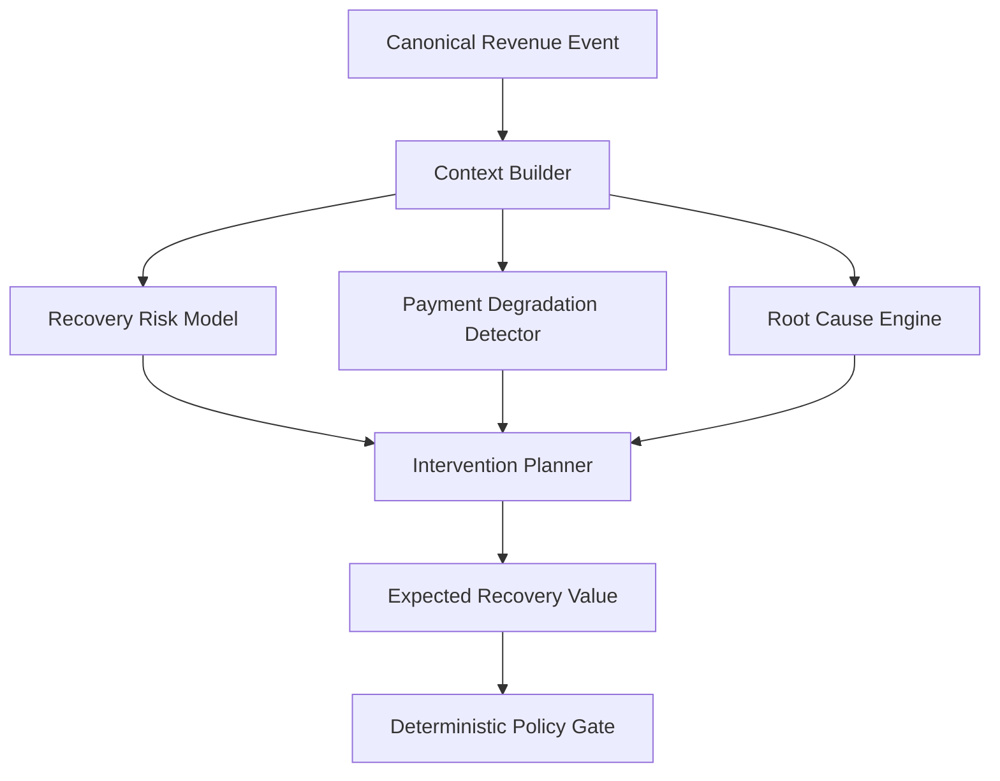
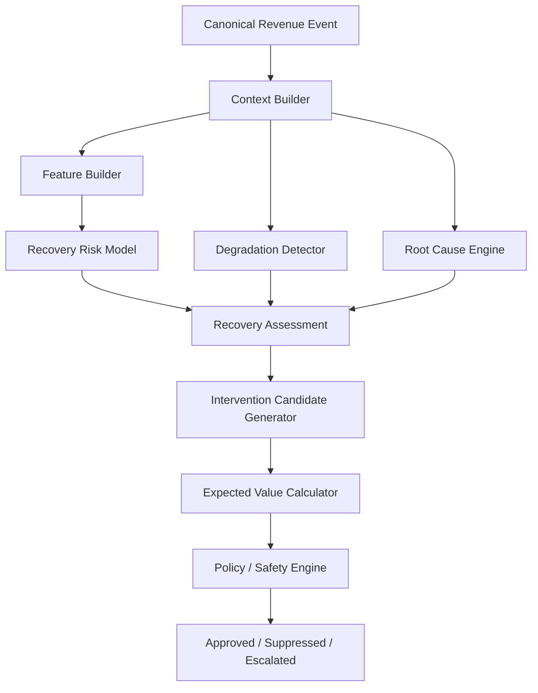
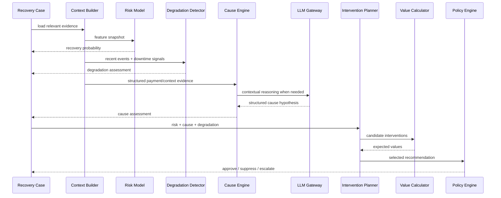

# RecoverAI — Revenue Intelligence

**Project:** RecoverAI
**Track:** Razorpay AI Buildathon — Track 03: AI Revenue Recovery
**Document:** Revenue Intelligence: Risk, Degradation, Root Cause & Intervention Economics
**Status:** Architecture Foundation — Proposed for Freeze
**Version:** 1.0
**Last Updated:** 2026-08-26

---

# 1. Purpose

This document defines the Revenue Intelligence layer of RecoverAI.

Revenue Intelligence converts validated revenue events and contextual evidence into structured decision inputs:

```text
Revenue Event
      |
      v
Context
      |
      +-------------------+
      |                   |
      v                   v
Recovery Risk       Degradation Detection
      |                   |
      +---------+---------+
                |
                v
          Cause Assessment
                |
                v
       Intervention Candidates
                |
                v
      Expected Recovery Value
                |
                v
       Policy / Safety Gate
```

The Revenue Intelligence layer is responsible for answering:

> **How much recovery opportunity exists, why is the revenue at risk, whether the problem is individual or systemic, and which interventions are worth considering?**

It is **not** responsible for final financial authorization.

---

# 2. Design Principles

## 2.1 Intelligence is evidence-driven

The system must base predictions and recommendations on explicit evidence.

The following distinction is mandatory:

```text
Observed fact
     !=
Derived signal
     !=
Prediction
     !=
Hypothesis
     !=
Decision
     !=
Outcome
```

Example:

```text
Observed:
payment.failed

Derived:
failure rate is 4.2x merchant baseline

Prediction:
recovery_probability = 0.71

Hypothesis:
customer-specific authentication issue

Decision:
create recovery payment link

Outcome:
payment captured
```

Each layer must retain its own provenance.

---

# 3. Revenue Intelligence Responsibilities

The subsystem contains five major capabilities:

1. **Recovery Risk Model**
2. **Payment Degradation Detector**
3. **Root Cause Engine**
4. **Intervention Candidate Generator**
5. **Expected Recovery Value Calculator**

These components deliberately use different techniques.



---

# 4. AI Judgment Principle

RecoverAI must not use an LLM as the default solution for every intelligence problem.

The selected tool must correspond to the nature of the problem.

| Intelligence problem              | Preferred technique                   | Reason                                                      |
| --------------------------------- | ------------------------------------- | ----------------------------------------------------------- |
| Recovery probability              | Supervised ML                         | Numerical prediction from structured features               |
| Probability calibration           | Statistical calibration               | Probability should be interpretable as probability          |
| Payment degradation               | Statistical/time-window analysis      | Detect temporal and aggregate deviations                    |
| Root-cause synthesis              | Evidence + LLM                        | Multiple heterogeneous signals require contextual reasoning |
| Candidate intervention generation | LLM + deterministic action vocabulary | Flexible reasoning with bounded outputs                     |
| Expected recovery value           | Deterministic mathematics             | Financial arithmetic must not depend on an LLM              |
| Final authorization               | Deterministic policy                  | Financial safety                                            |
| Final payment outcome             | External authoritative state          | Model prediction cannot establish financial truth           |

This separation is a central implementation requirement.

---

# 5. Revenue Intelligence Input Contract

Revenue Intelligence consumes a normalized `RevenueEvent` plus contextual data.

Conceptually:

```json
{
  "event": {
    "event_type": "PAYMENT_FAILED",
    "merchant_id": "merchant_01",
    "customer_id": "customer_01",
    "amount_minor": 50000,
    "currency": "INR",
    "occurred_at": "2026-08-26T12:30:00Z",
    "correlation": {
      "payment_id": "pay_01",
      "order_id": "order_01"
    }
  },

  "context": {
    "customer_history": {},
    "payment_history": {},
    "merchant_baseline": {},
    "recent_events": [],
    "active_downtime_signals": []
  }
}
```

The context layer must not expose hidden evaluation ground truth to the intelligence components.

---

# 6. Context Reliability

Every contextual input should have a provenance and freshness status where applicable.

Conceptually:

```text
ContextItem
├── source
├── observed_at
├── retrieved_at
├── freshness
├── authority
└── value
```

A value must not be silently treated as current if its freshness is unknown.

Possible context states:

```text
CURRENT
STALE
MISSING
CONFLICTING
UNAVAILABLE
```

The exact freshness thresholds are configuration, not universal constants.

---

# 7. Recovery Risk Model

## 7.1 Purpose

The Recovery Risk Model estimates the likelihood that a revenue opportunity can be successfully recovered under a defined recovery context.

The model's output is:

```text
recovery_probability
```

The probability must always be associated with:

* model identifier,
* model version,
* feature snapshot,
* prediction timestamp,
* evaluation context.

---

# 8. What Recovery Probability Means

The model must have a precise target definition.

For the initial payment-recovery model:

> **Probability that the eligible revenue opportunity will be successfully recovered within the defined recovery window under the specified intervention/evaluation policy.**

This definition must be finalized alongside the simulator because the label depends on:

* intervention type,
* allowed recovery window,
* recovery definition,
* and counterfactual evaluation design.

We must not train a model against an ambiguous label such as:

```text
payment eventually succeeded
```

without defining whether the success was caused by RecoverAI, by the customer independently, or by another process.

---

# 9. Two Distinct Probabilities

RecoverAI must distinguish:

## 9.1 Natural Recovery Probability

Probability that the revenue would recover without the proposed intervention within the evaluation window.

## 9.2 Intervention Recovery Probability

Probability that the revenue will recover under a particular intervention.

Example:

```text
Natural recovery probability:
0.32

Payment-link intervention probability:
0.71

Retry probability:
0.58
```

These values are conceptually different.

The second type is required if RecoverAI is going to optimize between interventions.

The initial MVP may begin with a simpler case-level recovery probability if the counterfactual simulator cannot reliably estimate intervention-specific probabilities.

The implementation must document which interpretation is actually trained and measured.

---

# 10. Model Output Contract

The model should return a typed structure such as:

```json
{
  "case_id": "case_001",
  "model_name": "recovery-risk-xgb",
  "model_version": "0.1.0",
  "recovery_probability": 0.73,
  "prediction_timestamp": "2026-08-26T12:31:00Z",
  "feature_snapshot_id": "features_001"
}
```

The model must not return an action.

It predicts a quantity.

The Agent Orchestrator and Intervention Planner use that prediction as one input to the decision process.

---

# 11. Initial Model Choice

The initial implementation should evaluate:

### Baseline

Logistic Regression.

### Candidate production-MVP model

XGBoost binary classification.

XGBoost documents the `binary:logistic` objective as binary logistic regression with probability output. ([xgboost.readthedocs.io](https://xgboost.readthedocs.io/en/latest/parameter.html))

The final model will be selected from measured validation results rather than predetermined by assumption.

---

# 12. Why We Should Not Start With an LLM for Recovery Probability

Recovery probability is a structured prediction problem.

An LLM could produce:

```text
"probably 70-80%"
```

but that would not provide the same reproducible numerical contract as a supervised model.

A dedicated ML model gives us:

* fixed feature definitions,
* repeatable inference,
* measurable predictive metrics,
* versioning,
* calibration analysis,
* and a clean evaluation boundary.

This is an intentional example of choosing **not** to use an LLM.

---

# 13. Candidate Features

The initial feature set should be based only on data actually available in the configured event/context model.

Potential features include:

## Transaction

```text
amount
currency
payment method
time since failure
attempt count
```

## Customer history

```text
historical payment count
historical success rate
historical failure rate
historical recovery rate
customer tenure
previous recovery interactions
```

## Failure context

Razorpay's documented payment error structures expose fields including:

```text
code
description
source
step
reason
metadata
```

and Razorpay's documentation explains that `source` identifies the point of failure, `step` identifies the transaction stage, and `reason` identifies the exact failure reason. ([razorpay.com](https://razorpay.com/docs/errors/))

These fields may therefore become structured features when they are available in the actual event/payload.

## Temporal context

```text
hour of day
day of week
recent failures
recent payment volume
recent recovery success
```

## System health

```text
merchant failure rate
method failure rate
active downtime signal
baseline deviation
```

Only fields actually available from verified data sources should enter the model.

---

# 14. Feature Provenance

Every production inference should be reproducible from a feature snapshot.

Conceptually:

```text
FeatureSnapshot
├── snapshot_id
├── case_id
├── generated_at
├── feature_schema_version
├── features
└── source_references
```

This allows us to answer:

> **What did the model actually see when it made this prediction?**

The raw source data may remain outside the model snapshot where privacy/minimization requires it.

---

# 15. Time Leakage Prevention

The feature pipeline must not use information that was unavailable at prediction time.

For example:

```text
Prediction time = 12:00
```

The model must not receive:

```text
payment_captured at 12:15
```

as a feature for the 12:00 prediction.

This is especially important in the synthetic evaluation environment.

The simulator must construct features using only data available at the simulated decision timestamp.

---

# 16. Train / Validation / Test Separation

The final model evaluation must use distinct datasets.

Conceptually:

```text
Dataset
├── Training
├── Validation / Calibration
└── Held-out Test
```

The held-out test set must not be used to tune the model.

The final Buildathon metrics must be generated from the held-out set.

---

# 17. Temporal Evaluation

If the simulated data contains temporal behavior, evaluation should consider a temporal split rather than allowing future patterns to leak into training.

For example:

```text
Earlier period
    ->
Train

Later period
    ->
Validation

Newest held-out period
    ->
Test
```

The exact split will be determined once the synthetic event simulator is designed.

---

# 18. Probability Calibration

A probability must be evaluated as a probability, not merely as a ranking score.

Scikit-learn documents probability calibration and notes that a well-calibrated classifier's predicted probabilities can be interpreted as the empirical frequency of the positive outcome. ([scikit-learn.org](https://scikit-learn.org/stable/modules/calibration.html))

Therefore the model evaluation should consider:

* calibration curve / reliability diagram,
* Brier score,
* log loss,
* discrimination metrics,
* threshold-dependent precision/recall.

Scikit-learn provides `CalibratedClassifierCV` with sigmoid, isotonic, and temperature calibration methods. ([scikit-learn.org](https://scikit-learn.org/stable/modules/generated/sklearn.calibration.CalibratedClassifierCV.html))

Calibration must use data separate from the data used to fit the base model.

---

# 19. Risk Model Metrics

The final evaluation may include:

```text
ROC-AUC
PR-AUC
Precision
Recall
F1
Log Loss
Brier Score
Calibration Error
Confusion Matrix
```

Scikit-learn provides standard classification metrics including precision, recall, F-score, ROC-AUC, average precision, and log loss. ([scikit-learn.org](https://scikit-learn.org/stable/api/sklearn.metrics.html))

The final metric set must reflect the actual label distribution.

For highly imbalanced recovery outcomes, PR-AUC and precision/recall should receive attention rather than relying only on accuracy or ROC-AUC.

---

# 20. Threshold Selection

The system must not assume:

```text
recovery_probability > 0.5
```

automatically means:

> intervene.

The intervention threshold should depend on:

* expected recovery value,
* intervention cost,
* risk,
* policy,
* and customer friction.

Therefore:

```text
Probability
     |
     v
Expected Value
     |
     v
Policy
     |
     v
Action
```

not:

```text
Probability > 0.5
     |
     v
Retry
```

---

# 21. Recovery Risk vs Action Selection

The architecture deliberately separates:

### Prediction

> How likely is recovery?

from:

### Decision

> What should we do?

This allows:

```text
P(recovery) = 0.82
```

but:

```text
Decision = WAIT
```

if another signal indicates an active payment-system degradation.

This separation is one of the most important design decisions in RecoverAI.

---

# 22. Payment Degradation Detector

## 22.1 Purpose

The Payment Degradation Detector identifies evidence that a payment problem is systemic rather than isolated.

This matters because the optimal response to:

```text
one failed customer payment
```

may be very different from:

```text
500 failures in 5 minutes
```

---

# 23. External Downtime Signals

Razorpay currently exposes payment downtime webhook events, including:

```text
payment.downtime.started
payment.downtime.updated
```

The documented downtime payload can include:

* payment method,
* status,
* severity,
* beginning time,
* ending time,
* instrument information where applicable.

Razorpay explains that payment downtime represents a period during which one or more payment options underperform and can result from technical issues or outages involving Razorpay partners or issuing banks. ([razorpay.com](https://razorpay.com/docs/webhooks/payments/))

These external signals should be incorporated directly into Revenue Intelligence.

---

# 24. Internal Degradation Detection

RecoverAI should additionally detect patterns from observed payment events.

Potential signals:

```text
failure_rate
failure_rate_delta
volume_delta
method_concentration
short_window_failure_count
baseline_deviation
recovery_success_rate_delta
```

Example:

```text
Current 5-minute failure rate = 41%
Baseline 5-minute failure rate = 8%

Deviation = +33 percentage points
```

The exact thresholds must be learned/evaluated rather than hard-coded from arbitrary numbers.

---

# 25. Aggregation Windows

The degradation detector may use multiple windows.

Example:

```text
1 minute
5 minutes
15 minutes
1 hour
```

Short windows detect sudden outages.

Longer windows detect persistent degradation.

The final set of windows should be configuration-driven so they can be evaluated rather than buried in code.

---

# 26. Baseline Construction

The baseline should be calculated using historical behavior that would have been available at the time of prediction.

Potential baseline dimensions:

```text
merchant
payment method
time-of-day
day-of-week
```

Additional dimensions should only be added if the synthetic or live data supports them reliably.

The baseline must not use future observations.

---

# 27. Degradation Signal Contract

Example:

```json
{
  "signal_type": "SYSTEMIC_PAYMENT_DEGRADATION",
  "score": 0.91,

  "scope": {
    "merchant_id": "merchant_01",
    "payment_method": "upi"
  },

  "signals": [
    {
      "type": "FAILURE_RATE_SPIKE",
      "value": 0.41,
      "baseline": 0.08
    },
    {
      "type": "RAZORPAY_DOWNTIME",
      "severity": "high"
    }
  ],

  "generated_at": "2026-08-26T12:35:00Z"
}
```

This is an internal contract.

`score` is a RecoverAI-derived signal and must not be confused with an official Razorpay health score.

---

# 28. Degradation Detector Must Separate Signal From Action

The detector only produces:

```text
SYSTEMIC_DEGRADATION = likely
```

It does not decide:

```text
SUPPRESS ALL PAYMENTS
```

The actual intervention decision occurs later through the Agent/Policy path.

This prevents the anomaly detector from becoming an uncontrolled action mechanism.

---

# 29. Root Cause Engine

The Root Cause Engine transforms multiple observations into a structured cause assessment.

Inputs may include:

```text
payment failure fields
customer history
payment history
temporal signals
degradation signals
downtime events
merchant context
previous recovery attempts
```

Outputs:

```text
cause category
confidence
evidence references
uncertainties
analysis provenance
```

---

# 30. Razorpay Error Taxonomy as Evidence

Razorpay documents a structured error object with:

```text
code
description
field
source
step
reason
metadata
```

The `source`, `step`, and `reason` fields are specifically intended to help identify where and why a failure occurred and can be handled programmatically. ([razorpay.com](https://razorpay.com/docs/errors/))

Razorpay also documents payment-method-specific source and step values across cards, UPI, netbanking, wallets, cardless EMI, and eMandate. ([razorpay.com](https://razorpay.com/docs/errors/payments/payment-methods-error-parameters/))

Therefore these fields should be treated as **high-value evidence**, not merely display text.

---

# 31. Root Cause Categories

The engine begins with a controlled taxonomy.

```text
CUSTOMER_ACTION
PAYMENT_METHOD_ISSUE
BANK_OR_ISSUER_ISSUE
GATEWAY_OR_NETWORK_ISSUE
MERCHANT_CONFIGURATION
SYSTEMIC_DEGRADATION
UNKNOWN
```

These are RecoverAI categories.

They are not claimed to be identical to Razorpay's own production classification taxonomy.

Mapping logic must preserve the original Razorpay `source`, `step`, and `reason` values when available.

---

# 32. Evidence Hierarchy

The Root Cause Engine should prefer evidence in this order:

```text
1. Authoritative external state / documented event
2. Structured external error fields
3. Deterministic derived signals
4. Historical behavioral signals
5. Statistical/model evidence
6. LLM interpretation
```

The LLM should **synthesize evidence**, not replace stronger evidence.

---

# 33. Root Cause Example

Input:

```text
payment.failed

source = customer
step = payment_authentication
reason = invalid_otp

customer_history:
7 previous successful payments
```

Potential assessment:

```text
category = CUSTOMER_ACTION
confidence = high
```

The LLM may explain:

> The failure is consistent with an authentication problem requiring customer action.

But the structured `source`, `step`, and `reason` remain the underlying evidence.

---

# 34. Systemic Root Cause Example

Input:

```text
300 failures
5-minute window

same payment method

failure rate >> baseline

Razorpay payment.downtime.started
```

Assessment:

```text
category = SYSTEMIC_DEGRADATION
```

The recommendation may then be:

```text
SUPPRESS INDIVIDUAL RECOVERY
```

rather than generating 300 individual actions.

---

# 35. LLM Role in Root Cause Analysis

The LLM may be used when:

* multiple signals conflict,
* evidence is heterogeneous,
* a merchant-facing explanation is needed,
* a structured cause hypothesis needs contextual synthesis.

The LLM should return a structured response:

```json
{
  "cause_category": "CUSTOMER_ACTION",
  "confidence": 0.87,
  "evidence_ids": [
    "err_001",
    "history_023"
  ],
  "uncertainties": []
}
```

The response must pass schema and semantic validation.

The LLM cannot invent evidence IDs.

---

# 36. LLM Must Not Determine Ground Truth

In live operation:

The LLM produces a hypothesis.

In evaluation:

The simulator determines ground truth independently.

The model must never influence:

```text
whether the simulated payment recovered
```

or:

```text
whether its own prediction is considered correct
```

This is a mandatory evaluation integrity rule.

---

# 37. Intervention Candidate Generation

Intervention planning receives:

```text
RecoveryCase
+
RiskAssessment
+
DegradationAssessment
+
CauseAssessment
+
Historical actions
+
Policy context
```

The planner generates candidates from a **closed action vocabulary**.

Initial candidates:

```text
WAIT
CREATE_PAYMENT_LINK
SEND_PAYMENT_LINK_NOTIFICATION
PAYMENT_LINK_REMINDER
SUPPRESS
ESCALATE
```

Potential future candidates can be added through implementation packages.

The LLM may rank/explain candidates, but it cannot invent a new executable action.

---

# 38. Intervention Eligibility

Each candidate must have an eligibility state:

```text
ELIGIBLE
INELIGIBLE
REQUIRES_APPROVAL
REQUIRES_REVALIDATION
```

Example:

```text
CREATE_PAYMENT_LINK
    |
    +--> ELIGIBLE
```

or:

```text
CREATE_PAYMENT_LINK
    |
    +--> INELIGIBLE
         because case already recovered
```

The eligibility rules belong to the Policy layer.

---

# 39. Intervention Economics

The planner must quantify the expected value of eligible interventions.

Baseline formula:

```text
Expected Recovery Value
=
Amount at Risk
×
Intervention Recovery Probability
```

Where intervention-specific recovery probabilities are available.

If no intervention-specific model exists:

```text
Expected Recovery Value
=
Amount at Risk
×
Case Recovery Probability
```

with the limitation explicitly recorded.

---

# 40. Net Expected Value

Where enough information exists, the system may compute:

```text
Net Expected Value
=
Expected Recovery Value
-
Intervention Monetary Cost
-
Expected Margin Loss
-
Expected Operational Cost
-
Expected Customer Friction Cost
```

Not every term needs to be monetized in the first MVP.

The first version should prefer explicit measurable terms over invented monetary approximations.

For example:

```text
₹ recovered
+
number of interventions
+
escalation count
```

are measurable.

A fabricated:

```text
customer_friction_cost = ₹37.50
```

is not acceptable without an empirical or documented basis.

---

# 41. Intervention Ranking

A candidate ranking should consider:

```text
expected_recovery_value
+
action eligibility
+
risk
+
friction
+
urgency
```

The final selection must pass the Policy Engine.

The ranking algorithm is not itself authorization.

---

# 42. Suppression as an Intervention Candidate

`SUPPRESS` must participate in candidate evaluation.

Example:

```text
Candidate A:
CREATE_PAYMENT_LINK
EV = ₹3,000

Candidate B:
WAIT
EV = ₹3,400

Candidate C:
SUPPRESS
Expected unnecessary intervention = high
```

The system may select `WAIT` even when immediate intervention exists.

This is essential to prevent:

> “Agentic” = “always take action.”

---

# 43. Case Prioritization

When many RecoveryCases are active, the system needs a prioritization strategy.

Initial conceptual priority:

```text
Priority Score
=
Expected Recovery Value
×
Urgency Factor
×
Confidence
```

The exact formula must be evaluated.

This is not a financial authorization rule.

It determines processing order.

---

# 44. Systemic Degradation Override

Individual case priority must not override a trusted systemic degradation signal.

Example:

```text
Case priority:
₹20,000 expected recovery

Systemic degradation:
active
```

The case can still be suppressed if policy specifies that recovery attempts should pause during the degradation condition.

This is another example of:

> **Revenue optimization under constraints rather than revenue maximization without constraints.**

---

# 45. Recovery Intelligence Output Contract

The intelligence layer should produce a structured `RecoveryAssessment`.

Conceptually:

```json
{
  "case_id": "case_001",

  "risk": {
    "recovery_probability": 0.73,
    "model_name": "recovery-risk-xgb",
    "model_version": "0.1.0"
  },

  "degradation": {
    "detected": true,
    "probability": 0.91,
    "scope": "upi"
  },

  "cause": {
    "category": "SYSTEMIC_DEGRADATION",
    "confidence": 0.94,
    "evidence_ids": [
      "evt_001",
      "sig_017",
      "down_003"
    ]
  },

  "candidates": [
    "WAIT",
    "SUPPRESS",
    "ESCALATE"
  ],

  "generated_at": "2026-08-26T12:35:00Z"
}
```

This output is advisory.

The Policy Engine still determines authorization.

---

# 46. Confidence Semantics

Confidence values must identify what they refer to.

Do not use:

```text
confidence = 0.91
```

without defining whether it refers to:

* model prediction,
* cause hypothesis,
* degradation detection,
* LLM output certainty.

Use explicit fields:

```text
recovery_probability
cause_confidence
degradation_probability
```

Where a model does not produce a calibrated probability, it must not be labelled as one.

---

# 47. Calibration Requirements

If `recovery_probability` is presented to the intervention optimizer as a probability, the model should undergo calibration analysis.

The evaluation must include:

* calibration curve,
* Brier score or an equivalent proper scoring rule,
* comparison of predicted vs observed frequencies.

Scikit-learn explicitly distinguishes calibrated probabilities from arbitrary classifier scores and provides tools for calibration and calibration curves. ([scikit-learn.org](https://scikit-learn.org/stable/modules/calibration.html))

---

# 48. Avoiding Model Self-Confirmation

The model should not receive the result of its own proposed action as a pre-action feature.

Correct:

```text
features at T0
  ->
prediction
  ->
action
  ->
outcome at T1
```

Incorrect:

```text
features at T0
  +
future outcome at T1
  ->
prediction at T0
```

The latter is data leakage.

---

# 49. Intervention Model Evaluation

When multiple interventions are modeled, the evaluation must compare actual outcomes under the simulator's ground truth.

For example:

```text
Case 101

Natural outcome:
not recovered

Payment Link:
recovered

Wait:
not recovered

Escalation:
recovered
```

RecoverAI may select:

```text
Payment Link
```

The simulator can then determine whether that decision produced recovery.

The ground truth is independent of the agent.

---

# 50. Counterfactual Evaluation Constraint

The system must not claim:

> "The payment would definitely have failed without RecoverAI."

unless the simulator provides that counterfactual ground truth.

For live Test Mode cases, RecoverAI can observe actual outcomes, but it cannot know what would have happened under an unexecuted alternative.

Therefore:

### Live integration

Use for:

* actual workflow demonstration,
* API correctness,
* state verification.

### Synthetic benchmark

Use for:

* counterfactual intervention comparison,
* baseline comparison,
* measured recovery uplift.

This distinction must remain explicit.

---

# 51. Degradation Evaluation

The degradation detector must be evaluated separately.

Metrics may include:

```text
precision
recall
false-positive rate
false-negative rate
detection latency
```

A high false-positive rate is dangerous because it can cause unnecessary suppression.

A high false-negative rate can cause unnecessary individual recovery actions during systemic degradation.

Therefore:

> **The detector is not optimized solely for sensitivity.**

---

# 52. Recovery Intelligence Ablation

The evaluation should eventually support:

### Full RecoverAI

```text
ML
+
degradation detector
+
root cause
+
LLM
+
intervention economics
```

versus:

### Without ML

### Without degradation detection

### Without LLM reasoning

### Without intervention economics

The objective is not to make every component look useful.

It is to determine which components actually contribute.

---

# 53. Why This Matters for Razorpay's AI-Judgment Criterion

The architecture should allow the final submission to answer:

### Why ML?

Because recovery probability is a supervised prediction problem.

### Why statistics?

Because payment degradation is observable through temporal aggregate behavior.

### Why Razorpay signals?

Because Razorpay exposes structured payment-error and downtime information relevant to diagnosis. ([razorpay.com](https://razorpay.com/docs/errors/); [razorpay.com](https://razorpay.com/docs/webhooks/payments/))

### Why an LLM?

Because contextual synthesis and explanation can require combining heterogeneous evidence.

### Why not LLM for money calculations?

Because deterministic arithmetic is safer and reproducible.

### Why not LLM for authorization?

Because financial policy must be deterministic.

---

# 54. Revenue Intelligence Anti-Patterns

The implementation must not:

### Use an LLM as the recovery classifier

Unless benchmarking establishes a concrete benefit.

### Use arbitrary confidence scores as probabilities

Probability semantics must be justified.

### Hard-code undocumented Razorpay error taxonomies

Retain original source/step/reason fields where available and map them to RecoverAI categories.

### Treat Razorpay downtime signals as absolute truth about every individual payment

They are contextual signals; individual payment state still requires individual evidence.

### Trigger financial actions directly from anomaly detection

The detector produces a signal; policy and orchestration determine the next step.

### Use future information in predictions

No temporal leakage.

### Optimize only for recovery rate

The system must also measure unnecessary interventions and safety.

---

# 55. Data Flow



---

# 56. Revenue Intelligence Sequence



---

# 57. Revenue Intelligence Data Contracts

The following logical contracts are required:

```text
RecoveryRiskAssessment
DegradationAssessment
CauseAssessment
InterventionCandidate
InterventionPlan
ExpectedValueAssessment
```

Each must contain:

* version,
* timestamp,
* case ID,
* provenance,
* relevant evidence references.

The detailed implementation types will be defined in the corresponding package.

---

# 58. Model Versioning

Each model output must record:

```text
model_name
model_version
feature_schema_version
prediction_timestamp
```

A future model must not silently replace an existing model while leaving old decisions impossible to reproduce.

Evaluation reports must identify the model version used.

---

# 59. Intelligence Failure Policy

If the ML model fails:

```text
No model output
   |
   v
Use deterministic fallback only if safe
   |
   +--> otherwise ESCALATE / SUPPRESS
```

If the degradation detector fails:

```text
No degradation assessment
   |
   v
Do not claim systemic degradation
   |
   v
Use conservative case-specific policy
```

If the LLM fails:

```text
No root-cause synthesis
   |
   v
Use structured/documented evidence
   |
   +--> deterministic action possible
   |
   +--> otherwise escalate
```

Intelligence failure must never silently become financial authority.

---

# 60. Revenue Intelligence and Policy Boundary

The Revenue Intelligence layer may recommend:

```text
CREATE_PAYMENT_LINK
WAIT
SUPPRESS
ESCALATE
```

It cannot execute those actions merely because they are recommended.

The boundary is:

```text
Revenue Intelligence
        |
        v
Recommendation
        |
        v
Policy Engine
        |
        v
Authorized Action
```

This separation is mandatory.

---

# 61. What Revenue Intelligence Must Be Able to Explain

For every selected recommendation, RecoverAI should be able to answer:

```text
What evidence was observed?
What was the recovery probability?
Was systemic degradation detected?
What cause was inferred?
Which candidate interventions were considered?
Why was the selected intervention preferred?
What policy allowed it?
```

This is the bridge between the internal intelligence architecture and the Buildathon's auditability requirement.

---

# 62. Evaluation Requirements

Before the Revenue Intelligence layer is declared complete, the implementation must demonstrate:

### Recovery model

* held-out evaluation,
* calibration assessment,
* precision/recall or equivalent metrics,
* reproducible model version.

### Degradation detector

* known synthetic degradation scenarios,
* false-positive measurement,
* false-negative measurement,
* detection latency measurement.

### Root cause

* structured taxonomy,
* evidence references,
* invalid/hallucinated evidence rejection.

### Intervention economics

* reproducible calculation,
* no floating-point financial arithmetic,
* no unsupported invented cost assumptions.

### Integration

* Razorpay error fields are mapped only when actually available,
* downtime events are accepted where configured,
* external outcomes remain authoritative.

---

# 63. Definition of Done

Revenue Intelligence is not complete when:

> "The model runs."

It is complete when:

1. Features are versioned.
2. Training/validation/test separation exists.
3. Probability semantics are documented.
4. Calibration has been evaluated where probabilities are used.
5. Degradation scenarios are measurable.
6. Cause assessments reference evidence.
7. The LLM cannot invent evidence.
8. Candidate actions use a closed vocabulary.
9. Expected value is deterministic.
10. No intelligence component can directly authorize a financial mutation.
11. Failure behavior is explicit.
12. Evaluation results are reproducible.

---

# 64. Freeze Decisions

The following are frozen at architecture level:

### Decision 1

Recovery probability is an ML/statistical prediction, not an LLM-only judgment.

### Decision 2

If probability is exposed as probability, calibration must be evaluated.

### Decision 3

Payment degradation uses both:

* Razorpay-provided downtime signals where available,
* RecoverAI-derived temporal anomaly signals.

### Decision 4

Razorpay's structured error fields are evidence inputs where actually available.

### Decision 5

Root-cause reasoning may use an LLM, but the LLM is not the source of truth.

### Decision 6

Expected recovery value uses deterministic arithmetic.

### Decision 7

Suppression is a legitimate decision outcome.

### Decision 8

Prediction, recommendation, authorization, execution, and outcome remain separate concepts.

### Decision 9

Synthetic counterfactual ground truth remains outside the application.

### Decision 10

The intelligence layer cannot directly execute or authorize financial actions.

---

# 65. Next Document

The next specification is:

```text
07_AI_JUDGMENT.md
```

It will define the precise AI boundary:

* where Gemini/Groq/Hugging Face are used,
* where they are deliberately not used,
* structured LLM contracts,
* prompt/context boundaries,
* evidence injection,
* hallucination containment,
* provider fallback,
* model selection,
* AI evaluation,
* and the exact answer to Razorpay's criterion:

> **"The right tool in the right place, and where you chose not to use one."**

---

# 66. External References

## Razorpay

### About Errors

https://razorpay.com/docs/errors/
Razorpay documents `code`, `description`, `field`, `source`, `step`, `reason`, and `metadata` as structured error fields used to diagnose payment failures.

### Payment Error Taxonomy

https://razorpay.com/docs/errors/payments/payment-methods-error-parameters/
Razorpay documents payment-method-specific `source` and `step` values across supported payment methods.

### Payment Webhook Events

https://razorpay.com/docs/webhooks/payments/
Razorpay documents payment events, payment downtime events, and related payload structures.

### Webhooks

https://razorpay.com/docs/webhooks/
Razorpay documents webhook-based asynchronous event notification and explains that webhook information can be used to analyse payment failures and status changes.

---

## Machine Learning

### XGBoost Parameters

https://xgboost.readthedocs.io/en/latest/parameter.html
XGBoost documents `binary:logistic` as a binary classification objective producing probability output.

### scikit-learn Probability Calibration

https://scikit-learn.org/stable/modules/calibration.html
scikit-learn documents probability calibration, calibration curves, and evaluation of probabilistic predictions.

### CalibratedClassifierCV

https://scikit-learn.org/stable/modules/generated/sklearn.calibration.CalibratedClassifierCV.html
scikit-learn documents sigmoid, isotonic, and temperature-scaling approaches and the need for appropriate calibration data.

### Classification Metrics

https://scikit-learn.org/stable/api/sklearn.metrics.html
scikit-learn provides precision, recall, F-score, average precision, ROC-AUC, log loss, and related metrics.

---

# 67. Verification Status

## VERIFIED

* Razorpay payment error structure.
* Razorpay payment `source`, `step`, and `reason` semantics.
* Razorpay payment webhook behavior.
* Razorpay payment downtime webhook availability.
* Razorpay payment-downtime payload fields documented by Razorpay.
* XGBoost binary probability objective.
* scikit-learn probability calibration facilities.
* Standard classification metrics.

## PROPOSED

* Exact feature set.
* Exact recovery labels.
* Exact intervention-specific models.
* Exact degradation thresholds.
* Exact anomaly algorithm.
* Exact root-cause taxonomy.
* Exact expected-value coefficients.
* Exact model-selection outcome.

## NOT YET IMPLEMENTED

All Revenue Intelligence components.

## IMPORTANT

No recovery-performance number is currently claimed.

All model quality, calibration, degradation-detection quality, and intervention-value results must be generated experimentally from the final implementation and held-out evaluation data.
