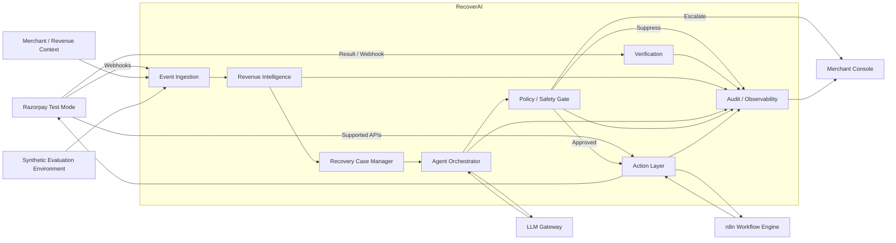
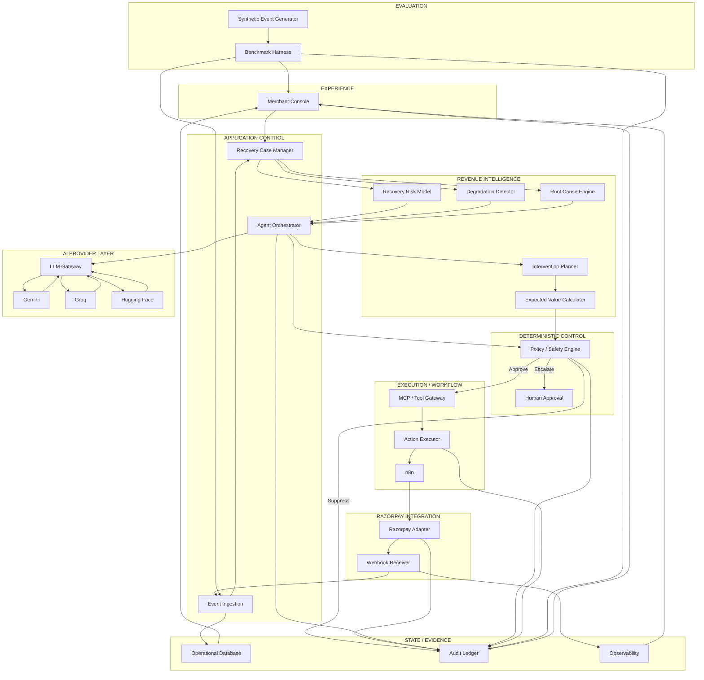
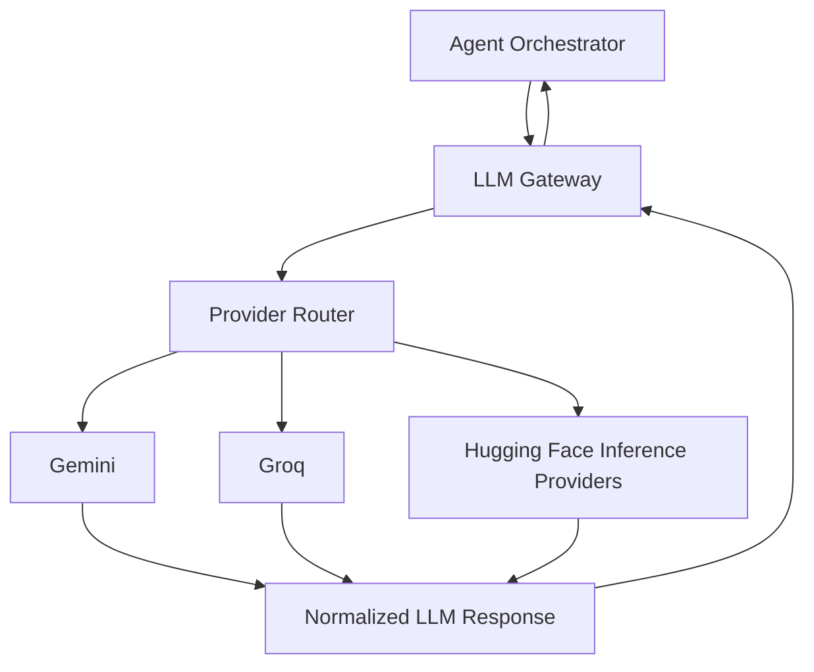
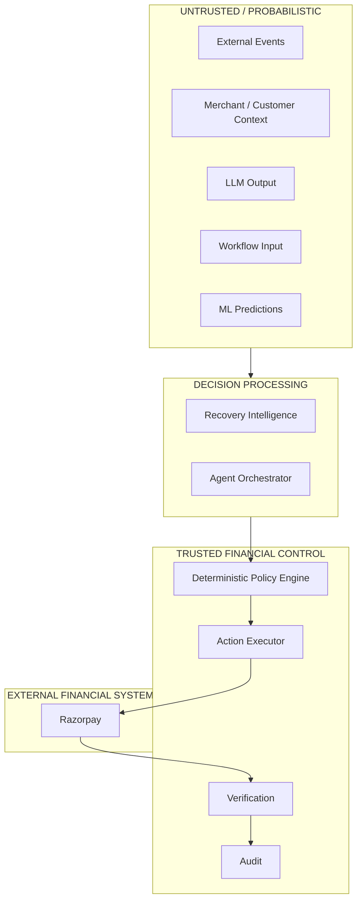
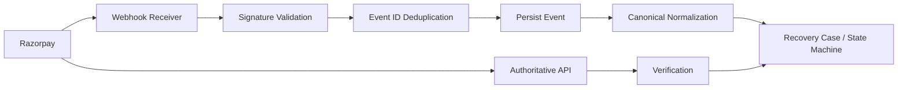
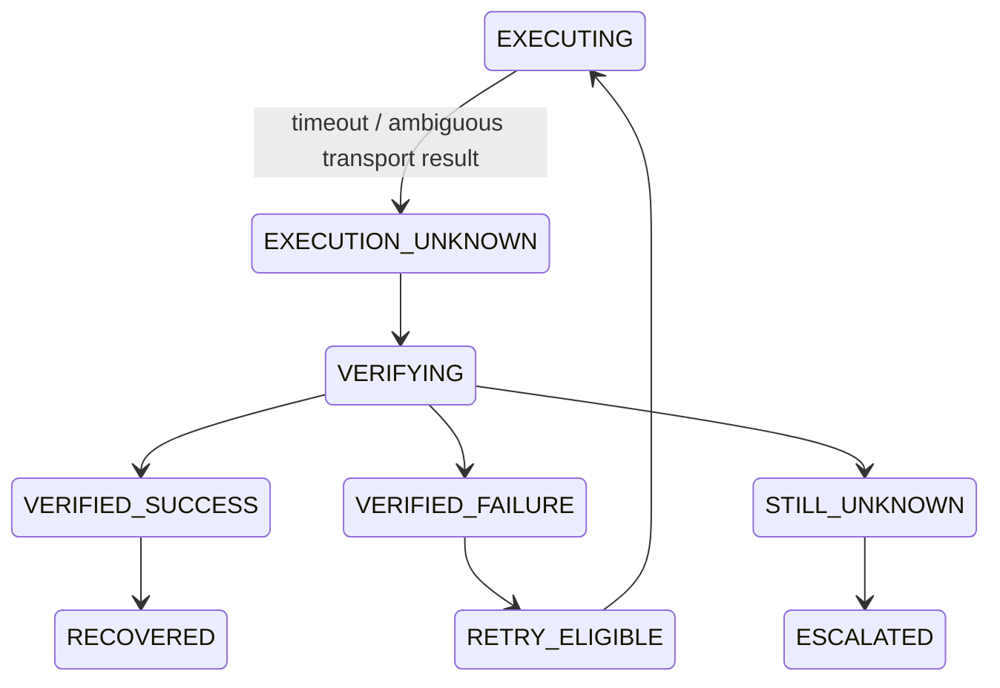
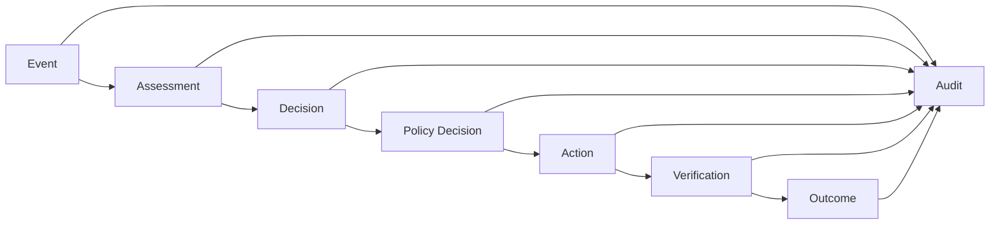
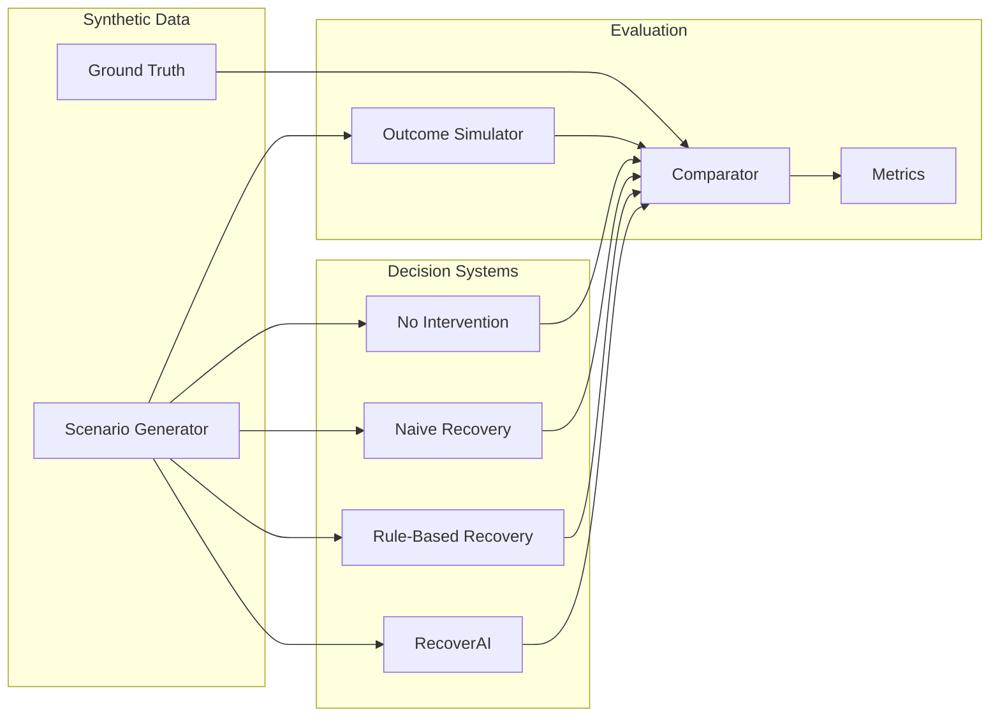
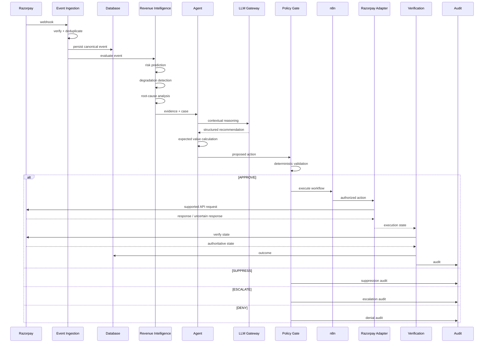

# RecoverAI — System Architecture

**Project:** RecoverAI
**Track:** Razorpay AI Buildathon — Track 03: AI Revenue Recovery
**Document:** System Architecture
**Status:** Architecture Foundation — Proposed for Freeze
**Version:** 1.0
**Last Updated:** 2026-08-26

---

# 1. Purpose

This document defines the system-level architecture of RecoverAI.

It establishes:

* system boundaries,
* architectural layers,
* component responsibilities,
* trust boundaries,
* data flow,
* control flow,
* technology responsibilities,
* external integration boundaries,
* synchronous and asynchronous paths,
* reliability principles,
* and the relationship between AI reasoning and deterministic financial execution.

This document is the architectural contract for subsequent domain, integration, implementation, testing, and package-planning documents.

The architecture is designed around one central requirement:

> **RecoverAI must be able to detect, reason about, and execute revenue-recovery workflows without allowing probabilistic AI behavior to directly control financial execution.**

---

# 2. Architectural Objectives

RecoverAI must satisfy six architectural objectives.

## 2.1 Track Alignment

The system must directly implement the Track 03 loop:

```text
Detect
  ->
Determine intervention
  ->
Execute bounded recovery workflow
  ->
Verify outcome
  ->
Measure recovered revenue
```

The architecture must support measured recovery across a synthetic batch and a smaller number of real Razorpay Test Mode demonstrations.

---

## 2.2 Financial Safety

Financial mutations must have a deterministic authorization boundary.

The LLM may recommend.

The policy engine authorizes.

The execution layer executes.

The verification layer determines the external business outcome.

---

## 2.3 Revenue Intelligence

The architecture must make room for:

* recovery probability,
* systemic degradation detection,
* root-cause analysis,
* intervention ranking,
* intervention economics,
* and explicit suppression.

These are core product capabilities rather than optional analytics.

---

## 2.4 Reliability

The system must correctly handle:

* duplicate webhooks,
* out-of-order webhooks,
* delayed webhooks,
* API timeouts,
* unknown external state,
* provider failures,
* invalid LLM output,
* policy rejection,
* duplicate actions,
* and workflow interruption.

---

## 2.5 Observability

Every important decision and mutation must be explainable after the fact.

A reviewer should be able to reconstruct:

```text
event
  ->
evidence
  ->
assessment
  ->
recommendation
  ->
policy decision
  ->
action
  ->
verification
  ->
outcome
```

---

## 2.6 Reproducible Evaluation

The architecture must allow the same RecoverAI core to run against:

1. Razorpay Test Mode events.
2. Synthetic revenue events.

The synthetic system must not become a separate implementation of RecoverAI.

---

# 3. System Context

The system has five major external actors or environments:

```text
Razorpay Test Mode
        |
        | APIs + Webhooks
        v
   RecoverAI Core
        ^
        |
Merchant Context / Revenue Events
        |
        v
Synthetic Evaluation Environment

LLM Providers:
Gemini / Groq / Hugging Face

Workflow Infrastructure:
n8n
```

The merchant-facing dashboard observes and controls RecoverAI but does not become the financial execution layer.

---

# 4. System Context Diagram



---

# 5. Primary Architectural Layers

RecoverAI is divided into the following logical layers:

```text
┌─────────────────────────────────────────────┐
│                EXPERIENCE                  │
│ Dashboard / Case inspection / Metrics      │
├─────────────────────────────────────────────┤
│             APPLICATION CONTROL            │
│ Recovery Case / Agent Orchestration        │
├─────────────────────────────────────────────┤
│           REVENUE INTELLIGENCE             │
│ ML / Anomaly / Root Cause / Economics      │
├─────────────────────────────────────────────┤
│             POLICY & SAFETY                │
│ Rules / Limits / Approval / Suppression    │
├─────────────────────────────────────────────┤
│          EXECUTION & WORKFLOW              │
│ MCP / Action Executor / n8n                │
├─────────────────────────────────────────────┤
│             INTEGRATIONS                   │
│ Razorpay Adapter / Webhooks / APIs         │
├─────────────────────────────────────────────┤
│       PERSISTENCE / AUDIT / EVALUATION     │
│ DB / Audit / Metrics / Simulator            │
└─────────────────────────────────────────────┘
```

The layers are logical boundaries. They do not require separate deployable services in the MVP.

The MVP should prefer a modular application over unnecessary microservice fragmentation.

---

# 6. Component Architecture



---

# 7. Component Responsibilities

## 7.1 Merchant Console

### Responsible for

* revenue-at-risk overview,
* recovered revenue,
* recovery cases,
* intervention status,
* suppression events,
* escalations,
* audit inspection,
* evaluation results,
* failure demonstrations.

### Not responsible for

* policy enforcement,
* direct Razorpay execution,
* LLM reasoning,
* financial-state authority.

The dashboard is an observation/control surface, not the trusted execution boundary.

---

# 8. Event Ingestion

The Event Ingestion layer is responsible for accepting revenue-related events from:

* Razorpay webhooks,
* merchant-provided revenue events,
* synthetic evaluation events.

For Razorpay webhooks, the ingestion layer must:

1. receive the raw request,
2. validate the webhook signature,
3. identify the event using the Razorpay event identifier,
4. perform duplicate detection,
5. persist the raw/canonical event as required,
6. normalize it into the RecoverAI event model,
7. pass it into the application layer.

Razorpay documents that webhook delivery follows at-least-once semantics, that duplicate events can occur, and that `x-razorpay-event-id` is unique per event and can be used for deduplication. Razorpay also warns that webhook events may not always arrive in event order.

---

# 9. Canonical Event Boundary

External event formats must not propagate directly through the entire domain.

RecoverAI introduces a canonical event representation:

```text
External Event
     |
     v
Validation
     |
     v
Canonical Revenue Event
     |
     v
Domain
```

This isolates:

* Razorpay-specific payload structures,
* synthetic data structures,
* future merchant integrations.

The canonical event model is defined in `04_EVENT_MODEL.md`.

---

# 10. Revenue Intelligence Layer

Revenue Intelligence converts raw revenue events into actionable evidence.

It contains five logical components.

## 10.1 Recovery Risk Model

Produces a probability or score estimating the likelihood of recovery under specified conditions.

The initial implementation is expected to use a conventional ML model rather than an LLM.

The model must receive explicit, versioned features and produce structured output.

---

## 10.2 Payment Degradation Detector

Detects deviations from normal payment behavior.

Potential signals include:

* failure rate,
* temporal spikes,
* payment-method concentration,
* bank/route concentration where such fields are available,
* merchant-level baseline deviation,
* short-window clustering.

This component should initially use statistical/algorithmic methods.

It must not depend on an LLM for anomaly detection.

---

## 10.3 Root Cause Engine

Produces:

* root-cause category,
* confidence,
* supporting evidence,
* unresolved uncertainties.

The engine may combine deterministic evidence aggregation, statistical signals, and LLM reasoning.

The LLM must not invent unavailable facts.

---

## 10.4 Intervention Planner

Generates candidate interventions based on the Recovery Case.

Possible classes include:

* supported payment recovery mechanism,
* waiting,
* retry where explicitly supported and authorized,
* reminder,
* escalation,
* suppression.

The final list of executable actions is restricted to capabilities actually implemented and verified by the integration layer.

---

## 10.5 Expected Value Calculator

Calculates the economic value of candidate interventions using explicit deterministic mathematics.

This component does not use an LLM for arithmetic or authorization.

---

# 11. Recovery Case Manager

The Recovery Case Manager is the central application domain component.

It is responsible for:

* opening Recovery Cases,
* enriching them,
* advancing their lifecycle,
* enforcing valid state transitions,
* associating evidence,
* tracking interventions,
* recording outcomes,
* and closing or escalating cases.

A Recovery Case should remain independent from a specific LLM provider or workflow implementation.

---

# 12. Agent Orchestrator

The Agent Orchestrator coordinates contextual reasoning.

Its responsibilities include:

1. loading the Recovery Case,
2. retrieving relevant evidence,
3. requesting predictions from the ML layer,
4. obtaining anomaly signals,
5. requesting root-cause reasoning,
6. generating candidate intervention plans,
7. calculating expected value,
8. producing a structured proposed action,
9. sending that proposed action to the Policy Engine.

The Agent Orchestrator does **not** authorize the final financial action.

---

# 13. LLM Gateway

The LLM Gateway isolates provider-specific implementations.

Architecture:



The application must not directly import provider-specific code from core business modules.

The gateway is responsible for:

* provider selection,
* authentication,
* request normalization,
* structured-output handling,
* timeout handling,
* provider health,
* rate-limit handling,
* fallback,
* usage metadata,
* model metadata,
* and error normalization.

The exact interface is defined in `11_LLM_GATEWAY.md`.

---

# 14. LLM Trust Boundary

LLM output is untrusted.

The following rule is mandatory:

```text
LLM output
    |
    v
Schema validation
    |
    v
Semantic validation
    |
    v
Policy Engine
    |
    v
Possible execution
```

The LLM cannot directly invoke a financial mutation merely because it emitted a tool/action request.

---

# 15. Provider Failure Model

If a configured LLM provider:

* times out,
* returns a provider error,
* returns a rate-limit response,
* returns malformed structured output,
* or otherwise cannot produce a valid response,

the LLM Gateway must return a normalized failure state.

The Agent Orchestrator then decides, according to the operation:

* provider fallback,
* deterministic fallback,
* suppression,
* or escalation.

The Policy Engine remains the financial authorization boundary.

---

# 16. Policy / Safety Engine

The Policy Engine is deterministic.

It evaluates:

* action eligibility,
* maximum attempts,
* amount thresholds,
* cooldown,
* case state,
* customer communication constraints,
* duplicate-action constraints,
* suppression conditions,
* approval requirements,
* and other declared merchant/system policies.

It returns a structured decision:

```text
APPROVE
DENY
SUPPRESS
ESCALATE
REVALIDATE
```

The final policy vocabulary will be fixed in `08_POLICY_AND_SAFETY.md`.

---

# 17. Trust Boundary



### Critical rule

> **No probabilistic component has direct authority to create or mutate a financial state.**

---

# 18. MCP / Tool Gateway

The MCP/tool layer exposes bounded capabilities to the Agent Orchestrator.

The final tools must be:

* explicitly defined,
* typed,
* least-privilege,
* auditable,
* policy-aware,
* and idempotent where appropriate.

Conceptually:

```text
Agent
  |
  v
MCP / Tool Gateway
  |
  +--> Read payment
  |
  +--> Read customer context
  |
  +--> Read recovery case
  |
  +--> Create supported recovery mechanism
  |
  +--> Verify state
  |
  +--> Escalate
  |
  +--> Record action
```

The tool layer must not expose generic arbitrary HTTP or database mutation access.

---

# 19. Action Executor

The Action Executor is responsible for executing an **already-authorized** action.

It must:

* receive a policy-approved action,
* generate or reuse the appropriate idempotency identity,
* persist the action state,
* invoke the appropriate integration,
* handle transport errors,
* return an explicit execution state.

It must never:

* modify policy,
* create a new authorization,
* silently replace a denied action,
* or treat an API exception as confirmed business failure.

---

# 20. n8n Workflow Layer

n8n is used for workflow orchestration.

The logical relationship is:

```text
RecoverAI
    |
    v
Authorized Workflow
    |
    v
n8n
    |
    +--> wait
    +--> branch
    +--> schedule
    +--> notification
    +--> human approval
    +--> verification trigger
    |
    v
RecoverAI / Integration Layer
```

n8n must not become the source of truth for:

* financial state,
* policy,
* recovery probability,
* benchmark ground truth,
* or business authorization.

Workflow state must remain recoverable by the application.

The complete workflow boundary is specified in `12_N8N_WORKFLOWS.md`.

---

# 21. Razorpay Integration Boundary

RecoverAI communicates with Razorpay through an explicit adapter.

```text
RecoverAI Domain
      |
      v
Razorpay Adapter
      |
      +--> Authentication
      +--> HTTP/API requests
      +--> Response normalization
      +--> Error normalization
      +--> Idempotency handling
      |
      v
Razorpay API
```

The domain layer must not contain raw Razorpay HTTP requests.

---

# 22. Razorpay Capabilities Relevant to MVP

The current Razorpay API documentation confirms:

* REST APIs are available through the Razorpay API gateway.
* Test API keys are supported.
* Payment Links can be created and managed through APIs.
* Payment Link test payments can explicitly be marked as success or failure in Test Mode.
* Test Mode currently allows up to 30 Payment Links per business.
* Payment and other webhook events can be consumed for state changes.

Therefore the live integration architecture should focus on a limited number of deterministic Test Mode scenarios rather than pretending Test Mode is a production-scale sandbox.

---

# 23. Payment Link Integration

Payment Links are particularly relevant to the first recovery workflow because Razorpay provides:

* creation,
* retrieval,
* update,
* cancellation,
* and notification/resend operations through its Payment Link APIs.

The architecture therefore supports:

```text
Recovery Decision
       |
       v
Policy Approval
       |
       v
Create Payment Link
       |
       v
Notify / Present link
       |
       v
Observe payment state
       |
       v
Verify outcome
```

RecoverAI must not claim that the Payments API itself provides a generic failed-payment retry operation.

---

# 24. Razorpay Webhook Boundary

Webhook processing is treated as an asynchronous external event stream.



The webhook receiver must not assume:

* exactly-once delivery,
* perfect ordering,
* or that absence of a webhook means business failure.

Razorpay explicitly documents duplicate delivery and non-guaranteed event ordering.

---

# 25. Payment State Reconciliation

Razorpay's payment webhook documentation describes payment state changes including `payment.authorized` and `payment.captured`, and notes that a webhook payload is a snapshot of the entity when the event occurred.

The system therefore uses two concepts:

### Event observation

What the webhook told us.

### Authoritative verification

What the current external payment state is.

This is especially important for ambiguous execution outcomes.

---

# 26. Execution Unknown

A financial mutation can enter:

```text
EXECUTION_UNKNOWN
```

when:

* the request times out,
* the network fails after the request may have been transmitted,
* the client loses the response,
* or the external state cannot be determined immediately.

The state machine must then perform verification before permitting an unsafe retry.



The complete state machine is defined in `05_RECOVERY_STATE_MACHINE.md`.

---

# 27. Persistence Architecture

The MVP should use a relational database.

SQLite is sufficient for the initial local MVP unless later requirements demonstrate a concrete need for a different database.

The database should contain logical groups for:

### Operational state

* merchants,
* customers,
* orders,
* payments,
* events,
* recovery cases,
* recovery attempts.

### AI / decision state

* predictions,
* agent decisions,
* proposed actions,
* policy decisions.

### Audit

* audit events,
* action history,
* verification records.

### Evaluation

* datasets,
* scenarios,
* runs,
* results.

The schema is defined later in the domain/persistence documents.

---

# 28. Audit Architecture

The audit layer is append-oriented and records every material transition.

Conceptually:



The audit record should identify:

* event/case ID,
* actor,
* model version where relevant,
* evidence references,
* proposed action,
* policy decision,
* action ID,
* execution state,
* verification source,
* final outcome.

---

# 29. Observability

RecoverAI must generate structured operational telemetry.

At minimum:

### Request metadata

* request ID,
* case ID,
* action ID.

### Timing

* ingestion time,
* decision latency,
* execution latency,
* verification latency.

### AI

* provider,
* model,
* structured-output validity,
* fallback occurrence,
* token metadata where available.

### Workflow

* workflow execution ID,
* current state,
* retry count.

### External integration

* endpoint/category,
* HTTP status where applicable,
* normalized error category,
* verification status.

Sensitive secrets must never appear in logs.

---

# 30. Evaluation Architecture

The evaluation system is separate from the live integration environment but reuses the same RecoverAI core.



The evaluation architecture must ensure that:

> **RecoverAI does not define the ground truth it is evaluated against.**

---

# 31. Primary Runtime Flow

The principal runtime flow is:

```text
1. Revenue event arrives.
2. Event authenticity is checked where applicable.
3. Duplicate event check is performed.
4. Event is normalized.
5. Recovery Case is created or updated.
6. Relevant context is loaded.
7. Recovery probability is calculated.
8. Systemic degradation is checked.
9. Root cause / cause hypothesis is generated.
10. Candidate interventions are generated.
11. Expected value is calculated.
12. Policy is evaluated.
13. Case is approved, suppressed, escalated, or rejected.
14. If approved, action enters the execution layer.
15. n8n performs workflow orchestration where required.
16. Razorpay-supported action is executed.
17. External state is verified.
18. Case is transitioned to the final state.
19. Audit records are persisted.
20. Evaluation/analytics data is updated.
```

---

# 32. Complete Runtime Sequence



---

# 33. Trust and Responsibility Matrix

| Component            | May reason |        May predict |   May authorize |    May mutate financial state | May verify |
| -------------------- | ---------: | -----------------: | --------------: | ----------------------------: | ---------: |
| LLM                  |        Yes | Limited/contextual |          **No** |                        **No** |         No |
| ML model             |         No |                Yes |              No |                            No |         No |
| Degradation detector |         No |                Yes |              No |                            No |         No |
| Agent Orchestrator   |        Yes |        Uses models |              No |                            No |         No |
| Policy Engine        |         No |                 No |         **Yes** |                            No |         No |
| MCP / Tool Gateway   |         No |                 No |              No | Only through authorized tools |         No |
| Action Executor      |         No |                 No |              No |  **Yes, after authorization** |         No |
| Razorpay             |         No |                 No | External system |                       **Yes** |    **Yes** |
| Verification Layer   |         No |                 No |              No |                            No |    **Yes** |
| Audit Layer          |         No |                 No |              No |                            No |    Records |

The key boundary is:

```text
Reasoning
   ≠
Authorization
   ≠
Execution
   ≠
Verification
```

---

# 34. Failure Domains

The architecture separates failure domains so that failure in one component does not automatically create unsafe financial behavior.

| Failure                          | Expected system response                                |
| -------------------------------- | ------------------------------------------------------- |
| LLM unavailable                  | fallback / suppress / escalate                          |
| Invalid LLM output               | reject output                                           |
| ML inference unavailable         | conservative fallback or escalation                     |
| Degradation detector unavailable | do not assume degradation; follow conservative policy   |
| Policy engine unavailable        | fail closed for financial mutation                      |
| n8n unavailable                  | persist case state; do not treat workflow as completed  |
| Razorpay timeout                 | `EXECUTION_UNKNOWN`                                     |
| Razorpay error                   | normalized external failure                             |
| Duplicate webhook                | deduplicate                                             |
| Out-of-order webhook             | reconcile state                                         |
| Database write failure           | do not acknowledge mutation as durable                  |
| Verification failure             | remain `UNKNOWN` or escalate                            |
| Duplicate action request         | return existing action state                            |
| Test Mode limit reached          | live demo stops; synthetic evaluation remains available |

---

# 35. Architecture Decisions That Are Deliberate

## Decision 1 — Modular monolith for MVP

The MVP should use strong internal module boundaries rather than premature microservices.

### Reason

The judging signal is engineering quality and correctness, not infrastructure quantity.

---

## Decision 2 — LLM outside financial execution

### Reason

Probabilistic reasoning must not directly authorize a financial mutation.

---

## Decision 3 — Explicit external-state verification

### Reason

Transport success/failure does not necessarily equal business-state success/failure.

---

## Decision 4 — Canonical event model

### Reason

Razorpay and synthetic data must feed the same domain pipeline.

---

## Decision 5 — Separate live and synthetic environments

### Reason

Razorpay Test Mode has finite operational limits, while the Track 03 requirement requires batch measurement.

---

## Decision 6 — Payment Links as a primary supported live recovery mechanism

### Reason

Razorpay officially exposes Payment Link creation and management APIs suitable for payment collection and provides a deterministic Test Mode flow.

---

## Decision 7 — n8n as workflow orchestration, not financial authority

### Reason

Long-running recovery workflows benefit from workflow infrastructure, while domain and policy logic remain deterministic and testable within RecoverAI.

---

## Decision 8 — Provider-agnostic LLM Gateway

### Reason

LLM provider availability and quotas can change; the core recovery system must remain provider-independent.

---

# 36. Architecture Non-Goals

The architecture intentionally does not attempt to provide:

* production-scale distributed infrastructure,
* high-availability guarantees,
* multi-region deployment,
* Kubernetes,
* service mesh,
* event-stream infrastructure solely for architectural appearance,
* arbitrary agent tool access,
* unrestricted autonomous financial mutations,
* or real-merchant production performance guarantees.

These may be relevant to a future production architecture but are not justified for the buildathon MVP.

---

# 37. Architecture Quality Bar

The architecture is considered satisfactory only when a reviewer can answer the following questions directly from the repository:

### Where does a revenue event enter?

Event Ingestion.

### Where is recovery probability calculated?

Revenue Intelligence.

### Where is the LLM used?

LLM Gateway / Agent reasoning.

### Where is the financial action authorized?

Policy Engine.

### Where is the action executed?

Action Executor through the authorized integration path.

### What happens if Razorpay times out?

`EXECUTION_UNKNOWN` → verification.

### What happens if the same webhook arrives twice?

Deduplication using the Razorpay event identifier.

### What happens if the system detects systemic degradation?

The Recovery Case can be suppressed/escalated rather than blindly executing individual interventions.

### How is success measured?

Batch evaluation with actual recovered revenue.

---

# 38. Architecture Freeze Boundary

This document freezes the following high-level structure:

```text
Event Ingestion
    ->
Revenue Intelligence
    ->
Recovery Case
    ->
Agent Orchestrator
    ->
LLM / ML reasoning
    ->
Policy Engine
    ->
MCP / Action Layer
    ->
n8n workflow where required
    ->
Razorpay Adapter
    ->
Verification
    ->
Audit
    ->
Evaluation
```

Lower-level details remain subject to the subsequent domain and contract documents.

Any change that removes or bypasses one of these major boundaries requires an Architecture Decision Record.

---

# 39. Next Architectural Specifications

The following documents will define the next level of detail:

```text
03_DOMAIN_MODEL.md
04_EVENT_MODEL.md
05_RECOVERY_STATE_MACHINE.md
06_REVENUE_INTELLIGENCE.md
07_AI_JUDGMENT.md
08_POLICY_AND_SAFETY.md
09_RAZORPAY_INTEGRATION.md
10_MCP_TOOL_CONTRACTS.md
11_LLM_GATEWAY.md
12_N8N_WORKFLOWS.md
13_AUDIT_AND_OBSERVABILITY.md
14_EVALUATION.md
15_FAILURE_RECOVERY.md
16_TESTING_STRATEGY.md
17_SECURITY.md
18_DEPLOYMENT.md
19_ARCHITECTURE_DECISIONS.md
20_IMPLEMENTATION_PLAN.md
```

The next document, `03_DOMAIN_MODEL.md`, must translate the above architecture into precise entities, value objects, relationships, invariants, and domain boundaries.

---

# 40. External References

The following current official sources were consulted for this architecture:

* Razorpay API Reference
  https://razorpay.com/docs/api/

* Razorpay Payment Links API
  https://razorpay.com/docs/api/payments/payment-links/

* Razorpay Payment Links API capabilities
  https://razorpay.com/docs/payments/payment-links/apis/

* Razorpay Payment Link creation and Test Mode behavior
  https://razorpay.com/docs/payments/payment-links/create/

* Razorpay Webhook validation, duplicate detection, and ordering
  https://razorpay.com/docs/webhooks/validate-test/

* Razorpay Webhook best practices and at-least-once delivery
  https://razorpay.com/docs/webhooks/best-practices/

* Razorpay Payment Webhook Events
  https://razorpay.com/docs/webhooks/payments/

* Razorpay subscription-link Test Mode limits
  https://razorpay.com/docs/api/payments/subscriptions/create-subscription-link/

---

# 41. Verification Status

### VERIFIED

* Razorpay Test Mode/API availability.
* Payment Link creation and management capabilities.
* 30 Payment Link Test Mode limit.
* Webhook duplication semantics.
* `x-razorpay-event-id` deduplication mechanism.
* Non-guaranteed webhook order.
* Payment webhook state behavior.
* Separation of Test Mode and Live Mode.

### PROPOSED

* Exact internal module boundaries.
* SQLite implementation.
* n8n workflow boundaries.
* MCP tool list.
* LLM provider routing policy.
* Specific ML model selection.
* Specific root-cause algorithm.
* Specific intervention-economics formula.

### NOT YET IMPLEMENTED

All architecture described by this document.

### ARCHITECTURAL REQUIREMENT

Any proposed implementation must conform to the verified external behavior above rather than assuming unsupported Razorpay functionality.
